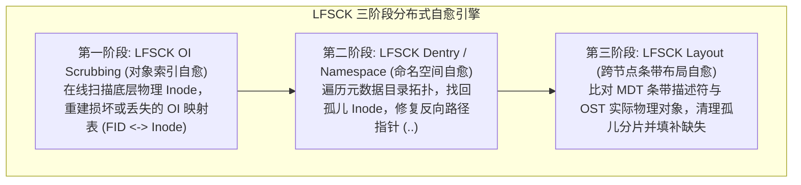

# 28.3 分布式一致性在线修复引擎：LFSCK

单机工具（如 `e2fsck`）仅能保证单台物理服务器本地的文件系统块结构合法，**完全不具备跨越网络感知分布式条带关联的能力**。如果 MDT 上的 Inode 指向了 OST-5 上的一个对象，而 OST-5 因掉电丢失了该对象，单机 `e2fsck` 根本无法检测此类逻辑悬空。

Lustre 内置了工业级 **分布式文件系统一致性检查器（LFSCK, Lustre File System Consistency Checker）**，具备在系统生产运行状态下跨全集群执行全局一致性自愈的能力：

## 1. 第一阶段：LFSCK OI（对象索引扫描修复）
- **核心职责**：验证并重构底层单机物理 Inode 与 128 位全局 FID 之间的双向对应关系；
- **执行机理**：当底层磁盘因断电丢失 `oi.16/*` 哈希索引时，OI Scrubbing 会自动扫描磁盘底层每一个被占用的 Inode，解析其扩展属性中的 `trusted.fid`，并无损重建丢失的索引项。

## 2. 第二阶段：LFSCK Dentry（目录树与命名空间修复）
- **核心职责**：修复多 MDT 拓扑中的断链目录树与悬空目录项；
- **执行机理**：遍历所有元数据 Inode。若发现某 Inode 真实存在但目录树中无任何硬链接指向它，自动将其收录至根目录下的 `/lost+found` 中；若目录项的父目录指针（`..`）错乱，自动根据反向链路重新修复。

## 3. 第三阶段：LFSCK Layout（跨网络条带布局修复）
- **核心职责**：跨越网络全面核对全集群所有 MDT 与所有 OST 之间的条带对象拓扑；
- **清理跨节点孤儿对象（Orphan Objects）**：当用户在客户端删除了文件，MDT 已经清空元数据，但个别 OST 因通信中断未能及时收到清理 RPC 时，Layout 检查器自动识别这些没有父文件归属的底层数据碎片，并将其安全释放，**找回全网泄漏的物理磁盘空间**；
- **识别并标记数据缺失**：若元数据记录了 4 个条带，但某台 OST 发生物理永久性坏道丢失了数据对象，LFSCK 自动在 MDT 上将该分片标记为缺失损坏，防止应用读请求在此无限重试卡死。

---

