# 29.2 GPU Direct Storage（GDS）：穿透 Host 内存的硬件直通

在传统基于 POSIX 的网络文件系统数据路径中，即便底层网络采用了 InfiniBand RDMA，数据在注入 GPU 显存之前依然必须经历冗长的主机中转：

```mermaid
flowchart TD
    subgraph Traditional_Path ["传统网络数据路径 (CPU 介入与三次跨总线拷贝)"]
        OST_1["OST 存储节点"] -->|InfiniBand RDMA| HCA_1["计算节点网卡 (NIC)"]
        HCA_1 -->|PCIe DMA 写入| HOST_RAM["主机系统内存 (Host DDR5)"]
        HOST_RAM -->|CPU 上下文中断与内核拷贝| K_BUF["内核虚拟页面缓存"]
        K_BUF -->|再次跨 PCIe 总线拷贝| GPU_HBM_1["GPU 显存 (HBM3)"]
    end

    subgraph GDS_Direct_Path ["GPUDirect Storage (GDS) 硬件直通路径"]
        OST_2["OST 存储节点"] -->|InfiniBand RDMA| HCA_2["计算节点网卡 (NIC)"]
        HCA_2 ==>|PCIe Switch 内部 Peer-to-Peer 直接 DMA| GPU_HBM_2["GPU 显存 (HBM3)"]
    end
```



## 24.2.1 GDS 架构原理与 PCIe 内部直通

基于 NVIDIA Magnum IO **GPUDirect Storage（GDS）** 技术，存储系统允许高速网络适配器（HCA）与 GPU 之间直接发起对等 DMA 传输（Peer-to-Peer DMA）：


结合官方架构图 24-2，GDS 的核心技术特征包括：
- **完全旁路主机系统内存（Host Memory Bypass）**：数据直接在 InfiniBand 网卡（NIC）与 GPU 显存（HBM）之间直灌，不占用任何主机 DDR5 内存带宽；
- **CPU 零拷贝与算力卸载**：系统消除了用户态与内核态之间的数据反弹缓冲（Bounce Buffer），主机 CPU 彻底从数据搬运的繁重开销中解放，仅负责极轻量的元数据调度；
- **超低微秒级端到端延迟**：数据包由计算节点内部的 PCIe Switch 直接路由转发，单次 I/O 往返延迟由毫秒级压缩至微秒级。

## 24.2.2 Lustre 内核对 GDS 的底层改造

为了实现对 GDS 的原生驱动支持，Lustre 客户端在内核协议栈中完成了深度适配：

1. **GPU 显存 BAR 空间的 RDMA 注册**：  
   传统的 LNet（`klnds/o2iblnd/o2iblnd.c`）仅能识别由 Linux 虚拟内存系统分配的标准 `struct page`。为了支持 GPU 显存，LNet 扩展了内存描述符，直接接收由 NVIDIA 内核驱动（`nvidia-fs.ko`）通过 `nvidia_p2p_get_pages()` 导出的 GPU 显存物理基地址寄存器（BAR1 映射物理地址），并将其直接注册为 InfiniBand 内存区域（`ib_reg_mr`）。
2. **`O_DIRECT` 通道直通封装**：  
   `lustre/llite/file.c` 拦截上层带有直接 I/O 标志的读写请求。当检测到目标缓冲区属于 GPU 虚拟地址时，跳过通用 Page Cache，直接将底层 GPU 物理页封装入 `struct ptlrpc_bulk_desc` 的网络传输描述符中。

## 24.2.3 用户态 cuFile API 编程示例

AI 应用可通过 NVIDIA 提供的 `libcufile` 库直接读写 Lustre 挂载点上的文件：

```c
#include <stdio.h>
#include <fcntl.h>
#include <unistd.h>
#include <cuda_runtime.h>
#include <cufile.h>

/**
 * 示例：使用 cuFile API 将 Lustre 上的检查点直灌入 GPU 显存
 */
int load_weights_gds_direct(const char *filepath, size_t size)
{
    CUfileError_t status;
    CUfileDescr_t descr;
    CUfileHandle_t cf_handle;
    void *d_buf = NULL;
    int fd;

    /* 1. 初始化 cuFile 运行时驱动 */
    cuFileDriverOpen();

    /* 2. 打开 Lustre 文件，必须携带 O_DIRECT 绕过操作系统缓存 */
    fd = open(filepath, O_RDONLY | O_DIRECT);
    if (fd &lt; 0) {
        perror("Failed to open file on Lustre");
        return -1;
    }

    /* 3. 分配 GPU 显存 (HBM) 并将其注册至 GDS 驱动 */
    cudaMalloc(&d_buf, size);
    cuFileBufRegister(d_buf, size, 0);

    /* 4. 注册文件句柄至 cuFile */
    descr.handle.fd = fd;
    descr.type = CU_FILE_HANDLE_TYPE_OPAQUE_FD;
    status = cuFileHandleRegister(&cf_handle, &descr);
    if (status.err != CU_FILE_SUCCESS) {
        fprintf(stderr, "cuFileHandleRegister failed\n");
        return -1;
    }

    /* 5. 发起 Peer-to-Peer 硬件直通读取 (数据由网卡直达 GPU 显存) */
    ssize_t ret = cuFileRead(cf_handle, d_buf, size, 0, 0);
    printf("GDS successfully transferred %zd bytes directly to GPU HBM.\n", ret);

    /* 6. 注销句柄并释放资源 */
    cuFileHandleDeregister(cf_handle);
    cuFileBufDeregister(d_buf);
    close(fd);
    cudaFree(d_buf);
    cuFileDriverClose();
    return 0;
}
```

---

