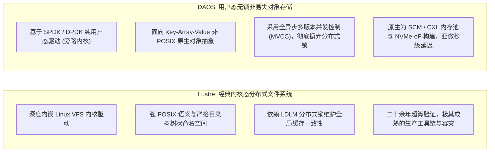

# 29.3 现代存储架构反思：Lustre 与 DAOS 的架构对决

随着持久化内存（PMEM）、CXL 共享内存池以及纯 NVMe-oF 网络协议的成熟，存储架构界爆发了关于“内核态传统文件系统”与“用户态新型无锁对象存储”的深刻技术路线之争。其中最具代表性的即为 **DAOS（Distributed Asynchronous Object Storage）**。

结合图 24-3 展示的纯用户态存储栈模型，Lustre 与 DAOS 代表了两种完全不同的架构哲学：

## 深度维度技术对比

| 架构维度 | Lustre 分布式文件系统 | DAOS 分布式异步对象存储 |
| :--- | :--- | :--- |
| **执行上下文** | **内核态驱动**（运行在 Linux 内核空间，与 VFS、Page Cache 及块设备紧密集成） | **纯用户态进程**（基于 SPDK 旁路操作系统内核，直接对 NVMe 寄存器轮询） |
| **原生数据模型** | **POSIX 文件模型**（标准层次化目录树、Inode 属性与连续字节流） | **Key-Array-Value 对象模型**（多级键与定长数组，POSIX 需通过 DFS 抽象层仿真） |
| **并发一致性机制** | **LDLM 分布式锁**（采用意向锁与范围锁，读写冲突时触发阻塞 AST 撤销） | **无锁 MVCC 与纪元（Epochs）**（全异步非阻塞事务，多版本并发控制） |
| **单次 I/O 延迟** | **微秒至毫秒级**（受制于内核中断上下文切换与跨节点锁协商） | **亚微秒至微秒级**（SCM / NVMe 轮询，零内核开销） |
| **生态成熟度与通用性**| **极高**（所有 Linux 标准工具与科研软件零修改直接运行，容灾与配额完备） | **演进中**（复杂传统应用需重构或依赖仿真层，运维监控工具链仍在成熟中） |

## 架构反思与工程权衡
- **DAOS 的颠覆性优势**：在极端高频小 I/O、海量元数据并发以及原生使用 CXL/PMEM 的场景下，DAOS 凭借纯用户态无锁架构展现出了令人惊叹的低延迟；
- **Lustre 的工程不可替代性**：生产实践表明，数以万计的已有工业软件（如 EDA 仿真、老牌物理计算程序、通用 Python 生态）重度依赖绝对标准的 POSIX 行为（符号链接、文件锁、随机 Seek、硬链接）。Lustre 凭借二十余年淬炼出的完备生态、成熟的高可用双活机制、多 MDT 线性扩展以及数百万客户端下的稳定性，依然是当前绝大多数生产级大模型训练集群最可靠的主存储中枢。

---

