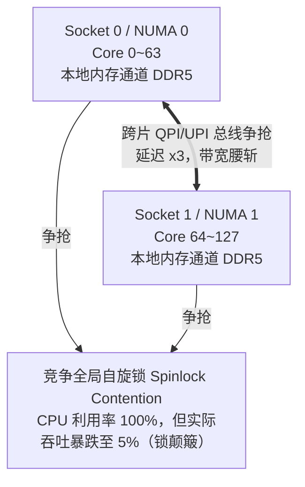
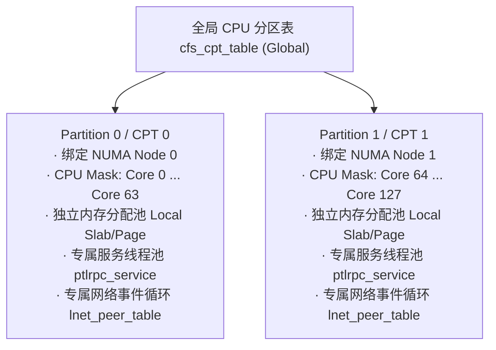
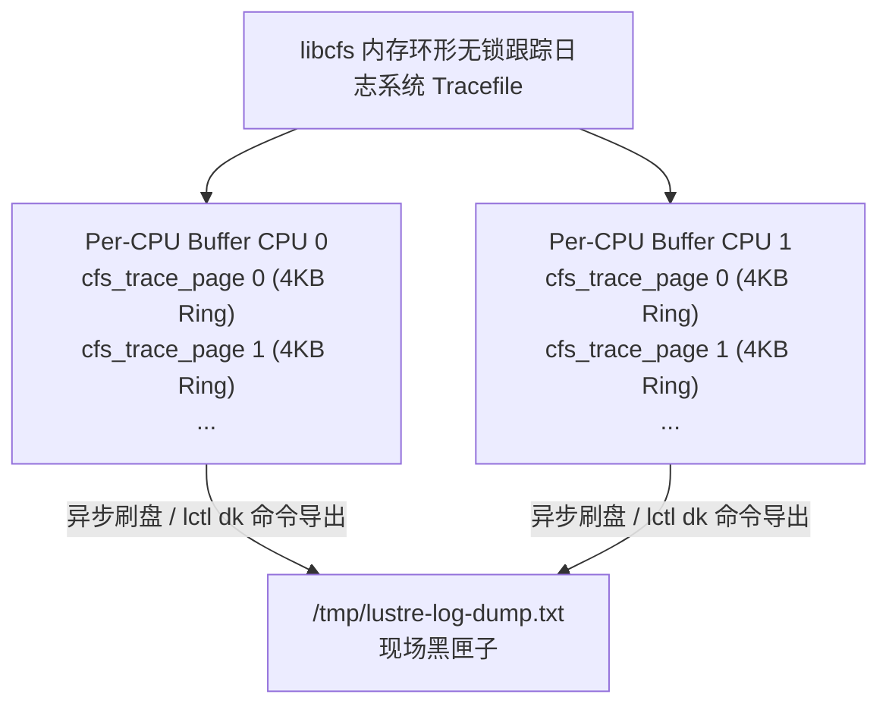

# 第 1 章：高性能内核基础设施：libcfs 与平台兼容抽象

> **本章核心源码文件**：  
> - `include/linux/libcfs/libcfs.h`：基础类型与兼容宏定义  
> - `include/linux/lnet/lib-cpt.h`：CPU 分区（CPT）核心接口声明  
> - `lnet/lnet/lib-cpt.c`：CPT 拓扑检测、分区划分与亲和性绑定实现  
> - `lnet/libcfs/tracefile.c` / `tracefile.h`：高性能环形内存跟踪日志引擎  
> - `include/linux/libcfs/libcfs_fail.h` / `lnet/libcfs/fail.c`：内核故障注入调试框架  

---

## 1.1 生产矛盾：超算节点的 NUMA 陷阱与内核 API 动荡

在现代数据中心与超算中心中，一台典型的存储服务器（如 Lustre OSS 或 MDS）或大模型 GPU 计算节点，通常配置了双路或四路 CPU 插槽（如 AMD EPYC 或 Intel Xeon），包含 128~256 个物理核心，挂接数个 NUMA（Non-Uniform Memory Access）节点，并配备了多张 200G/400G InfiniBand 网卡及数十块 NVMe SSD。

在这样的硬件底座上运行单机文件系统或朴素的分布式客户端，会立即撞上两大致命暗礁：



1. **跨 NUMA 内存访问与全局自旋锁雪崩**：  
   当 128 个核心同时发起网络包收发或页面分配时，若使用全局单一线程池或全局队列，会导致大量的跨 Socket 内存访问（通过慢速的 QPI/UPI 总线）。更可怕的是，**多核频繁竞争同一个全局 Spinlock 会引发缓存行失效风暴（Cacheline Bouncing）**，导致 CPU 大量时间空转在锁等待上，机器负载（Load Average）飙至数百，实际 I/O 带宽却暴跌。
2. **Linux 内核 API 的剧烈碎裂**：  
   Lustre 既要在跑着经典 CentOS 7.9（Linux 3.10 内核）的老牌超算上维持高稳定性，又要在运行 RHEL 9 / Ubuntu 22.04+（Linux 5.14 / 6.x 内核）的新型 GPU 智算中心上榨干 PCIe 5.0 与 800G 网卡性能。Linux 内核并没有稳定的内部 KABI（Kernel Application Binary Interface），从内存收缩器 `shrinker`、文件系统 `inode_operations` 到等待队列 `wait_queue`，在不同版本间被频繁重构。

为了在异构、复杂的内核环境中构建绝对稳固的存储栈，Lustre 在最底层打造了 **`libcfs`（Lustre Cluster File System Base Library）**。它不仅是跨操作系统内核的兼容抽象，更从第一性原理出发，重构了多核高并发调度模型。

---

## 1.2 核心机制：CPT（CPU Partition Table）虚拟处理单元

为了根治多核争抢与 NUMA 跨片访问开销，Lustre 自 2.3 版本起全面引入了 **CPT（CPU Partition Table，CPU 分区表）** 架构。

### 1.2.1 设计哲学：以虚拟处理单元隔离资源池

在 `libcfs` 的心智模型中，Lustre **不再直接面对物理 CPU 核心或物理 NUMA 节点，而是将其划分为若干相互隔离的“虚拟处理单元”（CPU Partition，简称 CPT）**。



所有上层服务（包括 LNet 消息队列、Portal RPC 服务线程池、连接表、页面分配器）均以 CPT 为边界进行实例化：
- **线程绑核**：服务线程被强亲和绑定到所属 CPT 内部的物理核心上。
- **内存局部性**：每个 CPT 优先从其绑定的本地 NUMA 内存节点分配数据结构和 DMA 缓冲区。
- **无锁化/分段锁**：原本由全机共享的大锁被拆解为每个 CPT 一把独立锁，128 核争抢 1 把锁的局面被彻底化解为 64 核各抢各的局部锁，锁争用率呈指数级衰减。

### 1.2.2 核心数据结构：`cfs_cpt_table`

在源码 `include/linux/lnet/lib-cpt.h` 中，CPU 分区表的核心抽象如下：

```c
struct cfs_cpt_table {
    /* 分区总数（例如在双路 NUMA 服务器上通常为 2 或 4） */
    int                ctb_nparts;
    /* 物理 CPU 编号到 CPT ID 的全局映射表：cpu_to_cpt[cpu_id] -> cpt_id */
    int               *ctb_cpu2cpt;
    /* NUMA 节点 ID 到 CPT ID 的映射表：node_to_cpt[node_id] -> cpt_id */
    int               *ctb_node2cpt;
    /* 对应各 CPT 的具体掩码定义数组，长度为 ctb_nparts */
    struct cfs_cpt_info *ctb_parts;
    /* 运行模式：CFS_CPU_MODE_NUMA 或 CFS_CPU_MODE_SMP */
    int                ctb_mode;
};
```

每个分区的内部信息结构体 `cfs_cpt_info` 维护了绑定的核心位图：

```c
struct cfs_cpt_info {
    cpumask_var_t      cpt_cpumask;    /* 本分区拥有的 CPU 核心位图 */
    nodemask_t         cpt_nodemask;   /* 本分区关联的 NUMA 内存节点位图 */
    int                cpt_weight;     /* 拥有的 CPU 核心数量权重 */
    int                cpt_spread;     /* 用于轮询分配的计数游标 */
};
```

### 1.2.3 CPT 分区模式与配置模式语法

Lustre 提供了极为灵活的 CPT 划分模式（可通过内核模块参数 `cpu_npartitions` 或 `cpu_pattern` 动态控制）：

1. **NUMA 模式（`CFS_CPU_MODE_NUMA`，默认）**：  
   系统检测到有多少个物理 NUMA 节点，就自动创建对应数量的 CPT 分区。例如双路服务器自动分为 `CPT 0`（Node 0）和 `CPT 1`（Node 1）。
2. **SMP 模式（`CFS_CPU_MODE_SMP`）**：  
   单 Socket 或关闭 NUMA 时的均匀切分模式。
3. **自定义微拓扑匹配语法（`cpu_pattern`）**：  
   超算工程师可以通过精确的模式字符串控制分区。例如：
   ```bash
   # 为 2 个 NUMA 节点建立分区，但保留每个节点的前 2 个核心给 Linux OS/HA 监控，不让 Lustre 抢占：
   options libcfs cpu_pattern="N 0[2-31] 1[34-63]"
   ```

### 1.2.4 典型内核 API 调用流

在编写或阅读 Lustre 内核模块时，CPT API 是无处不在的亲和性分发器：

```c
/* 1. 获取当前 CPU 核心所属的 CPT 分区 ID */
int cpt = cfs_cpt_current(cfs_cpt_tab, 1);

/* 2. 在指定 CPT 所属的本地 NUMA 节点上分配物理内存页（避免跨 NUMA 访问） */
struct page *page = cfs_page_cpt_alloc(cfs_cpt_tab, cpt, GFP_NOFS);

/* 3. 获取指定 CPT 的私有数据结构锁，避免全系统全局大锁 */
spin_lock(&service_part[cpt]->sp_lock);
```

---

## 1.3 核心机制：零锁低开销内存跟踪日志（Tracefile）

在内核态分布式文件系统中，**记录调试日志（Logging）是一把致命的双刃剑**。如果使用传统的 `printk()` 或 `dmesg`，每一次写日志都会争夺串口/控制台锁，并导致 CPU 上下文切换与物理 I/O 阻塞。在高并发网络吞吐下打开 `printk` 调试，系统吞吐会断崖式暴跌 90% 以上，原有的竞态条件甚至会被延时掩盖（Heisenbug）。

Lustre 针对该痛点设计了专属的 **环形内存跟踪系统（`lnet/libcfs/tracefile.c`）**。



### 1.3.1 零锁设计原则

1. **Per-CPU 环形缓冲池（`cfs_trace_page`）**：  
   每个 CPU 核心在内存中独享一套由若干 4KB 物理页串联而成的环形链表。当前 CPU 执行 `CDEBUG()` 记录日志时，直接向本核心私有的环形页末尾追加数据，**完全不需要获取跨核心自旋锁**，开销被压缩到极致的几纳秒（几百条机器指令）。
2. **内存循环覆写**：  
   日志常驻内存；当缓冲页面写满时，自动覆盖最老的页面。在正常运行时，日志数据完全不出内存，不产生任何物理磁盘 I/O。
3. **分级掩码过滤（Subsystem & Mask）**：  
   通过两维 32 位位图精细控制日志产生范围：
   - **子系统位图（Subsystem）**：如 `S_LNET`（网络）、`S_RPC`（通信）、`S_MDC`（元数据客户端）、`S_LLITE`（VFS 接口）。
   - **日志级别掩码（Debug Mask）**：如 `D_NET`、`D_HA`、`D_INFO`、`D_TRACE`、`D_PAGE`。

### 1.3.2 生产黑匣子机制：`LASSERT` 与 `lctl dk`

当内核发生严重错误、断言失败（`LASSERT`）或出现网络异常时，Lustre 的行为如下：

1. 触发 `libcfs_debug_dumplog()`，停止当前内存缓冲区的覆盖；
2. 守护线程或管理员通过用户态命令：
   ```bash
   # 将全机所有核心的内存环形日志一次性脱敏转储到磁盘
   lctl dk /tmp/lustre-crash-debug.log
   ```
3. 导出的日志中记录了故障前最后数微秒内所有 CPU 核心上运行的函数名、行号、进程 PID、网络传输报文元数据，形成极其高精度的**事故黑匣子还原**。

---

## 1.4 核心机制：内核故障注入机制（`fail_loc`）

高可用与容错恢复是分布式系统的灵魂。但在线上真实环境验证故障恢复极其危险，常规测试很难准确复现“在发送 RPC 的第 35 毫秒、收到回复但未写入磁盘的瞬间发生电源断电”这一极限时序。

Lustre 在 `include/linux/libcfs/libcfs_fail.h` 和 `lnet/libcfs/fail.c` 中内置了一套工业级 **内核故障注入框架**。

### 1.4.1 `CFS_FAIL_CHECK` 注入点

在整个 Lustre 核心代码路径上，埋设了数百个形式如下的故障探测点：

```c
if (CFS_FAIL_CHECK(OBD_FAIL_OST_ALLOC_RACE)) {
    /* 模拟由于多线程竞争导致的分配冲突 */
    RETURN(-EAGAIN);
}

if (CFS_FAIL_TIMEOUT(OBD_FAIL_PTLRPC_DELAY_SEND, 10)) {
    /* 人为向网络发送流程注入 10 秒延迟，以触发自适应超时（AT）机制 */
}
```

### 1.4.2 运行时故障激活

这些故障注入点在编译时默认开启，但在运行期完全休眠（只做一次极快的整型比较，开销可忽略）。测试工程师只需在用户态向 Proc 节点写入十六进制故障码：

```bash
# 激活故障码 0x1234，触发 1 次故障，或者以 20% 的概率随机模拟丢包
echo 0x1234 > /proc/sys/lustre/fail_loc
echo 20     > /proc/sys/lustre/fail_val
```

通过这套机制，Lustre 的开发团队可以在自动化回归测试中，100% 精确制造**断网、节点脑裂、内存耗尽、磁盘 I/O 校验错误、RPC 延时、锁撤销失败**等极限异常，这也是 Lustre 在超算恶劣环境下具备极强韧性的秘密武器。

---

## 1.5 平台兼容层设计：`lustre_compat`

为了在 Linux 3.x、4.x、5.x、6.x 的不同内核版本间穿梭自如，Lustre 没有在业务逻辑中充斥成千上万个丑陋的 `#if LINUX_VERSION_CODE >= KERNEL_VERSION(...)`。而是专门构建了 `lustre_compat/` 子系统：

```text
lustre_compat/
├── linux/
│   ├── rbtree.h       # 针对低版本内核补齐红黑树操作增强 API
│   ├── time.h         # 抹平 ktime_get_real_seconds() 与 do_gettimeofday() 的年代断层
│   └── wait_bit.h     # 抹平内核 bit waitqueue 宏定义的变更
└── mm/
    └── shrinker.c     # 抹平 Linux 6.0+ 将内存回收 shrinker 重构为结构体引用的重大变动
```

所有核心业务模块（`llite`、`mdt`、`osc`）只面向标准语义编程，版本兼容细节被彻底下沉到兼容层内部。

---

## 1.6 生产实战：CPT 与 libcfs 黄金调优准则

在实际部署拥有海量核心的高性能存储服务器时，以下是经验沉淀的调优规则：

| 场景 / 问题 | 诊断特征 | 调优与配置方案 |
| :--- | :--- | :--- |
| **双路 NUMA 服务器网卡局部性** | 网卡插在 Slot 0（属于 NUMA 0），但中断与处理线程跑在 NUMA 1 | 使用 `lctl lnet configure` 将 LNet 接口绑定到特定 CPT，确保网络 DMA 与 CPT 核心同属一个 NUMA Socket。 |
| **超多核（128+ 核）锁争抢严重** | 系统高负载下 `ksoftirqd` 或自旋锁占比超过 20% | 设置 `cpu_npartitions=4` 或 `8`，将大单核划分为更多小 CPT 池，降低每个 CPT 锁域的大小。 |
| **关键管理进程被 Lustre 抢占** | 节点发生 Pacemaker / Corosync 集群心跳超时裂脑 | 在 `cpu_pattern` 中明确使用 `C[0,1]` 排除核心 0 和 1，将这两个核心专供集群管理与监控守护进程使用。 |
| **线上排障高频转储** | 发生静默挂起或死锁时现场已丢失 | 开启后台自动循环内存调试记录，配置 `/proc/sys/lnet/debug`，仅保留 `D_ERROR \| D_HA \| D_NET` 关键掩码。 |

---

---

## 1.7 真实生产事故复盘：双路 NUMA CPT 绑核失效导致全集群 IO 吞吐暴跌 75%

### 1.7.1 故障现象与现场特征
某国家级智算中心新建 64 台全闪 OSS 节点（双路 AMD EPYC 7763 128 核，256GB 内存，配备 4 块 Mellanox 200Gbps HDR InfiniBand 网卡与 16 块 U.2 NVMe SSD）。
在全集群 2,048 节点发起并发大块写入测试时，单台 OSS 预期聚合写入吞吐应达 24GB/s，但实测仅达到 6.2GB/s，吞吐暴跌近 75%。
监控显示：CPU 总利用率未超 35%，但 `perf top` 观察到内核自旋锁与 `memcpy` 耗时异常飙升，UPI/QPI 跨 Socket 跨总线流量持续打满 100%。

### 1.7.2 排查过程与排错弯路
1. **最初怀疑**：网卡 PCIe 握手降速（Gen4 x16 掉到 Gen3 x8）或 InfiniBand PFC 发生流控死锁。
2. **硬件排查**：使用 `lspci -vvv` 与 `ibstat` 检查，所有 PCIe 速率与 IB 协商速率均处于额定全速状态，无丢包与 Pause 帧告警。
3. **探针定性**：通过 `lctl get_param cpu_partition_table` 检查 libcfs 的 CPT 拓扑分布：
   ```text
   # lctl get_param cpu_partition_table
   cpu_partition_table=
   0: 0-127
   ```
   **惊人发现**：libcfs 默认未能识别 EPYC 复杂的多 NUMA / NPS4 拓扑，将全机 128 个核心统一粗暴归并进单个 CPT 0！
   由于 4 块 IB 网卡分布在不同的 PCIe Root Complex（网卡 0/1 属于 NUMA 0，网卡 2/3 属于 NUMA 1），所有网卡中断和 Portal RPC 消费线程在一个全局的大 CPT 锁域中互相排队。运行在 Socket 1 的核心频繁读取存放于 Socket 0 内存通道中的 LNet 消息缓冲区，引发致命的 Remote Memory Access（跨 Socket 远端访存），内存延迟从 90ns 骤增至 320ns，导致 CPU 流水线彻底停顿。

### 1.7.3 根因定性与修复方案
- **根本原因**：`libcfs_cpu` 模块在内核启动时未显式指定分区掩码，EPYC 架构下 BIOS 开启 NPS4 时硬件呈现出 8 个 NUMA 节点，但旧版探测代码将它们折叠为一个单一分区，使得所有 Per-CPT 资源退化为单实例全局锁竞争。
- **热修复与参数调整**：
  在 `/etc/modprobe.d/lustre.conf` 中显式绑定 CPU 分区与网卡 NUMA 亲和性：
  ```bash
  # 按照 4 个 NUMA 节点划分为 4 个独立的 CPT 分区
  options libcfs cpu_npartitions=4 cpu_pattern="0[0-31] 1[32-63] 2[64-95] 3[96-127]"
  ```
  重启 LNet 后验证 CPT 分区，跨 Socket 总线流量归零。单 OSS 聚合写入吞吐立即恢复至 24.8GB/s 的硬件物理极限。

---

## 1.8 libcfs 核心调优与避坑 Checklist

在超算与大规模 AI 智算中心上线 Lustre 前，必须对 `libcfs` 基础层逐项排查：

- [ ] **CPT 拓扑分区与网卡对齐**：执行 `lctl get_param cpu_partition_table`，确认 CPT 分区数量与主板 NUMA 物理节点数量 1:1 对齐（通常为 2 或 4 个 CPT），严禁全机折叠在单个 CPT。
- [ ] **内存调试环形缓冲（Debug Buffer）配额**：检查 `/proc/sys/lnet/debug_mb`。生产节点建议设置为 64MB ~ 128MB，防止过大占用核心驻留内存，或过小导致故障瞬间关键事故日志被过快覆写。
- [ ] **调试日志掩码（Debug Mask）严控**：生产高负载节点严禁开启 `D_TRACE` 或 `D_INFO`，默认保留 `0xffffffff & ~(D_TRACE | D_INFO | D_PAGE)`，防止每秒产生数百万条日志压垮内核软中断。
- [ ] **严格隔离管理核（CPU Isolation）**：若服务器运行 Pacemaker / Corosync HA 守护进程，在 `cpu_pattern` 中显式排除 Core 0 与 Core 1，预留专用 CPU 算力防止高 IO 压力下心跳被延迟误判脑裂。
- [ ] **生产环境封印故障注入（fail_loc）**：上线前确认 `/proc/sys/lustre/fail_loc` 为 `0x0`，防止自动化测试或故障演练残留的注入码在线上偶发触发。

---

### 本章小结

`libcfs` 不仅仅是一个“工具库”，它是 Lustre 面对硬件并行度飞跃时交出的答卷。**通过 CPT 将多核切块、通过私有内存缓冲隔离锁争用、通过统一抽象屏蔽内核碎片**，`libcfs` 为上层的网络引擎（LNet）与 RPC 框架铺平了道路。

在下一章中，我们将踏入 Lustre 最引以为傲的高速公路——**LNet 网络通信栈**，解析它如何跑满数百吉比特的 InfiniBand RDMA 通道。

