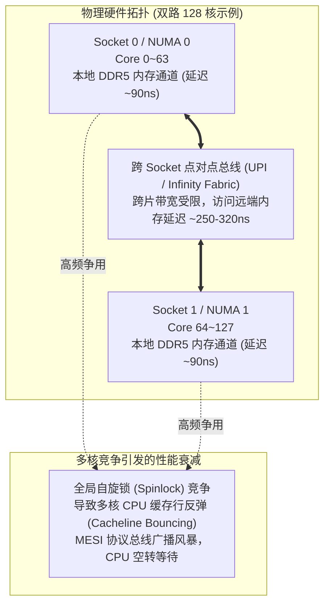
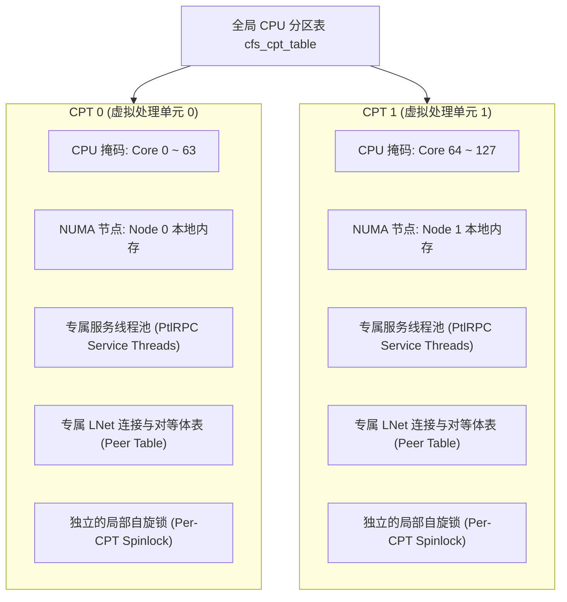
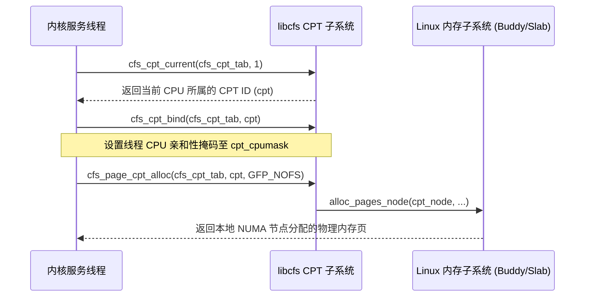
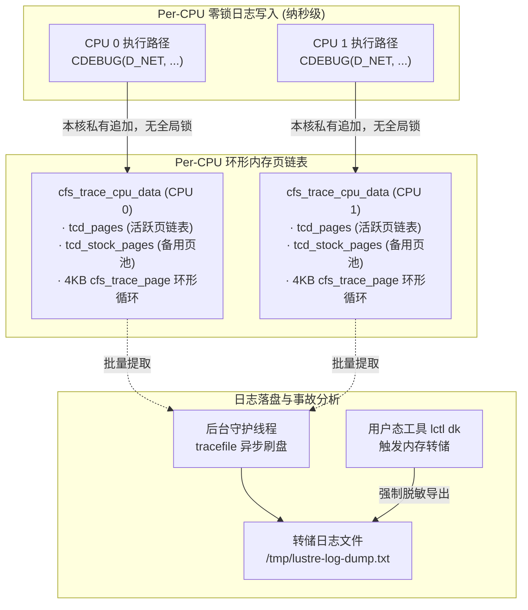
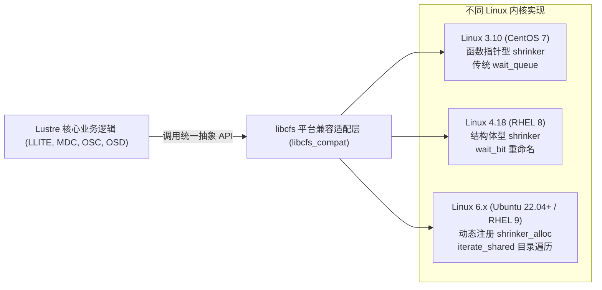

# 第 1 章：高性能内核基础设施：libcfs 与平台兼容抽象

> **本章核心源码文件**：  
> - `libcfs/include/libcfs/libcfs.h`：基础宏、类型与全局环境定义  
> - `libcfs/include/libcfs/libcfs_cpu.h` / `include/linux/lnet/lib-cpt.h`：CPU 分区表（CPT）核心接口与数据结构声明  
> - `libcfs/libcfs/libcfs_cpu.c`：CPT 拓扑探测、掩码计算与线程亲和性绑定实现  
> - `libcfs/libcfs/libcfs_mem.c`：Per-CPT 内存分配器与本地 NUMA 内存管理  
> - `libcfs/libcfs/tracefile.c` / `tracefile.h`：Per-CPU 环形内存跟踪日志引擎  
> - `libcfs/include/libcfs/libcfs_fail.h` / `libcfs/libcfs/fail.c`：内核故障注入框架实现  
> - `lustre/include/obd_support.h`：存储子系统故障注入码映射宏  

---

## 1.1 硬件矛盾：NUMA 拓扑开销与 Linux 内核演进

现代存储服务器（如 Lustre OSS 或 MDS）通常配备双路或四路 CPU 插槽（如 AMD EPYC 或 Intel Xeon），整机集成 128 至 256 个物理计算核心，并细分为多个 NUMA（Non-Uniform Memory Access）节点。此外，系统还挂接了多块 200Gb/s 或 400Gb/s 的 InfiniBand / RoCE 网络适配器以及数十块 NVMe 固态硬盘。

在多核高并发硬件架构下，存储系统面临两类核心矛盾：


```mermaid
flowchart TD
    subgraph NUMA_Hardware ["物理硬件拓扑 (双路 128 核示例)"]
        S0["Socket 0 / NUMA 0<br/>Core 0~63<br/>本地 DDR5 内存通道 (延迟 ~90ns)"]
        S1["Socket 1 / NUMA 1<br/>Core 64~127<br/>本地 DDR5 内存通道 (延迟 ~90ns)"]
        BUS["跨 Socket 点对点总线 (UPI / Infinity Fabric)<br/>跨片带宽受限，访问远端内存延迟 ~250-320ns"]
        S0 <==> BUS <==> S1
    end

    subgraph Problem_Contention ["多核竞争引发的性能衰减"]
        LOCK["全局自旋锁 (Spinlock) 竞争<br/>导致多核 CPU 缓存行反弹 (Cacheline Bouncing)<br/>MESI 协议总线广播风暴，CPU 空转等待"]
        S0 -.->|高频争用| LOCK
        S1 -.->|高频争用| LOCK
    end
```

### 1. 跨 NUMA 远端访存与自旋锁争用
在多核心并发处理网络报文接收与页面缓存分配时，若采用全局单线程队列或单实例全局锁，不同 Socket 上的核心将频繁发起跨片总线访问。跨片内存访问延迟是本地访问的 2.5 至 3.5 倍。更为严重的是，当大量物理核心同时争用同一把全局自旋锁时，CPU 缓存一致性协议（MESI/MOESI）会产生大量的缓存行失效与回写风暴（Cacheline Bouncing），导致处理器流水线长期停顿，系统吞吐量急剧下降。

### 2. Linux 内核无稳定 KABI
Linux 内核内部未维护稳定的二进制接口（KABI）。Lustre 既要在长期服役的企业级发行版（如 CentOS 7.9，基于 Linux 3.10 内核）上保持稳定运行，又需支持高版本发行版（如 RHEL 9 / Ubuntu 22.04+，基于 Linux 5.14 及 6.x 内核）以发挥现代硬件特性。从内存回收收缩器（`shrinker`）、等待队列（`wait_queue`）到虚拟文件系统接口（`inode_operations` / `file_operations`），内核 API 历经多次重构与函数签名调整。

为了解决多核扩展瓶颈并屏蔽内核差异，Lustre 在最底层构建了 **`libcfs`（Lustre Cluster File System Base Library）**。该子系统为上层网络（LNet）与分布式对象存储栈提供了 CPU 分区调度、零锁内存日志、故障注入框架及跨平台兼容抽象。

---

## 1.2 CPT（CPU Partition Table）虚拟处理单元架构

针对多核争用与 NUMA 跨节点访存开销，Lustre 引入了 **CPT（CPU Partition Table，CPU 分区表）** 机制。

### 1.2.1 架构设计

`libcfs` 将整机的物理计算核心与物理 NUMA 内存节点统一划分为若干个独立的虚拟处理单元（CPU Partition，简称 CPT）。


```mermaid
flowchart TD
    GLOBAL["全局 CPU 分区表 cfs_cpt_table"]
    
    subgraph CPT_0 ["CPT 0 (虚拟处理单元 0)"]
        M0["CPU 掩码: Core 0 ~ 63"]
        N0["NUMA 节点: Node 0 本地内存"]
        P0["专属服务线程池 (PtlRPC Service Threads)"]
        L0["专属 LNet 连接与对等体表 (Peer Table)"]
        S0["独立的局部自旋锁 (Per-CPT Spinlock)"]
    end

    subgraph CPT_1 ["CPT 1 (虚拟处理单元 1)"]
        M1["CPU 掩码: Core 64 ~ 127"]
        N1["NUMA 节点: Node 1 本地内存"]
        P1["专属服务线程池 (PtlRPC Service Threads)"]
        L1["专属 LNet 连接与对等体表 (Peer Table)"]
        S1["独立的局部自旋锁 (Per-CPT Spinlock)"]
    end

    GLOBAL --> CPT_0
    GLOBAL --> CPT_1
```

所有上层关键服务与数据结构均以 CPT 为边界进行实例划分：
- **线程亲和性绑定**：服务处理线程绑定在所属 CPT 的 CPU 核心掩码内，避免线程在跨 Socket 核心间无序迁移。
- **内存局部性约束**：每个 CPT 优先从其绑定的本地 NUMA 节点分配对象内存与 DMA 缓冲区。
- **细粒度分段锁**：原本由全机共享的全局锁被拆解为 Per-CPT 局部锁。每个 CPT 仅管理本分区内的并发状态，消除了跨 Socket 的锁争用。

### 1.2.2 核心数据结构

CPT 的实现主要集中在 `libcfs/libcfs/libcfs_cpu.c` 与 `libcfs/include/libcfs/libcfs_cpu.h` 中。

#### 1. 单个分区结构体：`cfs_cpu_partition`
每个 CPT 分区由 `struct cfs_cpu_partition` 表示：

```c
struct cfs_cpu_partition {
    /* 本分区包含的物理 CPU 核心位图 */
    cpumask_var_t       cpt_cpumask;
    /* 本分区绑定的 NUMA 内存节点位图指针 */
    nodemask_t         *cpt_nodemask;
    /* 到其他各个 CPT 分区的 NUMA 拓扑距离数组 */
    unsigned int       *cpt_distance;
    /* NUMA 轮询分配游标，用于在绑定的多个节点间均衡负载 */
    unsigned int        cpt_spread_rotor;
    /* 若 cpt_nodemask 仅包含单个节点，直接记录其节点 ID */
    int                 cpt_node;
};
```

#### 2. 全局分区表结构体：`cfs_cpt_table`
全局的 CPT 管理实例通过 `struct cfs_cpt_table` 维护：

```c
struct cfs_cpt_table {
    /* 分区表层级的轮询游标 */
    unsigned int                ctb_spread_rotor;
    /* 系统各 NUMA 节点间的综合距离矩阵基准 */
    unsigned int                ctb_distance;
    /* 当前配置的 CPT 分区总数量 */
    int                         ctb_nparts;
    /* 指向各个分区实体的数组，长度为 ctb_nparts */
    struct cfs_cpu_partition   *ctb_parts;
    /* 物理 CPU 编号到 CPT ID 的全局直接映射表 */
    int                        *ctb_cpu2cpt;
    /* 物理 NUMA 节点编号到 CPT ID 的全局直接映射表 */
    int                        *ctb_node2cpt;
    /* 系统中全部可用物理 CPU 核心的集合位图 */
    cpumask_var_t               ctb_cpumask;
    /* 系统中全部可用物理 NUMA 内存节点的集合位图 */
    nodemask_t                 *ctb_nodemask;
};
```

### 1.2.3 核心 API 与控制流

在内核运行时，`libcfs` 向外暴露了一组标准的 CPT 调度接口：


```mermaid
sequenceDiagram
    participant Worker as 内核服务线程
    participant CPT as libcfs CPT 子系统
    participant MM as Linux 内存子系统 (Buddy/Slab)

    Worker->>CPT: cfs_cpt_current(cfs_cpt_tab, 1)
    CPT-->>Worker: 返回当前 CPU 所属的 CPT ID (cpt)
    
    Worker->>CPT: cfs_cpt_bind(cfs_cpt_tab, cpt)
    Note over Worker,CPT: 设置线程 CPU 亲和性掩码至 cpt_cpumask
    
    Worker->>CPT: cfs_page_cpt_alloc(cfs_cpt_tab, cpt, GFP_NOFS)
    CPT->>MM: alloc_pages_node(cpt_node, ...)
    MM-->>Worker: 返回本地 NUMA 节点分配的物理内存页
```

1. **获取当前 CPT 分区号**：
   ```c
   int cpt = cfs_cpt_current(cfs_cpt_tab, 1);
   ```
   该调用根据当前执行上下文的 CPU 核心号，快速通过 `ctb_cpu2cpt[smp_processor_id()]` 索引定位所属分区。

2. **Per-CPT 数据结构申请**：
   ```c
   void *cfs_percpt_alloc(struct cfs_cpt_table *cptab, unsigned int size);
   ```
   为系统中的每一个 CPT 分别申请一份独立的内存对象副本（返回指针数组），确保各 CPT 在读写各自数据结构时不产生跨核伪共享（False Sharing）。

3. **亲和性物理页分配**：
   ```c
   struct page *cfs_page_cpt_alloc(struct cfs_cpt_table *cptab, int cpt, gfp_t flags);
   ```
   底层通过 Linux 内核的 `alloc_pages_node()` 强制从该 CPT 绑定的本地 NUMA 节点上获取内存页，避免发生跨总线远端内存分配。

### 1.2.4 分区划分策略与配置语法

CPT 支持三种划分策略，可通过内核模块参数 `cpu_npartitions` 与 `cpu_pattern` 进行配置：

1. **NUMA 拓扑自动匹配模式**（默认）：  
   当未指定特殊参数时，`libcfs` 检测硬件 NUMA 节点数。若检测到 $N$ 个物理 NUMA 节点，则自动建立 $N$ 个 CPT 分区，各个分区与 NUMA 节点形成 1:1 映射。

2. **核心数均分模式（SMP 模式）**：  
   通过指定 `cpu_npartitions=<N>`，系统将所有在线 CPU 核心平均切分为 $N$ 组。当节点未启用 NUMA 或单个 NUMA 内核心数过大时，可用于细化分区粒度。

3. **微拓扑字符串模式（`cpu_pattern`）**：  
   支持使用语法字符串显式绑定。语法支持两种前缀格式：
   - 基于物理 CPU 编号：`"0[0-31], 1[32-63]"` 表示创建 2 个 CPT，CPT 0 包含 CPU 0~31，CPT 1 包含 CPU 32~63。
   - 基于 NUMA 节点编号（前缀 `N`）：`"N 0[0-3], 1[4-7]"` 表示创建 2 个 CPT，分别挂接 NUMA 0 与 NUMA 1，并指定核心子集。

---

## 1.3 零锁环形内存跟踪日志（Tracefile）

在内核级分布式存储系统中，调试与故障现场捕获需要极高的时效性。传统内核打印机制 `printk()` 依赖全局控制台自旋锁，且可能触发同步终端 I/O。如果在每秒处理数万次网络请求的高并发路径中直接调用 `printk()`，会导致严重的锁竞争和线程阻塞，不仅吞吐量骤降，还会改变原有的并发时序，掩盖偶发性竞态故障（Heisenbug）。

`libcfs` 设计了专用的内存跟踪日志引擎 **Tracefile**（`libcfs/libcfs/tracefile.c`）。


```mermaid
flowchart TD
    subgraph Writers ["Per-CPU 零锁日志写入 (纳秒级)"]
        CPU0["CPU 0 执行路径<br/>CDEBUG(D_NET, ...)"]
        CPU1["CPU 1 执行路径<br/>CDEBUG(D_NET, ...)"]
    end

    subgraph PerCPU_Buffers ["Per-CPU 环形内存页链表"]
        TCD0["cfs_trace_cpu_data (CPU 0)<br/>· tcd_pages (活跃页链表)<br/>· tcd_stock_pages (备用页池)<br/>· 4KB cfs_trace_page 环形循环"]
        TCD1["cfs_trace_cpu_data (CPU 1)<br/>· tcd_pages (活跃页链表)<br/>· tcd_stock_pages (备用页池)<br/>· 4KB cfs_trace_page 环形循环"]
    end

    subgraph Export ["日志落盘与事故分析"]
        DAEMON["后台守护线程<br/>tracefile 异步刷盘"]
        LCTL["用户态工具 lctl dk<br/>触发内存转储"]
        DISK["转储日志文件<br/>/tmp/lustre-log-dump.txt"]
    end

    CPU0 -->|本核私有追加，无全局锁| TCD0
    CPU1 -->|本核私有追加，无全局锁| TCD1
    TCD0 -.->|批量提取| DAEMON
    TCD1 -.->|批量提取| DAEMON
    DAEMON --> DISK
    LCTL -->|强制脱敏导出| DISK
```

### 1.3.1 Per-CPU 环形缓冲架构

Tracefile 的核心设计原则在于：**内存驻留、Per-CPU 独立缓冲与零全局锁写入**。

1. **核心数据结构**：
   - `struct cfs_trace_page`：表示单个 4KB 物理日志页面，内嵌已写入偏移量、数据长度与双向链表节点。
   - `struct cfs_trace_cpu_data`：每个 CPU 拥有专属的控制块，管理当前核心的页面集合：
     - `tcd_pages`：当前已记录日志的页面双向循环链表。
     - `tcd_stock_pages`：预先分配的空闲可用页链表，避免在记录日志时调用底层分配器引发死锁。
     - `tcd_cur_pages` 与 `tcd_max_pages`：记录当前使用的页数与设定的配额上限。

2. **零锁写入机制**：  
   当某一 CPU 核心执行 `CDEBUG()` 或 `CERROR()` 时，首先禁用本地中断，获取本核心私有的 `cfs_trace_cpu_data`。写入操作直接追加至当前活跃的 `cfs_trace_page`。整个过程不涉及任何跨核心锁或跨 Socket 内存同步，写入单条日志仅需数十纳秒。

3. **内存循环覆写**：  
   日志页面在内存中形成环形缓冲。当 `tcd_cur_pages` 达到配置上限（通过 `/proc/sys/lnet/debug_mb` 控制）时，系统自动回收最早的页面并重新初始化写入。在系统正常运行时，Tracefile 完全在内存中循环滚动，不产生物理磁盘 I/O。

### 1.3.2 二维掩码过滤体系

Tracefile 通过两组 32 位位掩码在运行时动态过滤日志生成：

```c
/* 1. 子系统位图 (Subsystem Mask) - 标识模块 */
#define S_LNET      (1 << 1)   /* LNet 网络通信层 */
#define S_RPC       (1 << 2)   /* Portal RPC 框架 */
#define S_MDC       (1 << 6)   /* 元数据客户端 */
#define S_OSC       (1 << 8)   /* 对象存储客户端 */
#define S_LLITE     (1 << 10)  /* VFS 与挂载层接口 */

/* 2. 调试级别掩码 (Debug Mask) - 标识严重程度与类别 */
#define D_TRACE     (1 << 0)   /* 函数进出追踪 (高频，生产禁用) */
#define D_INODE     (1 << 1)   /* Inode 元数据操作 */
#define D_NET       (1 << 3)   /* 网络连接与数据包传输 */
#define D_HA        (1 << 6)   /* 高可用与节点状态迁移 */
#define D_ERROR     (1 << 17)  /* 严重错误状态 */
```

过滤决策在宏展开第一阶段执行：
```c
if ((libcfs_subsystem_debug & S_xxx) && (libcfs_debug & D_xxx)) {
    libcfs_debug_vmsg2(...);
}
```
若掩码未匹配，代码仅执行两次位运算和一次分支判断即可返回，保证未开启级别时的最低指令开销。

### 1.3.3 现场转储与断言机制

当内核遭遇致命异常或触发断言宏 `LASSERT()` 时：
1. 内核调用 `libcfs_debug_dumplog()`，立即停止所有 CPU 的环形覆写机制，锁定现场日志。
2. 触发控制台简要报警，并由用户态守护进程或管理员通过命令导出完整日志：
   ```bash
   lctl dk /var/log/lustre-crash.dump
   ```
3. 导出的日志中精确包含了故障发生前数秒内各 CPU 核心上执行的函数调用链、行号、进程 PID 及 RPC 报文序列，便于定位时序竞态问题。

---

## 1.4 内核故障注入机制（`fail_loc`）

分布式存储系统必须具备处理各类异常的能力，包括网络分区、RPC 丢包延迟、存储写入中途掉电、并发分配竞态等。但在生产物理环境中，上述极限时序难以通过常规黑盒测试稳定复现。

`libcfs` 在 `libcfs/include/libcfs/libcfs_fail.h` 中内置了一套运行时内核故障注入框架。

### 1.4.1 位掩码结构

故障注入行为由一个 32 位无符号整型变量 `fail_loc` 统一控制。该变量在逻辑上被划分为两部分：

```text
31             24 23             16 15                             0
+----------------+----------------+--------------------------------+
|  动作修饰掩码   |    保留标志位   |     故障点唯一编号 (Location ID) |
| (Action Flags) |                |       例如: OBD_FAIL_OST_...   |
+----------------+----------------+--------------------------------+
```

高位包含以下主要动作标志位：

| 动作标志位 | 十六进制值 | 说明 |
| :--- | :--- | :--- |
| `CFS_FAIL_ONCE` | `0x80000000` | 仅触发一次故障。触发后内核自动将 `fail_loc` 重置为 `0` |
| `CFS_FAIL_RAND` | `0x40000000` | 按概率随机触发，触发概率为 $1 / \text{fail\_val}$ |
| `CFS_FAIL_SOME` | `0x10000000` | 触发指定次数，触发次数由 `fail_val` 指定，每触发一次递减直至归零 |
| `CFS_FAIL_TIMEOUT` | `0x08000000` | 阻塞当前线程指定秒数（由 `fail_val` 指定），模拟网络延迟或卡顿 |
| `CFS_FAULT` | `0x04000000` | 模拟底层资源分配故障（如内存分配返回 `NULL`） |

低 16 位为具体子系统埋设的故障点编号（Location ID），例如 `OBD_FAIL_OST_ALLOC_RACE`、`OBD_FAIL_PTLRPC_DELAY_SEND`。

### 1.4.2 埋点实现与判定流程

在内核关键代码路径中，通过宏定义植入判定点：

```c
/* 模拟对象分配时的并发竞争，返回重试错误码 */
if (CFS_FAIL_CHECK(OBD_FAIL_OST_ALLOC_RACE)) {
    RETURN(-EAGAIN);
}

/* 模拟网络发送延迟 5 秒，以验证客户端自适应超时 (Adaptive Timeouts) 逻辑 */
if (CFS_FAIL_TIMEOUT(OBD_FAIL_PTLRPC_DELAY_SEND, 5)) {
    /* 内核将在此主动休眠 5 秒 */
}
```

内部核心判断函数实现如下：

```c
static inline bool __cfs_fail_check_set(__u32 id, __u32 value, int set)
{
    /* 第一阶段：快速路径检查。在绝大多数生产正常情况下，fail_loc 为 0，仅耗费一次整型比对 */
    if (likely(cfs_fail_loc == 0))
        return false;

    /* 第二阶段：提取低 16 位比对当前检查点 ID */
    if ((cfs_fail_loc & 0xffff) != (id & 0xffff))
        return false;

    /* 第三阶段：处理动作修饰符 (ONCE / RAND / SOME / TIMEOUT) */
    return __cfs_fail_val(id, value, set);
}
```

在生产环境下，只要保持 `fail_loc` 为 `0`，`likely(cfs_fail_loc == 0)` 的分支预测即生效，单次判定仅耗费数条指令周期，对正常代码执行几乎无性能损耗。

### 1.4.3 动态激活接口

测试人员可通过用户态工具或 ProcFS 接口动态激活故障点：

```bash
# 1. 模拟网络 RPC 发送延迟：配置故障码 OBD_FAIL_PTLRPC_DELAY_SEND (0x506) 并附加 CFS_FAIL_TIMEOUT
# 设定延迟时间为 10 秒
lctl set_param fail_val=10
lctl set_param fail_loc=0x08000506

# 2. 模拟单次内存耗尽故障：注入 CFS_FAIL_ONCE | OBD_FAIL_TND_ALLOC_FAIL
lctl set_param fail_loc=0x80000123

# 3. 演练完毕后，重置并关闭所有故障注入
lctl set_param fail_loc=0
```

---

## 1.5 跨内核平台兼容层设计

为避免在分布式业务逻辑中充斥散落的条件编译宏（`#if LINUX_VERSION_CODE >= KERNEL_VERSION(...)`），`libcfs` 将所有的内核接口差异封装在底层兼容目录中（如 `libcfs/include/libcfs/linux/`）。

下表列出几个具有代表性的内核重构痛点及 `libcfs` 的抹平方案：


```mermaid
flowchart LR
    UPPER["Lustre 核心业务逻辑 (LLITE, MDC, OSC, OSD)"]
    COMPAT["libcfs 平台兼容适配层 (libcfs_compat)"]
    
    subgraph Kernel_Versions ["不同 Linux 内核实现"]
        K3["Linux 3.10 (CentOS 7)<br/>函数指针型 shrinker<br/>传统 wait_queue"]
        K4["Linux 4.18 (RHEL 8)<br/>结构体型 shrinker<br/>wait_bit 重命名"]
        K6["Linux 6.x (Ubuntu 22.04+ / RHEL 9)<br/>动态注册 shrinker_alloc<br/>iterate_shared 目录遍历"]
    end

    UPPER -->|调用统一抽象 API| COMPAT
    COMPAT --> K3
    COMPAT --> K4
    COMPAT --> K6
```

### 1. 内存回收收缩器（Memory Shrinker）
- **内核变更**：Linux 3.10 中使用函数指针签名；4.x 中引入 `struct shrinker` 并要求静态内嵌；Linux 6.7 之后废弃了静态声明，强制要求使用 `shrinker_alloc()` 动态分配并注册。
- **libcfs 兼容抽象**：封装统一的 `cfs_shrinker_create()` 与 `cfs_shrinker_destroy()` 接口，在底层适配不同内核版本的生命周期管理。

### 2. 等待队列与位等待（Wait Bit）
- **内核变更**：内核在不同版本中频繁变更 `wait_queue_t` 的类型名称（更名为 `wait_queue_entry_t`），重写了 `wake_up_bit` 的传参形式。
- **libcfs 兼容抽象**：在 `libcfs/linux/linux-fs.h` 中提供统一的 `cfs_wait_event()` 与 `cfs_wake_up_bit()` 宏，隔离底层结构体成员命名的变动。

### 3. VFS 目录遍历接口
- **内核变更**：`file_operations` 中的 `readdir` 先后被迁移为 `iterate`，后又在多核心高并发优化中演进为 `iterate_shared`。
- **libcfs 兼容抽象**：在客户端层对外暴露稳定的统一上下文，底层根据内核宏自动切换读写锁类型与函数调用约定。

---

## 1.6 生产实战：CPT 与 libcfs 参数调优矩阵

下表给出了大规模存储节点部署中 `libcfs` 基础层的推荐配置：

| 调节参数 / 接口 | 配置位置 | 典型推荐值 | 适用硬件与问题场景 | 性能影响与作用机理 |
| :--- | :--- | :--- | :--- | :--- |
| `cpu_npartitions` | `/etc/modprobe.d/lustre.conf` | `2`、`4` 或 `8` | 双路 / 四路多核心服务器，单机核心数 $\ge 64$ | 将大规格单机切分为多个并发 CPT，成倍削减全局自旋锁竞争，降低 CPU 锁争用时间。 |
| `cpu_pattern` | `/etc/modprobe.d/lustre.conf` | 见拓扑实操 | 配合 NUMA 节点与高速网卡 PCIe Slot 布局 | 明确指定各 CPT 核心绑定范围，消除跨 Socket 内存访问开销。 |
| `debug_mb` | `/proc/sys/lnet/debug_mb` | `64` ~ `128` | 生产环境 MDS / OSS 节点 | 设定 Tracefile 的 Per-CPU 环形缓冲总内存上限（单位 MB）。避免占用过多常驻内存，同时确保事故瞬间具备充足的日志上下文。 |
| `debug` | `/proc/sys/lnet/debug` | `0x03f004` (排除 TRACE/INFO) | 生产环境高 IOPS 负载 | 过滤日志级别。严禁在生产开启 `D_TRACE` 或 `D_INFO`，仅保留 `D_ERROR \| D_NET \| D_HA \| D_CONFIG` 等关键状态。 |
| `fail_loc` | `/proc/sys/lustre/fail_loc` | `0` | 线上生产环境必查项 | 必须置为 0，防止测试遗留的故障码触发异常逻辑。 |

---

## 1.7 生产事故案例：NUMA CPT 映射退化引发集群 I/O 吞吐骤降

### 1.7.1 故障现象

某智算中心新建 64 台全闪存储节点（每台配置双路 AMD EPYC 7763 处理器，整机共 128 核心，配置 4 块 Mellanox 200Gb/s HDR InfiniBand 网络适配器与 16 块 NVMe 固态硬盘）。

在对存储集群执行并发聚合顺序写入压力测试时，单台存储节点预期写入带宽应稳定在 24GB/s 左右，但实测仅达到 6.2GB/s，性能衰减约 74%。监控数据显示：
- 节点 CPU 总利用率仅约 35%，未发生 CPU 耗尽。
- 操作系统内核态自旋锁（`queued_spin_lock_slowpath`）以及 `memcpy` 耗时显著偏高。
- 双路 CPU 之间的跨 Socket 总线（AMD Infinity Fabric）利用率持续达到 100% 饱和上限。

### 1.7.2 排查过程

1. **链路层排查**：  
   使用 `lspci -vvv` 检查网卡与固态硬盘的 PCIe 协商状态，所有设备均处于 PCIe Gen4 x16 全速状态；使用 `ibstat` 检查 InfiniBand 端口协商速率与丢包计数，无链路丢包或重传。

2. **拓扑分布检查**：  
   检查内核 CPT 分布信息：
   ```bash
   lctl get_param cpu_partition_table
   ```
   输出结果如下：
   ```text
   cpu_partition_table=
   0: 0-127
   ```
   **排查发现**：系统启动时未能正确提取 AMD 架构在开启 NPS4 时的 NUMA 拓扑，导致全机 128 个物理核心被统一编入了单个 CPT 0。

3. **机理分析**：  
   服务器上的 4 块 InfiniBand 网卡分别插在不同的 PCIe 插槽上，分别归属于不同的物理 NUMA 节点（网卡 0/1 属于 Socket 0，网卡 2/3 属于 Socket 1）。由于退化为单分区，LNet 接收队列、PtlRPC 线程池及数据缓冲区均在全局单一 CPT 中分配。运行在 Socket 1 上的核心频繁读写位于 Socket 0 对应内存通道中的网络缓冲区，导致跨 Socket 内存访问流量打满片间互联总线，内存访存延迟急剧增加，处理器执行流水线严重停滞。

### 1.7.3 修复措施与验证结果

在存储节点的 `/etc/modprobe.d/lustre.conf` 中显式指定 CPT 划分模式，与主板硬件 NUMA 拓扑对齐：

```bash
# 将 128 核心切分为 4 个独立的 CPT 分区，分别对应 4 个 NUMA 域
options libcfs cpu_npartitions=4 cpu_pattern="0[0-31] 1[32-63] 2[64-95] 3[96-127]"
```

更新配置并重启 LNet 服务后，重新检查 CPT 表：
```bash
# lctl get_param cpu_partition_table
cpu_partition_table=
0: 0-31
1: 32-63
2: 64-95
3: 96-127
```

网卡中断处理与对应 CPT 的 PtlRPC 线程池被限定在本地 NUMA 节点内执行。在相同压力测试场景下，跨 Socket 总线流量下降至基线水平，单节点聚合顺序写入吞吐恢复至 24.6GB/s。

---

## 1.8 运维基线检查清单

存储节点上线部署前，建议针对 `libcfs` 基础层执行以下检查：

- [ ] **CPT 分区与物理 NUMA 对齐**：执行 `lctl get_param cpu_partition_table`，确认 CPT 分区数量与系统的物理 NUMA 节点数量一致，避免多 NUMA 节点退化至单个全局 CPT。
- [ ] **网络适配器与 CPT 亲和性**：确认 InfiniBand / 以太网卡所在的 PCIe Slot 归属 NUMA 节点，并与绑定的 LNet 接口 CPT 保持一致。
- [ ] **Tracefile 内存配额控制**：检查 `/proc/sys/lnet/debug_mb`。在生产节点建议设为 64MB 至 128MB，兼顾内存开销与日志保留时长。
- [ ] **生产调试掩码配置**：生产高吞吐环境下，确认 `/proc/sys/lnet/debug` 掩码中关闭了 `D_TRACE`（`0x1`）与 `D_INFO`（`0x2`）等高频调试位，避免软中断因大量打印发生拥塞。
- [ ] **管理守护进程核心隔离**：若节点部署了 Pacemaker / Corosync 等双机高可用软件，在 `cpu_pattern` 中为高可用心跳进程预留独立的 CPU 核心（如隔离 Core 0 与 Core 1），防止高存储负载导致心跳超时发生脑裂。
- [ ] **故障注入确认关闭**：上线前确认 `/proc/sys/lustre/fail_loc` 值为 `0`。

---

## 本章小结

`libcfs` 作为 Lustre 存储栈的底层支撑库，通过 CPT 机制将多核与 NUMA 物理资源细化为独立的虚拟处理单元，消除了全局大锁竞争与跨片访存瓶颈；通过 Per-CPU 环形缓冲实现了低开销的 Tracefile 调试日志系统；通过 `fail_loc` 提供了精准可控的内核异常注入途径；并通过兼容层抽象屏蔽了不同 Linux 内核版本的 API 变动。这些底层机制为上层的 LNet 网络通信与 Portal RPC 框架提供了稳定的并发与调度底座。
