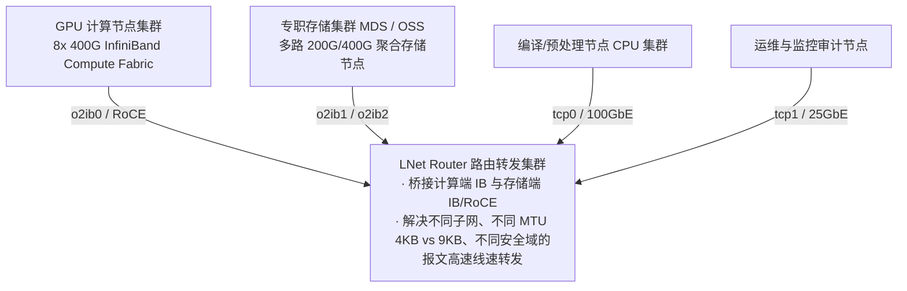
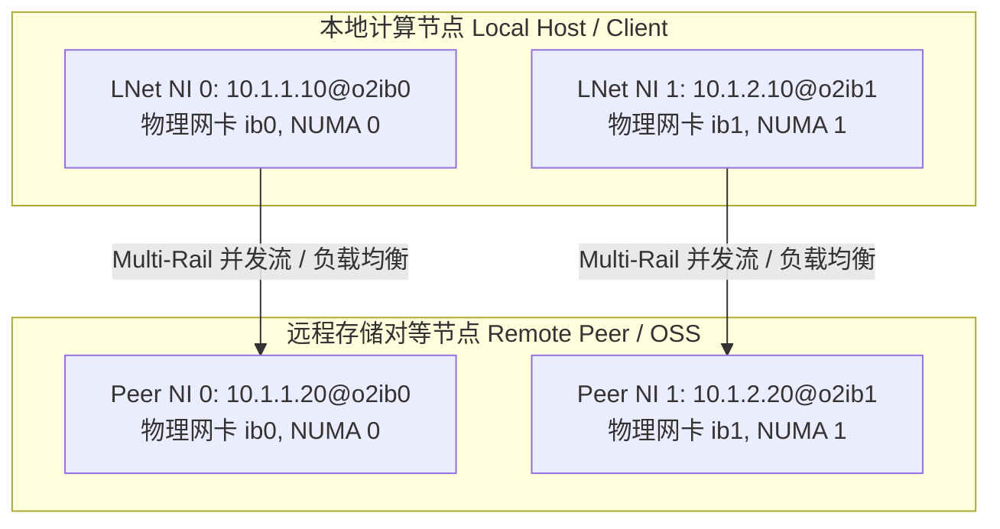
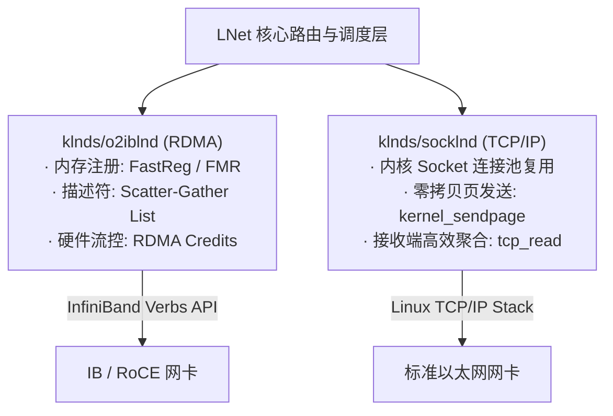

# 第 2 章：LNet（Lustre Network）通信引擎：构建集群血管

> **本章核心源码文件**：  
> - `include/uapi/linux/lnet/lnet-types.h` / `lnet-idl.h`：NID 结构与 LNet 线控报文头协议  
> - `lnet/lnet/api-ni.c`：网络接口（LNet NI）初始化与驱动适配层  
> - `lnet/lnet/peer.c`：端点对等体（Peer）管理与健康检查（Health Check）  
> - `lnet/lnet/router.c`：跨网络路由器调度与缓冲池管理  
> - `lnet/klnds/o2iblnd/o2iblnd.c` / `o2iblnd.h`：InfiniBand / RoCE RDMA 传输驱动  
> - `lnet/klnds/socklnd/socklnd.c` / `socklnd.h`：TCP/IP 套接字传输驱动  

---

## 2.1 生产矛盾：万节点超大规模集群的网络带宽与异构鸿沟

在构建超万张 GPU 的大模型训练算力池或国家级超算集群时，存储网络面临着人类计算机工业史上最苛刻的通信挑战：



1. **CPU 协议栈开销瓶颈**：  
   在 200Gb/s 甚至 400Gb/s 的单网卡线速下，如果使用传统 Linux 内核 TCP/IP 协议栈，CPU 将全速陷入套接字缓冲区分配、三次握手、数据从内核态到用户态的多次拷贝以及软中断处理中。单个 400G 接口就足以跑满双路 CPU 的全部算力，根本无暇执行分布式文件系统的元数据和条带逻辑。**存储网络必须全面拥抱硬件 RDMA（Remote Direct Memory Access）与内核态零拷贝**。
2. **异构网络介质的无缝互通**：  
   现代数据中心往往并存着极速的计算 Fabric（如 InfiniBand HDR/NDR）、高性价比的存储网络（RoCE v2）、以及常规业务网络的以太网（100GbE/25GbE TCP）。上层文件系统绝不能为每种网络编写不同的客户端代码，必须有一层统一的抽象将“网络类型”、“路由跳数”和“传输原语”封装为通用的透明管道。
3. **多网卡链路利用率（Multi-Rail 挑战）**：  
   单个服务器插有 4 张甚至 8 张网卡时，如何让单次文件大块读写自动在多网卡上并发条带化传输？当某根光纤或交换机端口发生静默丢包时，如何在数十毫秒内感知并透明切换，而不是导致上层训练任务由于 I/O 挂起而全盘超时崩溃？

这就是 **LNet（Lustre Network）** 的用武之地。LNet 起源于 Sandia 国家实验室的高性能 Portals 网络协议，经过数十年的工业进化，演变为一套**支持跨网路由、RDMA 零拷贝、动态多轨聚合（Multi-Rail）与主动健康检测**的内核级高性能通信栈。

---

## 2.2 LNet 核心概念模型：NID、Net 与 Peer

LNet 构建了一套独立于底层 IP 体系的分布式网络寻址世界观。

### 2.2.1 节点网络标识（NID, Network Identifier）

在 Lustre 中，任何网络实体的唯一通信地址被称为 **NID**。其字符串表示格式为：

$$\text{NID} = \langle\text{Address}\rangle\text{@}\langle\text{Network Type}\rangle\langle\text{Network Number}\rangle$$

例如：
- `10.10.1.5@tcp0`：基于 TCP/IP 协议、运行在第 0 号以太网上的节点，地址为 `10.10.1.5`；
- `192.168.100.12@o2ib0`：基于 OpenFabrics InfiniBand/RoCE 驱动、运行在第 0 号 IB 网络上的节点，IP 映射为 `192.168.100.12`。

在内核头文件 `include/uapi/linux/lnet/lnet-idl.h` 中，NID 的线控数据结构经过了从 64 位整型到扩展 NID 的升级：

```c
/* 扩展形态的现代 LNet NID 结构体（支持 IPv6、128 位地址及未来网络形态） */
struct lnet_nid {
    __u8    nid_size;       /* 实际有效地址字节数（减 8） */
    __u8    nid_type;       /* 网络类型：SOCKLND, O2IBLND, GNI, KFI 等 */
    __be16  nid_num;        /* 网络编号（如 o2ib0 中的 0） */
    __be32  nid_addr[4];    /* 网络底层地址（如 IPv4 占前 4 字节，IPv6 占满 16 字节） */
} __attribute__((packed));
```

### 2.2.2 网络接口（Net 与 NI）与对等体（Peer）

- **LNet Net**：同构物理网络的抽象集合（如所有的 `o2ib0` 网卡构成一个 Net）。
- **LNet NI（Network Interface）**：本地主机上的一个具体 LNet 网络接口（对应一块物理 InfiniBand HCA 卡或以太网网卡）。
- **LNet Peer**：远程对等节点的抽象。**一个远程物理节点可以同时拥有多个 NID**（如既有 InfiniBand NID，又有管理以太网 NID）。



---

## 2.3 现代架构飞跃：LNet Multi-Rail（多轨网络聚合）

早期 Lustre 每个节点在同一子网内只能使用单张网卡通信，多网卡必须人为划分子网（如 `o2ib0`、`o2ib1`），上层条带化必须通过繁复的手工配置绕行。自 Lustre 2.10 起引入的 **LNet Multi-Rail（MR）** 彻底改变了这一现状。

### 2.3.1 动态对等体发现（Dynamic Discovery）

当客户端向服务端首次发起连接时，LNet 会自动触发 **Push / Pull Discovery 握手协议**：
1. 客户端发送自身所有本地 NI 列表；
2. 服务端回复自身所有可用 NI 列表；
3. 双方在内存中建立高维的 `lnet_peer` 拓扑拓扑表，此后通信时自动将这两台主机之间的流量**分流并行灌入所有可用的物理通道**。

### 2.3.2 动态负载均衡与链路选择算法

在 `lnet/lnet/peer.c` 中，当上层 Portal RPC 提交一个大块 I/O 请求时，LNet 会综合以下四个维度动态选择最佳的本地 NI 和远程 Peer NI：

1. **NUMA 亲和性权重（NUMA Distance）**：优先选择与发起请求线程同属一个 CPT/NUMA 插槽的本地网卡；
2. **当前链路在途信用额度（Credits）**：优先选择队列中等待报文最少的网卡通道；
3. **接口健康度分值（Health Value）**：健康分满分 1000 分，发生丢包或重传时扣分；
4. **网络代价值（Hop / Cost）**：直连优先于路由转发。

### 2.3.3 主动健康检测（Health Check & Ping）

传统网络依靠 TCP KeepAlive 或 IB 心跳，通常需要数秒乃至数十秒才能确认链路挂死。LNet Multi-Rail 实现了专属的硬件级健康监控器：
- 每次传输若发生底层 HCA 报错（如 IB Completion Queue 出现 `IB_WC_RETRY_EXC_ERR`），立即将该 Peer NI 标记为不稳定（`HEALTH_DECREMENT`）；
- 核心引擎自动启动异步后台 Ping 线程探测故障链路；
- **流量瞬间毫秒级重定向到其余存活网卡**，上层正在进行的数吉字节训练读写**完全无感知、零中断**。

---

## 2.4 底层传输驱动（LND）：零拷贝 RDMA 的极致榨干

LNet 本身是无状态的报文路由器与队列调度器，真正的物理层报文发射与接收由 **LND（LNet Network Driver）** 驱动承载。



### 2.4.1 `o2iblnd`：InfiniBand / RoCE 上的零拷贝 RDMA 实现

在超算和 AI 基础设施中，`o2iblnd`（基于 OpenFabrics Alliance 内核 Verbs API）是绝对的吞吐主力。

#### 1. 内存注册模型：FastReg（FRMR）
RDMA 传输的前提是物理内存必须被网卡硬件感知（虚拟地址到物理地址转换被锁定在网卡 TLB 中）。
- 早期使用动态内存注册（`ib_reg_mr`），开销巨大，甚至成为延迟瓶颈；
- 现代 `o2iblnd` 全面采用 **FastReg（Fast Registration Work Requests，也称 FRWR）**：在发送工作队列（Send Queue）中直接下发一条特殊的 `IB_WR_REG_MR` 工作请求，由网卡硬件异步并发完成内存区域（Memory Region）注册，CPU 耗时直接归零。

#### 2. 分散/聚集列表（Scatter-Gather List）直通
在 `lnet/klnds/o2iblnd/o2iblnd.c` 中，文件系统分散在各处的 Page 数组被组织为 RDMA 分散/聚集项：
```c
struct kib_rdma_desc {
    __u64           kib_addr;     /* 物理页面内存总线 DMA 地址 */
    __u32           kib_len;      /* 页面长度（通常为 4KB 或 64KB） */
    __u32           kib_key;      /* RDMA L_Key / R_Key 访问授权密钥 */
};
```
发送方将数据直接由本地内存由网卡 DMA 推送到远程服务器内存指定地址，整个数据读写流水线**不经过任何 CPU 中间缓冲，实现真正意义上的硬件零拷贝**。

#### 3. Credits 信用流控机制
为防止超高速网络将接收端缓冲区打爆并触发 IB 流控死锁（Credit Deadlock），`o2iblnd` 设计了精密的信用额度体系：
- 每次建立连接时双方协商并发 `credits`（通常为 32~64）；
- 发送方每发出一个请求消耗 1 个信用；
- 接收方回复确认或处理完成时释放并附带归还信用；
- 信用耗尽时自动在发送端内核挂起排队，杜绝网络无谓重传。

### 2.4.2 `socklnd`：万兆以太网 TCP 套接字深度优化

在缺少 RDMA 的通用以太网环境中，`socklnd`（`lnet/klnds/socklnd/`）是支撑万兆/十万兆连接的核心：
1. **多连接绑定（Multi-Connection per NI）**：每个 Peer 之间维护若干并发的 TCP 连接，区分小包控制流与大包批量数据流，避免小元数据包被大文件 I/O 队头阻塞。
2. **`kernel_sendpage` 零拷贝**：直接利用 Linux 内核页面通道发射数据，避免从内核 Page Cache 向 Socket Buffer 的多余拷贝。

---

## 2.5 跨子网网络路由引擎（LNet Router）

在超大规模集群中，所有的计算节点不可能全部置于同一个庞大的 L2 广播域或 IB 子网内。

LNet 拥有独特的 **无状态应用层路由器（LNet Router）**：
- **专用路由节点**：一台普通的双网卡服务器（如一张网卡接 InfiniBand，另一张接 100G 以太网），加载 `lnet.ko` 并开启路由转发：
  ```bash
  options lnet forward=1
  ```
- **三级内存缓冲池（Buffer Pools）**：为了以最高吞吐转发报文，LNet Router 在内核内存中预先开辟三级缓冲池：
  - **Tiny Buffers**：用于快速确认（ACK）、控制报文（$< 256$ 字节）；
  - **Small Buffers**：用于元数据请求与 RPC 报头（约 4KB）；
  - **Large Buffers**：用于实际数据切片（1MB 甚至 4MB 大块）。
- **死锁避免算法**：路由器严格执行先到先发与配额隔离，防止某一特定目标服务器的拥塞反压瘫痪整个转发集群。

---

## 2.6 线控数据原语：PUT, GET, REPLY, ACK

在 `include/uapi/linux/lnet/lnet-idl.h` 中，LNet 抽象出了四种极简而强大的线控通信原语：

```c
enum lnet_msg_type {
    LNET_MSG_ACK   = 0,  /* 接收端确认已收到单向消息 */
    LNET_MSG_PUT   = 1,  /* 发送端主动推送数据到目标端内存缓冲区 */
    LNET_MSG_GET   = 2,  /* 发送端请求从目标端拉取特定内存数据 */
    LNET_MSG_REPLY = 3,  /* 对 GET 请求的实际数据承载回复 */
    LNET_MSG_HELLO = 4   /* 链路建连与握手探测 */
};
```

整个上层庞杂的文件系统操作（`read`、`write`、`stat`、`commit`），在被下压到 LNet 链路层时，全部被优雅地折叠为这四种原语的高速排列组合：
- **客户端写数据**：向 OSS 发起 `PUT` 请求推送数据块；
- **客户端读数据**：向 OSS 发起 `GET` 请求拉取数据块，OSS 通过 `REPLY` 将 RDMA 数据流直灌客户端指定的页面缓冲区中。

---

## 2.7 生产实战：LNet 调优与排错黄金指南

### 2.7.1 核心调优参数配置

在生产环境的 `/etc/modprobe.d/lnet.conf` 中，核心调优黄金配比如下：

```bash
# 启用动态 Multi-Rail 聚合，设置健康检测 Ping 间隔为 10 秒
options lnet lnet_peer_discovery_support=1
options lnet lnet_health_sensitivity=100

#针对 InfiniBand HDR/NDR 高速网络（o2iblnd 优化参数）
options ko2iblnd credits=64 peer_credits=32 peer_credits_hiw=16 concurrent_sends=64 map_on_demand=256
```

### 2.7.2 常见网络故障诊断速查表

| 常见故障特征 | 故障根因分析 | 推荐排查与修复指令 |
| :--- | :--- | :--- |
| **`Peer NI unhealthy` 告警** | 物理链路存在微弱误码，触发健康度分值扣除 | 运行 `lctl net health` 查看具体的健康分，检查 IB 网卡 `symbol_error` 计数。 |
| **`Out of credits` 挂死** | 接收端处理极慢，发送端信用额度耗尽挂起 | 运行 `lctl dk` 查看是否有大量等待 credits 的报文，排查目标机 OSS 是否存在磁盘 I/O 阻塞。 |
| **跨网络路由丢包** | LNet Router 内存大缓冲池（Large Buffers）耗尽 | 检查 `lctl router_stat`，若 `dropped` 计数增加，调大路由器的 `large_router_buffers`。 |

---

## 2.8 真实生产事故复盘：Multi-Rail 动态流控失效引发 InfiniBand 信用耗尽重传雪崩

### 2.8.1 故障现象与现场特征
在某 8,000 卡 GPU 训练大集群中，所有计算节点配置双口 200Gbps HDR InfiniBand 网卡（`mlx5_0` 与 `mlx5_1`），通过 LNet Multi-Rail 聚合连接到存储层。
当某万亿参数大模型每隔 15 分钟触发一次全集群分布式同步保存 Checkpoint（单次瞬时写入量 40TB）时，集群大约有 5% 的计算节点出现严重的 `LNet: Out of peer credits` 报警，紧接着触发 RPC 超时（`PTLRPC: error sending RPC: -ETIMEDOUT`），最终导致深度学习训练框架报 `NCCL/IO Error` 崩溃中断。

### 2.8.2 排查过程与排错弯路
1. **最初怀疑**：IB 交换机背板拥塞，PFC 触发死锁导致丢包。
2. **抓包与交换机排查**：使用 `ibdiagnet` 分析全网链路，发现交换机端口并无严重的 Pause 帧堆积，物理链路误码为 0。
3. **深入 LNet 状态排查**：
   在报错客户端执行 `lctl net health` 与 `lctl get_param lnet.peers.*`：
   ```text
   # lctl get_param lnet.peers.10.10.10.51@o2ib.credits
   credits: 0 / 32
   outstanding_tx: 32
   health_value: 0 (Unhealthy)
   ```
   **惊人发现**：
   客户端虽然配了双网卡（`mlx5_0` 和 `mlx5_1`），但目标存储节点 OSS 01 的 `mlx5_0` 由于受控交换机升级临时发生了微秒级毛刺。LNet 的动态健康探测器（`lnet_health`）立刻将 OSS 01 的 Port 0 健康度降分，导致 Multi-Rail 算法将后续该客户端的所有流量**全部倾泻到了 Port 1**。
   但此时客户端针对该 Peer Port 1 的 `peer_credits` 上限仅配置为 32。在数千个客户端并发涌向同一个存储端口时，发送端发送队列（Tx Queue）在 2 毫秒内彻底被打满，信用配额降为 0！由于无法获取发送信用，后续 RPC 被强行阻塞在 `tx_queue` 超过 `lnet_transaction_timeout`（默认 50 秒），直接超时暴毙。

### 2.8.3 根因定性与修复方案
- **根本原因**：
  1. `ko2iblnd` 默认的单 Peer 信用配额 `peer_credits=8` 或 `32` 过于保守，与 200G/400G 极高并发场景不匹配；
  2. Multi-Rail 在某一网口发生健康度抖动时，流量重定向没有加权平滑过渡，瞬间击穿单口流控上限。
- **热修复与参数调整**：
  在全体客户端与服务端调整 `/etc/modprobe.d/lnet.conf`：
  ```bash
  # 将 Peer 信用额度提升至 64，高水位线设为 32，全局信用池扩大为 256
  options ko2iblnd credits=256 peer_credits=64 peer_credits_hiw=32 concurrent_sends=64
  # 调整事务超时时间为 60 秒，并放宽健康度惩罚衰减率
  options lnet lnet_transaction_timeout=60
  options lnet lnet_health_sensitivity=50
  ```
  实施调整后，再次触发 40TB Checkpoint 倾泻写入，LNet peer credits 峰值稳定保持在 18~28 之间，再无单口信用耗尽报警，训练中断归零。

---

## 2.9 LNet 核心调优与避坑 Checklist

- [ ] **Multi-Rail 对称拓扑与 NUMA 绑定**：确认所有计算和存储节点的网卡均正确配置 `cpt_binding`，确保每个 IB HCA 绑定到对应 NUMA Core，消除跨插槽 PCIe 竞争。
- [ ] **网络信用配置（Credits Allocation）**：
  - HDR (200Gbps) / NDR (400Gbps) 网络：设置 `credits=256`、`peer_credits=64`；
  - 100Gbps EDR 网络：设置 `credits=128`、`peer_credits=32`；
  - 避免 `credits` 设置低于 `peer_credits * 2`，否则单点打满将耗尽全网信用池。
- [ ] **LNet Router 大缓冲区配额（Router Buffers）**：
  跨网络（如 Omni-Path 路由到 InfiniBand）时，检查路由器 `/proc/sys/lnet/large_router_buffers`，高并发环境下务必将其从默认 512 提升至 4096 或 8192，杜绝丢包。
- [ ] **Peer Discovery 与 Health 动态感知**：
  在集群初始化时显式确认 `lnet_peer_discovery_support=1`。若集群网络为静态隔离拓扑，可考虑降低 `lnet_health_sensitivity` 避免网络抖动触发误删路由。
- [ ] **避免与系统网络防火墙冲突**：
  确认 `ptlrpc` 端口（默认 988）在防火墙中全部放行，且 IB 子网管理器（OpenSM）路由表中所有节点 GUID 路由权重对称。

---

### 本章小结

LNet 是 Lustre 系统的“高速公路网”。它抛弃了传统网络栈的包袱，**通过 NID 抽象消除网络物理边界、通过 Multi-Rail 释放全链路带宽、通过 o2iblnd 将内存直连网卡硬件**。

有了这条微秒级、数百 GB/s 的血管，Lustre 的分布式调度才能毫无后顾之忧。下一章，我们将剖析流淌在这条血管之上的**统一线控协议与数据包布局（Wire Protocol）**。

