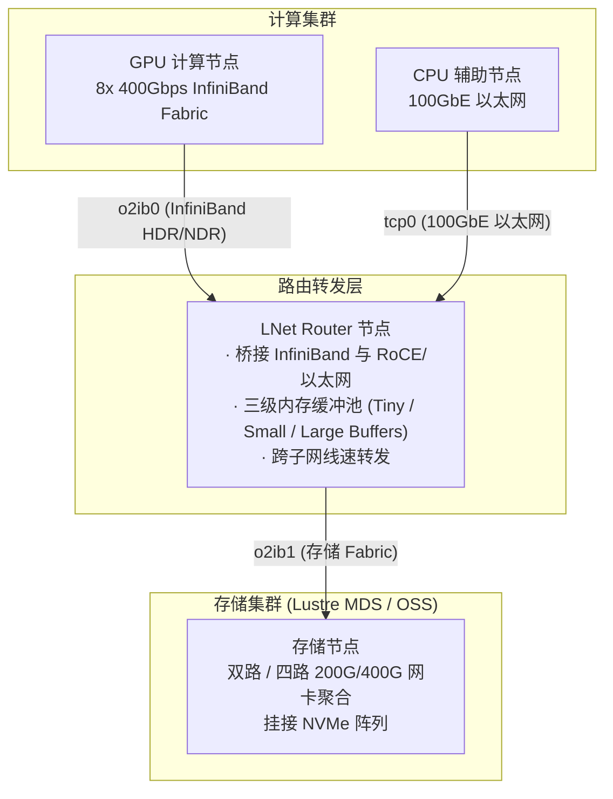
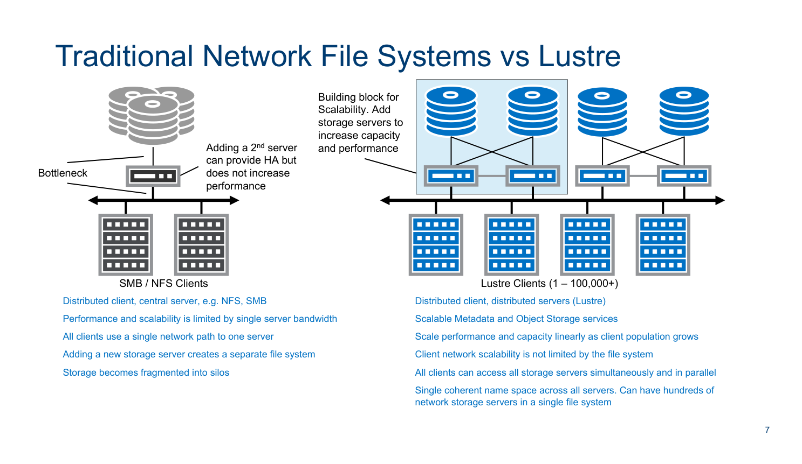
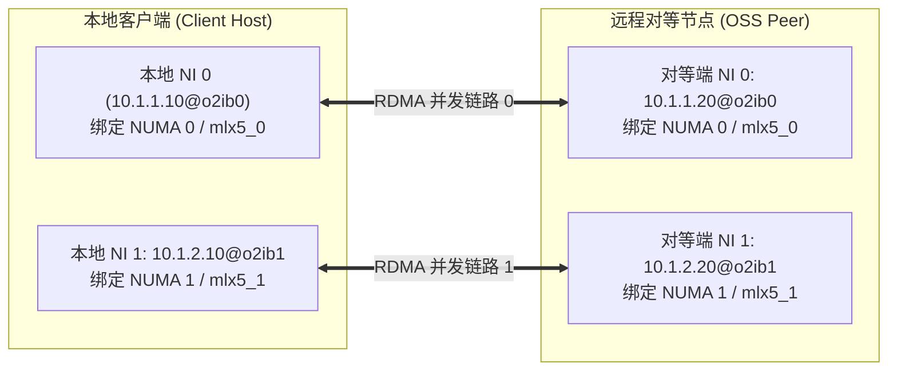
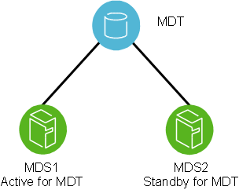
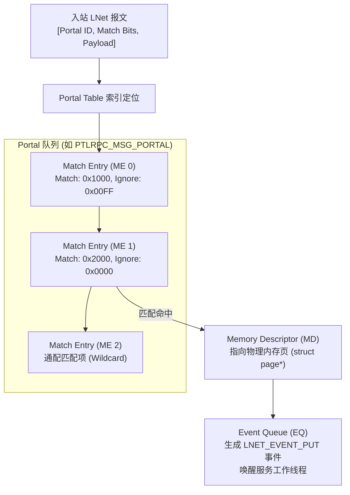
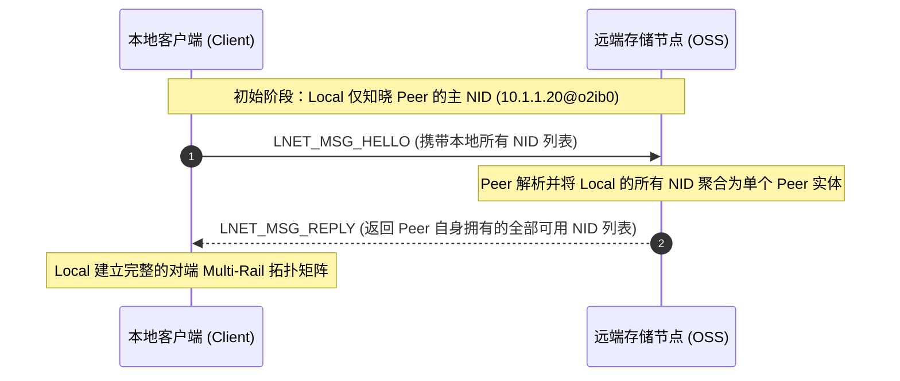
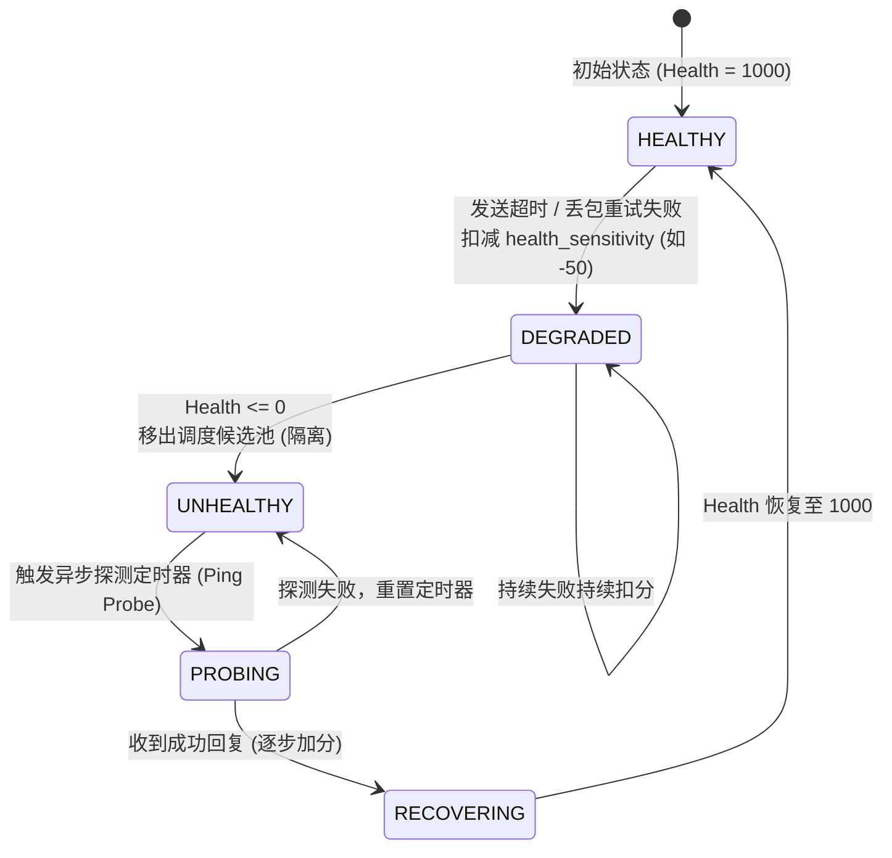

# 第 2 章：LNet（Lustre Network）通信引擎：构建高性能通信管道

> **本章核心源码文件**：  
> - `include/uapi/linux/lnet/lnet-types.h` / `lnet-idl.h`：NID 结构与 LNet 线控报文头协议  
> - `lnet/lnet/api-ni.c`：网络接口（LNet NI）初始化与驱动适配层  
> - `lnet/lnet/peer.c`：对等体（Peer）管理、动态发现与健康检查（Health Check）  
> - `lnet/lnet/router.c`：跨网络路由器调度与缓冲池管理  
> - `lnet/klnds/o2iblnd/o2iblnd.c` / `o2iblnd.h`：InfiniBand / RoCE RDMA 传输驱动  
> - `lnet/klnds/socklnd/socklnd.c` / `socklnd.h`：TCP/IP 套接字传输驱动  
> - `lnet/utils/lnetconfig/liblnetconfig.c`：LNet 动态配置 C-API 库实现  

---

## 2.1 存储通信约束：高带宽、介质异构与协议栈开销

在大型 GPU 智算中心与高性能计算（HPC）集群中，单节点网络带宽已达到 200Gb/s 至 800Gb/s。在这一吞吐级别下，存储网络通信面临三项物理约束：


*图 2-1: Lustre 文件系统核心组件（MGS、MDS/MDT、OSS/OST、Client）与网络互联拓扑（来源：Understanding Lustre Internals）*


```mermaid
flowchart TD
    subgraph Compute_Tier ["计算集群"]
        GPU["GPU 计算节点<br/>8x 400Gbps InfiniBand Fabric"]
        COMPILE["CPU 辅助节点<br/>100GbE 以太网"]
    end

    subgraph Router_Tier ["路由转发层"]
        ROUTER["LNet Router 节点<br/>· 桥接 InfiniBand 与 RoCE/以太网<br/>· 三级内存缓冲池 (Tiny / Small / Large Buffers)<br/>· 跨子网线速转发"]
    end

    subgraph Storage_Tier ["存储集群 (Lustre MDS / OSS)"]
        STORE["存储节点<br/>双路 / 四路 200G/400G 网卡聚合<br/>挂接 NVMe 阵列"]
    end

    GPU -->|"o2ib0 (InfiniBand HDR/NDR)"| ROUTER
    COMPILE -->|"tcp0 (100GbE 以太网)"| ROUTER
    ROUTER -->|"o2ib1 (存储 Fabric)"| STORE
```

### 1. 传统 TCP/IP 协议栈的 CPU 瓶颈
在 200Gb/s 及以上线速下，若使用标准 Linux 内核 TCP/IP 栈，协议栈在套接字缓冲区分配、内存拷贝（内核态至用户态）、校验和计算以及软中断处理上会消耗大量 CPU 指令周期。存储节点的大部分计算资源将被网络协议栈消耗，无法充分释放文件系统元数据与并发条带 I/O 的处理能力。因此，高性能存储网络必须依赖硬件 RDMA（Remote Direct Memory Access）实现内核态零拷贝。

### 2. 异构网络介质互通
大型数据中心内部通常混合存在多种网络技术：用于高并发计算的 InfiniBand（HDR/NDR）、高性价比存储网络使用的 RoCE（RDMA over Converged Ethernet），以及用于管理与辅助编译的以太网（100GbE/25GbE TCP）。上层分布式文件系统需要统一的网络抽象层，屏蔽底层物理介质、路由跳数及传输原语的差异。

### 3. 多网卡聚合（Multi-Rail）与可用性保障
当单台服务器配置 2 至 8 块物理网卡时，网络层需要将单次大块 I/O 自动分配到多个网卡上并发传输。同时，在物理链路发生瞬时误码、微秒级丢包或交换机端口故障时，网络层需在数十毫秒内感知并执行透明链路倒换，避免上层 I/O 请求超时引发作业中断。

**LNet（Lustre Network）** 基于 Sandia 国家实验室的 Portals 3.3 规范设计，演进为支持多传输驱动（LND）、跨网络路由、内核零拷贝、动态多轨聚合（Multi-Rail）与链路健康自愈的高性能通信子系统。

---

## 2.2 LNet 寻址模型：NID、Net 与 Peer

LNet 拥有独立于底层物理网络 IP 体系的抽象寻址机制。

### 2.2.1 节点网络标识符（NID, Network Identifier）

LNet 集群中所有网络端点的唯一地址称为 **NID**，其标准字符串格式定义如下：

$$\text{NID} = \langle\text{IP/物理地址}\rangle\text{@}\langle\text{网络类型}\rangle\langle\text{网络编号}\rangle$$

常用格式示例：
- `192.168.10.15@tcp0`：基于 TCP/IP 驱动、运行在 `tcp0` 网络上的端点，对应 IPv4 地址为 `192.168.10.15`。
- `10.10.1.20@o2ib0`：基于 OpenFabrics InfiniBand/RoCE 驱动、运行在 `o2ib0` 网络上的端点，对应映射 IP 为 `10.10.1.20`。

在头文件 `include/uapi/linux/lnet/lnet-idl.h` 中，NID 的线控数据结构包含传统 64 位整型与扩展 NID：

```c
/* 扩展 LNet NID 结构体，支持 IPv6 及更大地址空间 */
struct lnet_nid {
    __u8    nid_size;       /* 地址字节数减 8，标识地址有效长度 */
    __u8    nid_type;       /* 网络类型代号：SOCKLND, O2IBLND, GNI, KFI 等 */
    __be16  nid_num;        /* 网络编号（如 o2ib0 中的 0） */
    __be32  nid_addr[4];    /* 网络地址空间（IPv4 占低位，IPv6 占满 16 字节） */
} __attribute__((packed));
```

### 2.2.2 核心拓扑抽象：Net、NI 与 Peer



*图 2-2: LNet 网络架构：客户端多轨聚合与 LNet 路由器中继设计（来源：Lustre Architecture v4）*


```mermaid
flowchart LR
    subgraph Client_Host ["本地客户端 (Client Host)"]
        direction TB
        L_NI0["本地 NI 0 (10.1.1.10@o2ib0)<br/>绑定 NUMA 0 / mlx5_0"]
        L_NI1["本地 NI 1: 10.1.2.10@o2ib1<br/>绑定 NUMA 1 / mlx5_1"]
    end

    subgraph OSS_Peer ["远程对等节点 (OSS Peer)"]
        direction TB
        P_NI0["对等端 NI 0: 10.1.1.20@o2ib0<br/>绑定 NUMA 0 / mlx5_0"]
        P_NI1["对等端 NI 1: 10.1.2.20@o2ib1<br/>绑定 NUMA 1 / mlx5_1"]
    end

    L_NI0 <==>|"RDMA 并发链路 0"| P_NI0
    L_NI1 <==>|"RDMA 并发链路 1"| P_NI1
```

- **LNet Net**：同构物理网络集合，由属于同一网络类型且网络编号相同的接口组成（如系统中全部接入同一 InfiniBand 子网的 `o2ib0` 接口）。
- **LNet NI（Network Interface）**：本地主机上的一个网络实例，对应一块具体的物理 InfiniBand HCA 卡或以太网网卡。
- **LNet Peer**：远程物理主机的软件抽象。**一个 Peer 实体可以聚合属于该物理主机的多个 Peer NI（每个网卡对应一个 NID）**。



*图 2-3: 官方手册中的 LNet Multi-Rail 多网卡硬件映射（来源：Lustre Chinese Operations Manual）*

---

## 2.3 Portals 3.3 核心机制：ME、MD 与 EQ

LNet 继承并实现了 Portals 3.3 的内存匹配模型，用于在无连接、异步的分布式环境下实现接收缓冲区的高效解复用。


```mermaid
flowchart TD
    MSG["入站 LNet 报文<br/>[Portal ID, Match Bits, Payload]"]
    MSG --> PT["Portal Table 索引定位"]
    
    subgraph Portal_Queue ["Portal 队列 (如 PTLRPC_MSG_PORTAL)"]
        ME0["Match Entry (ME 0)<br/>Match: 0x1000, Ignore: 0x00FF"]
        ME1["Match Entry (ME 1)<br/>Match: 0x2000, Ignore: 0x0000"]
        ME2["Match Entry (ME 2)<br/>通配匹配项 (Wildcard)"]
        ME0 --> ME1 --> ME2
    end
    
    PT --> ME0
    ME1 -->|匹配命中| MD["Memory Descriptor (MD)<br/>指向物理内存页 (struct page*)"]
    MD --> EQ["Event Queue (EQ)<br/>生成 LNET_EVENT_PUT 事件<br/>唤醒服务工作线程"]
```

### 1. 匹配条目（Match Entry, ME）
在接收端，每个特定的业务服务（Portal）维护一个 ME 链表。每个 ME 包含匹配位（`match_bits`）与忽略掩码（`ignore_bits`）。入站报文根据算法执行比对：

$$(\text{Incoming Bits} \oplus \text{ME.match\_bits}) \ \& \ (\sim \text{ME.ignore\_bits}) == 0$$

只有当计算结果为 0 时，报文才与该 ME 匹配成功。通过配置 `ignore_bits`，LNet 支持范围匹配、会话 ID 匹配以及全通配匹配。

### 2. 内存描述符（Memory Descriptor, MD）
MD 描述一段具体的物理内存或页表向量（Scatter-Gather 链表）。当报文命中 ME 后，网卡硬件将有效载荷直接 DMA 写入该 MD 指向的物理地址，完全跳过协议栈中间拷贝。

### 3. 事件队列（Event Queue, EQ）
EQ 是环形无锁事件队列。当数据写入完成或发送操作被确认时，底层 LND 硬件中断触发 LNet 向 EQ 写入事件（如 `LNET_EVENT_PUT`、`LNET_EVENT_GET` 或 `LNET_EVENT_SEND`），唤醒处于等待状态的 PtlRPC 处理线程。

---

## 2.4 Multi-Rail 多轨传输与健康自愈机制

在 Lustre 2.10 之后引入的 Multi-Rail 架构彻底重塑了 LNet 的多网卡调度策略。

### 2.4.1 对等体动态发现（Dynamic Peer Discovery）

传统 LNet 必须在每个节点静态配置全网各节点的网卡映射。Multi-Rail 实现了基于线控报文的动态发现协议（Push/Pull Discovery）：


```mermaid
sequenceDiagram
    autonumber
    participant Local as 本地客户端 (Client)
    participant Peer as 远端存储节点 (OSS)
    
    Note over Local, Peer: 初始阶段：Local 仅知晓 Peer 的主 NID (10.1.1.20@o2ib0)
    Local->>Peer: LNET_MSG_HELLO (携带本地所有 NID 列表)
    Note over Peer: Peer 解析并将 Local 的所有 NID 聚合为单个 Peer 实体
    Peer-->>Local: LNET_MSG_REPLY (返回 Peer 自身拥有的全部可用 NID 列表)
    Note over Local: Local 建立完整的对端 Multi-Rail 拓扑矩阵
```


*图 2-4: 官方 LNet 路由器架构：多网络子网接入与数据流转（来源：Lustre Chinese Operations Manual）*


*图 2-5: 复杂跨子网拓扑：IB 计算节点经 LNet Router 透明访问 TCP/RoCE 存储集群（来源：Lustre Chinese Operations Manual）*

### 2.4.2 Multi-Rail 接口选择算法（Best NI Selection）

当本地主机准备向目标 Peer 发送大块数据时，LNet 在本地全部可用 NI 与远端 Peer 全部可用 NI 构成的笛卡尔积中，按以下优先级打分裁决最优通道：

$$\text{Priority Matrix} = \text{NUMA Distance} \rightarrow \text{Net Priority} \rightarrow \text{Health Score} \rightarrow \text{Credit Availability}$$

1. **同网络匹配（Same Net）**：强制本地与远端必须处于同一 LNet Net（如双方均为 `o2ib0`），若跨网络则交由 LNet Router 转发。
2. **NUMA 局部性（NUMA Distance）**：优先选择与当前调用线程同属一个 CPT 的本地 NI，减少 PCIe 跨片开销。
3. **健康评分（Health Value）**：优先选择健康分最高的本地与远端 NI。
4. **信用与负载（Credits & In-Flight）**：在并列候选中，选择当前在途报文最少、可用信用额度（`credits`）最多的链路执行传输。


*图 2-6: 基于 lnetctl 的 Multi-Rail 动态接口聚合与多轨路由拓扑（来源：Lustre Chinese Operations Manual）*

### 2.4.3 健康检查与动态自愈状态机

为解决交换机微丢包导致的链路亚健康问题，LNet 为每个 NI 维护独立的健康评分（初始满分 `LNET_MAX_HEALTH_VALUE = 1000`）：


```mermaid
stateDiagram-v2
    [*] --> HEALTHY: 初始状态 (Health = 1000)
    
    HEALTHY --> DEGRADED: 发送超时 / 丢包重试失败<br/>扣减 health_sensitivity (如 -50)
    DEGRADED --> DEGRADED: 持续失败持续扣分
    DEGRADED --> UNHEALTHY: Health <= 0<br/>移出调度候选池 (隔离)
    
    UNHEALTHY --> PROBING: 触发异步探测定时器 (Ping Probe)
    PROBING --> RECOVERING: 收到成功回复 (逐步加分)
    RECOVERING --> HEALTHY: Health 恢复至 1000
    PROBING --> UNHEALTHY: 探测失败，重置定时器
```

- **故障扣分**：当发生链路超时（如未能在 `lnet_transaction_timeout` 内收到 ACK）时，健康分扣减 `health_sensitivity`（默认 50 或 100）。
- **避让隔离**：一旦健康分低于阈值，Multi-Rail 调度器自动将该网卡降级，后续 I/O 自动迁移至主机的备用网卡。
- **后台探测自愈**：LNet 后台线程周期性向异常网卡发送轻量级 PING 探测包。连续探测成功后，按步长恢复健康分，最终重新纳入均衡调度。

---

## 2.5 传输驱动抽象：o2iblnd 与 socklnd

LND（Lustre Network Driver）通过抽象接口统一适配不同的硬件传输层。

### 2.5.1 `o2iblnd`：OpenFabrics InfiniBand/RoCE 驱动

`o2iblnd` 基于内核 OpenFabrics Verbs API 构建，是超算与高性能智算场景的核心驱动。

#### 1. 内存注册模型：FastReg（FRWR）
RDMA 传输要求目标物理内存被网卡硬件识别并固定（虚拟地址到物理总线地址的映射锁定在网卡 TLB 中）。
- 传统动态注册接口开销较高，难以匹配极短延迟请求。
- 现代 `o2iblnd` 采用 **FastReg（Fast Registration Work Requests）** 机制：通过向发送工作队列（Send Queue）提交一条 `IB_WR_REG_MR` 工作请求，由网卡硬件异步并发完成内存区域（Memory Region）的注册，大幅降低 CPU 开销。

#### 2. 分散/聚集列表（Scatter-Gather List）
在 `lnet/klnds/o2iblnd/o2iblnd.c` 中，文件系统分散在各处的内存物理页被组织为描述符链表：

```c
struct kib_rdma_desc {
    __u64           kib_addr;     /* 物理内存页面总线 DMA 地址 */
    __u32           kib_len;      /* 缓冲区长度（通常为 4KB 或 64KB） */
    __u32           kib_key;      /* RDMA L_Key / R_Key 访问凭证 */
};
```
通过网卡 DMA 控制器，发送端直接将本地内存页面推送或拉取至远程服务器的指定物理内存，数据流不经过 CPU 中间缓冲，实现端到端硬件零拷贝。

#### 3. 信用流控机制（Credits Management）
为防止超高速网络将接收端缓冲区打满导致网卡丢包，`o2iblnd` 实现了双向信用流控：
- **全局信用（`credits`）**：单张本地网卡允许并发在途的最大工作请求总数。
- **对等端信用（`peer_credits`）**：本地网卡与单个远端节点建立连接时协商的并发上限（通常设为 32 至 64）。
- 发送方每发出一个报文消耗 1 个信用；接收端处理完毕或回复报文时归还信用。当对等端信用耗尽时，发送端在内核队列中排队，防止网络层发生溢出重传。

### 2.5.2 `socklnd`：通用以太网 TCP 驱动

在缺乏 RDMA 支持的通用以太网环境中，`socklnd` 提供了针对大吞吐优化的实现：
- **控制流与数据流连接分离**：每个 Peer 之间建立多条独立的 TCP 套接字连接。小包 RPC 控制信令走专有控制连接，大块数据传输走数据连接，避免大吞吐 I/O 阻塞元数据请求。
- **页面零拷贝（`kernel_sendpage`）**：对于大块数据发送，直接将 Page Cache 中的物理页通过内核套接字管道发出，避免用户态与内核态之间的二次内存拷贝。

---

## 2.6 LNet 动态配置 C-API 与 lnetctl 体系


*图 2-7: LNet 用户态配置体系：liblnetconfig C-API 与底层内核 ioctl 通信架构（来源：Lustre Chinese Operations Manual）*

官方操作手册详细定义了 LNet 的现代化配置体系。LNet 废弃了早期的静态模块参数重载机制，全面转向基于 YAML 与 `liblnetconfig` 的用户态动态管理工具 `lnetctl`。

### 2.6.1 常用 lnetctl 动态运维操作

```bash
# 1. 动态添加本地网络接口 (绑定特定 NUMA CPT)
lnetctl net add --net o2ib0 --if mlx5_0 --cpt 0

# 2. 动态向指定 Peer 添加多轨网卡
lnetctl peer add --prim_nid 10.10.1.20@o2ib0 --nid 10.10.2.20@o2ib1

# 3. 动态配置跨网络路由
lnetctl route add --net tcp0 --gateway 10.10.1.100@o2ib0 --hop 1 --priority 1

# 4. 导出当前全部 LNet 网络拓扑为 YAML 配置文件
lnetctl export > /etc/lnet.conf

# 5. 查看链路健康统计与故障计数
lnetctl net show --detail
```

---

## 2.7 生产实战：LNet Self-Test（lst）全网基准测试

在 Lustre 部署或扩容完成后，严禁在未经验证的网络上直接挂载文件系统。官方操作手册第三十二章专门规定了 **LNet Self-Test (`lst`)** 标准测试规程，用于在完全剥离上层磁盘 I/O 的前提下，压测端到端网络真实吞吐与延迟。

### 2.7.1 lst 架构与核心概念

- **Session（测试会话）**：控制整个测试生命周期的上下文。
- **Group（节点组）**：将测试节点划分为客户端组（Clients）与服务端组（Servers）。
- **Batch（批处理）**：一组并发执行的通信任务集合。

### 2.7.2 生产标准端到端压测脚本

```bash
#!/bin/bash
# LNet 全网吞吐压测自动化脚本
export LST_SESSION=$$

# 1. 初始化会话
lst new_session lustre_fabric_perf

# 2. 创建测试节点组
lst add_group servers 10.10.1.[20-23]@o2ib0
lst add_group clients 10.10.2.[1-64]@o2ib0

# 3. 创建测试批次：大块 RDMA 聚合写入测试 (1MB 块大小，并发度 16)
lst add_batch write_test
lst add_test --batch write_test --from clients --to servers \
             --distribute 1:1 --concurrency 16 brw write check=simple size=1M

# 4. 启动压力测试并采样监控 (持续运行 60 秒)
lst run write_test
echo "LNet 性能测试运行中，采集吞吐监控..."
lst stat --bw --rate servers 5 &
STAT_PID=$!
sleep 60

# 5. 停止测试并清理环境
lst stop write_test
kill $STAT_PID
lst end_session
```

测试输出重点指标：
- **Bandwidth（带宽）**：若实测带宽达到物理链路理论极限的 92% 以上（如 200Gbps HDR 实测达到 22.5GB/s），表明网络底层无拥塞。
- **Drop / Retrans Rate（丢包/重传率）**：若出现非零丢包，说明交换机 PFC/ECN 流控配置存在缺陷。

---

## 2.8 生产事故案例：Multi-Rail 流量倾斜引发信用额度耗尽雪崩

### 2.8.1 故障现象

某 8000 卡 GPU 训练集群中，计算节点配置双口 200Gb/s HDR InfiniBand 网卡（`mlx5_0` 与 `mlx5_1`），通过 LNet Multi-Rail 连接存储层。

在进行大规模模型分布式训练时，全集群每 15 分钟执行一次同步 Checkpoint 写入（单次突发写入量约 40TB）。在写入过程中，约 5% 的计算节点出现内核告警：
```text
LNet: 10.10.1.15@o2ib0: Out of peer credits to 10.10.1.50@o2ib0
PTLRPC: error sending RPC: -ETIMEDOUT
```
紧接着，计算框架抛出 `NCCL / I/O Timeout` 异常，导致整体训练作业中断退出。

### 2.8.2 排查过程

1. **底层链路排查**：  
   使用 `ibdiagnet` 检查全网物理链路与交换机端口，无物理误码与 Pause 帧死锁，链路物理层状态正常。

2. **LNet 节点状态检查**：  
   在故障计算节点上检查对端存储节点（`10.10.1.50@o2ib`）的连接状态：
   ```text
   # lctl get_param lnet.peers.10.10.1.50@o2ib.credits
   credits: 0 / 32
   outstanding_tx: 32
   health_value: 0 (Unhealthy)
   ```
   **排查发现**：  
   目标存储节点 OSS 01 的 `mlx5_0` 端口在此前因交换机巡检发生过微秒级的链路抖动。LNet 的健康检测模块将该 Peer NI 的健康分直接扣减至 0。  
   在 Multi-Rail 算法的作用下，集群内所有计算节点对该 OSS 的通信流量被全量重定向到该 OSS 的第二网卡端口（`mlx5_1`）。

3. **机理分析**：  
   计算节点针对单个 Peer 端口的默认发送信用上限配置为 `peer_credits=32`。当数千个计算节点同时向同一个存储网卡发起突发 I/O 时，发送端的在途工作队列在极短时间内被打满，可用发送信用降为 0。后续待发 RPC 报文在内核发送队列中阻塞等待释放信用，等待时长超过了事务超时限制（`lnet_transaction_timeout=50s`），最终触发超时错误。

### 2.8.3 修复措施与成效

在客户端与服务端优化 `/etc/modprobe.d/lnet.conf` 参数：

```bash
# 扩大信用额度池，提高突发并发承载能力
options ko2iblnd credits=256 peer_credits=64 peer_credits_hiw=32 concurrent_sends=64

# 放宽超时与平滑健康惩罚阈值
options lnet lnet_transaction_timeout=60
options lnet lnet_health_sensitivity=50
```

更新配置并重新挂载后再次执行 40TB Checkpoint 压力测试，在途信用额度维持在正常水位（15~35 之间），未再出现单端口信用枯竭告警，分布式写入作业稳定完成。

---

## 2.9 运维基线检查清单

- [ ] **网卡与 NUMA 拓扑对齐**：通过 `lctl get_param lnet.nis.*.cpt` 确认每个物理网卡绑定的 CPT 分区与其实际接入的 PCIe 插槽所属 NUMA 节点一致。
- [ ] **链路信用配额匹配**：
  - 100Gb/s (EDR)：配置 `credits=128`，`peer_credits=32`；
  - 200Gb/s (HDR) / 400Gb/s (NDR)：配置 `credits=256`，`peer_credits=64`；
  - 保持 `credits` 至少为 `peer_credits * 2`，防止单连接打满造成全局可用信用枯竭。
- [ ] **动态对等体发现状态确认**：确认 `lnet_peer_discovery_support=1`，确保集群自动维护多轨对等体网格。
- [ ] **LNet Router 缓冲池配置**：跨网络转发场景下，检查并调整 `/proc/sys/lnet/large_router_buffers` 至 4096 或更高，消除缓冲区耗尽引发的丢包。
- [ ] **全网上线前压测验证**：集群投产前必须使用 `lst`（LNet Self-Test）完成饱和打流测试，确认无非零丢包与跨节点吞吐倾斜。
- [ ] **端口与防火墙规则**：确认 Lustre 默认通信端口（TCP 988）在相关主机的防火墙及安全策略中处于放行状态。

---

## 本章小结

LNet 作为 Lustre 的网络传输子系统，通过独立于物理 IP 的 NID 与 Peer 抽象统一了异构网络介质；通过 Portals 3.3 的匹配条目（ME）与内存描述符（MD）模型实现了高效的接收缓冲区解复用；通过 Multi-Rail 技术实现了多网卡带宽聚合与动态故障自愈；并通过针对性的传输驱动（`o2iblnd`、`socklnd`）结合硬件 RDMA 提供了内核态零拷贝传输能力。这些特性为上层的分布式 RPC 调度与数据条带化传输构建了高吞吐、低延迟的通信底座。
