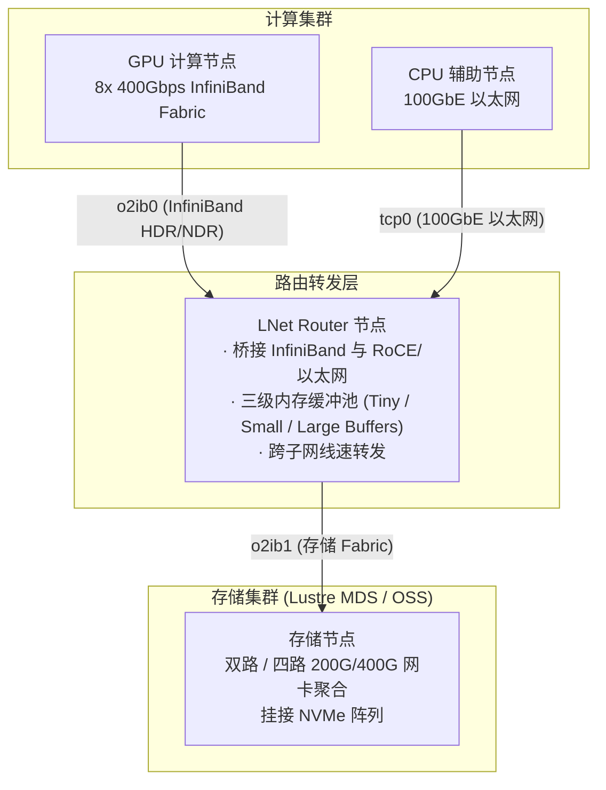

# 2.1 存储通信约束：高带宽、介质异构与协议栈开销

在大型 GPU 智算中心与高性能计算（HPC）集群中，单节点网络带宽已达到 200Gb/s 至 800Gb/s。在这一吞吐级别下，存储网络通信面临三项物理约束：

*图 2-1: Lustre 文件系统核心组件（MGS、MDS/MDT、OSS/OST、Client）与网络互联拓扑（来源：Understanding Lustre Internals）*

## 1. 传统 TCP/IP 协议栈的 CPU 瓶颈
在 200Gb/s 及以上线速下，若使用标准 Linux 内核 TCP/IP 栈，协议栈在套接字缓冲区分配、内存拷贝（内核态至用户态）、校验和计算以及软中断处理上会消耗大量 CPU 指令周期。存储节点的大部分计算资源将被网络协议栈消耗，无法充分释放文件系统元数据与并发条带 I/O 的处理能力。因此，高性能存储网络必须依赖硬件 RDMA（Remote Direct Memory Access）实现内核态零拷贝。

## 2. 异构网络介质互通
大型数据中心内部通常混合存在多种网络技术：用于高并发计算的 InfiniBand（HDR/NDR）、高性价比存储网络使用的 RoCE（RDMA over Converged Ethernet），以及用于管理与辅助编译的以太网（100GbE/25GbE TCP）。上层分布式文件系统需要统一的网络抽象层，屏蔽底层物理介质、路由跳数及传输原语的差异。

## 3. 多网卡聚合（Multi-Rail）与可用性保障
当单台服务器配置 2 至 8 块物理网卡时，网络层需要将单次大块 I/O 自动分配到多个网卡上并发传输。同时，在物理链路发生瞬时误码、微秒级丢包或交换机端口故障时，网络层需在数十毫秒内感知并执行透明链路倒换，避免上层 I/O 请求超时引发作业中断。

**LNet（Lustre Network）** 基于 Sandia 国家实验室的 Portals 3.3 规范设计，演进为支持多传输驱动（LND）、跨网络路由、内核零拷贝、动态多轨聚合（Multi-Rail）与链路健康自愈的高性能通信子系统。

---

