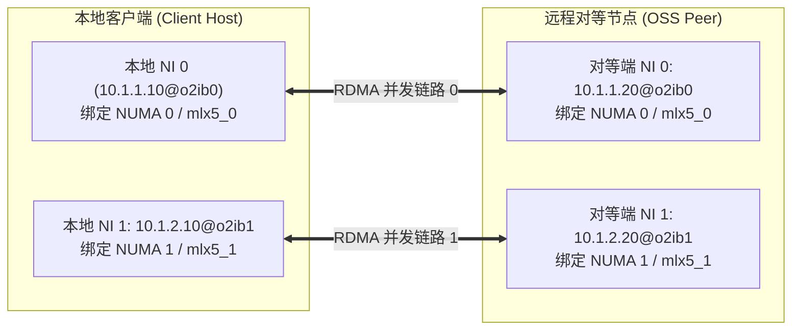

# 2.2 LNet 寻址模型：NID、Net 与 Peer

LNet 拥有独立于底层物理网络 IP 体系的抽象寻址机制。

## 2.2.1 节点网络标识符（NID, Network Identifier）

LNet 集群中所有网络端点的唯一地址称为 **NID**，其标准字符串格式定义如下：

$$\text{NID} = \langle\text{IP/物理地址}\rangle\text{@}\langle\text{网络类型}\rangle\langle\text{网络编号}\rangle$$

常用格式示例：
- `192.168.10.15@tcp0`：基于 TCP/IP 驱动、运行在 `tcp0` 网络上的端点，对应 IPv4 地址为 `192.168.10.15`。
- `10.10.1.20@o2ib0`：基于 OpenFabrics InfiniBand/RoCE 驱动、运行在 `o2ib0` 网络上的端点，对应映射 IP 为 `10.10.1.20`。

在头文件 `include/uapi/linux/lnet/lnet-idl.h` 中，NID 的线控数据结构包含传统 64 位整型与扩展 NID：

```c
/* 扩展 LNet NID 结构体，支持 IPv6 及更大地址空间 */
struct lnet_nid {
    __u8    nid_size;       /* 地址字节数减 8，标识地址有效长度 */
    __u8    nid_type;       /* 网络类型代号：SOCKLND, O2IBLND, GNI, KFI 等 */
    __be16  nid_num;        /* 网络编号（如 o2ib0 中的 0） */
    __be32  nid_addr[4];    /* 网络地址空间（IPv4 占低位，IPv6 占满 16 字节） */
} __attribute__((packed));
```

## 2.2.2 核心拓扑抽象：Net、NI 与 Peer


*图 2-2: LNet 网络架构：客户端多轨聚合与 LNet 路由器中继设计（来源：Lustre Architecture v4）*



- **LNet Net**：同构物理网络集合，由属于同一网络类型且网络编号相同的接口组成（如系统中全部接入同一 InfiniBand 子网的 `o2ib0` 接口）。
- **LNet NI（Network Interface）**：本地主机上的一个网络实例，对应一块具体的物理 InfiniBand HCA 卡或以太网网卡。
- **LNet Peer**：远程物理主机的软件抽象。**一个 Peer 实体可以聚合属于该物理主机的多个 Peer NI（每个网卡对应一个 NID）**。


*图 2-3: 官方手册中的 LNet Multi-Rail 多网卡硬件映射（来源：Lustre Chinese Operations Manual）*

---

