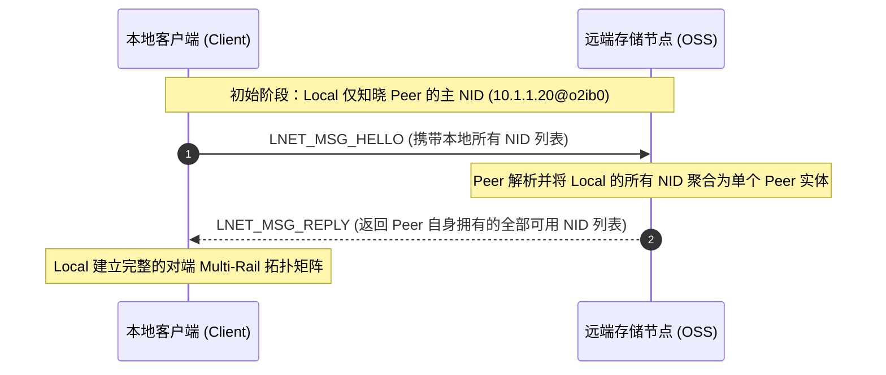
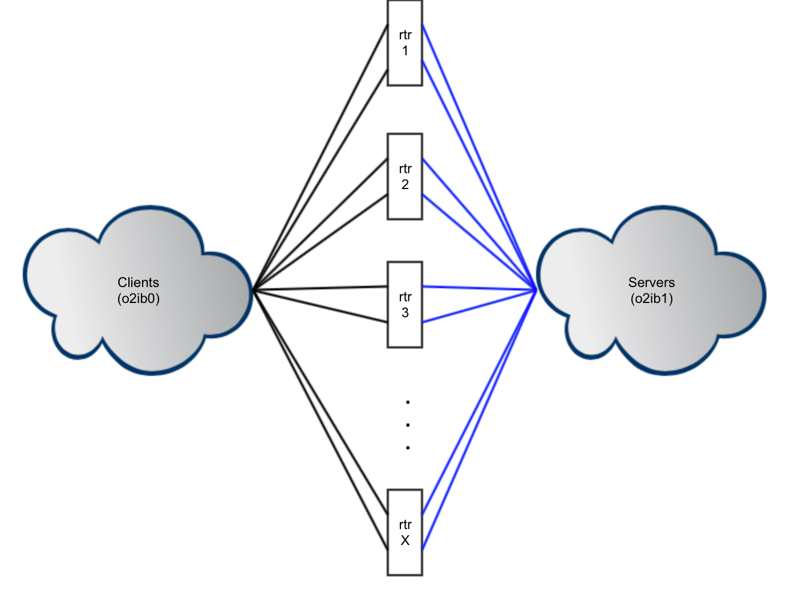
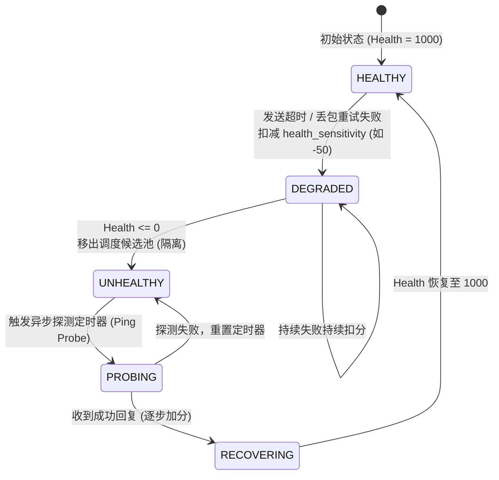

# 2.4 Multi-Rail 多轨传输与健康自愈机制

在 Lustre 2.10 之后引入的 Multi-Rail 架构彻底重塑了 LNet 的多网卡调度策略。

## 2.4.1 对等体动态发现（Dynamic Peer Discovery）

传统 LNet 必须在每个节点静态配置全网各节点的网卡映射。Multi-Rail 实现了基于线控报文的动态发现协议（Push/Pull Discovery）：

*图 2-4: 官方 LNet 路由器架构：多网络子网接入与数据流转（来源：Lustre Chinese Operations Manual）*

*图 2-5: 复杂跨子网拓扑：IB 计算节点经 LNet Router 透明访问 TCP/RoCE 存储集群（来源：Lustre Chinese Operations Manual）*

## 2.4.2 Multi-Rail 接口选择算法（Best NI Selection）

当本地主机准备向目标 Peer 发送大块数据时，LNet 在本地全部可用 NI 与远端 Peer 全部可用 NI 构成的笛卡尔积中，按以下优先级打分裁决最优通道：

$$\text{Priority Matrix} = \text{NUMA Distance} \rightarrow \text{Net Priority} \rightarrow \text{Health Score} \rightarrow \text{Credit Availability}$$

1. **同网络匹配（Same Net）**：强制本地与远端必须处于同一 LNet Net（如双方均为 `o2ib0`），若跨网络则交由 LNet Router 转发。
2. **NUMA 局部性（NUMA Distance）**：优先选择与当前调用线程同属一个 CPT 的本地 NI，减少 PCIe 跨片开销。
3. **健康评分（Health Value）**：优先选择健康分最高的本地与远端 NI。
4. **信用与负载（Credits & In-Flight）**：在并列候选中，选择当前在途报文最少、可用信用额度（`credits`）最多的链路执行传输。

*图 2-6: 基于 lnetctl 的 Multi-Rail 动态接口聚合与多轨路由拓扑（来源：Lustre Chinese Operations Manual）*

## 2.4.3 健康检查与动态自愈状态机

为解决交换机微丢包导致的链路亚健康问题，LNet 为每个 NI 维护独立的健康评分（初始满分 `LNET_MAX_HEALTH_VALUE = 1000`）：

- **故障扣分**：当发生链路超时（如未能在 `lnet_transaction_timeout` 内收到 ACK）时，健康分扣减 `health_sensitivity`（默认 50 或 100）。
- **避让隔离**：一旦健康分低于阈值，Multi-Rail 调度器自动将该网卡降级，后续 I/O 自动迁移至主机的备用网卡。
- **后台探测自愈**：LNet 后台线程周期性向异常网卡发送轻量级 PING 探测包。连续探测成功后，按步长恢复健康分，最终重新纳入均衡调度。

---

