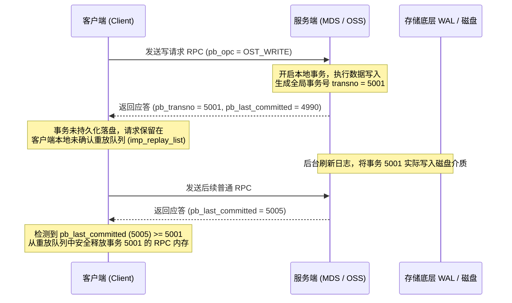
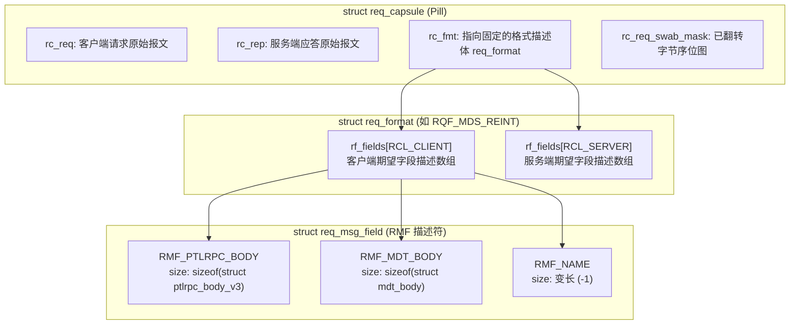
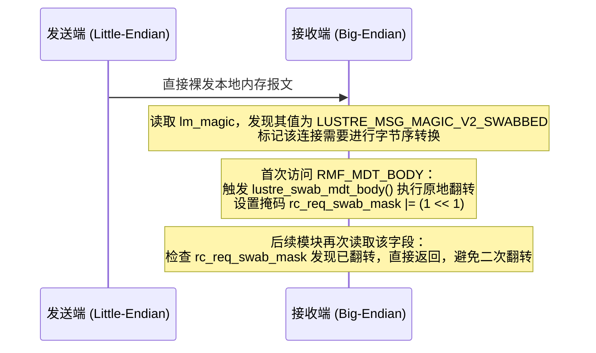

# 第 3 章：统一线控协议与数据包布局 (Wire Protocol)

> **本章核心源码文件**：  
> - `include/uapi/linux/lustre/lustre_idl.h`：核心线路协议结构体、魔数与操作码定义  
> - `lustre/include/lustre_req_layout.h`：Request Capsule（Pill）抽象层声明  
> - `lustre/ptlrpc/layout.c`：报文布局格式（`req_format`）与字段定义（`req_msg_field`）  
> - `lustre/ptlrpc/pack_generic.c`：报文打包、解包、内存偏移计算与字节序转换（Swab）  
> - `lustre/utils/wiretest.c`：编译期二进制结构体大小与偏移量静态断言门禁  

---

## 3.1 传输开销与设计考量

在设计高性能分布式存储的通信协议时，报文的序列化方式直接影响系统吞吐量与 CPU 开销。通用 RPC 框架（如 gRPC / Protocol Buffers）通常侧重跨语言通用性，采用字段标签与变长编码（Varint），但在高并发存储场景下存在明显的性能制约：


| 评估维度 | 通用 RPC 协议 (如 gRPC / Protobuf) | Lustre 线路协议 (Wire Protocol) |
| :--- | :--- | :--- |
| **序列化机制** | 对象遍历与动态编码，高并发下引发频繁 `malloc` 与 CPU 锁争用 | 原地内存映射（In-Place Layout），结构体直接映射至连续内存，无动态装配开销 |
| **数据拷贝开销** | 经由用户态与内核态的多重内存拷贝 | 结合 RDMA 硬件直接注册页面，支持端到端零拷贝 |
| **内存对齐特性** | 采用变长非对齐紧凑存储 | 严格保证 64 位（8 字节）对齐，消除 CPU 跨缓存行访存惩罚与非对齐陷入 |
| **异构体系适配** | 统一采用固定字节序（如 Little-Endian），发送端可能强制执行转换 | 采用端点嗅探与按需延迟翻转（Lazy Swab-on-Demand），无损同构通信性能 |
| **报文结构组织** | 依赖多层对象嵌套 | 采用单报文多缓冲区（Capsule）扁平排列，避免多次网络往返 |

Lustre 线路协议的核心设计约束包括：
1. **直接内存映射与零序列化**：报文直接对应 C 语言结构体，网络接收端通过指针偏移即可直接读取字段，无需经历反序列化阶段。
2. **严格的 8 字节物理对齐**：所有报文头部、子缓冲区及结构体字段均按 8 字节边界向上补齐，确保在 x86-64、ARM64 及其他架构上均满足硬件对齐访问要求。
3. **单请求多缓冲区架构**：单个 RPC 报文支持同时挂载多个独立的逻辑数据块（例如基础 RPC 头、元数据主体、变长文件名及安全上下文），提升复合操作的处理效率。

---

## 3.2 报文信封头：`struct lustre_msg_v2`

所有通过 LNet 传输的 Lustre RPC 报文，其物理内存首部均包含标准的信封头 `struct lustre_msg_v2`。

```text
 0                   1                   2                   3
 0 1 2 3 4 5 6 7 8 9 0 1 2 3 4 5 6 7 8 9 0 1 2 3 4 5 6 7 8 9 0 1
+-+-+-+-+-+-+-+-+-+-+-+-+-+-+-+-+-+-+-+-+-+-+-+-+-+-+-+-+-+-+-+-+
|                       lm_bufcount (4 Bytes)                   | 0x00
+-+-+-+-+-+-+-+-+-+-+-+-+-+-+-+-+-+-+-+-+-+-+-+-+-+-+-+-+-+-+-+-+
|                       lm_secflvr (4 Bytes)                    | 0x04
+-+-+-+-+-+-+-+-+-+-+-+-+-+-+-+-+-+-+-+-+-+-+-+-+-+-+-+-+-+-+-+-+
|                       lm_magic (4 Bytes)                      | 0x08
+-+-+-+-+-+-+-+-+-+-+-+-+-+-+-+-+-+-+-+-+-+-+-+-+-+-+-+-+-+-+-+-+
|                       lm_repsize (4 Bytes)                    | 0x0C
+-+-+-+-+-+-+-+-+-+-+-+-+-+-+-+-+-+-+-+-+-+-+-+-+-+-+-+-+-+-+-+-+
|                       lm_cksum (4 Bytes)                      | 0x10
+-+-+-+-+-+-+-+-+-+-+-+-+-+-+-+-+-+-+-+-+-+-+-+-+-+-+-+-+-+-+-+-+
|                       lm_flags (4 Bytes)                      | 0x14
+-+-+-+-+-+-+-+-+-+-+-+-+-+-+-+-+-+-+-+-+-+-+-+-+-+-+-+-+-+-+-+-+
|                       lm_opc (4 Bytes)                        | 0x18
+-+-+-+-+-+-+-+-+-+-+-+-+-+-+-+-+-+-+-+-+-+-+-+-+-+-+-+-+-+-+-+-+
|                       lm_padding_3 (4 Bytes 保留填充)          | 0x1C
+-+-+-+-+-+-+-+-+-+-+-+-+-+-+-+-+-+-+-+-+-+-+-+-+-+-+-+-+-+-+-+-+
|                       lm_buflens[0] (4 Bytes)                 | 0x20
+-+-+-+-+-+-+-+-+-+-+-+-+-+-+-+-+-+-+-+-+-+-+-+-+-+-+-+-+-+-+-+-+
|                       lm_buflens[1] (4 Bytes)                 | 0x24
+-+-+-+-+-+-+-+-+-+-+-+-+-+-+-+-+-+-+-+-+-+-+-+-+-+-+-+-+-+-+-+-+
|                       ... 柔性长度数组                         |
+-+-+-+-+-+-+-+-+-+-+-+-+-+-+-+-+-+-+-+-+-+-+-+-+-+-+-+-+-+-+-+-+
|                       [ 8 字节边界填充 ]                       |
+=+=+=+=+=+=+=+=+=+=+=+=+=+=+=+=+=+=+=+=+=+=+=+=+=+=+=+=+=+=+=+=+
|  Buffer 0: struct ptlrpc_body_v3 (固定为第 0 号 Buffer)       |
+-+-+-+-+-+-+-+-+-+-+-+-+-+-+-+-+-+-+-+-+-+-+-+-+-+-+-+-+-+-+-+-+
|  Buffer 1: 业务数据块 1 (如 mdt_body / ost_body)               |
+-+-+-+-+-+-+-+-+-+-+-+-+-+-+-+-+-+-+-+-+-+-+-+-+-+-+-+-+-+-+-+-+
|  Buffer 2: 业务数据块 2 (如 文件名、ACL、安全令牌)            |
+---------------------------------------------------------------+
```

在 `include/uapi/linux/lustre/lustre_idl.h` 中，该结构体定义如下：

```c
struct lustre_msg_v2 {
    __u32 lm_bufcount;    /* 本报文包含的子缓冲区总数量 */
    __u32 lm_secflvr;     /* 安全风味标识 (0 表示未加密，或 SPTLRPC 安全策略) */
    __u32 lm_magic;       /* 协议版本魔数 (LUSTRE_MSG_MAGIC_V2) */
    __u32 lm_repsize;     /* 客户端期望服务端预分配的回包缓冲区大小 */
    __u32 lm_cksum;       /* 早期回复报文的 CRC32 校验和 */
    __u32 lm_flags;       /* 报文头控制标记 (如 MSGHDR_AT_SUPPORT 等) */
    __u32 lm_opc;         /* 批量请求中的子操作码 */
    __u32 lm_padding_3;   /* 保留填充字段，用于保持 8 字节对齐 */
    __u32 lm_buflens[];   /* 柔性数组：记录每个子缓冲区的实际字节长度 */
};
```

### 字段细节说明

1. **`lm_bufcount`**：标识当前报文后部连续排布的独立子缓冲区数量。
2. **`lm_secflvr`**：记录报文所使用的安全套件（如 Kerberos、GSS 签名或全链路加密）。若启用加密，报文载荷会被加密封装，但外层依旧保留标准的 `lustre_msg_v2` 结构。
3. **`lm_magic`**：协议版本标识，标准取值为 `0x0BD00BD3`（`LUSTRE_MSG_MAGIC_V2`）。当大端主机与小端主机通信时，接收方读取到的魔数为 `0xD30BD00B`（`LUSTRE_MSG_MAGIC_V2_SWABBED`），用于动态触发后续的字节序翻转逻辑。
4. **`lm_repsize`**：客户端在发送请求时预先计算并填入期望回复的最大字节数。服务端接收到请求后按此大小分配回复缓冲区，避免在应答阶段二次协商或动态扩展内存。
5. **`lm_buflens[]` 柔性数组与对齐计算**：  
   各个子缓冲区在物理内存中依次排列，每个子缓冲区的起始地址必须满足 8 字节向上对齐。偏移量计算通过 `lustre/ptlrpc/pack_generic.c` 中的对齐函数完成：
   $$\text{Offset}_{0} = \text{round\_up}(\text{sizeof}(\text{struct lustre\_msg\_v2}) + \text{bufcount} \times \text{sizeof}(\_\_u32), 8)$$
   $$\text{Offset}_{i} = \text{Offset}_{i-1} + \text{round\_up}(\text{lm\_buflens}[i-1], 8)$$

---

## 3.3 分布式调度中枢：`struct ptlrpc_body_v3`

在所有通过 `struct lustre_msg_v2` 封装的 RPC 报文中，**第 0 号子缓冲区（`MSG_PTLRPC_BODY_OFF = 0`）固定为 `struct ptlrpc_body_v3`**。该结构体承载了请求的事务号、会话句柄、自适应超时状态以及分布式锁参数。

```c
struct ptlrpc_body_v3 {
    struct lustre_handle pb_handle;         /* 客户端与服务端绑定的全局会话句柄 */
    __u32                pb_type;           /* 报文类型：PTL_RPC_MSG_REQUEST / REPLY / ERR */
    __u32                pb_version;        /* 协议版本号 */
    __u32                pb_opc;            /* 顶级业务操作码 (如 OST_WRITE, MDS_REINT) */
    __u32                pb_status;         /* 返回错误码 (标准 Linux errno 负值，如 -ENOENT) */
    __u64                pb_last_xid;       /* 客户端确认已接收到的最高连续事务 XID */
    __u16                pb_tag;            /* 批量/并发操作的虚拟槽位标识 */
    __u16                pb_padding0;       /* 填充字段 */
    __u32                pb_projid;         /* 项目配额/TBF 流量控制标识 */
    __u64                pb_last_committed; /* 服务端已落盘持久化的最高全局事务号 */
    __u64                pb_transno;        /* 服务端为修改型操作分配的单调递增事务号 */
    __u32                pb_flags;          /* 状态控制标记 (MSG_RESENT, MSG_REPLAY 等) */
    __u32                pb_op_flags;       /* 握手协商功能标记 */
    __u32                pb_conn_cnt;       /* 客户端在服务端的连接代数计数器 */
    __u32                pb_timeout;        /* 请求超时限制或服务端估算的处理耗时 */
    __u32                pb_service_time;   /* 服务端处理该 RPC 的实际执行耗时 (秒) */
    __u32                pb_limit;          /* LDLM 分布式锁客户端 LRU 缓存上限 */
    __u64                pb_slv;            /* LDLM 服务端锁体积 (Server Lock Volume) */
    __u64                pb_pre_versions[PTLRPC_NUM_VERSIONS]; /* VBR: 修改前对象的版本号 */
    __u64                pb_mbits;          /* RDMA Bulk 传输匹配位 */
    __u64                pb_padding64_0;    /* 保留填充位 */
    __u64                pb_padding64_1;    /* 保留填充位 */
    __u32                pb_uid;            /* 发起进程的用户 UID */
    __u32                pb_gid;            /* 发起进程的组 GID */
    char                 pb_jobid[LUSTRE_JOBID_SIZE]; /* 超算调度作业标识 (Job ID) */
};
```

### 3.3.1 事务一致性契约：`pb_transno` 与 `pb_last_committed`

Lustre 依赖事务号机制实现服务端崩溃后的请求重放（Transaction Replay）：



1. **事务分配**：当服务端处理一个修改型请求（如文件创建、写入或属性修改）时，底层文件系统将其封装为本地事务，并分配一个全局严格递增的 64 位事务号 `pb_transno`。
2. **应答缓存**：服务端在应答报文中回传该 `pb_transno` 以及当前已经落盘的最高事务号 `pb_last_committed`。客户端收到回复后，不会立即销毁请求上下文，而是将其放入 `imp_replay_list` 链表中暂存。
3. **安全释放**：仅当服务端后续回复中通告的 `pb_last_committed >= pb_transno` 时，证明该修改已安全持久化到物理介质，客户端才将该请求从重放链表中释放。若服务端在中途崩溃重启，客户端会重新发送未提交的 RPC 进行状态重建。

### 3.3.2 基于版本的恢复（VBR, Version-Based Recovery）

在节点恢复阶段，客户端重放事务时需验证操作的前提条件是否依然成立。`pb_pre_versions` 记录了修改前目标对象的前置版本号。在重放执行时，服务端对比磁盘上现存对象的版本号与请求中的 pre-version：
- 若版本号一致，说明尽管存在崩溃恢复重放，但该对象在此期间未被其他并发操作修改，事务可以安全执行；
- 若版本号不一致，说明发生了数据竞态冲突，服务端返回错误以避免破坏元数据一致性。

---

## 3.4 报文抽象与解析机制：Request Capsule（Pill）

在 C 语言内核编程中，如果业务模块直接通过指针偏移访问子缓冲区，极易引发越界与非对齐问题。为此，Lustre 在 `lustre/include/lustre_req_layout.h` 与 `lustre/ptlrpc/layout.c` 中设计了 **Request Capsule**（系统内通常简称为 Pill）机制。



### 3.4.1 字段与布局描述体

每个字段由静态元数据结构 `struct req_msg_field`（RMF）定义：

```c
struct req_msg_field {
    const __u32  rmf_flags;                 /* 属性标志：RMF_F_STRING, RMF_F_NO_SWAB 等 */
    const char  *rmf_name;                  /* 调试追踪名称，如 "mdt_body" */
    const size_t rmf_size;                  /* 预期字节长度 (若为变长则设为 -1) */
    void       (*rmf_swabber)(void *);      /* 字节序大小端转换函数指针 */
    void       (*rmf_dumper)(void *);       /* 调试转储函数指针 */
};
```

一组完整的请求与应答字段组合构成一个操作格式模板 `struct req_format`（例如 `RQF_MDS_REINT`、`RQF_OST_BRW_WRITE`）。

### 3.4.2 统一解包接口

上层业务逻辑通过封装的标准 API 读取字段，不直接操作底层指针：

```c
/* 1. 从客户端请求报文中提取元数据主体 */
struct mdt_body *body = req_capsule_client_get(&req->rq_pill, &RMF_MDT_BODY);

/* 2. 提取带有长度边界检查的变长文件名 */
char *filename = req_capsule_client_sized_get(&req->rq_pill, &RMF_NAME, name_len);

/* 3. 在服务端回包中动态扩展特定字段的分配空间 */
req_capsule_server_grow(&req->rq_pill, &RMF_MDT_MD, layout_size);
```

底层 `req_capsule_client_get()` 执行以下安全校验：
1. 校验当前报文格式（`req_format`）中是否注册了该 RMF 描述符；
2. 校验网络接收到的实际缓冲区长度是否满足 `rmf_size` 的最小约束；
3. 检测当前通信是否涉及跨平台异构字节序，并触发对应的字节序转换。

---

## 3.5 异构架构与按需字节序转换（Swab 机制）

在超算与异构算力集群中，可能存在 Little-Endian（如 x86-64、ARM64）与 Big-Endian（如 PowerPC、s390x）节点共存的场景。

Lustre 采用 **发送端裸发、接收端按需原地延迟翻转（Lazy Swab-on-Demand）** 策略：
- 发送端直接将主机字节序的内存通过网络发出，不执行前置转换；
- 接收端通过信封头中的 `lm_magic` 识别对端字节序；
- 当业务逻辑首次调用 `req_capsule_client_get()` 访问某一子缓冲区时，系统按需调用该字段绑定的 `rmf_swabber()` 函数进行原地翻转。



### 防重位图机制（Anti-Double Swab）

在多层模块解耦的内核栈中，若模块 A 与模块 B 先后读取同一报文子缓冲区，可能发生“重复翻转（Double Swab）”，导致数据重新退化为错误字节序。

`struct req_capsule` 中引入了位图跟踪机制：
```c
static inline bool req_capsule_req_swabbed(struct req_capsule *pill, size_t index)
{
    return pill->rc_req_swab_mask & (1 << index);
}
```
每个子缓冲区在完成初次翻转后，其对应的 bit 位被置 1。后续所有访问该缓冲区的操作均被拦截，确保物理内存仅被翻转一次。

---

## 3.6 编译期布局断言：`wiretest.c`

为了防止因开发者在头文件中增减字段、调整字段顺序或结构体隐式填充破坏二进制协议兼容性，Lustre 在 `lustre/utils/wiretest.c` 中维护了编译期静态断言门禁。

```c
/* 摘自 lustre/utils/wiretest.c 静态断言 */
LASSERTF((int)sizeof(struct lustre_msg_v2) == 32, "found %lld\n",
         (long long)(int)sizeof(struct lustre_msg_v2));
LASSERTF((int)offsetof(struct lustre_msg_v2, lm_bufcount) == 0, "found %lld\n",
         (long long)(int)offsetof(struct lustre_msg_v2, lm_bufcount));
LASSERTF((int)offsetof(struct lustre_msg_v2, lm_secflvr) == 4, "found %lld\n",
         (long long)(int)offsetof(struct lustre_msg_v2, lm_secflvr));
LASSERTF((int)offsetof(struct lustre_msg_v2, lm_magic) == 8, "found %lld\n",
         (long long)(int)offsetof(struct lustre_msg_v2, lm_magic));
LASSERTF((int)offsetof(struct lustre_msg_v2, lm_repsize) == 12, "found %lld\n",
         (long long)(int)offsetof(struct lustre_msg_v2, lm_repsize));
```

在持续集成（CI）阶段，`make wirecheck` 针对所有线路协议结构体的尺寸（`sizeof`）与成员偏移量（`offsetof`）进行编译期校验。任何导致二进制布局变动的提交均无法通过构建，从而保证了跨版本升级时的协议稳定性。

---

## 3.7 生产事故案例：结构体字段隐式对齐引发跨平台 RPC 协议解析崩溃

### 3.7.1 故障现象

在某混合架构集群（客户端包含 x86-64 与 ARM64 节点，服务端运行在 x86-64 架构上）升级至定制内核补丁版本后，ARM64 客户端挂载文件系统正常，但一旦执行涉及扩展属性（xattr）的操作，客户端内核即报出协议错误：
```text
LustreError: 1234:0:(file.c:452:ll_setxattr()) error sending RPC to MDT0000: rc = -EPROTO
```
导致所有 ARM64 节点上的应用程序无法写入扩展属性并异常中断，而 x86-64 客户端运行完全正常。

### 3.7.2 排查过程

1. **报文长度校验定位**：  
   在 MDS 服务端开启调试日志并排查 `pack_generic.c`：
   ```text
   LustreError: lustre_unpack_msg_v2: buffer 2 too small: 48, expected 56
   ```
   服务端在解析客户端请求的第 2 号子缓冲区时，发现其实际接收长度小于服务端预期结构体长度，直接判定为恶意或损坏报文并返回 `-EPROTO`。

2. **数据结构对比**：  
   检查涉及扩展属性请求的结构体定义。在定制补丁中，某开发者向协议头中新增了两个整型字段：
   ```c
   struct mdt_xattr_ext {
       __u32 mxe_flags;
       __u32 mxe_valid;
       __u64 mxe_size;   /* 64 位整型 */
       /* 缺失 32 位显式填充 */
   };
   ```
3. **机理分析**：  
   在 x86-64 GCC 编译环境下，`__u64 mxe_size` 之前编译器隐式按照 8 字节边界对齐，填充了 4 字节 padding，结构体总长度为 24 字节。而在特定版本的 ARM64 编译配置下，编译器在未指定严格结构体对齐指示时，对尾部填充的处理存在差异，导致生成的结构体尺寸与 offsetof 产生了平台间不一致。当报文经由网络跨架构传输时，服务端静态校验触发边界断言，直接丢弃报文。

### 3.7.3 修复措施与验证

修复该结构体定义，增加显式保留填充字段，确保各字段偏移与总长度均满足严格的 8 字节物理对齐：

```c
struct mdt_xattr_ext {
    __u32 mxe_flags;
    __u32 mxe_valid;
    __u64 mxe_size;
    __u32 mxe_padding; /* 显式 32 位对齐填充 */
    __u32 mxe_reserved;
};
```

在 `wiretest.c` 中补齐该结构体的 `sizeof` 与 `offsetof` 断言，重新执行 `make wirecheck` 并部署修复包后，ARM64 客户端与 x86-64 服务端扩展属性交互恢复正常。

---

## 3.8 协议开发与验证核对清单

在扩展 Lustre RPC 协议或排查线路报文异常时，需遵循以下约束：

- [ ] **严格保证 8 字节对齐**：所有新增协议结构体的整体大小必须满足 `sizeof(struct) % 8 == 0`，内部 64 位字段偏移量必须满足 `offsetof(...) % 8 == 0`；若存在 32 位字段结尾，必须显式补齐 `__u32 padding`。
- [ ] **严禁就地修改已发布结构体字段语义**：不得调整已有结构体中的字段排列顺序或复用已废弃字段；扩展新功能应通过 `ptlrpc_body->pb_op_flags` 协商特性标志，或追加新的独立 Capsule 子缓冲区。
- [ ] **注册 Swab 大小端翻转函数**：所有新增协议结构体必须在 `layout.c` 中注册对应的 `lustre_swab_*()` 转换函数，确保异构节点通信时字段数值正确解析。
- [ ] **报文总大小控制**：单 RPC 报文头部（信封 + 所有子缓冲区）总大小不得超过 LNet 设定的最大有效载荷限制（通常为 1MB 或 4MB）。对于大规模条带描述符，需采用分页批次请求处理。
- [ ] **执行 Wiretest 静态门禁测试**：修改 `include/uapi/linux/lustre/lustre_idl.h` 之后，必须重新编译并运行 `lustre/utils/wiretest`，确认全量断言通过。

---

## 本章小结

Lustre 线路协议放弃了高层抽象 RPC 的序列化开销，直接采用基于 C 语言结构体的原地内存映射与 8 字节硬件对齐约束，配合 RDMA 技术实现了端到端的高效数据传输；以 `struct lustre_msg_v2` 为信封、以 `struct ptlrpc_body_v3` 为调度中枢，内建了事务号追踪与版本恢复机制；通过 Request Capsule（Pill）机制实现了类型安全的报文解包与异构架构下的按需字节序翻转；并通过 `wiretest` 机制保证了协议在跨平台与版本迭代中的二进制兼容性。这些机制为上层的分布式 RPC 调度框架与分布式锁管理器提供了统一且稳定的通信契约。
