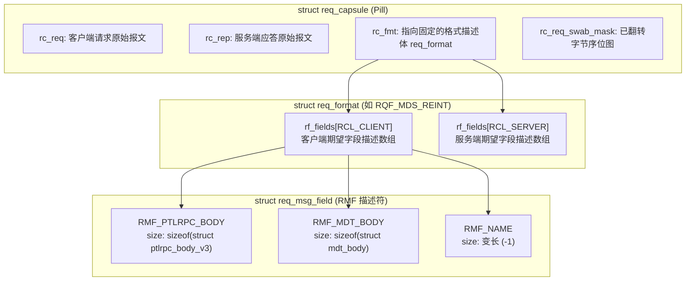

# 3.4 报文抽象与解析机制：Request Capsule（Pill）

在 C 语言内核编程中，如果业务模块直接通过指针偏移访问子缓冲区，极易引发越界与非对齐问题。为此，Lustre 在 `lustre/include/lustre_req_layout.h` 与 `lustre/ptlrpc/layout.c` 中设计了 **Request Capsule**（系统内通常简称为 Pill）机制。



## 3.4.1 字段与布局描述体

每个字段由静态元数据结构 `struct req_msg_field`（RMF）定义：

```c
struct req_msg_field {
    const __u32  rmf_flags;                 /* 属性标志：RMF_F_STRING, RMF_F_NO_SWAB 等 */
    const char  *rmf_name;                  /* 调试追踪名称，如 "mdt_body" */
    const size_t rmf_size;                  /* 预期字节长度 (若为变长则设为 -1) */
    void       (*rmf_swabber)(void *);      /* 字节序大小端转换函数指针 */
    void       (*rmf_dumper)(void *);       /* 调试转储函数指针 */
};
```

一组完整的请求与应答字段组合构成一个操作格式模板 `struct req_format`（例如 `RQF_MDS_REINT`、`RQF_OST_BRW_WRITE`）。

## 3.4.2 统一解包接口

上层业务逻辑通过封装的标准 API 读取字段，不直接操作底层指针：

```c
/* 1. 从客户端请求报文中提取元数据主体 */
struct mdt_body *body = req_capsule_client_get(&req->rq_pill, &RMF_MDT_BODY);

/* 2. 提取带有长度边界检查的变长文件名 */
char *filename = req_capsule_client_sized_get(&req->rq_pill, &RMF_NAME, name_len);

/* 3. 在服务端回包中动态扩展特定字段的分配空间 */
req_capsule_server_grow(&req->rq_pill, &RMF_MDT_MD, layout_size);
```

底层 `req_capsule_client_get()` 执行以下安全校验：
1. 校验当前报文格式（`req_format`）中是否注册了该 RMF 描述符；
2. 校验网络接收到的实际缓冲区长度是否满足 `rmf_size` 的最小约束；
3. 检测当前通信是否涉及跨平台异构字节序，并触发对应的字节序转换。

---

