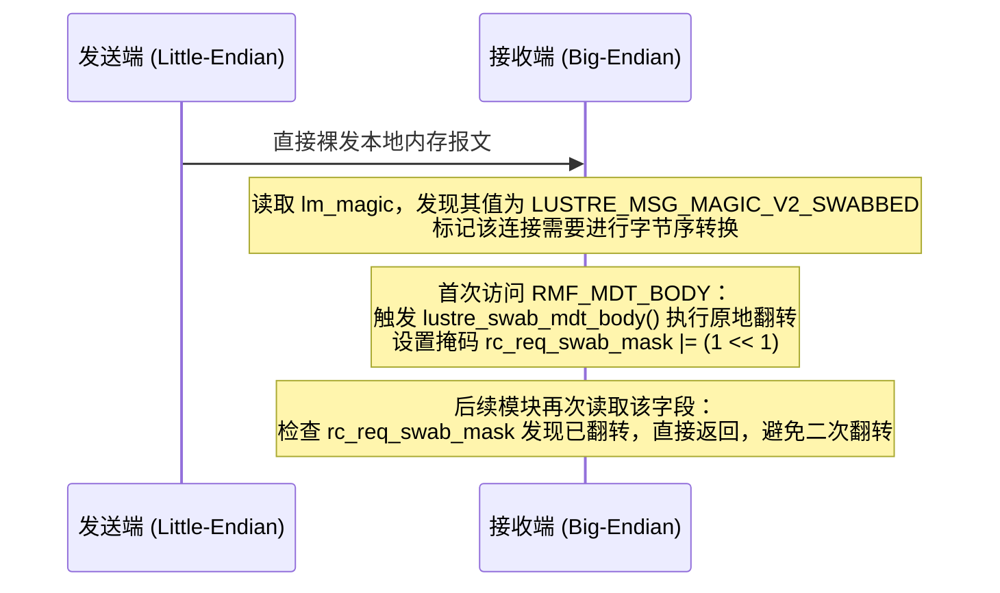

# 3.5 异构架构与按需字节序转换（Swab 机制）

在超算与异构算力集群中，可能存在 Little-Endian（如 x86-64、ARM64）与 Big-Endian（如 PowerPC、s390x）节点共存的场景。

Lustre 采用 **发送端裸发、接收端按需原地延迟翻转（Lazy Swab-on-Demand）** 策略：
- 发送端直接将主机字节序的内存通过网络发出，不执行前置转换；
- 接收端通过信封头中的 `lm_magic` 识别对端字节序；
- 当业务逻辑首次调用 `req_capsule_client_get()` 访问某一子缓冲区时，系统按需调用该字段绑定的 `rmf_swabber()` 函数进行原地翻转。



## 防重位图机制（Anti-Double Swab）

在多层模块解耦的内核栈中，若模块 A 与模块 B 先后读取同一报文子缓冲区，可能发生“重复翻转（Double Swab）”，导致数据重新退化为错误字节序。

`struct req_capsule` 中引入了位图跟踪机制：
```c
static inline bool req_capsule_req_swabbed(struct req_capsule *pill, size_t index)
{
    return pill->rc_req_swab_mask & (1 << index);
}
```
每个子缓冲区在完成初次翻转后，其对应的 bit 位被置 1。后续所有访问该缓冲区的操作均被拦截，确保物理内存仅被翻转一次。

---

