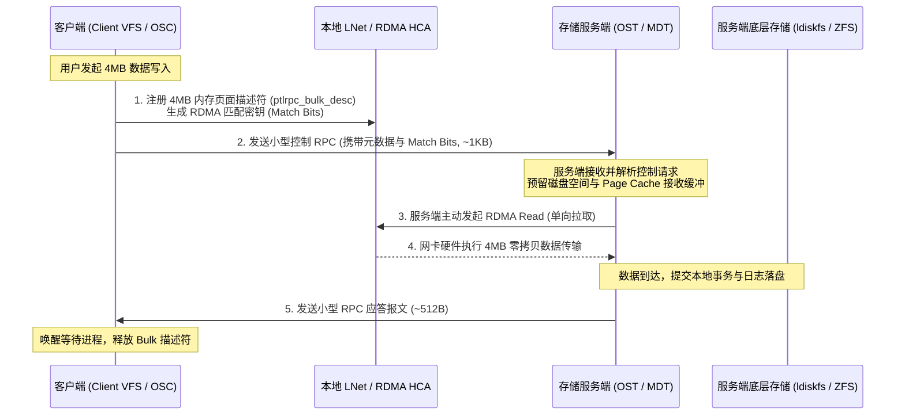
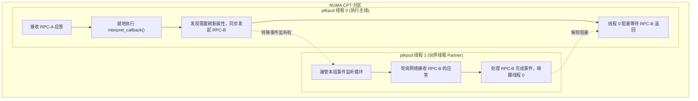
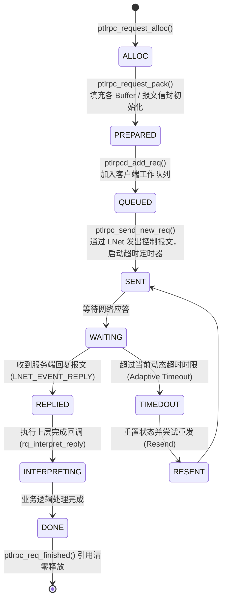
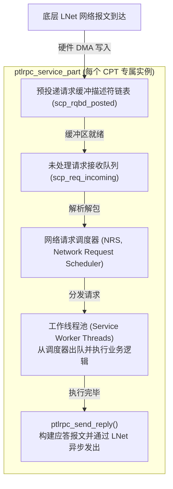
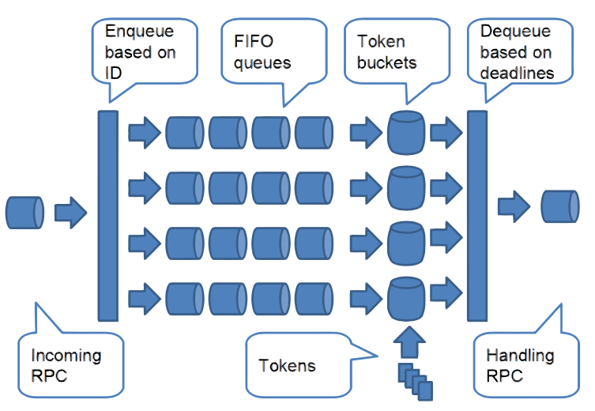

# 第 4 章：Portal RPC 异步通信框架与请求状态机

> **本章核心源码文件**：  
> - `lustre/include/lustre_net.h`：Portal RPC 核心数据结构、状态机枚举与服务定义  
> - `lustre/ptlrpc/ptlrpcd.c`：客户端异步请求派发守护线程与伙伴调度机制  
> - `lustre/ptlrpc/service.c`：服务端多 CPT 亲和流水线与线程池实现  
> - `lustre/ptlrpc/client.c`：客户端请求生命周期分配、排队与超时处理  
> - `lustre/ptlrpc/nrs.c`：网络请求调度器（NRS, Network Request Scheduler）核心框架  

---

## 4.1 控制流与数据流分离设计

在常规 RPC 协议实现中，元数据信令与大块数据通常通过同一连续数据流发送。在向远端写入数兆字节（MB）数据时，若必须在单个 RPC 报文中等待全部有效载荷发送完毕，服务端工作线程将长期被网络传输阻塞，难以支持高并发元数据与并发条带 I/O。

Lustre 采用**控制流（Control Plane）与数据流（Data Plane）解耦**的架构：



1. **控制 RPC 先行**：客户端在准备大块写入时，先在本地通过 `ptlrpc_bulk_desc` 将分散在内存中的物理页注册为 LNet 内存描述符（MD），生成专有的匹配位（Match Bits）。随后，仅向服务端发送约 1KB 的控制请求报文。
2. **服务端主动拉取（RDMA Read）**：服务端接收到控制请求并校验权限、预留存储空间后，根据请求中携带的 NID 与 Match Bits，主动调用 RDMA Read 原语将客户端内存中的数据直接拉取到服务端的物理页面中。
3. **极小应答确认**：数据传输与本地落盘完成后，服务端发送几百字节的轻量应答完成交互。

### Portal 端口功能划分

Portal RPC 将不同类型的业务请求隔离在完全独立的 LNet Portal 队列中，防止海量大块 I/O 阻塞关键元数据或锁回调：

| Portal 宏常量 | 编号 | 业务职责 | 关联线程池与调度逻辑 |
| :--- | :--- | :--- | :--- |
| `OST_IO_PORTAL` | 10 | 数据对象 I/O 控制（`read`、`write`、`punch`） | OST 专用 I/O 服务线程池 |
| `MDS_REQUEST_PORTAL` | 12 | 元数据文件操作（`create`、`lookup`、`unlink` 等） | MDT 专用服务线程池 |
| `LDLM_CB_REQUEST_PORTAL` | 14 | 分布式锁异步阻断回调（Blocking AST / Revocation） | 锁回调专用快速通道，防止死锁 |
| `MGS_PORTAL` | 16 | 集中式管理服务（配置拉取、心跳与日志订阅） | MGS 管理服务线程池 |

每个 Portal 维护独立的请求缓冲描述符链表（`rqbd`），消除跨业务队列的相互影响。

---

## 4.2 客户端异步引擎：`ptlrpcd` 与伙伴线程防死锁

在内核态文件系统中，VFS 接口不能长期处于同步等待状态。Lustre 客户端通过异步守护线程池 `ptlrpcd`（`lustre/ptlrpc/ptlrpcd.c`）实现高并发的异步请求管理。

### 4.2.1 Per-CPT 线程池与拓扑对齐

为避免跨 NUMA 内存访问开销，`ptlrpcd` 按照底层 `libcfs` 的 CPT 分区划分独立的线程池实例：

```c
struct ptlrpcd {
    int                 pd_size;
    int                 pd_index;
    int                 pd_cpt;         /* 当前线程池所属的 NUMA CPT 分区 ID */
    int                 pd_cursor;      /* 轮询负载均衡游标 */
    int                 pd_nthreads;    /* 本 CPT 内的工作线程总数 */
    int                 pd_groupsize;   /* 伙伴线程组大小（默认为 2） */
    struct ptlrpcd_ctl  pd_threads[];
};
```

客户端发起 RPC 时，通过 `ptlrpcd_add_req()` 将请求交付给当前 CPT 内负载最低的 `ptlrpcd` 线程。

### 4.2.2 伙伴线程组防死锁机制（Partner Group Policy）

在分布式客户端执行过程中，存在一类潜在的死锁场景：**完成回调中的嵌套 RPC 等待**。



- 若只有单线程运行，当线程在执行 RPC-A 的回调函数时发起同步的 RPC-B，该线程将进入等待阻塞；而 RPC-B 的网络接收事件本身又依赖该线程轮询推进，从而产生自死锁。
- 为此，`ptlrpcd` 将线程按组配对（默认每组 2 个线程）。当线程 0 在执行回调需要同步等待子请求时，线程 1 自动接管事件轮询（Poller）职责，确保子请求的网络事件能够被及时消费并推进状态机，彻底规避了级联死锁。

---

## 4.3 客户端请求状态机：七阶段生命周期

单个 RPC 请求从创建到释放，严格遵循客户端状态机演进：



- **重试状态（`rq_resend`）**：若服务端返回 `-EBUSY`（服务队列过载）或发生网络瞬态抖动，状态机将请求重置为 `RESENT`，重新进入就绪队列。此时请求保留原本的事务编号（XID），服务端据此识别是否为重复请求。
- **重放状态（`rq_replay`）**：在服务端发生崩溃并重启时，客户端进入容错恢复流程，将处于历史已提交但尚未永久快照的已提交修改类 RPC（如 `CREATE`、`SETATTR`）重新灌入发送队列。

---

## 4.4 服务端多 CPT 亲和流水线与 NRS 调度器

在服务端，每个 `ptlrpc_service` 实例负责接收并处理特定类型的 Portal 请求。



### 4.4.1 预分配请求缓冲区（RQBD）机制

在高并发场景下，如果在网络中断路径动态申请内存，会导致内存锁竞争与延迟毛刺。服务端采用 **RQBD（Request Buffer Descriptor）预先投递机制**：
- 服务端启动时，各分区预先申请一批固定大小的物理内存块并注册到 LNet（`scp_rqbd_posted`）；
- 网络报文到达时直接由网卡 DMA 写入预投递的缓冲区；
- 缓冲区写满后触发中断，生成未解包请求挂入 `scp_req_incoming`，同时后台补充新的空闲 RQBD。

### 4.4.2 网络请求调度器（NRS, Network Request Scheduler）

请求从 `scp_req_incoming` 取出后，进入 NRS 调度层（`lustre/ptlrpc/nrs.c`）。



*图 4-1: Lustre NRS 网络请求调度器架构：入站请求分类、多策略队列与多线程消费流水线（来源：Lustre Chinese Operations Manual）*

官方操作手册第三十四章详细定义了 NRS 的调度策略体系，支持动态在线切换算法：

```bash
# 1. 查看当前各服务的可用 NRS 策略与激活状态
lctl get_param ost.OSS.ost_io.nrs_policies
# 输出示例:
# regular_policies:
#   fifo (active)
#   crrn
#   tbf
#   orr
#   trr

# 2. 将 OST I/O 调度切换为基于客户端 NID 的轮询公平调度 (CRR-N)
lctl set_param ost.OSS.ost_io.nrs_policies="crrn"

# 3. 启用令牌桶限速流控 (TBF) 并定义限速规则
lctl set_param ost.OSS.ost_io.nrs_policies="tbf"
lctl set_param ost.OSS.ost_io.nrs_tbf_rule="start bench_rule nid {10.10.1.*@o2ib0} rate 2000"
```

#### 核心调度算法深度解析：
1. **FIFO（先进先出）**：默认策略，按时间顺序依次处理。但在成百上千节点并发打流时，容易导致发包速率快的客户端“饿死”慢速客户端。
2. **CRR-N（Client Round-Robin based on NID）**：基于客户端 NID 的加权轮询算法。NRS 为每个远端 NID 维护独立的队列，工作线程轮流从各个 NID 队列中出队请求，保障单节点无法霸占服务端并发池。
3. **TBF（Token Bucket Filter）**：基于令牌桶算法的服务端 QoS 流控。支持按照客户端 NID、Job ID（与 SLURM 作业关联）、UID 或 GID 限制特定高频访问源的 RPC 速率，防止失控的脚本打崩全局存储。


*图 4-2: Lustre NRS TBF 令牌桶 QoS 调度算法：基于 ID 智能入队、令牌桶速率匹配与 Deadline 约束出队（来源：Lustre Chinese Operations Manual）*

4. **ORR / TRR（Offset / Target Round-Robin）**：针对底层为机械硬盘或 RAID 阵列的 OST，根据请求的物理扇区逻辑偏移量进行调度，将原本随机的并发写入聚合成局部连续写入，提升磁盘调度吞吐。

---

## 4.5 大块数据 RDMA 传输：Bulk Transfer 引擎

针对几十千字节至数兆字节的数据传输，Portal RPC 依赖 `struct ptlrpc_bulk_desc` 实现零拷贝 RDMA。

```c
struct ptlrpc_bulk_desc {
    refcount_t              bd_refcount;
    unsigned short          bd_flags;           /* 传输方向标记：PTL_RPC_FL_SET 等 */
    unsigned short          bd_nob;             /* 本次传输的总字节数 */
    unsigned short          bd_nob_transferred; /* 已完成传输的实际字节数 */
    unsigned int            bd_page_count;      /* 涉及的物理内存页数 */
    struct page            *bd_pages[];         /* 指向分散物理页的指针数组 */
};
```

### 传输流程与匹配控制

1. **描述符构造**：发起方根据文件 I/O 范围，分配一组物理页面指针填充 `bd_pages[]`，调用 `LNetMDAttach()` 绑定至 LNet。
2. **匹配位校验**：RPC 请求头中的 `pb_mbits` 携带专有的匹配密钥。当接收端或发送端发起 RDMA 操作时，LNet 在底层进行 Match Bits 匹配，只有完全对齐的通信请求才能执行物理 DMA 写入。
3. **异步事件驱动**：数据完全落入物理内存后，驱动产生 `LNET_EVENT_PUT` 或 `LNET_EVENT_REPLY`，中断处理函数更新 `bd_nob_transferred` 并唤醒上层等待状态机。

---

## 4.6 生产实战：参数调优与故障排查

### 4.6.1 核心服务线程参数配置

```bash
# 配置各服务类型的线程数范围 (最小线程数:最大线程数)
# OST I/O 线程池通常根据核心数与 NVMe/HDD 存储并发能力设定
options ost oss_num_threads=128

# MDT 元数据服务线程池
options mds mds_num_threads=64

# 客户端调整 ptlrpcd 伙伴线程组大小
options ptlrpc ptlrpcd_partner_group_size=2
```

### 4.6.2 常用状态监控与指标查看

| 监控目的 | 执行命令 | 关键指标解读 |
| :--- | :--- | :--- |
| **查看服务分区运行状态** | `lctl get_param ost.OSS.ost_io.threads_*` | 监控 `threads_started` 与 `threads_running`，判断服务线程是否打满。 |
| **检查请求积压队列** | `lctl get_param ost.OSS.ost_io.req_waittime` | 查看请求在队列中的等待耗时，识别服务端处理瓶颈。 |
| **监控 NRS 调度器状态** | `lctl get_param ost.OSS.ost_io.nrs_policies` | 查看当前激活的调度算法（fifo/crrn/tbf）及各队列在途深度。 |

---

## 4.7 生产事故案例：MDT 线程池耗尽引发元数据 RPC 级联阻塞

### 4.7.1 故障现象

某科研机构计算集群在数千个计算节点同时启动深度学习推理作业时，集群文件系统发生大面积无响应。应用端 `ls`、`stat`、`mkdir` 操作全部陷入 D 状态（不可中断睡眠），客户端日志频繁输出：
```text
Lustre: 10.10.10.12@o2ib0: req@... x1234/t0 o39->MDS_REQUEST_PORTAL:12 lens 320/480 e 0 to 10.10.10.1@o2ib0:12: timeout
```
监控显示：MDS 服务器 CPU 利用率仅为 15%，内存与网络带宽均处于空闲状态，但元数据操作整体停滞。

### 4.7.2 排查过程

1. **服务端队列排查**：  
   在 MDS 上查看 `mdt` 服务的线程运行状态：
   ```bash
   lctl get_param mdt.MDS.mdt.threads_running
   lctl get_param mdt.MDS.mdt.req_waittime
   ```
   输出显示：`threads_running` 达到了设定的上限值 `32`，而 `req_waittime` 平均等待时间超过了 45 秒，大量请求积压在 `scp_req_incoming` 队列中未被调度。

2. **堆栈跟踪分析**：  
   使用 `cat /proc/<mdt_thread_pid>/stack` 查看处于工作状态的 MDT 线程调用栈：
   ```text
   [<0>] call_rwsem_down_read_failed
   [<0>] down_read+0x...
   [<0>] mdt_reint_open+0x...
   [<0>] mdt_reint+0x...
   [<0>] ptlrpc_server_handle_request+0x...
   ```
   **排查发现**：  
   数千个节点并发打开同一个共享只读配置文件，同时触发了对同一目录 Inode 的扩展属性读取与状态校验。默认配置下，MDT 的服务线程总数仅为 32。在出现共享 Inode 读锁高频竞争时，这 32 个线程全部被阻塞在内核读写信号量等待中，导致服务队列无法腾出任何空闲线程来处理其他目录的普通元数据请求，形成全集群阻塞。

### 4.7.3 修复措施与成效

1. **调整服务端服务线程规模**：  
   根据双路 CPU 的实际核心数与并发能力，扩大 MDT 的工作线程池配额：
   ```bash
   lctl set_param mdt.MDS.mdt.threads_min=64
   lctl set_param mdt.MDS.mdt.threads_max=256
   ```
2. **启用 NRS CRR-N 调度策略**：  
   将默认的 FIFO 调度切换为基于客户端 NID 的轮询调度，避免单节点突发请求占满工作队列：
   ```bash
   lctl set_param mdt.MDS.mdt.nrs_policies="crrn"
   ```

实施配置调整后，积压的请求在数秒内被快速消化，MDT 线程池在峰值高并发下的吞吐恢复正常，应用端解除 D 状态。

---

## 4.8 运维基线检查清单

- [ ] **CPT 分区与服务线程对齐**：确认各服务的 `threads_max` 配置能够被 CPT 分区数整除，确保每个 CPU 分区分配到均衡的执行线程。
- [ ] **高并发场景启用 NRS CRR-N 策略**：在成千上万节点共享访问的大型集群中，建议将 MDT/OST 关键服务的调度策略配置为 `crrn`，保障调度公平性。
- [ ] **监控请求等待耗时（req_waittime）**：将 `req_waittime` 纳入集群监控告警指标，若等待队列耗时持续超过 5 秒，应预警扩容线程池或排查锁冲突。
- [ ] **避免设置过大的单请求超时（ptlrpc_timeout）**：生产环境默认通常设为 30 至 50 秒，过大的固定超时会导致物理故障时系统卡顿时间延长。

---

## 本章小结

Portal RPC 构成了 Lustre 分布式系统的异步通信核心。通过控制流与数据流解耦，系统将轻量元数据与重量级 RDMA 数据直通分离；通过客户端 `ptlrpcd` 线程池与伙伴防死锁机制，保证了内核上下文中的异步推进；通过严密的七阶段状态机，确保了请求在各种网络瞬态下的安全生命周期管理；通过服务端的预分配 RQBD 机制与可插拔 NRS 调度器，提供了高并发下的线速吸收与公平调度能力。这些特性为分布式一致性与容错恢复机制奠定了基础。
