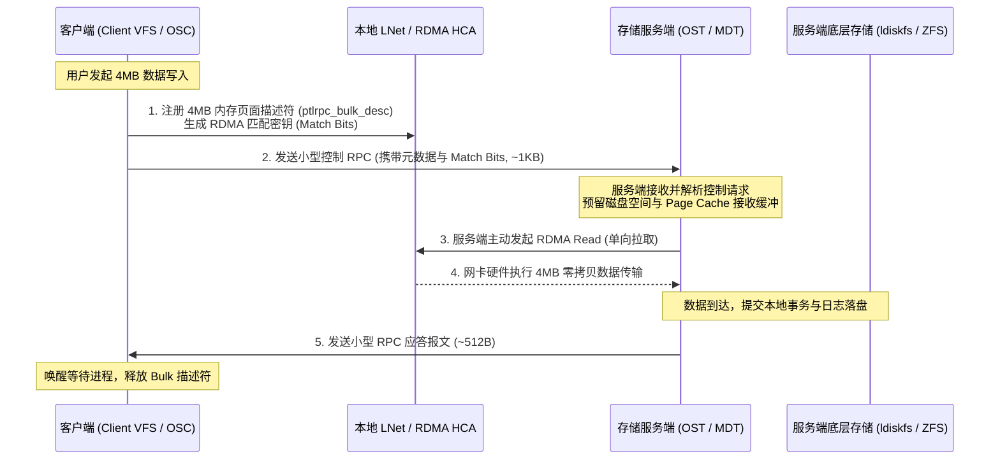

# 4.1 控制流与数据流分离设计

在常规 RPC 协议实现中，元数据信令与大块数据通常通过同一连续数据流发送。在向远端写入数兆字节（MB）数据时，若必须在单个 RPC 报文中等待全部有效载荷发送完毕，服务端工作线程将长期被网络传输阻塞，难以支持高并发元数据与并发条带 I/O。

Lustre 采用**控制流（Control Plane）与数据流（Data Plane）解耦**的架构：

1. **控制 RPC 先行**：客户端在准备大块写入时，先在本地通过 `ptlrpc_bulk_desc` 将分散在内存中的物理页注册为 LNet 内存描述符（MD），生成专有的匹配位（Match Bits）。随后，仅向服务端发送约 1KB 的控制请求报文。
2. **服务端主动拉取（RDMA Read）**：服务端接收到控制请求并校验权限、预留存储空间后，根据请求中携带的 NID 与 Match Bits，主动调用 RDMA Read 原语将客户端内存中的数据直接拉取到服务端的物理页面中。
3. **极小应答确认**：数据传输与本地落盘完成后，服务端发送几百字节的轻量应答完成交互。

## Portal 端口功能划分

Portal RPC 将不同类型的业务请求隔离在完全独立的 LNet Portal 队列中，防止海量大块 I/O 阻塞关键元数据或锁回调：

| Portal 宏常量 | 编号 | 业务职责 | 关联线程池与调度逻辑 |
| :--- | :--- | :--- | :--- |
| `OST_IO_PORTAL` | 10 | 数据对象 I/O 控制（`read`、`write`、`punch`） | OST 专用 I/O 服务线程池 |
| `MDS_REQUEST_PORTAL` | 12 | 元数据文件操作（`create`、`lookup`、`unlink` 等） | MDT 专用服务线程池 |
| `LDLM_CB_REQUEST_PORTAL` | 14 | 分布式锁异步阻断回调（Blocking AST / Revocation） | 锁回调专用快速通道，防止死锁 |
| `MGS_PORTAL` | 16 | 集中式管理服务（配置拉取、心跳与日志订阅） | MGS 管理服务线程池 |

每个 Portal 维护独立的请求缓冲描述符链表（`rqbd`），消除跨业务队列的相互影响。

---

