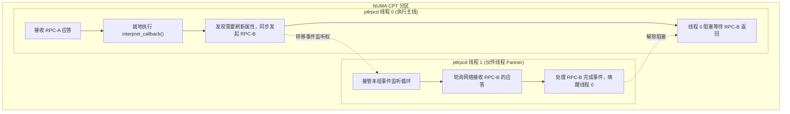

# 4.2 客户端异步引擎：ptlrpcd 与伙伴线程防死锁

在内核态文件系统中，VFS 接口不能长期处于同步等待状态。Lustre 客户端通过异步守护线程池 `ptlrpcd`（`lustre/ptlrpc/ptlrpcd.c`）实现高并发的异步请求管理。

## 4.2.1 Per-CPT 线程池与拓扑对齐

为避免跨 NUMA 内存访问开销，`ptlrpcd` 按照底层 `libcfs` 的 CPT 分区划分独立的线程池实例：

```c
struct ptlrpcd {
    int                 pd_size;
    int                 pd_index;
    int                 pd_cpt;         /* 当前线程池所属的 NUMA CPT 分区 ID */
    int                 pd_cursor;      /* 轮询负载均衡游标 */
    int                 pd_nthreads;    /* 本 CPT 内的工作线程总数 */
    int                 pd_groupsize;   /* 伙伴线程组大小（默认为 2） */
    struct ptlrpcd_ctl  pd_threads[];
};
```

客户端发起 RPC 时，通过 `ptlrpcd_add_req()` 将请求交付给当前 CPT 内负载最低的 `ptlrpcd` 线程。

## 4.2.2 伙伴线程组防死锁机制（Partner Group Policy）

在分布式客户端执行过程中，存在一类潜在的死锁场景：**完成回调中的嵌套 RPC 等待**。



- 若只有单线程运行，当线程在执行 RPC-A 的回调函数时发起同步的 RPC-B，该线程将进入等待阻塞；而 RPC-B 的网络接收事件本身又依赖该线程轮询推进，从而产生自死锁。
- 为此，`ptlrpcd` 将线程按组配对（默认每组 2 个线程）。当线程 0 在执行回调需要同步等待子请求时，线程 1 自动接管事件轮询（Poller）职责，确保子请求的网络事件能够被及时消费并推进状态机，彻底规避了级联死锁。

---

