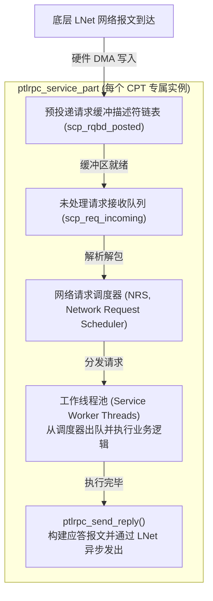

# 4.4 服务端多 CPT 亲和流水线与 NRS 调度器

在服务端，每个 `ptlrpc_service` 实例负责接收并处理特定类型的 Portal 请求。



## 4.4.1 预分配请求缓冲区（RQBD）机制

在高并发场景下，如果在网络中断路径动态申请内存，会导致内存锁竞争与延迟毛刺。服务端采用 **RQBD（Request Buffer Descriptor）预先投递机制**：
- 服务端启动时，各分区预先申请一批固定大小的物理内存块并注册到 LNet（`scp_rqbd_posted`）；
- 网络报文到达时直接由网卡 DMA 写入预投递的缓冲区；
- 缓冲区写满后触发中断，生成未解包请求挂入 `scp_req_incoming`，同时后台补充新的空闲 RQBD。

## 4.4.2 网络请求调度器（NRS, Network Request Scheduler）

请求从 `scp_req_incoming` 取出后，进入 NRS 调度层（`lustre/ptlrpc/nrs.c`）。


*图 4-1: Lustre NRS 网络请求调度器架构：入站请求分类、多策略队列与多线程消费流水线（来源：Lustre Chinese Operations Manual）*

官方操作手册第三十四章详细定义了 NRS 的调度策略体系，支持动态在线切换算法：

```bash
# 1. 查看当前各服务的可用 NRS 策略与激活状态
lctl get_param ost.OSS.ost_io.nrs_policies
# 输出示例:
# regular_policies:
#   fifo (active)
#   crrn
#   tbf
#   orr
#   trr

# 2. 将 OST I/O 调度切换为基于客户端 NID 的轮询公平调度 (CRR-N)
lctl set_param ost.OSS.ost_io.nrs_policies="crrn"

# 3. 启用令牌桶限速流控 (TBF) 并定义限速规则
lctl set_param ost.OSS.ost_io.nrs_policies="tbf"
lctl set_param ost.OSS.ost_io.nrs_tbf_rule="start bench_rule nid {10.10.1.*@o2ib0} rate 2000"
```

### 核心调度算法深度解析：
1. **FIFO（先进先出）**：默认策略，按时间顺序依次处理。但在成百上千节点并发打流时，容易导致发包速率快的客户端“饿死”慢速客户端。
2. **CRR-N（Client Round-Robin based on NID）**：基于客户端 NID 的加权轮询算法。NRS 为每个远端 NID 维护独立的队列，工作线程轮流从各个 NID 队列中出队请求，保障单节点无法霸占服务端并发池。
3. **TBF（Token Bucket Filter）**：基于令牌桶算法的服务端 QoS 流控。支持按照客户端 NID、Job ID（与 SLURM 作业关联）、UID 或 GID 限制特定高频访问源的 RPC 速率，防止失控的脚本打崩全局存储。


*图 4-2: Lustre NRS TBF 令牌桶 QoS 调度算法：基于 ID 智能入队、令牌桶速率匹配与 Deadline 约束出队（来源：Lustre Chinese Operations Manual）*

4. **ORR / TRR（Offset / Target Round-Robin）**：针对底层为机械硬盘或 RAID 阵列的 OST，根据请求的物理扇区逻辑偏移量进行调度，将原本随机的并发写入聚合成局部连续写入，提升磁盘调度吞吐。

---

