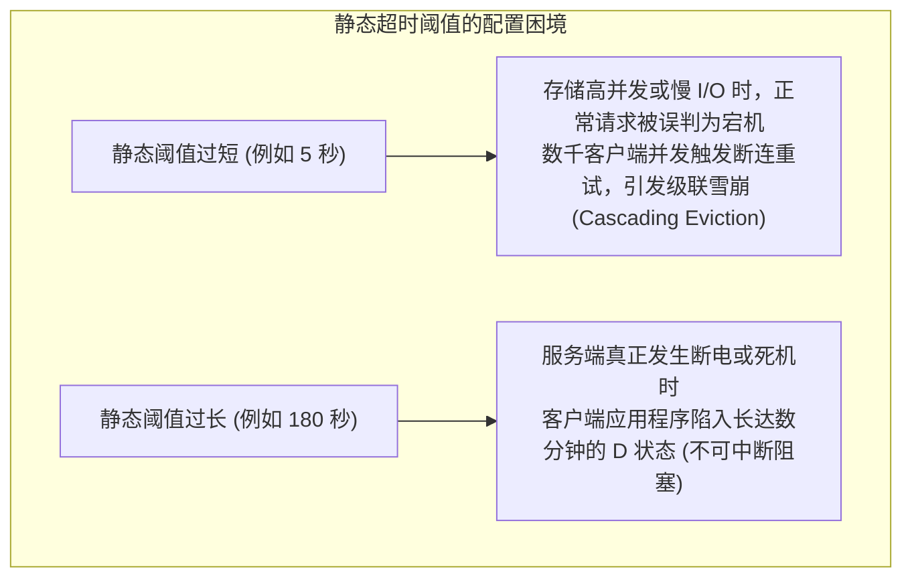
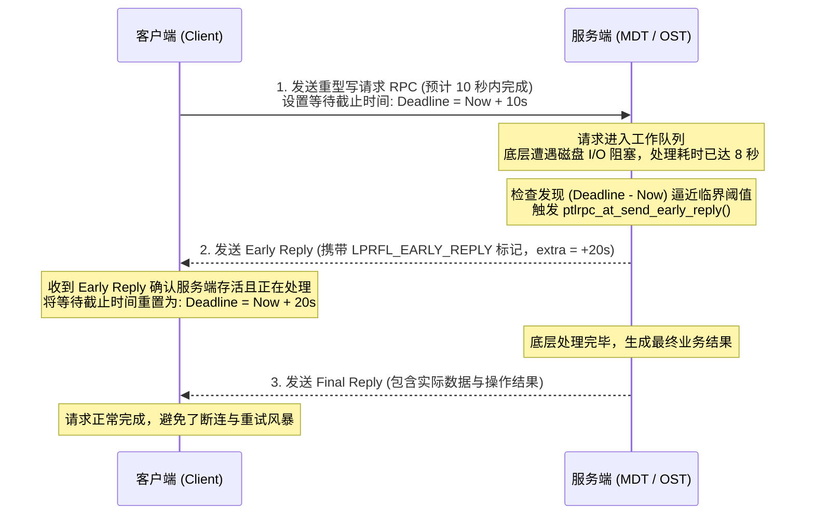
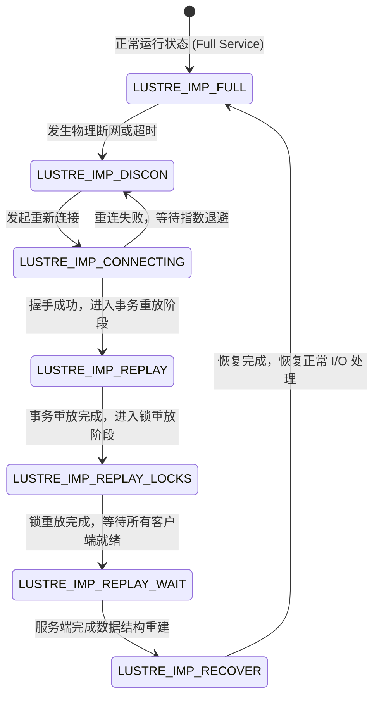
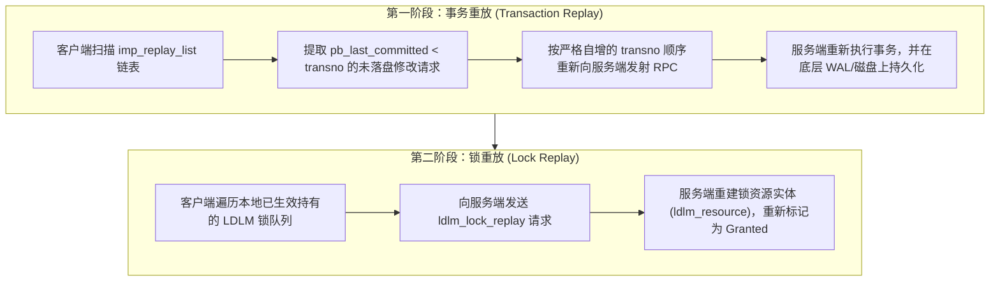

# 第 5 章：分布式容错恢复与自适应超时 (Adaptive Timeouts)

> **本章核心源码文件**：  
> - `lustre/include/lustre_import.h`：客户端 Import 结构与自适应超时数据定义  
> - `lustre/include/lustre_export.h`：服务端 Export 结构与客户端会话管理定义  
> - `lustre/ptlrpc/service.c`：自适应超时计算与 Early Reply 提前应答实现  
> - `lustre/ptlrpc/recover.c`：连接断开探测、重连调度与两阶段重放流水线  
> - `lustre/ptlrpc/import.c`：Import 状态机流转与会话恢复管理  

---

## 5.1 静态超时的制约与自适应超时（Adaptive Timeouts）

在传统的分布式文件系统或网络通信协议中，通常采用固定的静态超时阈值（例如固定配置 `timeout = 30s`）。然而，在大规模分布式存储集群中，静态超时面临两类性能与可用性矛盾：



为了兼顾慢请求处理与快速故障感知，Lustre 设计了 **自适应超时（Adaptive Timeouts，简称 AT）** 机制。

### 5.1.1 AT 算法核心原理

自适应超时的基本原则是：**客户端不预设全局固定超时，超时时限由服务端根据各个 Portal 队列的实时负载动态计算，并随 RPC 应答捎带（Piggyback）同步给客户端**。

客户端计算特定请求等待截止时间（Deadline）的基本公式如下：

$$\text{Deadline} = \text{CurrentTime} + 2 \times \text{NetworkLatency} + \text{ServiceEstimate}$$

- **`NetworkLatency`（网络往返时延）**：客户端与目标节点之间最近几次 RPC 的底层网络往返耗时测量值。
- **`ServiceEstimate`（服务端处理耗时预估）**：服务端当前处理该业务类型请求的历史滑动窗口平均耗时。

在 `lustre/include/lustre_import.h` 中，客户端为每个连接实例（Import）维护独立的超时跟踪结构体：

```c
struct imp_at {
    int                     iat_portal[IMP_AT_MAX_PORTALS];
    struct adaptive_timeout iat_net_latency;
    struct adaptive_timeout iat_service_estimate[IMP_AT_MAX_PORTALS];
};
```

服务端在每一个处理完成的应答报文头 `ptlrpc_body` 中，填入其计算得出的 `pb_timeout` 与当前服务实际执行时间 `pb_service_time`。客户端接收后调用 `at_add_latency()` 动态修正历史统计均值。

---

## 5.2 延时补偿机制：Early Reply（提前应答）

在实际存储生产环境中，某些操作可能出现长尾延迟（例如元数据 Journal 同步刷盘、底层 RAID 校验重构或大块脏页回写），处理耗时可能偶发性超过历史预测均值。

为防止客户端因请求耗时接近设定的 Deadline 而误判服务端宕机断开连接，Lustre 设计了 **Early Reply（提前应答）** 机制：



### 核心实现逻辑

在 `lustre/ptlrpc/service.c` 中，服务端在处理耗时较长的请求时执行如下检查：

```c
static int ptlrpc_at_send_early_reply(struct ptlrpc_request *req)
{
    /* 计算当前时刻距离客户端 Deadline 的剩余时间 */
    timeout_t olddl = req->rq_deadline - ktime_get_real_seconds();
    
    /* 若已经超过 Deadline，说明网络或逻辑严重超时，不再发送 Early Reply */
    if (olddl < 0)
        return -ETIMEDOUT;

    /* 构建轻量级应答报文，标记为早期回复，并附加额外的预估等待时间 */
    req->rq_early_reply = 1;
    return ptlrpc_send_reply(req, PTLRPC_REPLY_EARLY);
}
```

客户端收到带有早期回复标志的报文后，确认服务端处于存活状态并正在执行操作，随后延长该请求在本地的超时等待截止时间，消除了慢 I/O 场景下的误判断开。

---

## 5.3 分布式故障恢复与 Import 状态机

Lustre 客户端与服务端之间的逻辑会话由 `struct obd_import`（客户端侧）与 `struct obd_export`（服务端侧）对应管理。当底层物理链路中断或服务端重启时，客户端的 Import 实例进入恢复状态机（`enum lustre_imp_state`）。



### 关键状态流转解析

1. **`LUSTRE_IMP_DISCON`**：连接断开状态。当发送 RPC 连续超时或底层网卡抛出断开事件时进入该状态，所有待发送的新请求被暂存在本地待发队列中。
2. **`LUSTRE_IMP_CONNECTING`**：重连状态。客户端定期向服务端各可用 NID 发起连接协商请求，重新交换通信协议参数。
3. **`LUSTRE_IMP_REPLAY`**：事务重放阶段。服务端在重启后开启一个限时的“恢复窗口”（Recovery Window），客户端在此阶段将尚未持久化落盘的修改型操作重新推送到服务端。
4. **`LUSTRE_IMP_REPLAY_LOCKS`**：锁重放阶段。客户端将其持有的分布式锁状态上报给服务端，由服务端重新建立锁拓扑。
5. **`LUSTRE_IMP_REPLAY_WAIT`**：等待窗口阶段。服务端等待集群中绝大多数活跃客户端完成重放，或等待超时倒计时结束。
6. **`LUSTRE_IMP_RECOVER`**：最终清理阶段。服务端完成孤儿对象清理并激活正常请求调度，Import 状态随后迁回 `LUSTRE_IMP_FULL`。

---

## 5.4 两阶段重放机制（Two-Phase Replay）

服务端宕机重启后，其内存中尚未落盘的事务数据可能发生丢失，已授予各客户端的分布式锁状态也会清空。Lustre 采用**两阶段重放机制**实现服务端崩溃恢复后的状态重建。



### 5.4.1 第一阶段：事务重放（Transaction Replay）

1. **重放队列管理**：客户端每次发出涉及修改的 RPC 请求时，该请求会被保存在本地连接的 `imp_replay_list` 链表中。
2. **提交位点比对**：服务端在每个应答中通告当前已刷入物理存储的最高事务号 `pb_last_committed`。当且仅当客户端观察到 `pb_last_committed >= req->rq_transno` 时，该请求才会从重放链表中移除。
3. **幂等有序重放**：当服务端重启进入恢复模式后，客户端根据 `transno` 的严格升序重新发送未确认落盘的请求。服务端依次重新执行并落盘，保证了服务端事务历史的完整重现。

### 5.4.2 第二阶段：锁重放（Lock Replay）

在所有未落盘的事务重放完毕后，系统进入锁重放阶段：
- 客户端在本地内存中依然维护着断网前持有的分布式锁句柄（包含范围锁 Extent 与元数据 Inode Bits 锁）；
- 客户端依次向服务端发送 `LDLM_LOCK_REPLAY` 请求；
- 服务端据此在内存中重新初始化 `struct ldlm_resource` 并恢复 `lr_granted` 队列，使得客户端无需废弃本地缓存的 Dirty Page 和 Inode 属性，保障了文件系统缓存一致性。

---

## 5.5 基于版本的恢复与命令式恢复

为了进一步缩短大规模集群在复杂并发故障下的恢复耗时，Lustre 引入了两项关键技术：

### 5.5.1 基于版本的恢复（VBR, Version-Based Recovery）

在传统恢复逻辑中，若某一客户端在服务端恢复窗口内未上线，后续依赖该客户端前置操作的其他客户端请求将无法判定是否产生数据裂脑，导致恢复中断。

VBR 引入了对象版本校验机制：
- 每个 Inode 和数据对象维护一个单调递增的 64 位版本号（`f_ver`）；
- RPC 在修改对象前，在 `pb_pre_versions` 中记录目标对象的当前版本号；
- 服务端在重放时，校验磁盘对象的实际当前版本号与请求中的 pre-version。若一致，说明前置依赖未受破坏，即便重放顺序因部分节点掉线产生微小变动，事务依然可以安全幂等提交。

### 5.5.2 命令式恢复（Imperative Recovery）

在大规模超算中心中，若某个存储服务（如 OST0005）发生故障切换并由备机接管，成千上万个客户端若依靠各自的自适应超时轮询探测，需要经历数十秒甚至数分钟的重试周期才能发现新的服务网络地址。

Lustre 实现了基于管理服务器（MGS）的 **命令式恢复（Imperative Recovery）**：
- 当主备切换（Failover）完成时，目标节点立即向 MGS 注册其新的网络代数（Generation）与可用 NID；
- MGS 通过主动下发的配置日志通知集群内所有在线客户端；
- 客户端跳过冗长的超时等待，立即直接向新的目标地址发起快速重连与状态重放，将端到端故障恢复时间压缩至数秒以内。

---

## 5.6 生产实战：参数调优与故障排查

### 5.6.1 核心恢复与超时参数配置

生产环境中通常在 `/etc/modprobe.d/lustre.conf` 中调整如下参数：

```bash
# 1. 启用自适应超时 (默认开启)
options ptlrpc at_min=5 at_max=120 at_history=600

# 2. 恢复窗口保护时限 (单位秒)
options ptlrpc obd_timeout=60
```

- **`at_min`**：自适应超时的下限（秒），防止极端网络波动下超时估算过低引发频繁超时。
- **`at_max`**：自适应超时的上限（秒），确保在出现死锁或严重硬件故障时，系统在可预期的最长时限内终止等待并报错。
- **`at_history`**：移动平均算法的历史统计窗口大小（秒）。
- **`obd_timeout`**：基础连接与恢复窗口参数，服务端等待客户端完成重连重放的最大基准时间。

### 5.6.2 常用状态监控与指标查看

| 监控目的 | 执行命令 | 输出关注重点 |
| :--- | :--- | :--- |
| **查看 Import 连接状态** | `lctl get_param osc.*.import` | 关注 `state: FULL` 是否正常，以及 `transno` 和 `last_committed` 差距。 |
| **监控服务端恢复进度** | `lctl get_param mdt.*.recovery_status` | 监控处于恢复状态的客户端数量（`connected_clients`）、剩余恢复倒计时（`time_remaining`）。 |
| **查看当前自适应超时预估** | `lctl get_param mdt.*.timeouts` | 查看各 Portal 队列当前计算出的预估服务耗时。 |

---

## 5.7 生产事故案例：底层磁盘 I/O 停顿引发客户端级联超时与驱逐雪崩

### 5.7.1 故障现象

某智算中心由 128 台 OSS 组成的存储集群中，单个全闪 OSS 节点在进行后端 RAID 固件自动更新与重构时，引发了持续约 90 秒的底层存储 I/O 阻塞。

在此期间，数十台并发写入的客户端节点连续抛出超时错误：
```text
LustreError: 1234:0:(import.c:1250:import_select_connection()) osc-test-OST002b: connection closed to 10.10.1.43@o2ib0
LustreError: 1234:0:(ptlrpc.c:452:ptlrpc_expire_one_request()) @@@ timeout on req@... to 10.10.1.43@o2ib0:10
```
当 OSS 节点底层 I/O 恢复后，服务端判定大量客户端因超时未能维持心跳，执行了 **客户端驱逐（Client Eviction）**，导致上百个分布式深度学习作业因丢失锁与脏数据被强制中断。

### 5.7.2 排查过程

1. **参数配置检查**：  
   在客户端与服务端检查自适应超时参数：
   ```bash
   lctl get_param at_max
   lctl get_param at_min
   ```
   **排查发现**：  
   该集群在部署时，运维人员将 `at_max` 错误地硬编码为 `30` 秒，同时关闭了 `at_history`。在 OSS 遭遇后端 90 秒长尾延迟时，服务端的 Early Reply 机制受到 `at_max=30s` 的硬性约束，无法将超时时限延长至 90 秒以上。

2. **驱逐时序分析**：  
   服务端在经过 $30$ 秒硬超时后，未收到来自客户端的应答确认，并且客户端的重试请求在队列中再次超时。当 OSS 完成底层写入恢复网络后，其恢复窗口计时器（Recovery Timer）超时失效，服务端被迫将未在时限内同步状态的客户端标记为驱逐（Evicted），客户端持有的锁被强制释放，脏页缓存失效。

### 5.7.3 修复措施与成效

1. **放宽生产自适应超时上限**：  
   在全体节点调整 `at_max` 与 `obd_timeout`，为极端慢 I/O 预留合理的缓冲空间：
   ```bash
   lctl set_param at_max=120
   lctl set_param at_history=600
   lctl set_param obd_timeout=100
   ```
2. **启用动态 Early Reply 保护**：  
   确保各存储节点开启提前应答，使得长尾写入请求能够在逼近 Deadline 前主动获得时间顺延。

调整参数后，再次模拟存储底层长尾延迟场景，客户端在收到 Early Reply 后耐受住了 80 秒的极端卡顿，在底层 I/O 恢复后平滑继续写入，未再发生客户端意外驱逐事故。

---

## 5.8 运维基线检查清单

- [ ] **自适应超时参数合理性**：生产环境下确认 `at_max` 不低于 90 至 120 秒，避免因底层瞬时慢盘引发过早超时。
- [ ] **检查 Import 连接健康度**：定期巡检客户端 `osc.*.import` 状态，确认无节点长期滞留在 `DISCON` 或 `RECONNECTING` 状态。
- [ ] **服务端恢复状态审计**：在存储节点重启后，通过 `lctl get_param *.recovery_status` 观察客户端重连与重放进度，确认全部活跃客户端完成状态恢复后再解除维护模式。
- [ ] **版本恢复（VBR）开启验证**：确认 `/proc/fs/lustre/vbr` 处于开启状态（值为 1），保证并发重放过程中的数据安全性。

---

## 本章小结

Lustre 通过动态自适应超时（AT）机制替代了传统的静态超时配置，有效化解了误判断连与故障感知迟钝的两难矛盾；通过 Early Reply 机制为长尾慢 I/O 提供了优雅的等待延展途径；通过清晰的 Import 恢复状态机与两阶段重放（事务重放与锁重放），实现了服务端重启后状态的无损重建；结合 VBR 与命令式恢复技术，进一步提升了超大规模集群在故障场景下的恢复效率与一致性保障。
