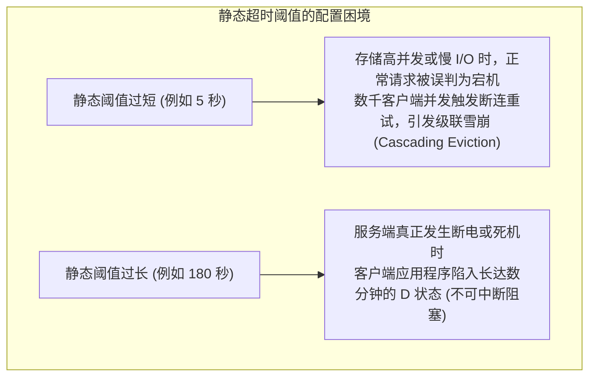

# 5.1 静态超时的制约与自适应超时（Adaptive Timeouts）

在传统的分布式文件系统或网络通信协议中，通常采用固定的静态超时阈值（例如固定配置 `timeout = 30s`）。然而，在大规模分布式存储集群中，静态超时面临两类性能与可用性矛盾：



为了兼顾慢请求处理与快速故障感知，Lustre 设计了 **自适应超时（Adaptive Timeouts，简称 AT）** 机制。

## 5.1.1 AT 算法核心原理

自适应超时的基本原则是：**客户端不预设全局固定超时，超时时限由服务端根据各个 Portal 队列的实时负载动态计算，并随 RPC 应答捎带（Piggyback）同步给客户端**。

客户端计算特定请求等待截止时间（Deadline）的基本公式如下：

$$\text{Deadline} = \text{CurrentTime} + 2 \times \text{NetworkLatency} + \text{ServiceEstimate}$$

- **`NetworkLatency`（网络往返时延）**：客户端与目标节点之间最近几次 RPC 的底层网络往返耗时测量值。
- **`ServiceEstimate`（服务端处理耗时预估）**：服务端当前处理该业务类型请求的历史滑动窗口平均耗时。

在 `lustre/include/lustre_import.h` 中，客户端为每个连接实例（Import）维护独立的超时跟踪结构体：

```c
struct imp_at {
    int                     iat_portal[IMP_AT_MAX_PORTALS];
    struct adaptive_timeout iat_net_latency;
    struct adaptive_timeout iat_service_estimate[IMP_AT_MAX_PORTALS];
};
```

服务端在每一个处理完成的应答报文头 `ptlrpc_body` 中，填入其计算得出的 `pb_timeout` 与当前服务实际执行时间 `pb_service_time`。客户端接收后调用 `at_add_latency()` 动态修正历史统计均值。

---

