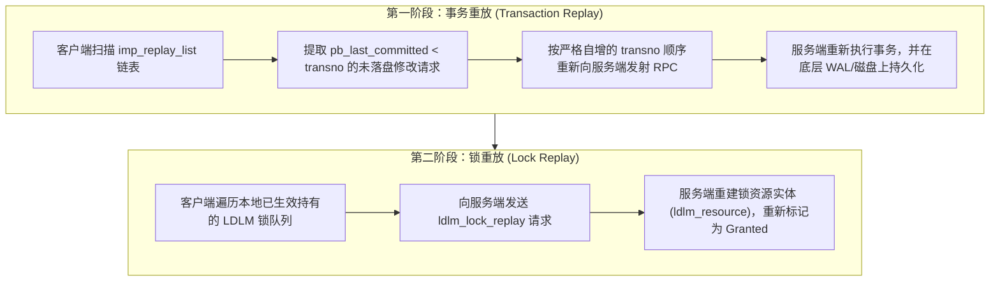

# 5.4 两阶段重放机制（Two-Phase Replay）

服务端宕机重启后，其内存中尚未落盘的事务数据可能发生丢失，已授予各客户端的分布式锁状态也会清空。Lustre 采用**两阶段重放机制**实现服务端崩溃恢复后的状态重建。

## 5.4.1 第一阶段：事务重放（Transaction Replay）

1. **重放队列管理**：客户端每次发出涉及修改的 RPC 请求时，该请求会被保存在本地连接的 `imp_replay_list` 链表中。
2. **提交位点比对**：服务端在每个应答中通告当前已刷入物理存储的最高事务号 `pb_last_committed`。当且仅当客户端观察到 `pb_last_committed >= req->rq_transno` 时，该请求才会从重放链表中移除。
3. **幂等有序重放**：当服务端重启进入恢复模式后，客户端根据 `transno` 的严格升序重新发送未确认落盘的请求。服务端依次重新执行并落盘，保证了服务端事务历史的完整重现。

## 5.4.2 第二阶段：锁重放（Lock Replay）

在所有未落盘的事务重放完毕后，系统进入锁重放阶段：
- 客户端在本地内存中依然维护着断网前持有的分布式锁句柄（包含范围锁 Extent 与元数据 Inode Bits 锁）；
- 客户端依次向服务端发送 `LDLM_LOCK_REPLAY` 请求；
- 服务端据此在内存中重新初始化 `struct ldlm_resource` 并恢复 `lr_granted` 队列，使得客户端无需废弃本地缓存的 Dirty Page 和 Inode 属性，保障了文件系统缓存一致性。

---

