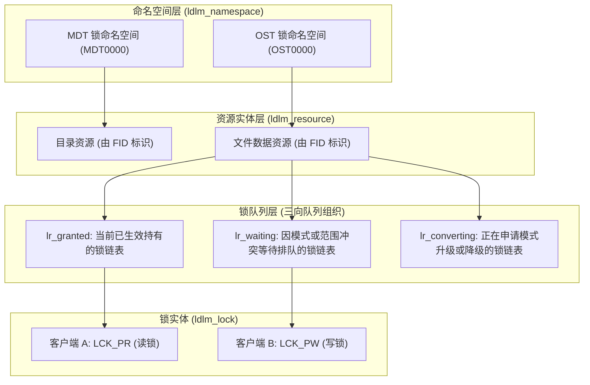
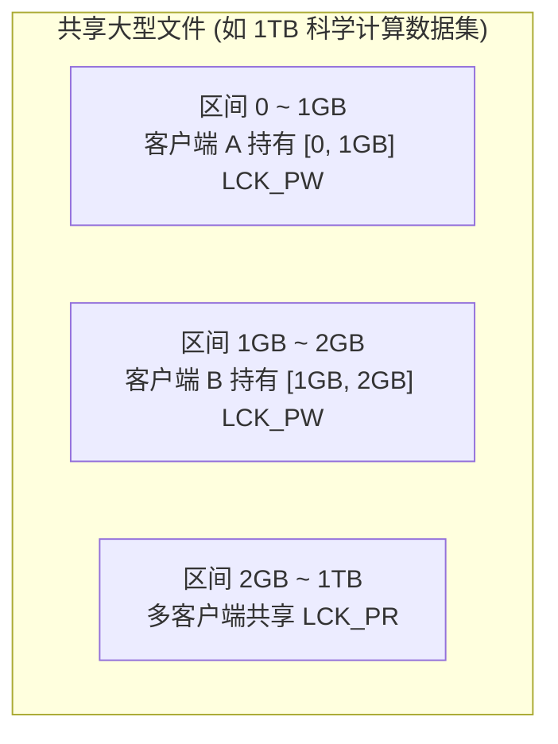
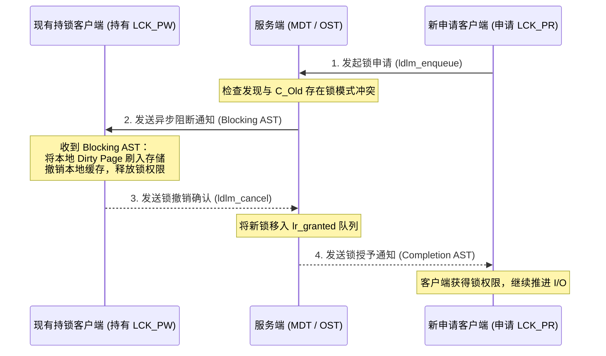
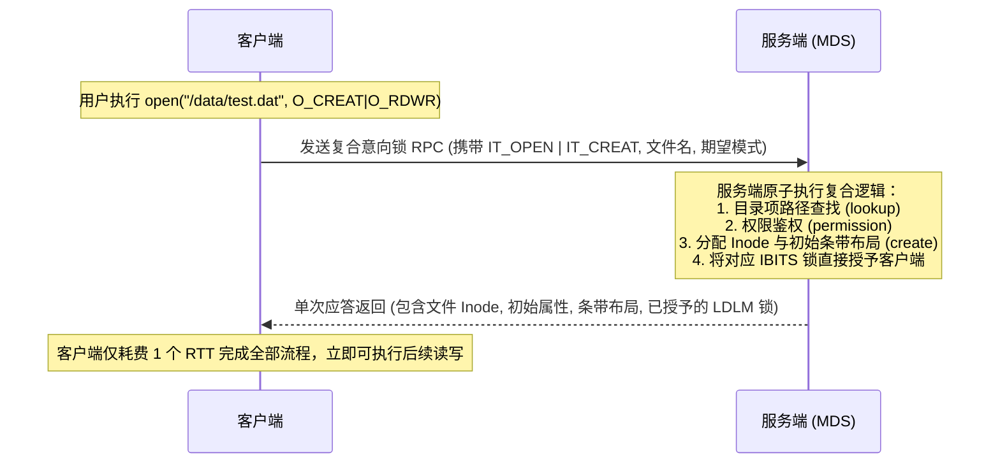

# 第 6 章：LDLM 分布式锁管理器：意图锁与并发控制深度解密

> **本章核心源码文件**：  
> - `include/uapi/linux/lustre/lustre_idl.h`：LDLM 锁模式、锁类型与意向操作码定义  
> - `lustre/include/lustre_dlm.h`：锁管理器核心命名空间、资源实体与锁结构声明  
> - `lustre/ldlm/ldlm_lock.c`：分布式锁生命周期、状态迁移与队列流转实现  
> - `lustre/ldlm/ldlm_resource.c`：资源哈希表管理、冲突判定与兼容性矩阵计算  
> - `lustre/ldlm/ldlm_request.c`：意图锁（Intent Lock）协议交互与 AST 异步回调处理  

---

## 6.1 分布式锁的核心拓扑与兼容性矩阵

在单机操作系统中，互斥锁与读写锁通常直接内嵌在 `struct inode` 中，通过 CPU 原子指令与本地内存总线实现仲裁。但在分布式存储系统中，锁管理必须与底层物理数据存储解耦，支持跨万级节点的并发协同。

LDLM（Lustre Distributed Lock Manager）建立了三层层次化管理模型：



### 6.1.1 核心数据结构

1. **`struct ldlm_namespace`（命名空间）**：  
   每个服务端（每个 MDT、每个 OST）维护专属的命名空间，负责管理该存储目标上所有锁资源的生命周期、内存缓存配额与并发哈希表。
2. **`struct ldlm_resource`（锁资源）**：  
   由全局唯一的 128 位资源标识 `struct ldlm_res_id`（通常对应文件的 FID）定位。每个资源内部维护三个双向链表：
   - **`lr_granted`**：当前已被授予、正在被各客户端正常持有的锁链表。
   - **`lr_waiting`**：与现有已授予锁存在模式或范围冲突、处于排队等待状态的锁链表。
   - **`lr_converting`**：正在申请升级（如由读锁申请升级为写锁）或降级的锁链表。
3. **`struct ldlm_lock`（锁实体）**：  
   表示一把具体的锁，记录其持有者客户端 NID、锁模式（Mode）、锁覆盖的范围或字段位图，以及异步通知回调函数指针。

### 6.1.2 锁模式定义与兼容性矩阵

在 `include/uapi/linux/lustre/lustre_idl.h` 中，LDLM 定义了如下锁模式（`enum ldlm_mode`）：

```c
enum ldlm_mode {
    LCK_EX      = 1,    /* 独占锁 (Exclusive Lock) */
    LCK_PW      = 2,    /* 写锁 (Protected Write) */
    LCK_PR      = 4,    /* 读锁 (Protected Read) */
    LCK_CW      = 8,    /* 并发写 (Concurrent Write) */
    LCK_CR      = 16,   /* 并发读 (Concurrent Read) */
    LCK_NL      = 32,   /* 空锁 (Null Lock，无冲突) */
    LCK_GROUP   = 64,   /* 组锁 (Group Lock，跨进程协作) */
    LCK_COS     = 128,  /* 提交时共享锁 (Commit-on-Share) */
};
```

当新锁申请加入某一资源时，服务端根据下述兼容性矩阵进行冲突判定：

| 申请模式 \ 现有持锁模式 | `EX` (独占) | `PW` (写锁) | `PR` (读锁) | `CW` (并发写) | `CR` (并发读) | `NL` (空锁) |
| :--- | :---: | :---: | :---: | :---: | :---: | :---: |
| **`EX`** | 冲突 | 冲突 | 冲突 | 冲突 | 冲突 | 兼容 |
| **`PW`** | 冲突 | 冲突 | 冲突 | 冲突 | 兼容 | 兼容 |
| **`PR`** | 冲突 | 冲突 | 兼容 | 冲突 | 兼容 | 兼容 |
| **`CW`** | 冲突 | 冲突 | 冲突 | 兼容 | 兼容 | 兼容 |
| **`CR`** | 冲突 | 兼容 | 兼容 | 兼容 | 兼容 | 兼容 |
| **`NL`** | 兼容 | 兼容 | 兼容 | 兼容 | 兼容 | 兼容 |

---

## 6.2 锁特化形态：针对不同存储实体的定制化隔离

为避免对所有文件系统实体采用统一粒度的粗暴加锁，LDLM 支持四种特化的锁类型（`enum ldlm_type`）：

```c
enum ldlm_type {
    LDLM_PLAIN  = 10,   /* 扁平锁：全对象互斥 */
    LDLM_EXTENT = 11,   /* 范围锁：面向文件字节区间的细粒度锁 */
    LDLM_FLOCK  = 12,   /* POSIX 文件锁：对应应用态 fcntl / flock */
    LDLM_IBITS  = 13,   /* 字段位锁：面向元数据属性维度的细粒度锁 */
};
```

### 6.2.1 范围锁（Extent Lock）：文件字节区间的并发隔离

在 OST 数据对象上，LDLM 采用范围锁（`LDLM_EXTENT`）。每个锁定义了一个闭合字节区间 $[start, end]$（最大支持至 `OBD_OBJECT_EOF = ~0ULL`）。



- **区间树（Interval Tree）算法**：服务端通过区间树结构组织锁范围，能够以 $O(\log N)$ 的时间复杂度快速判断新申请区间是否与现有已授予锁发生重叠。
- **并发写入无阻塞**：多个计算节点（如 MPI 并行写入任务）可以同时持有同一文件不同字节区间的写锁（`LCK_PW`），各自在本地执行 Page Cache 缓冲与后台异步刷盘，互不发生锁冲突。

### 6.2.2 字段位锁（Inode Bits Lock）：元数据维度的属性解耦

在元数据服务器（MDS）上，传统单机锁通常对整个 Inode 加锁。但元数据包含多种正交属性（如文件名目录项、大小时间戳、扩展属性、布局描述符等）。为此，LDLM 引入了字段位锁（`LDLM_IBITS`）：

```c
#define MDS_INODELOCK_LOOKUP   (1 << 0)  /* 目录项名称与路径映射缓存 */
#define MDS_INODELOCK_UPDATE   (1 << 1)  /* 文件大小、修改时间 (mtime) 与链接数 */
#define MDS_INODELOCK_OPEN     (1 << 2)  /* 文件打开状态与句柄引用 */
#define MDS_INODELOCK_LAYOUT   (1 << 3)  /* 文件数据条带布局 (Striping Layout) */
#define MDS_INODELOCK_PERM     (1 << 4)  /* 访问权限与属主 (UID/GID/ACL) */
#define MDS_INODELOCK_XATTR    (1 << 5)  /* 扩展属性 (Extended Attributes) */
```

- **锁粒度解耦**：当客户端修改文件扩展属性时，仅需申请针对 `MDS_INODELOCK_XATTR` 位的排他锁。其他正在并发读取该文件数据条带布局（持有 `MDS_INODELOCK_LAYOUT` 锁）或查询路径（持有 `MDS_INODELOCK_LOOKUP` 锁）的客户端完全不受影响，消除了无关元数据属性变更引发的锁失效风暴。

---

## 6.3 三大异步 AST 回调机制

在分布式无中心或弱中心环境下，状态变更需要主动通知各参与方。LDLM 通过三组异步系统陷阱（AST, Asynchronous System Traps）机制驱动分布式锁状态协同。



### 1. 阻断通知（Blocking AST）
当新客户端申请的锁与已授予的现有锁发生冲突时，服务端并不直接粗暴剥夺旧锁，而是向现有持锁方发送 Blocking AST。
- 持锁客户端接收到通知后，执行缓存同步（如将本地未回写的脏页 Flush 到 OST，或废弃过期的 Inode 缓存）；
- 缓存同步完成后，持锁客户端向服务端发送 `ldlm_cancel` 释放或降级锁模式，让出并发通道。

### 2. 完成通知（Completion AST）
当新锁由于资源冲突暂时无法获得授权被放入 `lr_waiting` 等待队列后，一旦冲突方释放锁资源，服务端通过 Completion AST 异步通知等待客户端，驱动其由等待状态迁移至生效执行状态。

### 3. 探测通知（Glimpse AST）
在常规文件读取或属性获取（如 `ls -l`、`stat`）时，客户端需要获取文件当前最新的精确大小（`st_size`）与修改时间。然而，当前拥有写权限的客户端可能在本地 Page Cache 中写入了新数据，尚未触发回写刷盘。
- 若采用传统逻辑，必须向持写锁方发送 Blocking AST 强行收回写锁并刷新全部脏页，开销巨大；
- **Glimpse 机制**：服务端向持写锁方发送轻量的 Glimpse AST 探测消息。持锁客户端就地读取本地尚未刷盘的最新偏移量与时间戳回传，**写锁保留不被撤销**，兼顾了属性精准性与写缓存性能。

---

## 6.4 意向锁（Intent Lock）：1-RTT 复合元数据操作

在传统 POSIX 文件系统中，打开或创建一个文件涉及多个步骤的交互：
1. 路径解析与元数据查找（`lookup`）并获取目录锁；
2. 权限校验与属主检查（`permission`）；
3. 文件创建或打开操作（`create` / `open`）；
4. 获取针对该文件的操作锁。

若上述每一步骤均对应一次独立的 RPC 往返，单次文件访问需经历 4 至 5 个 RTT 网络延迟。

Lustre 首创了 **意向锁（Intent Lock）** 机制：



客户端在申请锁的同时，通过在 `ldlm_enqueue` 请求中嵌入意向数据块（Intent Data，如 `IT_OPEN`、`IT_CREAT`、`IT_GETATTR`），通告服务端自身后续的操作目的。服务端在锁仲裁路径中一次性完成文件创建、权限校验、句柄打开并返回所需的数据属性，**将元数据操作的网络往返时延压缩至 1 个 RTT**。

---

## 6.5 锁动态收缩与内存控制（SLV 与 Client LRU）

在大规模高并发集群中，若客户端无限期保留持有的只读锁或空闲锁，服务端与客户端的内核内存将被海量 `struct ldlm_lock` 结构体挤占。

Lustre 实现了基于 **服务端锁体积（SLV, Server Lock Volume）** 与客户端 LRU 的动态锁回收机制：

1. **服务端锁体积计算**：服务端根据当前命名空间内总锁数量、可用内存比例与请求压力，动态计算出一个全局评估值 SLV，并随 RPC 应答捎带通知所有客户端。
2. **客户端本地 LRU 淘汰**：客户端维护本地未被进程直接引用的锁链表（Unused Lock List）。当客户端本地持锁量超过配置阈值（`lru_size`），或检测到服务端的 SLV 压力值上升时，客户端后台线程主动扫描并向服务端批量发送 `ldlm_cancel` 释放冷数据锁。

---

## 6.6 生产实战：参数调优与监控指标

### 6.6.1 核心分布式锁参数配置

```bash
# 1. 调整客户端本地未被引用锁的 LRU 缓存上限
options ldlm ldlm_lru_size=400

# 2. 控制每个命名空间的最大并发锁数量 (服务端)
options ldlm ldlm_namespaces_max=1000000

# 3. 开启提交时共享锁 (Commit-on-Share, COS) 提高事务吞吐
options ldlm ldlm_cos=1
```

### 6.6.2 常用状态监控与指标查看

| 监控目的 | 执行命令 | 输出关注重点 |
| :--- | :--- | :--- |
| **监控客户端持锁数量** | `lctl get_param ldlm.namespaces.*.lock_count` | 监控本地当前持有的锁总数，评估锁内存占用。 |
| **查看锁资源等待队列** | `lctl get_param ldlm.services.*.waiting_locks` | 监控服务端是否存在大量处于 Waiting 状态的锁冲突。 |
| **查看 AST 异步回调统计** | `lctl get_param ldlm.namespaces.*.pool.stats` | 查看 blocking/completion/glimpse 各类 AST 的触发频次与耗时。 |

---

## 6.7 生产事故案例：共享目录并发创建引发 Inode 字段锁颠簸（Lock Ping-Pong）

### 6.7.1 故障现象

某国家超算中心在运行大规模分子动力学模拟作业时，2048 个计算节点并发启动并在同一个集中共享输出目录（`/lustre/scratch/run_001/`）下同时创建独立结果文件（如 `node_0001.dat` 至 `node_2048.dat`）。

作业启动阶段，文件系统整体元数据响应极其缓慢，`ls -la` 挂起超过 60 秒。MDS 节点的 CPU 软中断利用率与网络接收队列持续维持在接近 100% 的极高负载，但每秒创建文件数（Create IOPS）由基线 45,000 暴跌至不足 800。

### 6.7.2 排查过程

1. **锁冲突排查**：  
   在 MDS 上检查 LDLM 命名空间的冲突统计：
   ```bash
   lctl get_param ldlm.namespaces.MDT0000.waiting_locks
   lctl get_param ldlm.namespaces.MDT0000.lock_timeouts
   ```
   输出显示：共享目录父 Inode 的资源项上聚集了超过 2000 个处于等待状态的锁申请，且每秒产生数千次 Blocking AST 回调。

2. **机制定性分析**：  
   客户端在创建新文件时，需要对父目录 Inode 申请针对 `MDS_INODELOCK_UPDATE` 的排他写锁，以更新目录的修改时间（`mtime`）和目录项哈希树结构。  
   在 2048 个节点同时并发修改同一个父目录时，锁权限在不同的客户端之间高频发生“申请 $\rightarrow$ 阻断已有锁 $\rightarrow$ 强制撤销刷盘 $\rightarrow$ 移交新锁”的循环，形成了经典的 **分布式锁颠簸（Lock Ping-Pong）** 现象。CPU 大量时间消耗在跨网络发送 Blocking AST 与接收 Cancel 应答上，有效文件创建流水线严重停滞。

### 6.7.3 修复措施与成效

1. **开启目录并发修改优化（Commit-on-Share / Parallel Directory）**：  
   在 MDS 上激活目录写锁细粒度并发机制：
   ```bash
   lctl set_param ldlm.namespaces.MDT0000.cos=1
   ```
2. **应用层输出目录分桶策略**：  
   推动作业编排系统改写应用落盘逻辑，将全扁平共享目录拆解为按节点分级的子目录结构（如 `/lustre/scratch/run_001/part_<00-63>/node_xxxx.dat`），将单个父 Inode 的锁竞争分散至 64 个独立子目录中。

调整后，元数据创建速率恢复至 48,000 IOPS，锁颠簸与网络 AST 广播风暴消除。

---

## 6.8 运维基线检查清单

- [ ] **客户端 LRU 锁配额控制**：检查客户端 `ldlm_lru_size`。在具有海量小文件并发访问的客户端上，建议设为 400 至 800，避免过大占用客户端内存，同时防止过小引发重复申请开销。
- [ ] **监控锁撤销阻塞（Blocking AST Timeouts）**：将 `ldlm.services.*.lock_timeouts` 纳入告警规则。若出现超时，说明存在由于网络卡顿或客户端死锁无法及时释放锁的情况。
- [ ] **高并发共享目录分桶治理**：针对作业启动或日志写入场景，推动用户规范化使用散列目录结构，严禁数千进程直接在单一顶层目录下执行无序并发创建。
- [ ] **验证意向锁机制正常生效**：确认客户端挂载选项未禁用 Intent Lock 特性，保证元数据访问维持 1-RTT 复合效率。

---

## 本章小结

LDLM 作为维护 Lustre 分布式数据与元数据一致性的中枢组件，通过分层的命名空间、资源实体与锁队列模型，实现了清晰的并发控制；通过针对数据块的范围锁（`LDLM_EXTENT`）与针对元数据的字段位锁（`LDLM_IBITS`），将锁冲突细化至最小粒度；通过 Blocking、Completion 与 Glimpse 三大异步 AST 机制，实现了无中心化的平滑状态协同；通过首创的意向锁机制将多轮元数据交互合并为 1-RTT 复合操作；并通过 SLV 与动态 LRU 机制有效避免了集群锁内存的无限膨胀。
