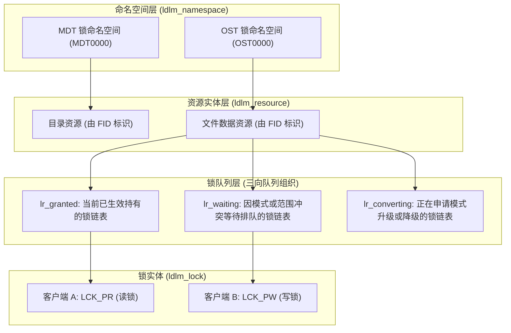

# 6.1 分布式锁的核心拓扑与兼容性矩阵

在单机操作系统中，互斥锁与读写锁通常直接内嵌在 `struct inode` 中，通过 CPU 原子指令与本地内存总线实现仲裁。但在分布式存储系统中，锁管理必须与底层物理数据存储解耦，支持跨万级节点的并发协同。

LDLM（Lustre Distributed Lock Manager）建立了三层层次化管理模型：



## 6.1.1 核心数据结构

1. **`struct ldlm_namespace`（命名空间）**：  
   每个服务端（每个 MDT、每个 OST）维护专属的命名空间，负责管理该存储目标上所有锁资源的生命周期、内存缓存配额与并发哈希表。
2. **`struct ldlm_resource`（锁资源）**：  
   由全局唯一的 128 位资源标识 `struct ldlm_res_id`（通常对应文件的 FID）定位。每个资源内部维护三个双向链表：
   - **`lr_granted`**：当前已被授予、正在被各客户端正常持有的锁链表。
   - **`lr_waiting`**：与现有已授予锁存在模式或范围冲突、处于排队等待状态的锁链表。
   - **`lr_converting`**：正在申请升级（如由读锁申请升级为写锁）或降级的锁链表。
3. **`struct ldlm_lock`（锁实体）**：  
   表示一把具体的锁，记录其持有者客户端 NID、锁模式（Mode）、锁覆盖的范围或字段位图，以及异步通知回调函数指针。

## 6.1.2 锁模式定义与兼容性矩阵

在 `include/uapi/linux/lustre/lustre_idl.h` 中，LDLM 定义了如下锁模式（`enum ldlm_mode`）：

```c
enum ldlm_mode {
    LCK_EX      = 1,    /* 独占锁 (Exclusive Lock) */
    LCK_PW      = 2,    /* 写锁 (Protected Write) */
    LCK_PR      = 4,    /* 读锁 (Protected Read) */
    LCK_CW      = 8,    /* 并发写 (Concurrent Write) */
    LCK_CR      = 16,   /* 并发读 (Concurrent Read) */
    LCK_NL      = 32,   /* 空锁 (Null Lock，无冲突) */
    LCK_GROUP   = 64,   /* 组锁 (Group Lock，跨进程协作) */
    LCK_COS     = 128,  /* 提交时共享锁 (Commit-on-Share) */
};
```

当新锁申请加入某一资源时，服务端根据下述兼容性矩阵进行冲突判定：

| 申请模式 \ 现有持锁模式 | `EX` (独占) | `PW` (写锁) | `PR` (读锁) | `CW` (并发写) | `CR` (并发读) | `NL` (空锁) |
| :--- | :---: | :---: | :---: | :---: | :---: | :---: |
| **`EX`** | 冲突 | 冲突 | 冲突 | 冲突 | 冲突 | 兼容 |
| **`PW`** | 冲突 | 冲突 | 冲突 | 冲突 | 兼容 | 兼容 |
| **`PR`** | 冲突 | 冲突 | 兼容 | 冲突 | 兼容 | 兼容 |
| **`CW`** | 冲突 | 冲突 | 冲突 | 兼容 | 兼容 | 兼容 |
| **`CR`** | 冲突 | 兼容 | 兼容 | 兼容 | 兼容 | 兼容 |
| **`NL`** | 兼容 | 兼容 | 兼容 | 兼容 | 兼容 | 兼容 |

---

