# 第 7 章：OBD 分层模型与设备生命周期

> **本章核心源码文件**：  
> - `lustre/include/obd.h`：`struct obd_device`、`struct obd_ops` 及核心设备类型定义  
> - `lustre/include/obd_class.h`：OBD 设备类注册、查找与通用操作宏定义  
> - `lustre/obdclass/genops.c`：全局设备表（`obd_devs`）、设备分配与生命周期管理  
> - `lustre/obdclass/obd_config.c`：配置指令（`lcfg`）解析与设备装配初始化  
> - `lustre/include/lustre_export.h`：Export 结构体与客户端会话管理定义  

---

## 7.1 分层架构设计：从块抽象到虚拟对象栈

在传统的存储体系中，通用块存储（如 iSCSI 或 Ceph RBD）向操作系统暴露的是平坦的逻辑块地址空间（LBA）。文件系统的元数据结构（如 Superblock、Inode 表、位图及目录项）全部需要在客户端本地进行解析与修改。当多个计算客户端需要并发挂载同一存储卷时，必须引入复杂的分布式单机文件系统（如 GFS2、OCFS2），并在客户端之间频繁同步块级缓存与锁，导致元数据处理扩展性受限。

Lustre 采纳了对象存储设备（OBD, Object-Based Device）模型：
- **存储端面向对象建模**：底层存储目标不再暴露裸扇区，而是对外暴露具备独立属性和变长数据流的“存储对象”。
- **职责解耦**：磁盘空间分配、块位图管理及 Extent 映射完全下沉至 MDS 与 OSS 本地的本地存储驱动（如 `osd-ldiskfs` 或 `osd-zfs`）自行处理；客户端仅需发起逻辑对象层级的读取、写入与属性修改请求。

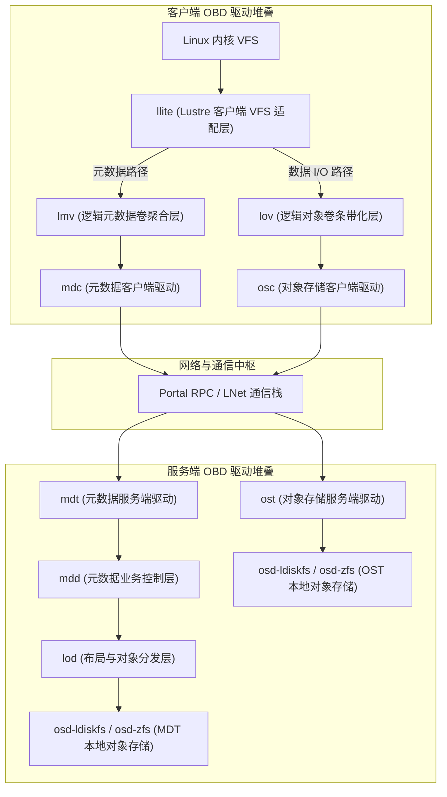

整个文件系统各层功能组件（包括网络客户端、本地驱动与聚合分发器）均统一抽象为标准化的 OBD 设备，在内核中通过统一接口自底向上分层装配。


*图 7-1: 客户端 llite 与 mgc 子系统通过通用的 obdclass 接口及 OBP 宏进行解耦调用（来源：Understanding Lustre Internals）*

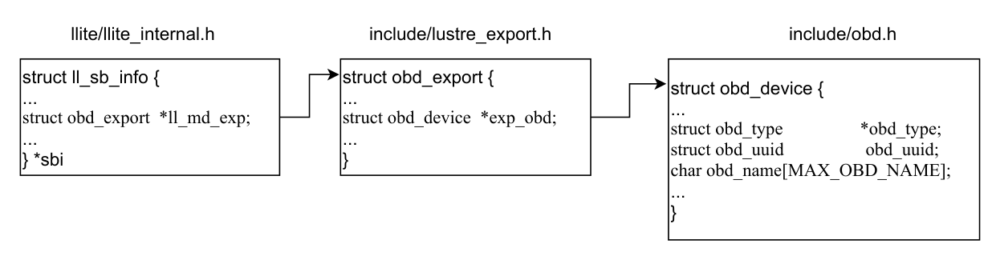

*图 7-2: mgc 与 llite 子系统交互中的关键内存数据结构（ll_sb_info、obd_device、obd_export）（来源：Understanding Lustre Internals）*

---

## 7.2 核心数据结构：`struct obd_device` 与 `struct obd_ops`

每个具体的存储驱动实例在内核中均由 `struct obd_device`（`lustre/include/obd.h`）表示：

```c
struct obd_device {
    struct obd_type        *obd_type;           /* 指向设备类型描述符 (如 "osc", "mdt") */
    char                    obd_name[MAX_OBD_NAME]; /* 设备全局唯一实例名 (如 "testfs-OST0000") */
    struct obd_uuid         obd_uuid;           /* 设备的 UUID 标识 */
    int                     obd_minor;          /* 在全局设备数组中的索引槽位编号 */
    
    /* 标志位 */
    unsigned long           obd_attached:1,     /* 设备已分配并挂接 */
                            obd_set_up:1,       /* 设备 setup() 函数执行成功 */
                            obd_stopping:1,     /* 正在执行停止流程 */
                            obd_force:1,        /* 强制卸载标志位 */
                            obd_fail:1;         /* 设备发生故障异常 */

    struct obd_ops         *obd_ops;            /* 设备操作函数跳转表 */
    struct md_ops          *md_ops;             /* 元数据专用操作跳转表 */
    
    struct ldlm_namespace  *obd_namespace;      /* 该设备拥有的 LDLM 分布式锁命名空间 */
    struct rhashtable       obd_uuid_hash;      /* 客户端 Export 会话 UUID 哈希表 */
    struct rhltable         obd_nid_hash;       /* 客户端 Export 会话 NID 哈希表 */
    atomic_t                obd_refcount;       /* 设备全局引用计数 */
    wait_queue_head_t       obd_boot_waitq;     /* 初始化等待队列 */
};
```

### 统一设备操作表：`struct obd_ops`

上层通用代码通过 `struct obd_ops` 约定的函数指针访问底层硬件或逻辑层，隔离各模块实现细节：

```c
struct obd_ops {
    struct module *owner;
    int (*setup)(struct obd_device *dev, struct lustre_cfg *cfg);
    int (*cleanup)(struct obd_device *dev);
    int (*connect)(const struct lu_env *env, struct obd_export **exp,
                   struct obd_device *dev, struct obd_uuid *cluuid,
                   struct obd_connect_data *data, void *localdata);
    int (*disconnect)(struct obd_export *exp);
    int (*statfs)(const struct lu_env *env, struct obd_export *exp,
                  struct obd_statfs *osfs, time64_t max_age, __u32 flags);
    int (*iocontrol)(unsigned int cmd, struct obd_export *exp, int len,
                     void *karg, void __user *uarg);
    /* 核心数据读写方法 */
    int (*preprw)(const struct lu_env *env, int cmd, struct obd_export *exp,
                  struct obdo *oa, int objcount, struct obd_ioobj *obj,
                  struct niobuf_remote *remote, int *pages,
                  struct niobuf_local *local);
    int (*commitrw)(const struct lu_env *env, int cmd, struct obd_export *exp,
                    struct obdo *oa, int objcount, struct obd_ioobj *obj,
                    struct niobuf_remote *remote, int pages,
                    struct niobuf_local *local, int rc);
};
```

#### OBP 调用宏机制
在内核源码中，上层模块严禁直接以 `dev->obd_ops->op(...)` 形式裸调操作表指针。Lustre 统一通过 `OBP(dev, op)` 保护宏展开调用：

```c
#define OBP(dev, op)                                    \
    ({                                                  \
        LASSERT(dev != NULL);                           \
        LASSERT(dev->obd_ops != NULL);                  \
        LASSERT(dev->obd_ops->op != NULL);              \
        dev->obd_ops->op;                               \
    })
```
该宏在编译期与调试运行时注入严格的前置条件断言（`LASSERT`），在指针为空或未初始化时立刻拦截崩溃，杜绝空指针引发内核 OOPS。

---

## 7.3 全局设备注册表与生命周期

内核中运行的全部 OBD 实例由 `obdclass/genops.c` 统一管理。

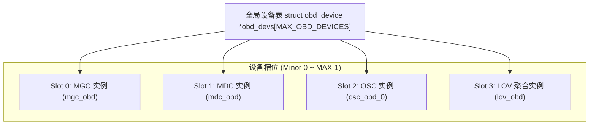

- **Minor 索引槽位分配**：每个新设备分配一个全局递增的整数编号 `obd_minor`，系统最大支持通过 `obd_devs` 管理数千个动态设备实例。
- **引用计数生命周期（`obd_refcount`）**：只有当所有连接的 Export 全部断开且内部子系统完全释放后，设备的内存结构体才被真正销毁。

---

## 7.4 OBD 设备全生命周期状态机

从系统挂载到安全卸载，OBD 设备遵循严格的五阶段生命周期管理：

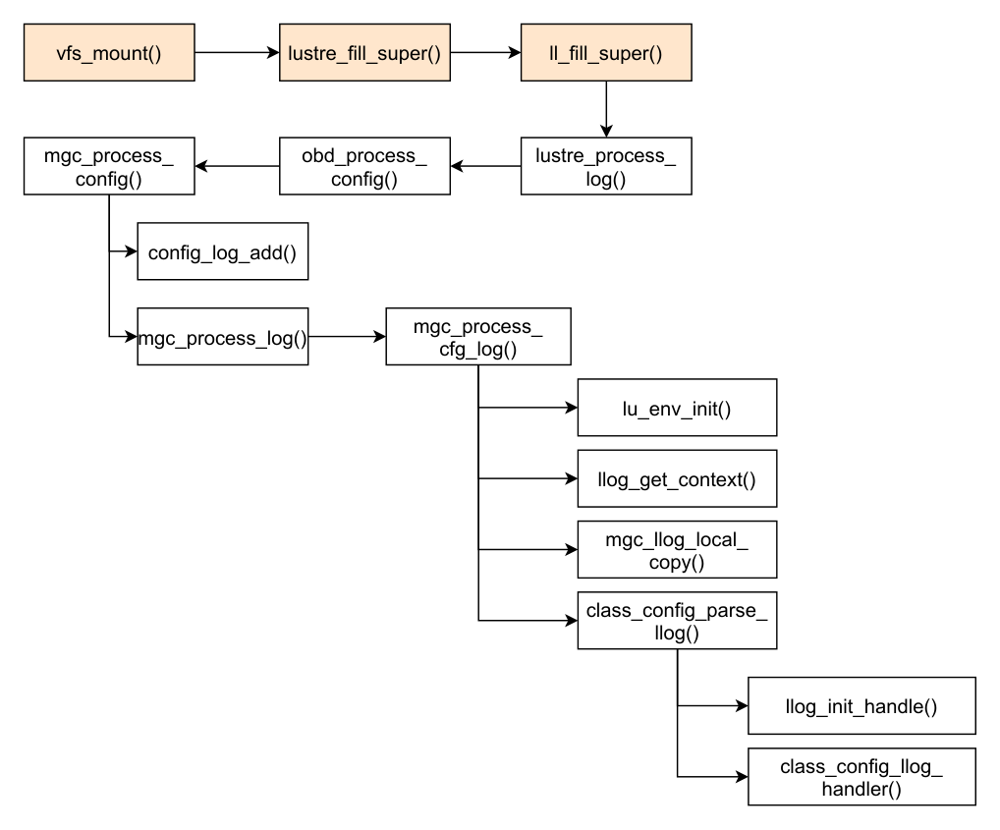

*图 7-3: MGC 设备完整生命周期工作流：从 attach、setup 到配置解析与卸载销毁（来源：Understanding Lustre Internals）*

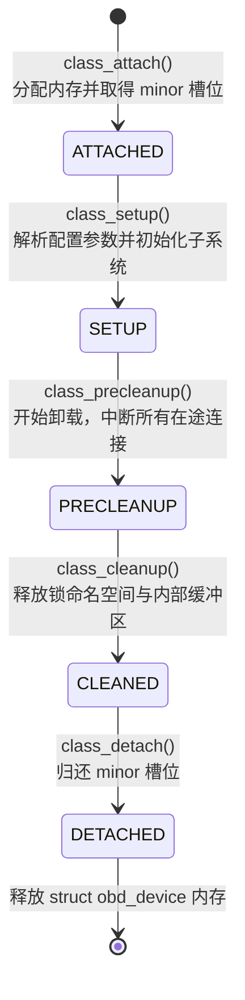

### 1. `class_attach`：设备实例分配
解析配置指令中的设备类型名（如 `osc`）与设备名。在全局数组中找到未占用的 `minor` 槽位，分配 `struct obd_device` 内存并完成基础锁与等待队列的初始化。

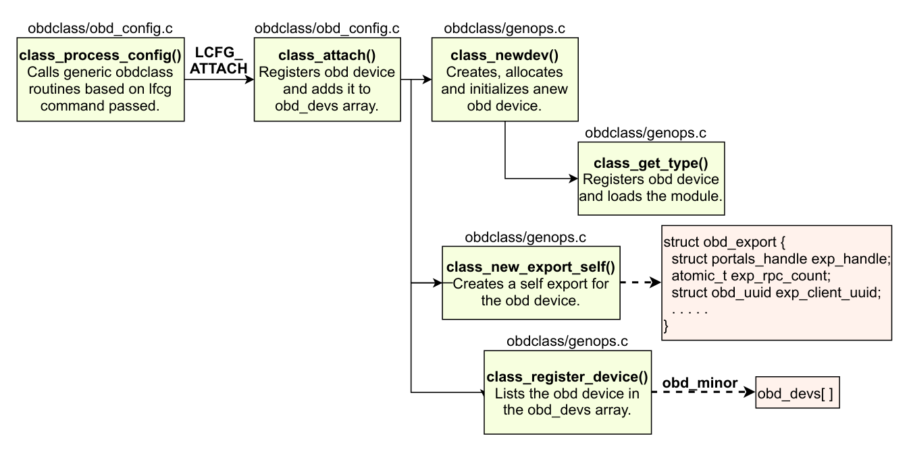

*图 7-4: class_attach() 核心执行路径：设备槽位分配与基础环境构造（来源：Understanding Lustre Internals）*

### 2. `class_setup`：驱动装配与就绪
调用对应驱动的具体 `obd_ops->setup()` 函数。
- 若是服务端驱动（如 MDT/OST），分配本地磁盘 I/O 资源，启动 PtlRPC 服务线程池；
- 若是客户端驱动（如 OSC/MDC），初始化 LDLM 锁命名空间（`obd_namespace`），建立到目标服务器的通信底座。

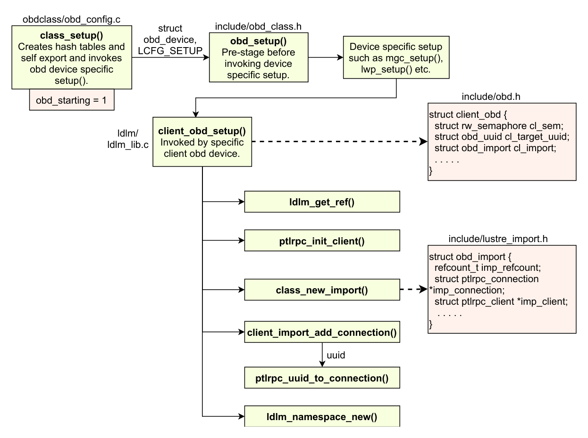

*图 7-5: class_setup() 执行工作流：驱动特定配置与服务线程激活（来源：Understanding Lustre Internals）*

### 3. `class_precleanup`：断开外部连接
由卸载流程触发。将 `obd_stopping` 置为 1，拒绝接收新的上层业务请求；强行断开并清理所有客户端的 Export 会话，触发在途异步请求的快速失败。

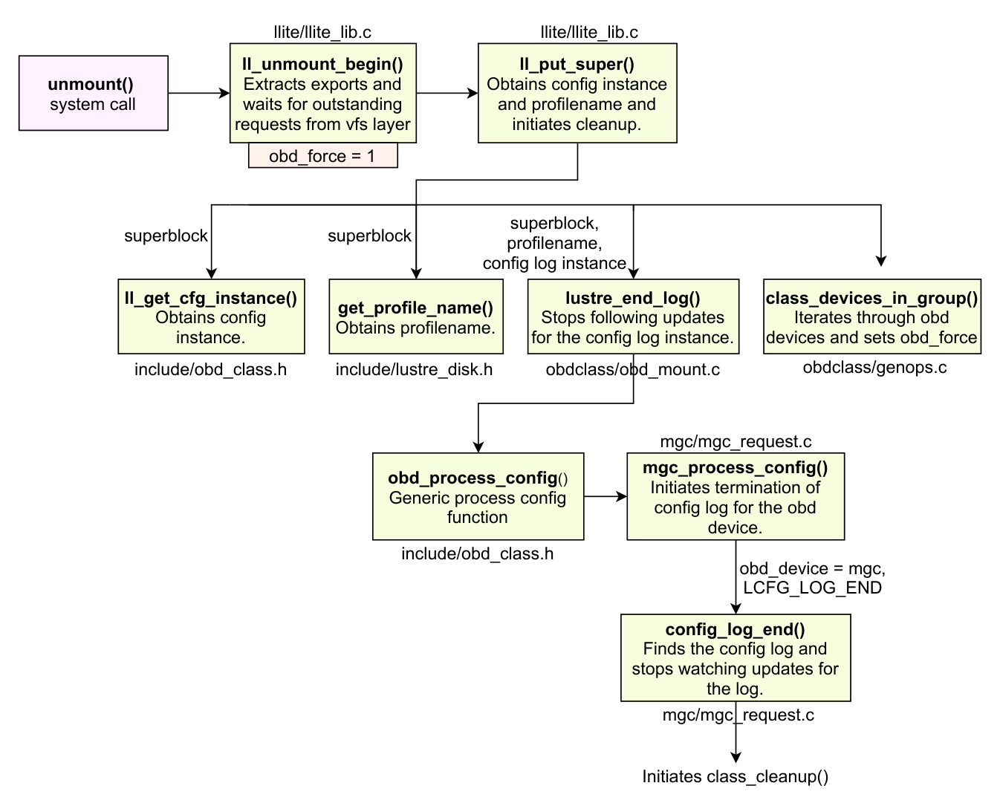

*图 7-6: Lustre 客户端卸载触发 class_cleanup 流程与 MGC 销毁时序（来源：Understanding Lustre Internals）*

### 4. `class_cleanup`：资源销毁
调用驱动的 `obd_ops->cleanup()`。停止服务线程池，销毁对应的 LDLM 锁命名空间，释放请求缓冲区（RQBD）与内部哈希表。

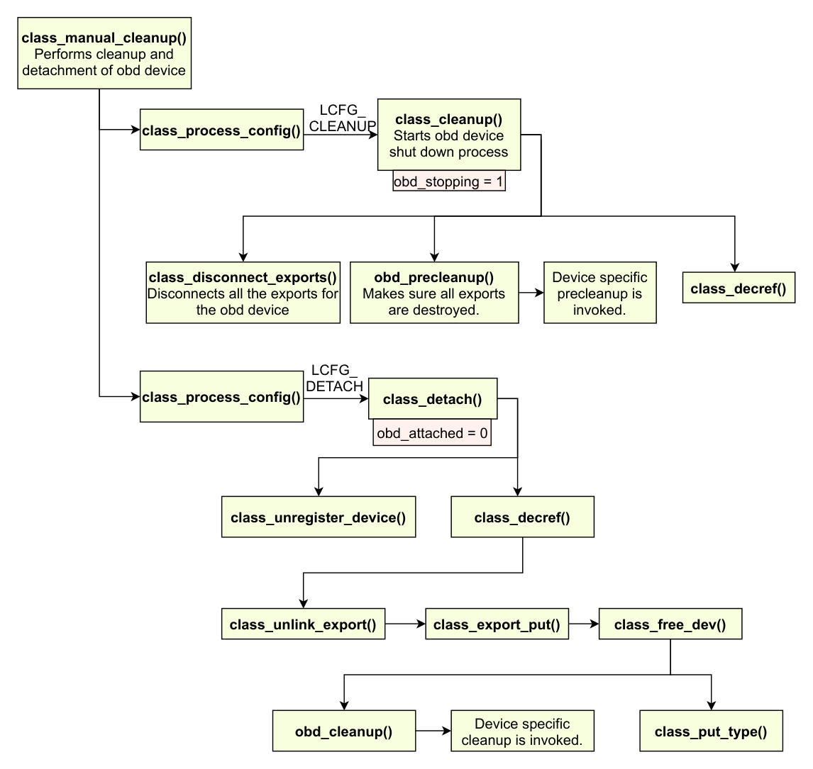

*图 7-7: class_cleanup() 核心流程：引用归零与底层子系统注销（来源：Understanding Lustre Internals）*

### 5. `class_detach`：全局解挂
从全局 `obd_devs` 数组中移除设备指针，归还 `minor` 编号，释放 `struct obd_device` 占用的内核内存。

---

## 7.5 Export 与 Import 核心通信实体

在 Lustre 的客户端与服务端之间，所有通信通过一对互为镜像的核心实体进行管理：

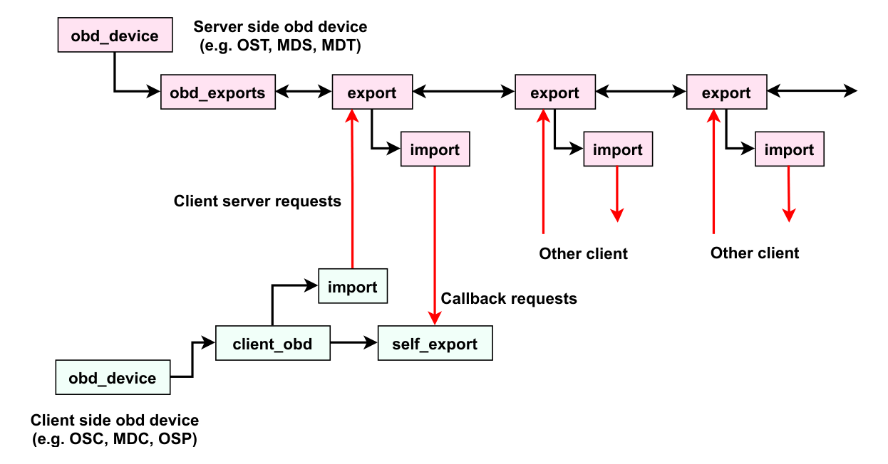

*图 7-8: Lustre 客户端与服务端之间的 Import / Export 映射拓扑与连接管道（来源：Understanding Lustre Internals）*

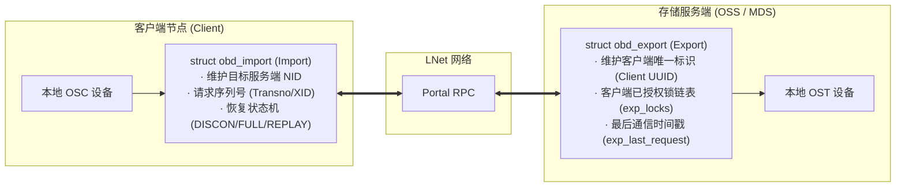

### 1. `struct obd_import`（客户端视角）
表示客户端指向远端目标服务端的单向通信管道。
- 负责维护到目标节点的 LNet NID、网络连接状态以及最后处理的事务编号（Transno）。
- 驱动容错恢复状态机：当检测到服务端失联时，`import` 状态在 `DISCONN`、`CONNECTING`、`REPLAY` 之间流转。

### 2. `struct obd_export`（服务端视角）
表示服务端接纳的某一个特定客户端的在线会话实体。
- 服务端为每个成功挂载的客户端分配一个 `struct obd_export`，挂载在 `obd_device` 的哈希表中。
- **锁资产记账**：记录该客户端当前持有的所有 LDLM 锁（`exp_locks` 链表）。当客户端主动关闭或被踢出集群时，服务端根据 Export 迅速撤销并回收其占有的全部锁资源。
- **驱逐判定（Eviction）**：记录最后活跃时间。若在租约期内未收到该 Export 的任何请求或 Ping 心跳，触发驱逐（Eviction）。


*图 7-9: 服务端协同通信：MDT 与 OST 之间通过 OSP 虚拟设备与 Import/Export 建立通信管道（来源：Understanding Lustre Internals）*

---

## 7.6 生产实战：设备状态检查与故障诊断

### 常用状态查看命令

```bash
# 1. 列出当前节点装配的全部 OBD 设备及其运行状态
lctl dl
# 典型输出:
#  0 UP mgc MGC10.10.1.1@o2ib0 c7a5f6e8-1111-2222-3333-444455556666 5
#  1 UP ost OSS OSS_uuid 3
#  2 UP obdfilter testfs-OST0000 testfs-OST0000_UUID 4

# 2. 查看特定 OST 上的在线客户端 Export 数量与详情
lctl get_param obdfilter.testfs-OST0000.num_exports

# 3. 检查特定客户端的 Export 状态与连接时间戳
lctl get_param obdfilter.testfs-OST0000.exports.*.last_request_time
```

---

## 7.7 生产事故案例：僵尸 Export 引用泄漏导致存储节点卸载挂死

### 7.7.1 故障现象

在对某台 OSS 存储节点执行滚动维护升级时，管理员执行 `umount /mnt/ost0` 尝试安全卸载 OST 设备。然而卸载命令彻底挂死在内核中，终端进程陷入 D 状态，等待超过 20 分钟仍未退出。

内核日志（`dmesg`）持续以 10 秒间隔输出告警：
```text
LustreError: 12345:0:(genops.c:1342:class_cleanup()) obdfilter-testfs-OST0002: has 1 remaining export!
LustreError: 12345:0:(genops.c:1345:class_cleanup()) obdfilter-testfs-OST0002: refcount is 2
```

### 7.7.2 排查过程

1. **查看堆栈**：  
   `cat /proc/<umount_pid>/stack` 显示 `umount` 进程卡死在 `class_cleanup()` 中的循环等待：
   ```text
   [<0>] schedule_timeout+0x...
   [<0>] class_cleanup+0x...
   [<0>] lustre_stop_simple+0x...
   [<0>] osd_shutdown+0x...
   ```
2. **分析 Export 残留**：  
   在卸载阶段，`class_precleanup()` 已经向所有注册的 Export 发送了断开指令。然而，检查该 OST 的残余 Export 时发现，存在一个特殊的内部 Export：来自于 MDT 预分配对象的内部同步链路（由 MDT 的 OSP 代理设备建立）。由于网络交换机在维护时提前切断了管理网段，MDT 的 OSP 客户端未能在超时时间内发送注销确认，导致该 Export 的引用计数始终大于 0。
3. **机理分析**：  
   `class_cleanup()` 具有严密的内存防御逻辑：在销毁 `obd_device` 之前，必须确保所有外部借出的 Export 已经完全释放归零。如果强行释放设备内存，会导致后续延迟到达的网络报文在访问野指针时引发系统 Kernel Panic。因此系统选择安全阻塞等待。

### 7.7.3 修复措施与成效

通过 `lctl` 工具向内核注入强制销毁标志（`obd_force`），强行斩断残余 Export：

```bash
# 激活指定设备的强制中止模式，旁路引用计数保护
lctl --device testfs-OST0002 force
```

执行后，内核立即释放受损的僵尸 Export，`umount` 进程顺利完成卸载，避免了由于进程挂死导致的服务器强制硬件断电重启。

---

## 7.8 运维基线检查清单

- [ ] **卸载前检查 Export 水位**：在对 OSS/MDS 执行关机前，先执行 `lctl get_param *.testfs-*.num_exports`，观察活跃客户端数量是否已降至极低水平。
- [ ] **规范卸载流程**：严格遵循“先停客户端挂载 $\rightarrow$ 再停 OST $\rightarrow$ 次停 MDT $\rightarrow$ 最后停 MGS”的顺序操作，严禁在客户端运行高吞吐 I/O 时直接关停服务端底层设备。
- [ ] **监控 `obd_devs` 槽位占用率**：大规模超算集群中，定期检查 `lctl dl | wc -l`，防止长期运行产生的大量临时设备实例耗尽内核预设的 Minor 槽位。

---

## 本章小结

OBD 分层模型是 Lustre 存储架构的基础设计。它将复杂的分布式存储栈划分为职责单一的抽象设备层，通过标准的 `obd_ops` 操作表屏蔽底层细节；通过全局设备管理与五阶段生命周期状态机，保证了内核模块在动态装配与卸载时的内存安全；通过 Import 与 Export 实体建立起分布式客户端与服务端的强类型契约与锁资源记账机制。这一体系为现代 `lu_object` 复合对象栈与分布式元数据管理提供了坚实的运行底座。
