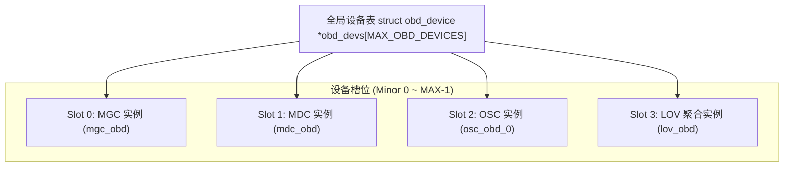

# 7.3 全局设备注册表与生命周期

内核中运行的全部 OBD 实例由 `obdclass/genops.c` 统一管理。

- **Minor 索引槽位分配**：每个新设备分配一个全局递增的整数编号 `obd_minor`，系统最大支持通过 `obd_devs` 管理数千个动态设备实例。
- **引用计数生命周期（`obd_refcount`）**：只有当所有连接的 Export 全部断开且内部子系统完全释放后，设备的内存结构体才被真正销毁。

---

