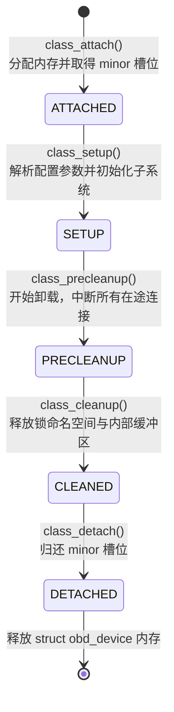

# 7.4 OBD 设备全生命周期状态机

从系统挂载到安全卸载，OBD 设备遵循严格的五阶段生命周期管理：

*图 7-3: MGC 设备完整生命周期工作流：从 attach、setup 到配置解析与卸载销毁（来源：Understanding Lustre Internals）*

## 1. `class_attach`：设备实例分配
解析配置指令中的设备类型名（如 `osc`）与设备名。在全局数组中找到未占用的 `minor` 槽位，分配 `struct obd_device` 内存并完成基础锁与等待队列的初始化。

*图 7-4: class_attach() 核心执行路径：设备槽位分配与基础环境构造（来源：Understanding Lustre Internals）*

## 2. `class_setup`：驱动装配与就绪
调用对应驱动的具体 `obd_ops->setup()` 函数。
- 若是服务端驱动（如 MDT/OST），分配本地磁盘 I/O 资源，启动 PtlRPC 服务线程池；
- 若是客户端驱动（如 OSC/MDC），初始化 LDLM 锁命名空间（`obd_namespace`），建立到目标服务器的通信底座。

*图 7-5: class_setup() 执行工作流：驱动特定配置与服务线程激活（来源：Understanding Lustre Internals）*

## 3. `class_precleanup`：断开外部连接
由卸载流程触发。将 `obd_stopping` 置为 1，拒绝接收新的上层业务请求；强行断开并清理所有客户端的 Export 会话，触发在途异步请求的快速失败。

*图 7-6: Lustre 客户端卸载触发 class_cleanup 流程与 MGC 销毁时序（来源：Understanding Lustre Internals）*

## 4. `class_cleanup`：资源销毁
调用驱动的 `obd_ops->cleanup()`。停止服务线程池，销毁对应的 LDLM 锁命名空间，释放请求缓冲区（RQBD）与内部哈希表。

*图 7-7: class_cleanup() 核心流程：引用归零与底层子系统注销（来源：Understanding Lustre Internals）*

## 5. `class_detach`：全局解挂
从全局 `obd_devs` 数组中移除设备指针，归还 `minor` 编号，释放 `struct obd_device` 占用的内核内存。

---

