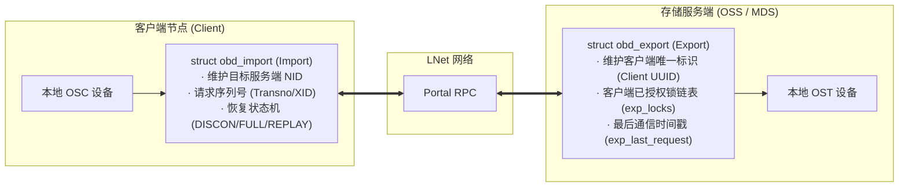

# 7.5 Export 与 Import 核心通信实体

在 Lustre 的客户端与服务端之间，所有通信通过一对互为镜像的核心实体进行管理：

*图 7-8: Lustre 客户端与服务端之间的 Import / Export 映射拓扑与连接管道（来源：Understanding Lustre Internals）*

## 1. `struct obd_import`（客户端视角）
表示客户端指向远端目标服务端的单向通信管道。
- 负责维护到目标节点的 LNet NID、网络连接状态以及最后处理的事务编号（Transno）。
- 驱动容错恢复状态机：当检测到服务端失联时，`import` 状态在 `DISCONN`、`CONNECTING`、`REPLAY` 之间流转。

## 2. `struct obd_export`（服务端视角）
表示服务端接纳的某一个特定客户端的在线会话实体。
- 服务端为每个成功挂载的客户端分配一个 `struct obd_export`，挂载在 `obd_device` 的哈希表中。
- **锁资产记账**：记录该客户端当前持有的所有 LDLM 锁（`exp_locks` 链表）。当客户端主动关闭或被踢出集群时，服务端根据 Export 迅速撤销并回收其占有的全部锁资源。
- **驱逐判定（Eviction）**：记录最后活跃时间。若在租约期内未收到该 Export 的任何请求或 Ping 心跳，触发驱逐（Eviction）。

*图 7-9: 服务端协同通信：MDT 与 OST 之间通过 OSP 虚拟设备与 Import/Export 建立通信管道（来源：Understanding Lustre Internals）*

---

