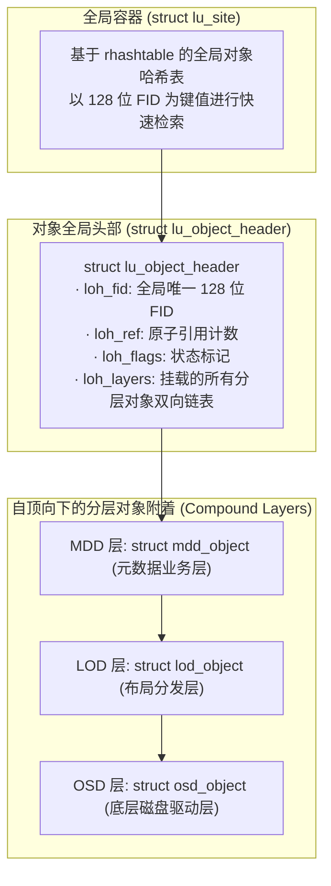
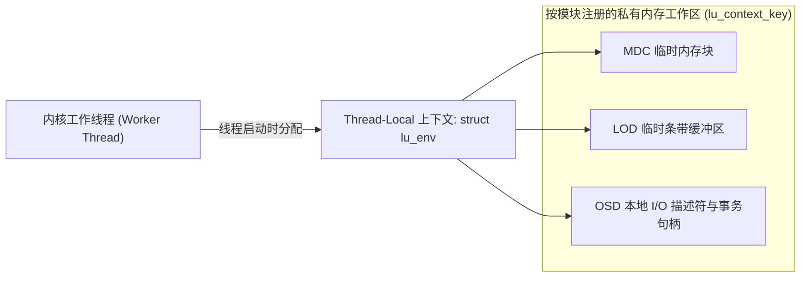
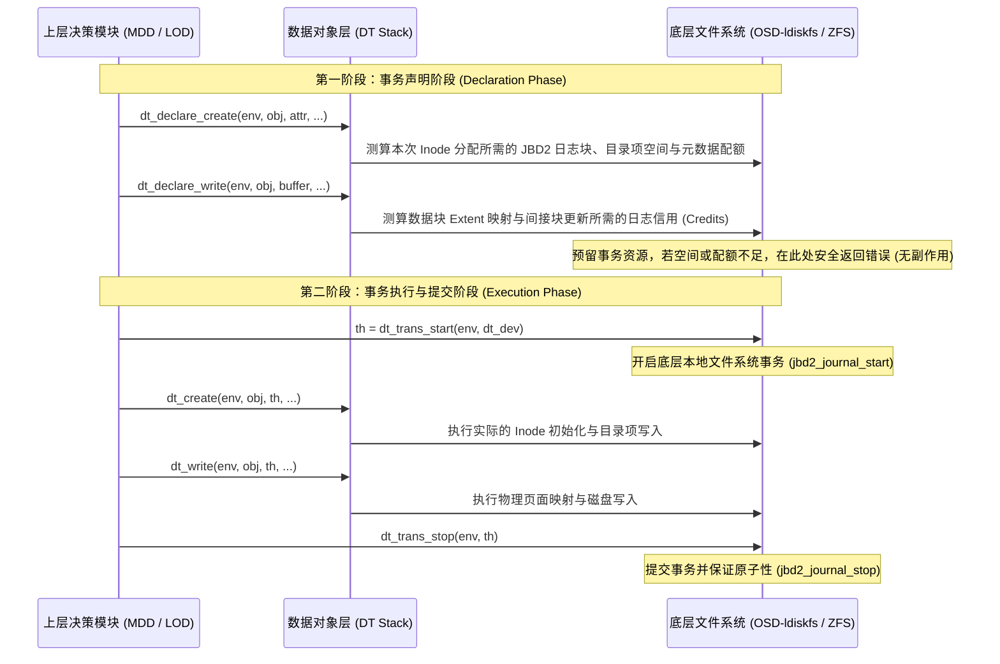

# 第 8 章：现代对象栈模型：lu_object 与两阶段事务契约

> **本章核心源码文件**：  
> - `lustre/include/lu_object.h`：复合对象基类（`lu_object`）、头部结构与生命周期 API  
> - `lustre/include/dt_object.h`：数据对象栈（DT Stack）与两阶段事务（`dt_txn`）定义  
> - `lustre/include/md_object.h`：元数据对象栈（MD Stack）与权限属性操作定义  
> - `lustre/obdclass/lu_object.c`：`lu_site` 全局对象哈希、分层实例化与 LRU 内存回收  
> - `lustre/osd-ldiskfs/osd_handler.c`：底层 ldiskfs 对象驱动与事务引擎实现  

---

## 8.1 架构演进：从单层 `obd_ops` 到现代对象栈

在早期设计中，Lustre 的所有设备操作均依赖单一扁平的 `struct obd_ops` 表。随着系统引入分布式命名空间（DNE）、文件条带化布局镜像（FLR）与复杂的元数据两阶段提交，扁平结构暴露出局限性：
1. **职责耦合与接口膨胀**：元数据目录树维护、数据条带布局分发与底层磁盘物理块分配混杂在同一接口体系中，函数参数充斥无类型的 `void *` 指针，难以进行静态类型检查。
2. **缺乏跨分层的原子事务契约**：在创建带复杂条带的文件时，需要同时修改 MDT 上的元数据目录项，并在多个 OST 上预先分配对象。若条带分配中途失败，旧架构缺乏统一的两阶段事务回滚与资源预留机制，容易产生孤儿对象或不一致状态。

为了解决上述问题，Lustre 构建了 **`lu_object`（Lustre Object）分层对象模型**，将系统划分为两大平行栈：
- **元数据对象栈（MD Stack）**：由 `md_device` 与 `md_object` 组成，负责文件命名空间、目录项检索、ACL 访问控制以及数据条带布局策略。
- **数据对象栈（DT Stack）**：由 `dt_device` 与 `dt_object` 组成，负责底层存储介质上的对象数据流读写、属性管理以及两阶段持久化事务（ACID）契约。

---

## 8.2 复合对象模型（Compound Object）与核心结构

在 Linux 内核 C 语言环境中，系统采用“统一头部、多层附着”的复合对象模型实现面向对象的继承与多态：



### 8.2.1 核心数据结构拆解

1. **`struct lu_object_header`（对象统一头部）**：  
   每个逻辑存储实体在内存中拥有唯一的头部，保存该对象的 128 位全局标识符 FID（`loh_fid`）、全局引用计数（`loh_ref`）以及连接各层实现的链表头（`loh_layers`）。

2. **`struct lu_object`（分层对象基类）**：  
   每一层驱动（如 MDD、LOD、OSD）通过内嵌 `struct lu_object` 实现逻辑扩展：
   ```c
   struct lu_object {
       struct lu_object_header *lo_header; /* 反向指针，指向所属的统一头部 */
       struct lu_device        *lo_dev;    /* 指向负责本层逻辑的 lu_device */
       struct lu_object_ops    *lo_ops;    /* 本层生命周期与对象操作函数表 */
       struct list_head         lo_linkage;/* 链接进 loh_layers 的链表节点 */
   };
   ```

3. **`struct lu_site`（站点容器）**：  
   每个独立文件系统或服务维护一个 `lu_site`，内部采用无锁或分段锁哈希表（`rhashtable`）管理所有在线对象的头部实例，并负责 LRU 内存淘汰。

---

## 8.3 栈内存控制：`struct lu_env` 执行上下文

Linux 内核线程的调用栈空间通常仅为 8KB 或 16KB。在复合对象模型中，一个 VFS 调用可能沿着 `VFS -> LLITE -> LMV -> MDC -> PTLRPC -> MDT -> MDD -> LOD -> OSD` 进行深达十余层的递归调用。若每层在函数栈上分配几十至上百字节的局部结构体，极易触发内核栈溢出（Kernel Stack Overflow）。

Lustre 引入了 **`struct lu_env`（执行上下文）** 机制：



- **预分配工作区**：在线程创建或进入 Portal RPC 调度时，系统为线程分配一个与调用栈解耦的 `struct lu_env` 堆内存上下文；
- **按需索取**：各子模块通过注册的静态键值（`lu_context_key`），在需要临时变量或大结构体时直接从 `lu_env` 中获取指针，消除函数调用栈上的动态分配。

---

## 8.4 两阶段事务契约：`dt_txn` 机制

在数据对象栈（DT Stack）中，为了确保文件创建、条带修改与空间分配具备 ACID 事务原子性，Lustre 定义了严格的两阶段事务流程：



### 1. 声明阶段（Declaration Phase）
在实际修改任何物理磁盘数据之前，上层必须显式调用以 `dt_declare_*` 为前缀的接口。
- 底层 OSD 精确测算本次操作涉及的日志块数、元数据 Inode 以及配额变化。
- 若磁盘剩余空间不足、达到用户配额硬限制或日志空间无法满足，系统在此阶段直接返回 `-ENOSPC` 或 `-EDQUOT`。由于尚未修改物理介质，调用链可安全退出，无需复杂的数据回滚。

### 2. 执行与提交阶段（Execution Phase）
当所有前置声明全部校验通过后，调用 `dt_trans_start()` 启动底层文件系统的本地原子事务（如 ldiskfs 的 JBD2 日志事务或 ZFS 的 TXG）。
- 各分层传入已获取的事务句柄 `th`，执行实际的磁盘写入；
- 最终调用 `dt_trans_stop()` 闭合事务，确保多对象的修改要么全部落盘提交，要么在崩溃后由 WAL 日志完整回放，消除了元数据与条带分布不一致的问题。

---

## 8.5 生产实战：参数调优与监控指标

### 8.5.1 常用参数配置

```bash
# 1. 查看 MDS/OSS 节点上 lu_site 对象缓存的总量与命中情况
lctl get_param lu_site.*.stats

# 2. 调整底层 OSD 事务提交的同步/异步策略
# 0 表示由事务引擎异步刷盘 (高性能)，1 表示每次关键修改同步强制刷盘
lctl set_param osd-ldiskfs.*.sync_on_cancel=1
```

### 8.5.2 常用状态监控与指标查看

| 监控目的 | 执行命令 | 输出关注重点 |
| :--- | :--- | :--- |
| **监控对象缓存深度** | `lctl get_param lu_site.*.total` | 监控内存中维持的 `lu_object` 实例总数。 |
| **查看对象查找命中率** | `lctl get_param lu_site.*.lookup` | 评估哈希碰撞与对象检索效率。 |
| **监控底层事务执行耗时** | `lctl get_param osd-ldiskfs.*.trans_latency` | 监控底层 JBD2 事务开启至关闭的实际延迟。 |

---

## 8.6 生产事故案例：两阶段事务声明不足引发底层 JBD2 事务句柄溢出内核 Panic

### 8.6.1 故障现象

某大型科研超算中心的 MDS 服务器在业务高峰期突然发生内核崩溃崩溃（Kernel Panic），控制台打印出如下致命堆栈：
```text
JBD2: testfs-MDT0000: transaction 145224 handle 0xffff8801... out of credits! (needed 18, only 14 available)
Kernel BUG at fs/jbd2/transaction.c:342!
Internal error: Oops - BUG: 0 [#1] SMP
```
导致主 MDS 节点瞬间宕机并触发高可用故障转移，中断了全集群正在运行的数千个作业。

### 8.6.2 排查过程

1. **崩溃点分析**：  
   故障发生在底层日志子系统 `jbd2` 的更新路径中。报错信息明确指出：当前事务句柄在实际执行写入时需要的日志信用额度（18 个 Blocks）超出了开启事务时预先声明的配额（14 个 Blocks）。JBD2 判定若继续执行将破坏日志循环缓冲区的边界，主动触发内核 `BUG()` 保护。

2. **代码追溯与机理分析**：  
   定位到具体触发操作为新版本新增的批量扩展属性设置（`setxattr`）。  
   在 `mdd_object.c` 的实现中，开发者在第一阶段声明时调用了 `mdd_declare_xattr_set()`，其内部仅按照常规小属性（Inline xattr，小于 256 字节）声明了基础日志配额；  
   然而在实际执行阶段，用户态程序写入了一个接近 4KB 的大扩展属性。底层 `osd-ldiskfs` 发现内联空间不足，自动将扩展属性转为外挂扩展块（External Block），需要额外修改间接索引树并申请新的物理块，消耗了 4 个未在第一阶段声明的日志 Credit。当执行到 `jbd2_journal_dirty_metadata()` 时，配额透支触发内核 Panic。

### 8.6.3 修复措施与成效

1. **修复事务声明边界**：  
   修改 `osd_declare_xattr_set()` 逻辑，在声明阶段严格按照最坏情况（Worst-Case Scenario）测算可能涉及的外部块分配，确保预留的 JBD2 Credits 能够覆盖大属性分支。
2. **安全防护断言**：  
   在进入执行阶段前增加安全断言校验，若发现实际操作超出声明配额，返回错误码退出而不是盲目推进至底层的 `jbd2` 触发崩溃。

部署修复后，系统在高并发海量扩展属性写入测试中保持稳定运行。

---

## 8.7 运维基线检查清单

- [ ] **对象缓存容量监控**：定期检查 `lu_site.*.total`，确保活跃对象总量维持在服务器安全内存水位内，防止海量对象挤占系统页缓存。
- [ ] **内核调用栈深度检测**：在定制编译或升级内核时，严禁缩减内核栈大小配置（保持至少 16KB），防止极端复杂条带场景下分层调用发生栈溢出。
- [ ] **底层事务监控**：定期监控底层 OSD 的事务延迟（`trans_latency`），若延迟异常飙升，排查底层物理存储介质是否存在性能瓶颈。

---

## 本章小结

`lu_object` 现代对象栈模型通过将“设备”与“对象”分离，建立了高内聚、易扩展的分层架构；通过复合对象模型在 C 语言内核中实现了多态分层；通过 `struct lu_env` 上下文机制解决了深层对象栈调用下的内核栈空间溢出难题；并通过两阶段事务契约（`dt_txn`）在声明阶段提前拦截非法与超额操作，在执行阶段保障了跨分层多对象操作的原子性与数据一致性。
