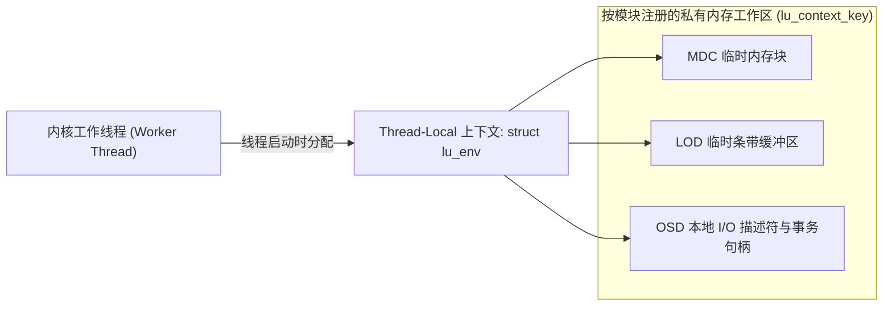

# 8.3 栈内存控制：struct lu_env 执行上下文

Linux 内核线程的调用栈空间通常仅为 8KB 或 16KB。在复合对象模型中，一个 VFS 调用可能沿着 `VFS -> LLITE -> LMV -> MDC -> PTLRPC -> MDT -> MDD -> LOD -> OSD` 进行深达十余层的递归调用。若每层在函数栈上分配几十至上百字节的局部结构体，极易触发内核栈溢出（Kernel Stack Overflow）。

Lustre 引入了 **`struct lu_env`（执行上下文）** 机制：

- **预分配工作区**：在线程创建或进入 Portal RPC 调度时，系统为线程分配一个与调用栈解耦的 `struct lu_env` 堆内存上下文；
- **按需索取**：各子模块通过注册的静态键值（`lu_context_key`），在需要临时变量或大结构体时直接从 `lu_env` 中获取指针，消除函数调用栈上的动态分配。

---

