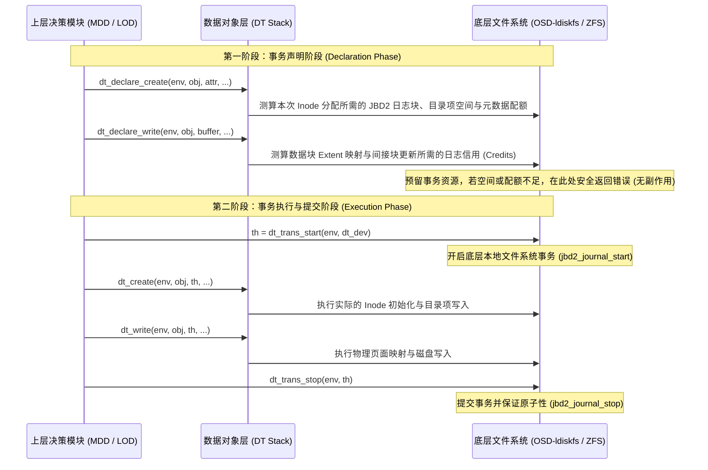

# 8.4 两阶段事务契约：dt_txn 机制

在数据对象栈（DT Stack）中，为了确保文件创建、条带修改与空间分配具备 ACID 事务原子性，Lustre 定义了严格的两阶段事务流程：

## 1. 声明阶段（Declaration Phase）
在实际修改任何物理磁盘数据之前，上层必须显式调用以 `dt_declare_*` 为前缀的接口。
- 底层 OSD 精确测算本次操作涉及的日志块数、元数据 Inode 以及配额变化。
- 若磁盘剩余空间不足、达到用户配额硬限制或日志空间无法满足，系统在此阶段直接返回 `-ENOSPC` 或 `-EDQUOT`。由于尚未修改物理介质，调用链可安全退出，无需复杂的数据回滚。

## 2. 执行与提交阶段（Execution Phase）
当所有前置声明全部校验通过后，调用 `dt_trans_start()` 启动底层文件系统的本地原子事务（如 ldiskfs 的 JBD2 日志事务或 ZFS 的 TXG）。
- 各分层传入已获取的事务句柄 `th`，执行实际的磁盘写入；
- 最终调用 `dt_trans_stop()` 闭合事务，确保多对象的修改要么全部落盘提交，要么在崩溃后由 WAL 日志完整回放，消除了元数据与条带分布不一致的问题。

---

