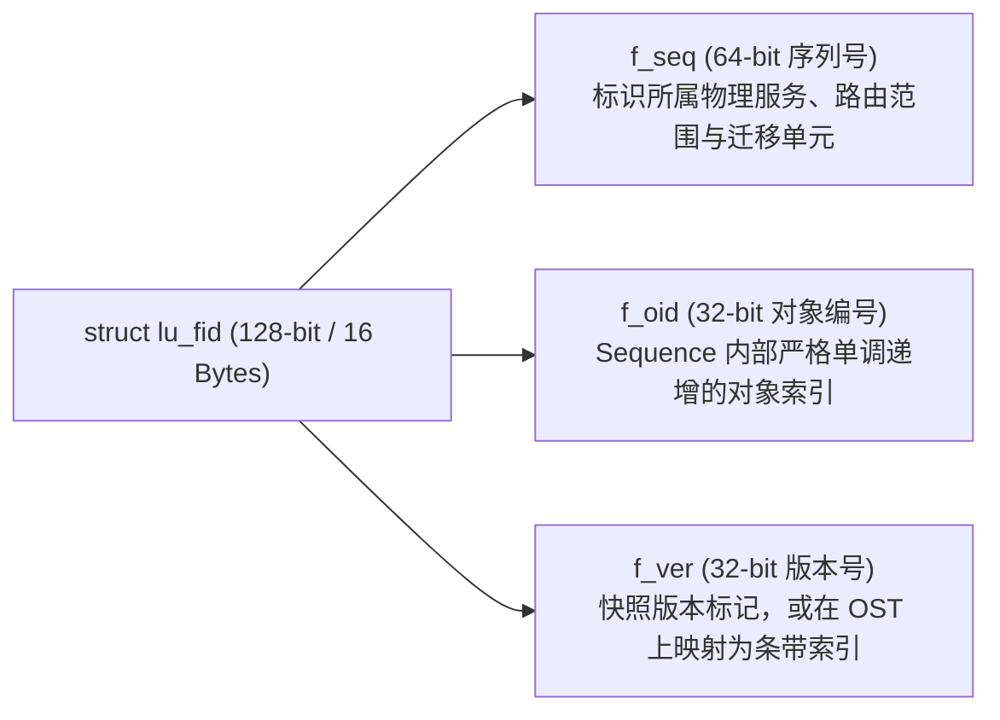
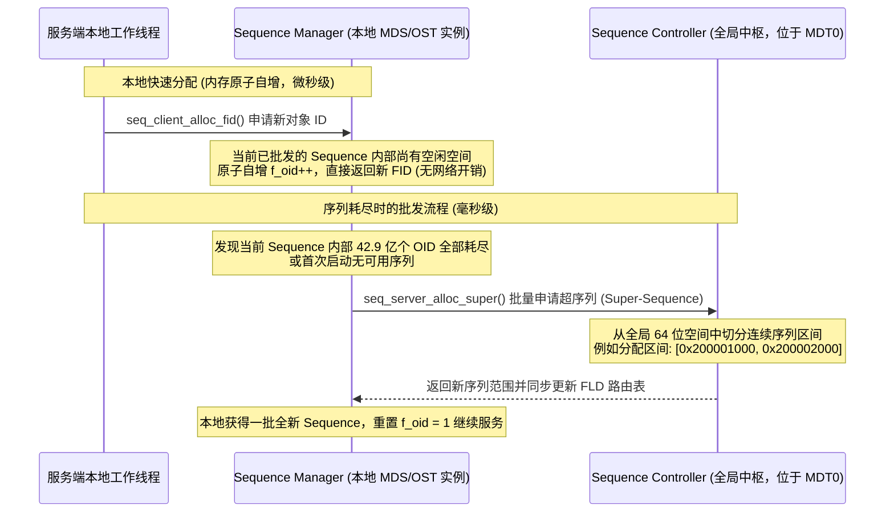
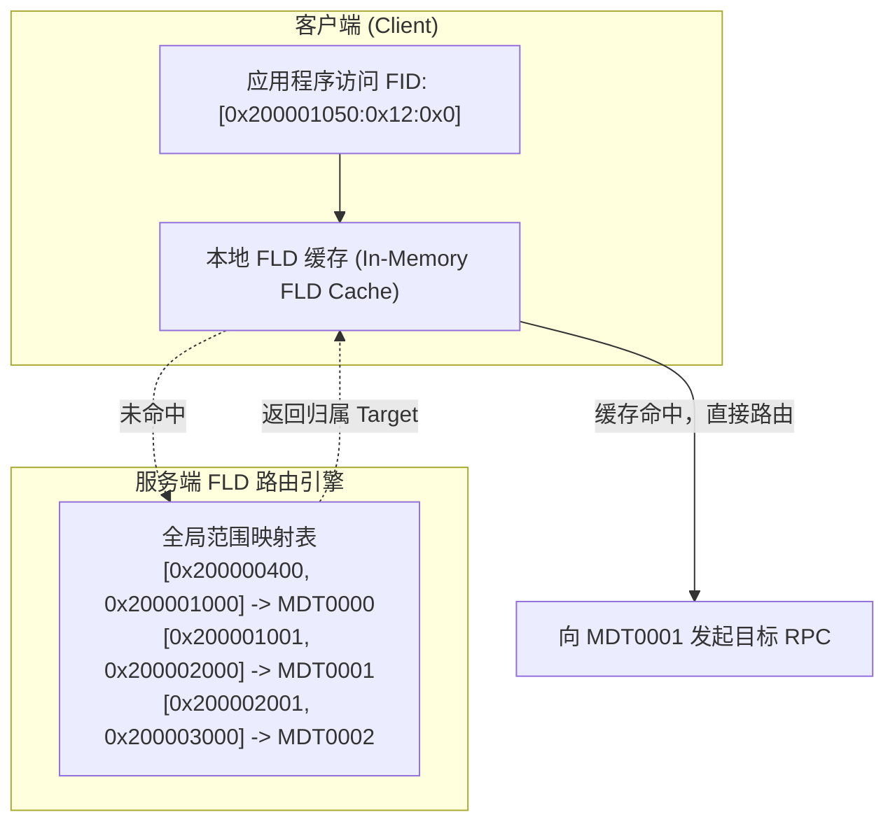

# 第 9 章：FID 体系与分布式命名空间路由

> **本章核心源码文件**：  
> - `include/uapi/linux/lustre/lustre_user.h`：128 位 FID 结构体（`struct lu_fid`）与基础操作宏  
> - `include/uapi/linux/lustre/lustre_idl.h`：保留序列号常量与范围划分宏定义  
> - `lustre/fid/fid_request.c`：分布式序列号分配器（Sequence Controller & Manager）实现  
> - `lustre/fld/fld_request.c`：FID 位置数据库（FLD, FID Location Database）实现  
> - `lustre/osd-ldiskfs/osd_index.c`：本地磁盘对象索引表（OI Table）映射机制  

---

## 9.1 分布式环境下的标识需求与 128 位 FID

在单机 Linux 系统中，操作系统依靠 32 位或 64 位的 inode 编号定位磁盘上的文件实体。但在跨越数十个元数据节点（MDS）、数百个对象存储节点（OSS）与上百亿文件的分布式集群中，单机 inode 抽象面临三项本质局限：
1. **全局编号碰撞**：不同 MDT 或 OST 本地文件系统独立分配 inode，极易产生相同的数字编号，导致客户端无法通过单一数值唯一区分文件。
2. **缺乏网络路由信息**：纯数字 inode 不包含该对象位于哪台物理节点的归属信息，客户端每次查找都必须从根目录依次递归解析路径，产生大量网络往返开销。
3. **条带化关联割裂**：单个文件的元数据位于 MDT，而其对应的数据切片分布在多个独立的 OST 上。单机 inode 无法在这些跨节点的数据分片与母体元数据之间建立确定性的对应关系。

为此，Lustre 构建了 **128 位全局文件标识符（FID, File Identifier）** 体系。



### `struct lu_fid` 内存结构

在 `include/uapi/linux/lustre/lustre_user.h` 中，FID 的定义如下：

```c
struct lu_fid {
    __u64   f_seq;      /* 64 位序列号 (Sequence)：标识物理归属与路由区间 */
    __u32   f_oid;      /* 32 位对象编号 (Object ID)：序列内部自增索引 */
    __u32   f_ver;      /* 32 位版本号 (Version)：用于快照或条带编号映射 */
} __attribute__((packed));
```

每个 FID 占用 16 字节物理内存，是贯穿客户端 VFS、Portal RPC 报文头、服务端对象栈及底层磁盘索引的全局唯一凭证。

---

## 9.2 保留序列空间划分（Reserved Sequence Universe）

为了区分不同用途的系统对象与用户数据，Lustre 将 64 位序列号（`f_seq`）划分为若干专用范围：

```text
 0x0                  0x200000000          0x200000400                 ~0ULL
  +------------------------+--------------------+-------------------------+
  |    传统与特殊保留序列  |   系统内部专用序列 |   用户常规文件与数据序列|
  |  (Legacy & Special)    |   (Internal)       |   (Normal Files / DNE)  |
  +------------------------+--------------------+-------------------------+
```

| 序列号范围 / 宏常量 | 取值范围 | 用途说明 |
| :--- | :--- | :--- |
| `FID_SEQ_OST_MDT0` | `0x0` | 兼容旧版 Lustre 1.x 的本地对象序列 |
| `FID_SEQ_LLOG` | `0x1` ~ `0x3` | 集群配置管理与更新日志（LLOG）对象 |
| `FID_SEQ_LOCAL_FILE` | `0x200000001` | 本地存储独占对象（如本地配额文件、OI 索引根等） |
| `FID_SEQ_DOT_LUSTRE` | `0x200000002` | 挂载点根目录下的隐藏控制入口 `.lustre` 虚拟节点 |
| `FID_SEQ_SPECIAL` | `0x200000003` | 特殊命名空间控制节点 |
| `FID_SEQ_NORMAL` | `0x200000400` ~ `~0ULL` | 常规用户文件、目录及 OST 数据条带的分配空间 |

---

## 9.3 序列分配中枢：Sequence Controller 与 Manager 批发机制

若每次创建文件或对象都需要向中心服务器发送一次 RPC 请求获取新 ID，中心节点将迅速成为全集群的性能瓶颈。

Lustre 采用 **分级批发（Batch-Allocation）机制**：



1. **全局中枢（Sequence Controller）**：运行在 MDT0 上，统管全集群 64 位全局序列号空间。
2. **本地管理者（Sequence Manager）**：每个 MDT 和 OST 上运行一个本地管理器。当本地序列用尽时，向 Controller 批发一个包含数千个 Sequence 的“超序列”（Super-Sequence）。
3. **本地纳秒级自增**：每个独立的 Sequence 内部支持 $2^{32} \approx 42.9$ 亿个对象（`f_oid` 由 1 递增至 `0xFFFFFFFF`）。在绝大多数创建请求中，线程仅需在本地内存中执行无锁原子操作递增 `f_oid`，避免了单文件创建时的跨节点网络往返。

---

## 9.4 基于 FID 与 Layout EA 的跨节点对象寻址

在分布式条带化架构中，客户端如何仅凭文件名或父目录定位到分布在多个不同 OST 上的数据分块？核心路径依赖于 **Layout 扩展属性（Layout Extended Attribute, trusted.lov）**：


*图 9-1: 基于 FID 检索 Layout EA 扩展属性并定位底层 OST 条带对象的寻址拓扑（来源：Understanding Lustre Internals）*

1. **元数据定位**：客户端向 MDT 发送查找请求，获得目标文件的母体 FID（例如位于 MDT 的 Inode 节点）。
2. **Layout EA 读取**：MDT Inode 的扩展属性区存储了 `trusted.lov`（即 Layout EA）。该数据结构记载了该文件的条带大小（`stripe_size`）、条带宽度（`stripe_count`）以及各个数据分片在各 OST 上的对应对象 FID。
3. **直接并行 I/O**：客户端解析该 Layout EA，得到一组用于 OST 寻址的派生 FID，进而直接与目标 OST 建立并发连接发起 RDMA I/O，完全绕开 MDT。

---

## 9.5 分布式命名空间路由：FLD（FID Location Database）

在多元数据服务器（DNE）架构下，集群并存着多个 MDT。当客户端仅持有某个文件的 FID 时，必须能够迅速确定该文件实际驻留在哪个具体的 MDT 上。

这一路由映射由 **FLD（FID Location Database，FID 位置数据库）** 承载。



- **范围聚合存储**：FLD 并不记录每个独立文件的映射关系，而是以 Sequence 区间为单位进行聚合记录（`[seq_start, seq_end] -> target_index`）。
- **客户端内存缓存**：客户端本地缓存已查询过的区间映射。当客户端后续访问属于同一 Sequence 的海量文件时，全部由本地缓存直接完成路由判定，消除了集中的路由查找瓶颈。

---

## 9.6 底层物理映射：对象索引表（OI Table）

当 RPC 请求最终到达目标存储节点（MDT 或 OST）后，底层本地文件系统（ldiskfs 或 ZFS）依然需要找到磁盘上的实际物理存储实体（如 ext4 inode 或 ZFS dnode）。

`osd-ldiskfs` 与 `osd-zfs` 通过 **OI 表（Object Index Table）** 建立从 128 位虚拟 FID 到物理 Inode 之间的映射：

```mermaid
flowchart LR
    FID["128 位虚拟标识<br/>FID: [0x200001050:0x4:0x0]"]
    
    subgraph OI_Indexing ["本地 OSD 对象索引层"]
        HASH["IAM (Index Access Method) / B-Tree 索引"]
    end
    
    subgraph Physical_Disk ["底层物理介质 (ldiskfs / ZFS)"]
        INODE["物理 Inode 编号: 145229<br/>磁盘数据块 Extent 映射"]
    end

    FID --> HASH
    HASH -->|O(1) 极速换算| INODE
```

1. **结构设计**：OI 表在底层表现为一个专用的扁平索引文件，内部采用 IAM（Index Access Method）散列树或 B-Tree 组织。
2. **多桶并行（Multi-OI）**：为防止单索引文件的读写锁争用，系统通常将 OI 表水平切分为多个并行的子桶（如默认 8 个 OI 桶文件：`oi.16/0` 至 `oi.16/7`），根据 FID 哈希分流降低并发访问锁冲突。
3. **快速解析**：服务端接收到针对特定 FID 的操作时，通过计算哈希值直接定位到 OI 表中的槽位，以 $O(1)$ 时间复杂度获取物理 Inode 号并载入内存，避免了在底层 Linux 文件系统中进行耗时的目录扫描。

---

## 9.7 生产实战：FID 检查与路径反查工具

在日常集群运维与故障排查中，管理员需要经常在用户层文件路径与底层 FID 之间进行转换。

### 常用命令工具

```bash
# 1. 查询特定用户文件对应的全局 FID 标识
lfs path2fid /mnt/lustre/test.dat
# 输出示例: [0x200000401:0x1b:0x0]

# 2. 根据已知 FID 反查文件系统路径 (依赖 Changelogs 或目录树遍历)
lfs fid2path /mnt/lustre [0x200000401:0x1b:0x0]

# 3. 查看底层 OST 对象索引与物理 Inode 状态 (在 MDS/OSS 本地执行)
debugfs -c -R "stat <145229>" /dev/mapper/mpatha
```

---

## 9.8 生产事故案例：OI 索引表局部损坏导致文件元数据访问报 `-ENOENT`

### 9.8.1 故障现象

某智算中心发生双机电源断电故障，存储集群在紧急重启后，用户程序在读取某批特定训练样本文件时频繁抛出 I/O 错误：
```text
No such file or directory (os error 2)
```
但通过 `ls -l` 查看该目录时，文件名和属性清晰可见，使用 `lfs path2fid` 也能正常解析出该文件的全局 FID（`[0x200000410:0x12a:0x0]`）。然而一旦尝试 `cat` 或 `open()` 读取该文件，系统即报错退出。

### 9.8.2 排查过程

1. **服务端日志检查**：  
   在对应的 MDT0000 上查看内核调试日志：
   ```text
   LustreError: testfs-MDT0000: cannot find object [0x200000410:0x12a:0x0] in OI table: rc = -2
   ```
   **排查发现**：元数据目录项中记录的 FID 是正确的，但当 MDT 尝试在本地底层磁盘的 OI 索引表中查找该 FID 对应的物理 Inode 时，OI 查找返回了 `-ENOENT`（未找到）。

2. **根因机理分析**：  
   在断电前夕，系统正在密集创建该批样本文件。MDT 上的内存事务分为两部分：上层目录树写入与底层 OI 索引树更新。由于断电发生在文件系统元数据刷盘的临界时间窗内，底层磁盘日志虽恢复了目录树项，但对应的 OI 索引项在物理块刷写中途损坏，导致该文件的 FID 与物理 Inode 映射关系断裂，形成了“目录可见但实体失联”的孤儿状态。

### 9.8.3 修复措施与成效

1. **运行在线/离线 OI 表修复工具（LFSCK）**：  
   利用 Lustre 内置的文件系统检查与修复工具（LFSCK, Lustre File System Consistency Checker）针对 OI 表执行在线扫描与重建：
   ```bash
   lctl lfsck_start -M testfs-MDT0000 -t oi
   ```
2. **监控修复进度**：  
   ```bash
   lctl get_param mdd.testfs-MDT0000.oi_scrub
   ```
   LFSCK 扫描了底层的物理 Inode 表，成功找回丢失映射的物理 Inode，并重新在 `oi.16/*` 表中填补了对应的 FID 条目。修复完成后，用户程序读取恢复正常，无数据丢失。

---

## 9.9 运维基线检查清单

- [ ] **定期监控序列号消耗水位**：通过 `lctl get_param seq.*.space` 监控当前序列分配器的剩余空间，确保集群在经历数年百亿级文件创建后无序列号枯竭风险。
- [ ] **定期巡检 LFSCK OI 表状态**：通过 `lctl get_param mdd.*.oi_scrub` 确认底层 OI Scrub 状态正常（`status: completed` 或 `init`），及时修复异常断电引发的局部索引缺失。
- [ ] **多 OI 桶配置核验**：在新格式化大容量 MDT 时，确认底层 OSD 启用了多 OI 桶配置（通常设为 8 或 16 桶），消除高并发文件创建下的单索引锁争用。

---

## 本章小结

128 位全局文件标识符（FID）是构建大规模分布式存储命名空间与路由的基石。通过将标识符拆解为 64 位序列号（Sequence）与 32 位对象编号（OID），系统在消除全局命名冲突的同时赋予了对象内在的物理归属信息；通过 Sequence Controller 与 Manager 的分级批发机制，实现了无锁化的本地快速分配；通过 Layout EA 建立了元数据与跨 OST 数据对象之间的确定性路由映射；通过 FLD 数据库提供了高效的分布式命名空间路由；并通过底层 OSD 的 OI 表实现了虚拟 FID 到物理磁盘 Inode 的高效映射。结合全套 LFSCK 自愈机制，保障了海量文件在复杂并发环境下的定位效率与数据一致性。
