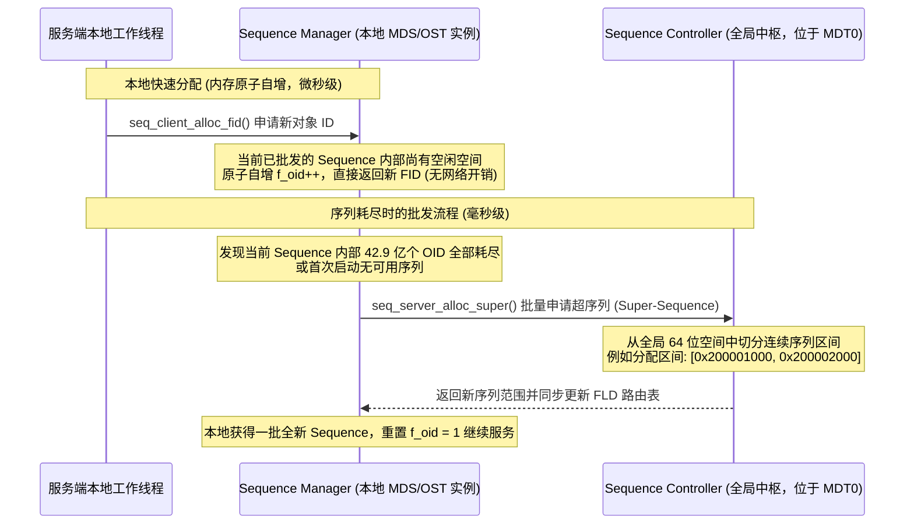

# 9.3 序列分配中枢：Sequence Controller 与 Manager 批发机制

若每次创建文件或对象都需要向中心服务器发送一次 RPC 请求获取新 ID，中心节点将迅速成为全集群的性能瓶颈。

Lustre 采用 **分级批发（Batch-Allocation）机制**：

1. **全局中枢（Sequence Controller）**：运行在 MDT0 上，统管全集群 64 位全局序列号空间。
2. **本地管理者（Sequence Manager）**：每个 MDT 和 OST 上运行一个本地管理器。当本地序列用尽时，向 Controller 批发一个包含数千个 Sequence 的“超序列”（Super-Sequence）。
3. **本地纳秒级自增**：每个独立的 Sequence 内部支持 $2^{32} \approx 42.9$ 亿个对象（`f_oid` 由 1 递增至 `0xFFFFFFFF`）。在绝大多数创建请求中，线程仅需在本地内存中执行无锁原子操作递增 `f_oid`，避免了单文件创建时的跨节点网络往返。

---

