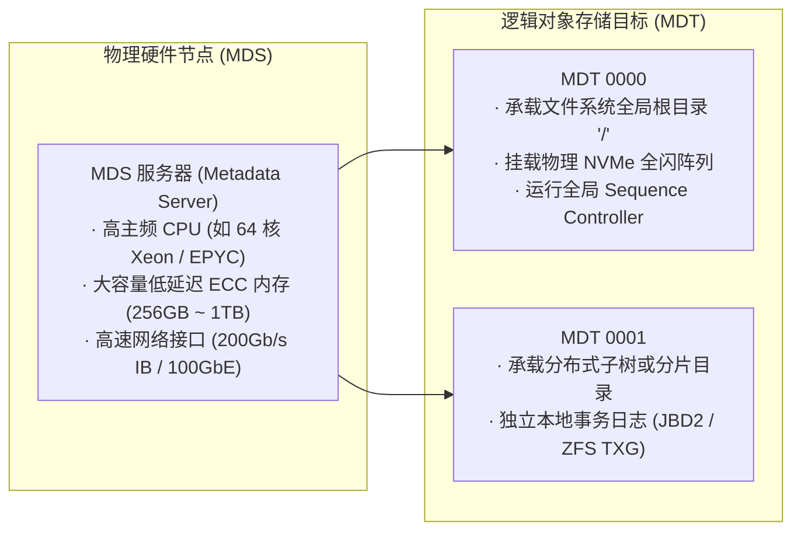
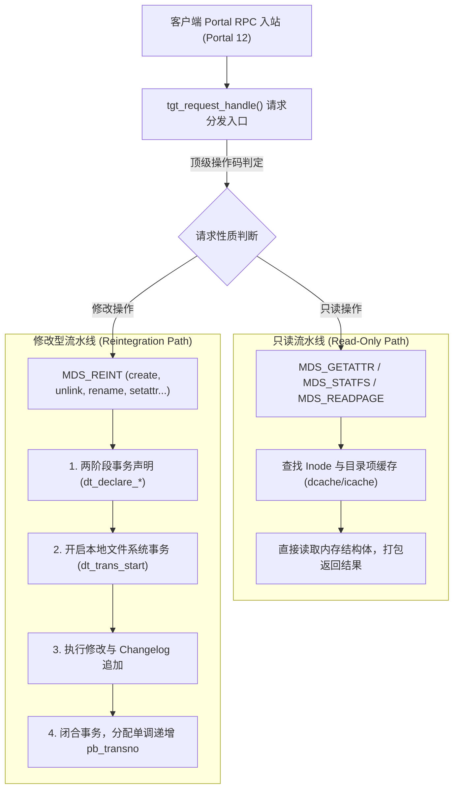
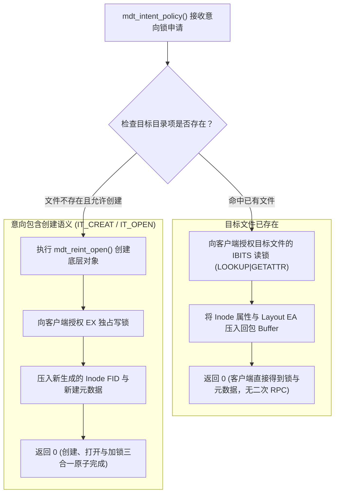
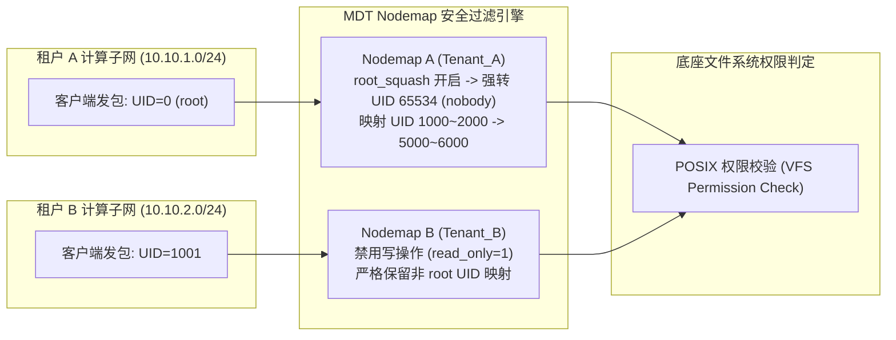

# 第 10 章：MDS 与 MDT 核心架构与元数据流水线

> **本章核心源码文件**：  
> - `lustre/mdt/mdt_handler.c`：MDT 请求分发中枢、只读与修改型操作派发实现  
> - `lustre/mdt/mdt_reint.c`：元数据变更（Reintegration）流水线与事务包装  
> - `lustre/mdt/mdt_identity.c`：Nodemap 多租户身份映射与权限压制实现  
> - `lustre/include/lustre_nodemap.h`：Nodemap 配置树与安全域结构声明  
> - `lustre/mdd/mdd_device.c`：MDD 元数据核心业务层驱动实现  

---

## 10.1 概念明晰：MDS 物理实体与 MDT 逻辑目标

在 Lustre 元数据子系统中，需明确区分 MDS 与 MDT 的物理与逻辑边界：


*图 10-1: 生产级 MDS 高可用参考设计：双控服务器节点、SAS/NVMe 共享 JBOD 阵列与双活 Target 部署架构（来源：Lustre Architecture v4）*



- **MDS（Metadata Server，元数据服务器）**：指运行元数据内核服务线程池的物理机或高可用虚机节点，负责提供算力、网络带宽与内存缓存。
- **MDT（Metadata Target，元数据目标）**：由 MDS 管理并导出的逻辑对象存储设备。每个 MDT 对应一个独立的底层块设备卷（采用 `ldiskfs` 或 `ZFS` 格式化）。在单一 Lustre 文件系统中，MDT0000 永远挂载全局根目录 `/`，其他 MDT 则承载通过 DNE 扩展的分布式子树或条带化目录分片。

---

## 10.2 元数据双轨流水线：只读与修改型操作

在 MDT 内部，入站请求按照其是否修改持久化元数据，被划分为两条性质不同的处理路径：



### 1. 只读流水线（Read-Only Pipeline）
包含 `MDS_GETATTR`、`MDS_STATFS`、`MDS_READPAGE` 等操作。请求到达后，线程直接在内存的目录项缓存（dcache）与 Inode 缓存（icache）中检索。若命中则就地打包回复，无需启动底层存储事务与 WAL 日志，单请求处理延迟通常处于微秒级。

### 2. 修改型流水线（Reintegration Pipeline）
所有涉及元数据状态变更的操作统一通过顶级操作码 `MDS_REINT` 提交，内部细分为多种子操作码（`enum mds_reint_op`）：

```c
enum mds_reint_op {
    REINT_SETATTR   = 1,    /* 修改文件权限、属主或时间戳 */
    REINT_CREATE    = 2,    /* 创建普通文件或命名管道 */
    REINT_LINK      = 3,    /* 创建硬链接 */
    REINT_UNLINK    = 4,    /* 删除文件或空目录 */
    REINT_RENAME    = 5,    /* 移动重命名文件或目录 */
    REINT_OPEN      = 6,    /* 打开并可能附带创建文件 */
    REINT_SETXATTR  = 7,    /* 设置文件扩展属性 */
    REINT_MIGRATE   = 8,    /* DNE 目录在线平滑迁移 */
};
```

修改型流水线严格执行两阶段事务：先调用 `dt_declare_*` 测算与预留日志块及 Inode 资源，再调用 `dt_trans_start()` 开启原子事务执行磁盘更新，并分配全局单调递增的事务序列号 `pb_transno`，保证状态变更具备持久化重放能力。

---

## 10.3 意向调度中枢：`mdt_intent_policy()`

意向锁机制的服务端核心仲裁实现位于 `lustre/mdt/mdt_handler.c` 的 `mdt_intent_policy()` 函数中：



通过这一单 RTT 复合裁决逻辑，客户端原本分离的“查找 $\rightarrow$ 属性拉取 $\rightarrow$ 锁申请 $\rightarrow$ 打开创建”四次网络请求被压缩至单个 RPC 轮次内，极大降低了万卡集群中海量小文件的遍历延迟。

---

## 10.4 Nodemap 多租户安全隔离与权限压制

在智算与云原生多租户场景下，不同租户的计算节点直接通过网卡挂载统一存储。如果不对计算节点的 UID/GID 加以限制，恶意租户可通过伪造本地 `root` 权限篡改其他租户的训练数据集。

`Nodemap`（`lustre/mdt/mdt_identity.c`）在 MDT 入口处提供了基于来源 NID 的多租户身份映射与安全隔离框架。



### 10.4.1 核心配置命令与实战

根据官方手册第二十八章，Nodemap 完全支持通过 `lctl` 进行动态管理，无需重启服务：

```bash
# 1. 创建命名 Nodemap 租户域
lctl nodemap_add tenant_ai

# 2. 将特定 IP/NID 网络段绑定到该租户域
lctl nodemap_add_range --name tenant_ai --range 10.10.1.[1-128]@o2ib0

# 3. 启用 Root Squash (将客户端 root 强转为 nobody)
lctl nodemap_modify --name tenant_ai --property root_squash --value 1
lctl nodemap_modify --name tenant_ai --property squash_uid --value 65534

# 4. 配置用户 ID 空间映射 (客户端 UID 1000 映射为存储端 UID 20000)
lctl nodemap_add_idmap --name tenant_ai --idtype uid --idmap 1000:20000

# 5. 激活全局 Nodemap 检查
lctl nodemap_activate 1
```

### 10.4.2 共享密钥加密与认证（Shared Secret Key, SSK）
官方手册第二十九章引入了基于 GSS/SSK 的线路鉴权机制。在不受信任的计算网段中，客户端在通过 RPC 与 MDS 通信时，必须携带通过 MGS 共享密钥协商的加密安全上下文。MDT 在 `mdt_handle_common()` 入口处校验上下文签名，阻断未授权节点的假冒访问。

---

## 10.5 生产实战：MDT 性能指标度量与监控

通过 procfs/sysfs 可实时查看 MDT 内部流水线的运行健康状况：

```bash
# 1. 监控元数据各类操作的 QPS 频次与耗时统计
lctl get_param mdt.*.md_stats
# 典型输出项包含:
# open, close, getattr, setattr, create, unlink, mkdir, rmdir, rename, getxattr

# 2. 检查当前已分配且持有的 Inode 缓存总量
lctl get_param ldlm.namespaces.filter-*.lru_size

# 3. 查看当前排队的修改型事务数量 (Reint In-Flight)
lctl get_param mdt.*.reint_sync
```

---

## 10.6 生产事故案例：父目录意图写锁冲突引发千节点并发 `create` 瘫痪

### 10.6.1 故障现象

某超算集群在运行一个由 2000 个 MPI 进程并发组成的作业时，所有节点同时向单一共享输出目录 `/mnt/lustre/job_output/` 下写入各自的临时输出文件（如 `rank_0001.out`、`rank_0002.out` 等）。

任务启动后 30 秒内，所有计算节点卡死，客户端日志大量打印 `LustreError: PTLRPC timeout`。MDT 服务器 CPU 单核利用率达到 100%，而整机多核平均利用率不足 3%。

### 10.6.2 排查过程

1. **服务端调用栈分析**：  
   在 MDS 上使用 `perf top` 查看热点函数，发现 `ldlm_lock_create()` 与 `ldlm_resource_get()` 消耗了绝大部分 CPU 周期，且存在严重的自旋锁争用（`ldlm_res_lock`）。
2. **锁持有链分析**：  
   执行 `lctl get_param ldlm.namespaces.MDT0000.lock_dump` 抓取当前活跃锁状态，发现：
   所有 2000 个客户端并发在申请父目录 `/mnt/lustre/job_output/` 的 `IBITS EX` 锁（为了在父目录中执行 `create` 插入新目录项）。
3. **根因机理分析**：  
   在单个普通目录下并发创建文件时，文件系统的 POSIX 目录项语义要求必须对父目录加写锁以保证目录项散列索引的线性一致性。单目录并发写锁无法像文件数据切片一样跨多核心并行处理，导致 2000 个节点在同一个 LDLM 资源上发生极度严重的**排队碰撞与锁震荡（Lock Thrashing）**，MDT 线程在不停地给不同客户端发送撤销回调（Blocking AST），系统吞吐归零。

### 10.6.3 修复措施与成效

1. **启用 DNE2/3 目录条带化分片（Striped Directory）**：  
   对于需要支持万级并发创建的大型输出目录，将其配置为横跨多个 MDT 的条带化目录：
   ```bash
   # 将共享输出目录条带化到集群中全部 4 个 MDT 上，条带哈希算法采用 fnv_1a_64
   lfs mkdir -c 4 -H fnv_1a_64 /mnt/lustre/job_output/
   ```
2. **应用层最佳实践规避**：  
   对业务训练或计算脚本进行目录散列优化，禁止数千个进程直冲单一目录，采用二级子目录散列（如 `job_output/rank_00/rank_0001.out`）。

实施目录分片与散列后，父目录的锁竞争分散至不同 MDT 与不同的子 Inode 锁上，2000 进程并发创建时间从挂死超时降至 1.8 秒完成。

---

## 10.7 运维基线检查清单

- [ ] **MDT 硬件内存冗余保证**：确认 MDS 物理内存容量满足经验公式：每 100 万个文件至少预留 1.5GB ~ 2GB 内存（用于 Inode 缓存、Dentry 缓存及 LDLM 锁资源占用）。
- [ ] **多租户集群强制激活 Nodemap**：面向容器云或外部租户开放的存储网段，必须为各子网创建对应的 Nodemap 域并开启 `root_squash`。
- [ ] **禁止巨型扁平单目录**：巡检文件系统，限制单个未条带化目录下包含的文件数不得超过 10 万个。对于超过 10 万文件的目录，使用 `lfs setdirstripe` 执行分片。
- [ ] **配置合理的 MDT 线程池**：结合物理 CPU 核心数，将 `mdt.*.threads_max` 配置在 128~256，防止并发突发请求耗尽线程池。

---

## 本章小结

MDT 是 Lustre 分布式文件系统的元数据控制核心。通过物理 MDS 与逻辑 MDT 的解耦，系统奠定了横向扩展基础；通过只读与修改型双轨流水线，兼顾了高频访问的零拷贝微秒级响应与持久化状态变更的事务一致性；通过 `mdt_intent_policy()` 意向仲裁中枢，大幅精简了网络往返轮次；通过 Nodemap 框架与 SSK 提供了完备的多租户隔离与安全认证机制。深入理解 MDT 的内部流水线与锁竞争边界，是保障大规模 AI 与 HPC 任务稳定吞吐的关键。
