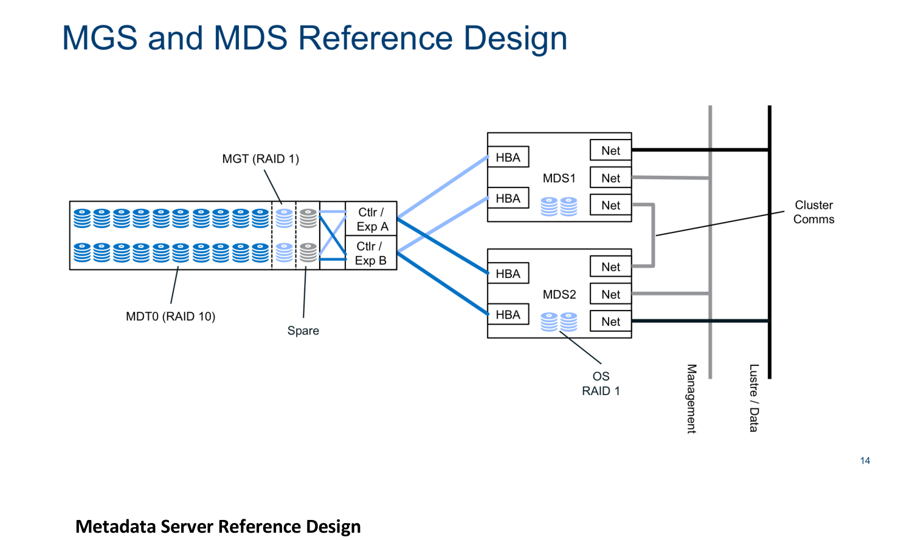
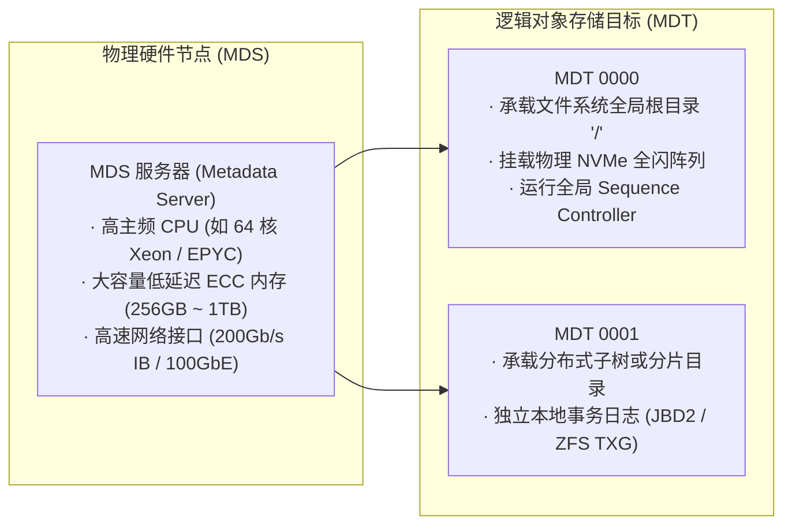

# 10.1 概念明晰：MDS 物理实体与 MDT 逻辑目标

在 Lustre 元数据子系统中，需明确区分 MDS 与 MDT 的物理与逻辑边界：

*图 10-1: 生产级 MDS 高可用参考设计：双控服务器节点、SAS/NVMe 共享 JBOD 阵列与双活 Target 部署架构（来源：Lustre Architecture v4）*

- **MDS（Metadata Server，元数据服务器）**：指运行元数据内核服务线程池的物理机或高可用虚机节点，负责提供算力、网络带宽与内存缓存。
- **MDT（Metadata Target，元数据目标）**：由 MDS 管理并导出的逻辑对象存储设备。每个 MDT 对应一个独立的底层块设备卷（采用 `ldiskfs` 或 `ZFS` 格式化）。在单一 Lustre 文件系统中，MDT0000 永远挂载全局根目录 `/`，其他 MDT 则承载通过 DNE 扩展的分布式子树或条带化目录分片。

---

