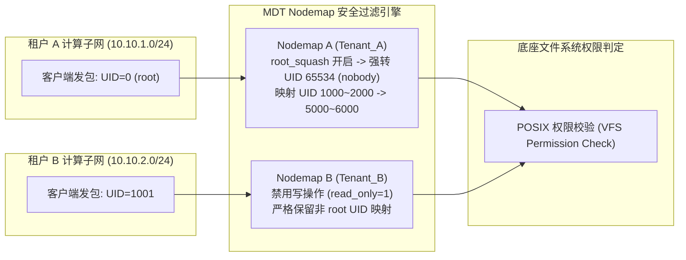

# 10.4 Nodemap 多租户安全隔离与权限压制

在智算与云原生多租户场景下，不同租户的计算节点直接通过网卡挂载统一存储。如果不对计算节点的 UID/GID 加以限制，恶意租户可通过伪造本地 `root` 权限篡改其他租户的训练数据集。

`Nodemap`（`lustre/mdt/mdt_identity.c`）在 MDT 入口处提供了基于来源 NID 的多租户身份映射与安全隔离框架。



## 10.4.1 核心配置命令与实战

根据官方手册第二十八章，Nodemap 完全支持通过 `lctl` 进行动态管理，无需重启服务：

```bash
# 1. 创建命名 Nodemap 租户域
lctl nodemap_add tenant_ai

# 2. 将特定 IP/NID 网络段绑定到该租户域
lctl nodemap_add_range --name tenant_ai --range 10.10.1.[1-128]@o2ib0

# 3. 启用 Root Squash (将客户端 root 强转为 nobody)
lctl nodemap_modify --name tenant_ai --property root_squash --value 1
lctl nodemap_modify --name tenant_ai --property squash_uid --value 65534

# 4. 配置用户 ID 空间映射 (客户端 UID 1000 映射为存储端 UID 20000)
lctl nodemap_add_idmap --name tenant_ai --idtype uid --idmap 1000:20000

# 5. 激活全局 Nodemap 检查
lctl nodemap_activate 1
```

## 10.4.2 共享密钥加密与认证（Shared Secret Key, SSK）
官方手册第二十九章引入了基于 GSS/SSK 的线路鉴权机制。在不受信任的计算网段中，客户端在通过 RPC 与 MDS 通信时，必须携带通过 MGS 共享密钥协商的加密安全上下文。MDT 在 `mdt_handle_common()` 入口处校验上下文签名，阻断未授权节点的假冒访问。

---

