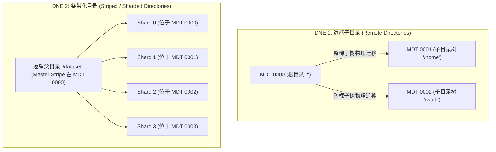
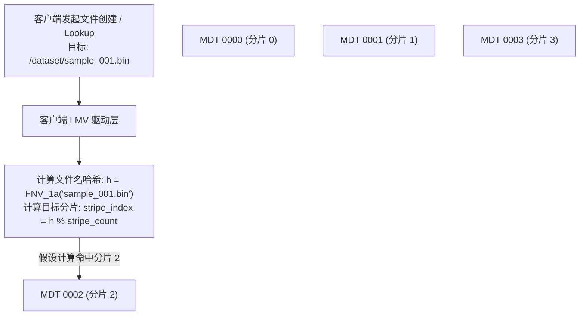
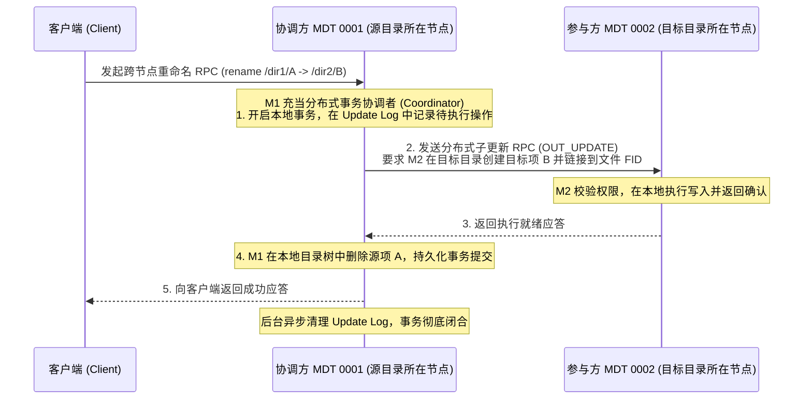
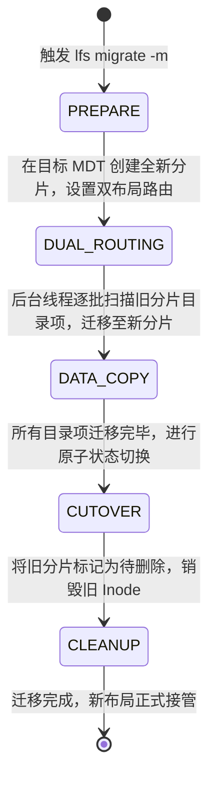

# 第 11 章：DNE 多元数据水平扩展与分布式命名空间

> **本章核心源码文件**：  
> - `lustre/lmv/lmv_obd.c`：客户端逻辑元数据卷（LMV）驱动与哈希路由实现  
> - `lustre/include/lustre_lmv.h`：LMV 条带化描述符与目录分片布局定义  
> - `lustre/mdt/mdt_coordinator.c`：跨 MDT 分布式操作协调器（Coordinator）实现  
> - `lustre/mdd/mdd_dir.c`：条带化目录（Striped Directory）分片创建与迭代遍历  
> - `lustre/lod/lod_sub_object.c`：底层跨目标对象更新日志（Update Log）管理  

---

## 11.1 单 MDT 的扩展性物理极限与 DNE 演进

在大规模集群建设中，数据存储容量通常可以通过增加 OST 节点实现线性扩展。然而，元数据命名空间由强因果关系的树状拓扑构成，单台 MDT 在面对超百亿文件与百万级并发操作时会面临物理瓶颈：
1. **内存缓存瓶颈**：每个打开的文件与缓存的目录项在内存中均占用固定大小的内核对象。当文件规模突破数十亿时，单机物理内存难以完全承载热点元数据，引发频繁的缓存换入换出与磁盘 I/O。
2. **底层索引深度与锁争用**：单机文件系统（如 ldiskfs 的 Htree）在单目录下文件数量达到千万级时，树深度与索引节点急剧增加，目录项修改时的锁竞争导致处理延迟显著增加。
3. **CPU 自旋锁饱和**：多核处理器在高频访问相同父目录时，Linux VFS 的目录锁与 Inode 互斥量会消耗大量 CPU 时间在自旋等待上。

为此，Lustre 推出了 **DNE（Distributed Namespace Engine，分布式命名空间引擎）** 架构。


*图 11-1: Lustre 官方路线图中的 DNE3 分布式多元数据与远程/条带化目录演进（来源：Lustre Roadmap 2019）*



### DNE 演进阶段

1. **DNE 1（远端子目录）**：支持将不同的目录子树独立存放在指定的 MDT 上（例如 `/home` 物理位于 MDT0001，`/data` 物理位于 MDT0002）。其局限在于：如果单一目录下包含数千万个文件，该单目录依然只能落在单个 MDT 上。
2. **DNE 2（条带化目录）**：支持将单个巨型目录本身切分为多个分片（Shards），目录下的子文件根据文件名哈希值打散分布在不同的 MDT 上，实现了单目录并发性能随 MDT 数量线性扩展。
3. **DNE 3（动态拆分与在线迁移）**：支持根据目录内文件数量自动触发分片拆分（Auto-split），并支持在文件系统不停机状态下将现有目录在线平滑迁移至其他 MDT（`lfs migrate -m`）。

---

## 11.2 目录条带化核心算法与 LMV 哈希机制

在条带化目录中，目录在逻辑上被划分为 **主分片（Master Stripe）** 与多个 **从分片（Slave Stripes）**：
- **主分片**：存放该目录的主 Inode，记录目录权限、属主以及扩展属性中的 LMV 条带布局（LMV EA）。
- **从分片**：分布在指定的一组 MDT 上，底层对应各 MDT 上的实际子目录，用于分散存储真实的文件目录项（dentry）。



### 11.2.1 哈希算法：客户端免中心寻址

客户端的 `lmv` 模块在解析目录条带布局后，利用哈希算法在本地直接计算文件所属的目标分片：

1. **哈希计算**：采用经过优化的 FNV-1a 或 CRUSH 算法，对文件名字符串进行哈希运算生成 32 位整型散列值。
2. **分片定位**：
   $$\text{StripeIndex} = \text{Hash}(\text{filename}) \pmod{\text{StripeCount}}$$
3. **直接通信**：根据 `StripeIndex` 查询 LMV 布局中的对应 MDT 编号，直接向目标 MDT 发起元数据 RPC。整个寻址过程在客户端本地内存完成，不经过 Master MDT 中转，消除了中心节点的通信开销。

---

## 11.3 跨 MDT 分布式操作与更新日志（Update Log）

在多元数据环境下，某些 POSIX 操作涉及跨不同 MDT 的状态协同（例如：将文件从 MDT0001 的目录移动到 MDT0002 的目录下，即跨节点 `rename`）。这类操作若发生中途断电或网络超时，极易产生单边孤儿文件或目录树撕裂。

Lustre 实现了基于 **更新日志（Update Log / OUT 机制）** 的分布式两阶段提交协议：



- **协调者机制**：接收请求的 MDT 充当事务协调者（Coordinator），在本地持久化记录分布式操作的预备日志（Update Log）。
- **幂等子事务**：协调者通过专用的内部 RPC 向远程参与方下发子更新命令。
- **故障重放恢复**：若协调者或参与方在执行过程中发生崩溃，重启后的恢复流程会扫描未提交的 Update Log，向参与方重新推进或回滚操作，保证跨 MDT 操作的原子性。

---

## 11.4 目录在线平滑迁移（Directory Migration）

当集群扩容新增了 MDT，或者某一特定目录因数据量暴增导致原有 MDT 空间告急时，管理员可以使用 `lfs migrate -m` 命令将目录在线迁移至其他 MDT，业务读写全程不中断。



1. **预备与双布局路由（Dual Routing）**：在目标 MDT 上分配新的目录分片，并在主 Inode 上挂载过渡态布局标记。在此阶段，客户端发起的新文件创建直接路由至新分片，旧文件的读取仍可回溯至旧分片。
2. **后台迭代数据搬迁**：内核工作线程以批次为单位，遍历旧目录下的目录项，通过内部事务将其安全移动至新分片中。
3. **原子切换（Cutover）**：当旧分片全部排空后，系统原子更新主分片的 LMV EA 布局，彻底解除对旧分片的引用并释放底层空间。

---

## 11.5 生产实战：参数调优与监控指标

### 11.5.1 目录条带化常用操作命令

```bash
# 1. 创建一个跨 4 个 MDT 条带化的目录 (采用默认哈希)
lfs mkdir -c 4 /mnt/lustre/striped_dir

# 2. 指定从特定 MDT 开始轮询条带化
lfs mkdir -i 1 -c 3 /mnt/lustre/striped_dir2

# 3. 查看目录当前的条带布局信息
lfs getdirstripe -d /mnt/lustre/striped_dir

# 4. 在线将现有目录迁移到 MDT0002 和 MDT0003
lfs migrate -m 2,3 /mnt/lustre/old_dir
```

### 11.5.2 常用状态监控与指标查看

| 监控目的 | 执行命令 | 输出关注重点 |
| :--- | :--- | :--- |
| **监控各 MDT 的负载均衡度** | `lctl get_param mdt.*.filesfree` | 观察各 MDT 剩余 Inode 数量，避免局部 MDT 空间耗尽。 |
| **查看 Update Log 事务队列** | `lctl get_param osp.*.update_log` | 检查是否有长期未提交的跨 MDT 分布式日志堆积。 |
| **监控目录迁移进度** | `lctl get_param mdd.*.migrate_status` | 监控后台在线迁移的数据搬迁速率与剩余条目。 |

---

## 11.6 生产事故案例：跨 MDT Update Log 堆积引发分布式重命名挂起与 MDS 内存溢出

### 11.6.1 故障现象

某国家级气象预报计算集群配置了 4 台全闪 MDS 节点。在运行海量预报格点文件生成作业时，计算脚本频繁在属于不同 MDT 的目录之间执行 `mv`（跨 MDT rename）操作。

运行约 4 小时后，所有涉及跨目录重命名的应用进程全部陷入 D 状态（不可中断睡眠），MDT0000 节点的可用内存持续下降直至触发 OOM（Out-Of-Memory），控制台连续打印如下告警：
```text
LustreError: 8765:0:(lod_sub_object.c:842:lod_sub_declare_create()) OSP testfs-MDT0002-osp-MDT0000: out of update log slots!
Lustre: testfs-MDT0000: transaction stalled waiting for update log commit
```

### 11.6.2 排查过程

1. **日志队列检查**：  
   在协调者 MDT0000 上检查与各参与方之间的 OSP（Object Storage Proxy）连接状态：
   ```bash
   lctl get_param osp.*.update_seq
   ```
   **排查发现**：MDT0000 发往 MDT0002 的 Update Log 堆积了超过 100,000 条未确认记录，事务槽位（Slots）彻底耗尽。

2. **根本原因定性**：  
   - 检查参与方 MDT0002 的网络状态，发现该节点与 MDT0000 之间的 LNet 链路由于网卡驱动中断亲和性配置不当，在处理极端高并发内部 RPC 时发生了丢包；
   - 协调者 MDT0000 发出的 `OUT_UPDATE` 子请求未能在超时时限内收到应答；
   - 协调者在等待远端确认期间，将后续所有的跨 MDT 重命名请求全部暂存在内核内存队列中，导致内存被未完结的上下文结构体挤占，最终触发 OOM 宕机。

### 11.6.3 修复措施与成效

1. **临时应急处置**：  
   重启故障通信链路，并在协调方上提高分布式更新的并发处理配额与超时重传限制：
   ```bash
   lctl set_param osp.*.max_rpcs_in_flight=64
   ```
2. **优化作业目录布局策略**：  
   推动气象作业团队优化数据落盘路径，确保高频重命名的源目录与目标目录归属于同一条带化父目录或同一 MDT，消除无谓的跨节点强一致事务交互。

调整后，Update Log 积压在 10 秒内被完全清空，跨目录操作延迟恢复至正常微秒级别。

---

## 11.7 运维基线检查清单

- [ ] **合理规划目录条带数（Stripe Count）**：普通目录无需开启条带化（默认保持单分片）；仅对预计存放超过 100 万个文件的大型共享目录配置条带化（通常设为 4 或 8 分片），避免盲目过度条带化造成元数据碎片。
- [ ] **MDT 间网络互联保障**：DNE 架构下各 MDS 节点之间的内部互联带宽必须与外部客户端带宽保持同等规格（如专网 200Gb/s IB 直连），防止节点间通信拥塞。
- [ ] **定期监控 Update Log 队列水位**：将 `osp.*.update_log` 的在途深度纳入监控指标，一旦出现持续增长，立即预警排查网络抖动或远端节点负载。

---

## 本章小结

DNE 架构通过多元数据服务器横向扩展，打破了传统单 MDS 的性能与容量天花板。通过 DNE1 远端子目录与 DNE2 条带化目录技术，系统能够将单目录下的海量文件打散至多个物理分片上并行处理；客户端 LMV 驱动通过 FNV-1a / CRUSH 哈希算法实现了零网络开销的本地直接寻址；通过基于 Update Log 的分布式更新协议保障了跨节点复杂操作的事务原子性；配合在线平滑迁移机制，为海量文件的动态再平衡提供了弹性支撑。
