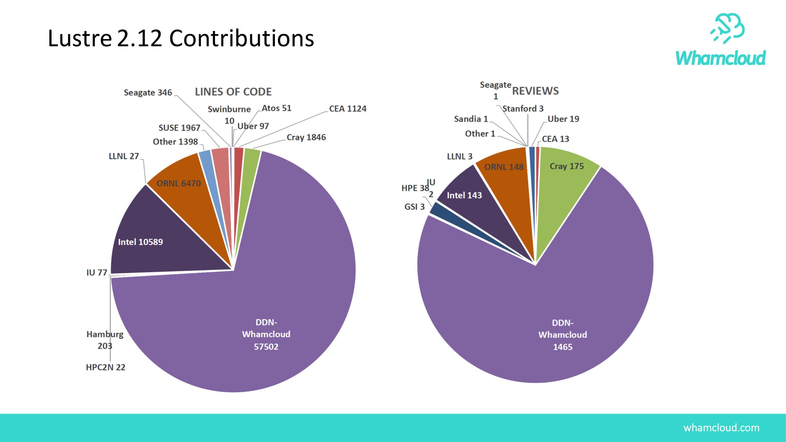
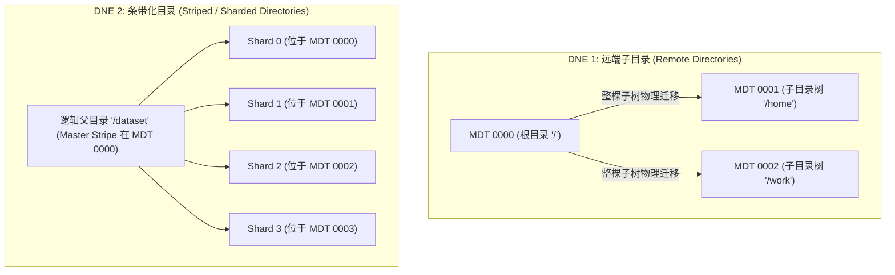

# 11.1 单 MDT 的扩展性物理极限与 DNE 演进

在大规模集群建设中，数据存储容量通常可以通过增加 OST 节点实现线性扩展。然而，元数据命名空间由强因果关系的树状拓扑构成，单台 MDT 在面对超百亿文件与百万级并发操作时会面临物理瓶颈：
1. **内存缓存瓶颈**：每个打开的文件与缓存的目录项在内存中均占用固定大小的内核对象。当文件规模突破数十亿时，单机物理内存难以完全承载热点元数据，引发频繁的缓存换入换出与磁盘 I/O。
2. **底层索引深度与锁争用**：单机文件系统（如 ldiskfs 的 Htree）在单目录下文件数量达到千万级时，树深度与索引节点急剧增加，目录项修改时的锁竞争导致处理延迟显著增加。
3. **CPU 自旋锁饱和**：多核处理器在高频访问相同父目录时，Linux VFS 的目录锁与 Inode 互斥量会消耗大量 CPU 时间在自旋等待上。

为此，Lustre 推出了 **DNE（Distributed Namespace Engine，分布式命名空间引擎）** 架构。

*图 11-1: Lustre 官方路线图中的 DNE3 分布式多元数据与远程/条带化目录演进（来源：Lustre Roadmap 2019）*

## DNE 演进阶段

1. **DNE 1（远端子目录）**：支持将不同的目录子树独立存放在指定的 MDT 上（例如 `/home` 物理位于 MDT0001，`/data` 物理位于 MDT0002）。其局限在于：如果单一目录下包含数千万个文件，该单目录依然只能落在单个 MDT 上。
2. **DNE 2（条带化目录）**：支持将单个巨型目录本身切分为多个分片（Shards），目录下的子文件根据文件名哈希值打散分布在不同的 MDT 上，实现了单目录并发性能随 MDT 数量线性扩展。
3. **DNE 3（动态拆分与在线迁移）**：支持根据目录内文件数量自动触发分片拆分（Auto-split），并支持在文件系统不停机状态下将现有目录在线平滑迁移至其他 MDT（`lfs migrate -m`）。

---

