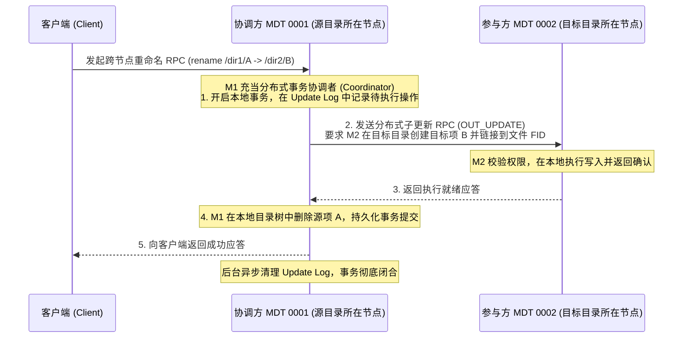

# 11.3 跨 MDT 分布式操作与更新日志（Update Log）

在多元数据环境下，某些 POSIX 操作涉及跨不同 MDT 的状态协同（例如：将文件从 MDT0001 的目录移动到 MDT0002 的目录下，即跨节点 `rename`）。这类操作若发生中途断电或网络超时，极易产生单边孤儿文件或目录树撕裂。

Lustre 实现了基于 **更新日志（Update Log / OUT 机制）** 的分布式两阶段提交协议：

- **协调者机制**：接收请求的 MDT 充当事务协调者（Coordinator），在本地持久化记录分布式操作的预备日志（Update Log）。
- **幂等子事务**：协调者通过专用的内部 RPC 向远程参与方下发子更新命令。
- **故障重放恢复**：若协调者或参与方在执行过程中发生崩溃，重启后的恢复流程会扫描未提交的 Update Log，向参与方重新推进或回滚操作，保证跨 MDT 操作的原子性。

---

