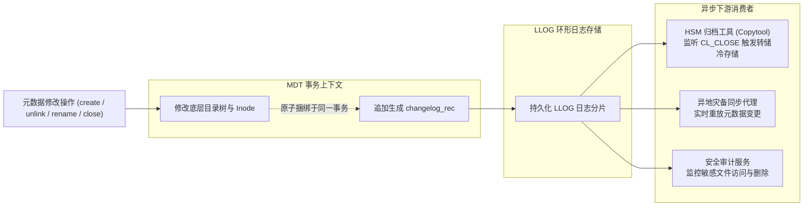
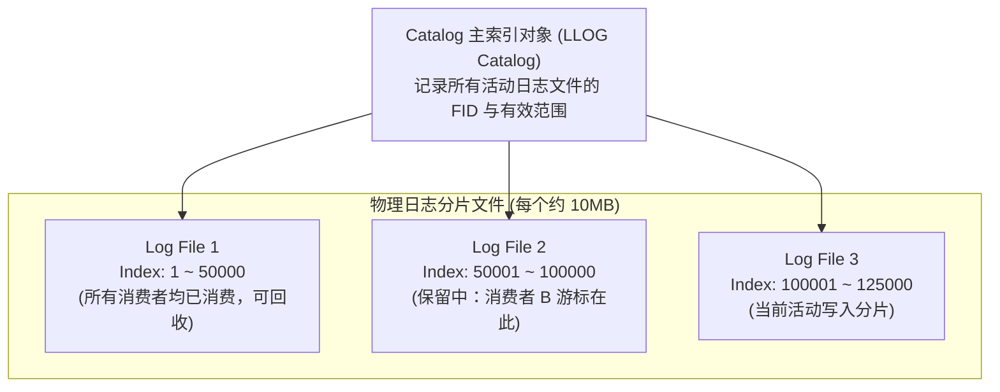
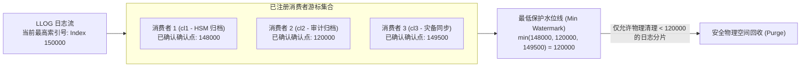

# 第 12 章：元数据变更日志（Changelogs）与数据保护

> **本章核心源码文件**：  
> - `include/uapi/linux/lustre/lustre_user.h`：`struct changelog_rec` 二进制报文、标志位与事件类型枚举定义  
> - `lustre/mdd/mdd_dir.c`：元数据变更事件捕获与 Changelog 记录生成  
> - `lustre/obdclass/llog.c`：底层追加型日志引擎（LLOG, Lustre Log）实现  
> - `lustre/obdclass/llog_cat.c`：LLOG 目录索引（Catalog）与分片生命周期管理  
> - `lustre/utils/lfs.c`：用户态 `lfs changelog` 消费、监听与清理命令实现  

---

## 12.1 变更捕获机制：从定时扫描到事件驱动

在容纳数亿至百亿级文件的分布式存储集群中，数据备份、分层归档（HSM）与灾备同步若依赖传统的文件系统全盘扫描（如定时执行 `find` 或 `readdir`），会面临严峻的性能挑战：

| 评估维度 | 传统全盘遍历扫描 (Namespace Crawling) | Lustre Changelogs 事件驱动 (CDC 机制) |
| :--- | :--- | :--- |
| **元数据 I/O 影响** | 触发数十亿次磁盘读取，占用大量 dcache/icache 内存，影响正常业务 | 零额外扫描 I/O：在元数据修改落盘的同一事务中顺手追加一条日志 |
| **事件感知延迟** | 取决于扫描周期（通常为数小时甚至数天） | 毫秒级：元数据操作落盘完成瞬间即可被消费者实时读取 |
| **变更捕获精度** | 易遗漏在两次扫描间被创建后迅速删除的“短命”临时文件 | 绝对记录：完整保留文件生命周期的每一次关键状态演进 |
| **审计信息完整度** | 仅能获知操作发生后的最终静态属性 | 记录上下文：附带发起修改的用户 UID、GID 以及超算 Job ID |



Lustre 内置的 **Changelogs** 机制采用变更数据捕获（CDC, Change Data Capture）模型，为下游应用提供高吞吐、按序递增的实时元数据事件流。

---

## 12.2 二进制数据结构：`struct changelog_rec`

产生于 MDT 内部的元数据事件，被序列化为连续紧凑的二进制记录：

```c
struct changelog_rec {
    __u16                   cr_namelen;         /* 记录末尾紧跟的文件名或路径字符串长度 */
    __u16                   cr_flags;           /* 扩展标记位 (如包含 JobID 或扩展属性) */
    __u32                   cr_type;            /* 事件类型：CL_CREATE, CL_UNLINK, CL_CLOSE... */
    __u64                   cr_index;           /* 全局单调递增的 64 位日志序列索引号 */
    __u64                   cr_prev;            /* 本对象上一次变更事件的索引号 (因果链) */
    __u64                   cr_time;            /* 事件发生的 64 位纳秒级时间戳 */
    struct lu_fid           cr_tfid;            /* 目标对象的全局唯一 FID */
    struct lu_fid           cr_pfid;            /* 目标对象所属父目录的全局唯一 FID */
};
```

### 核心事件类型枚举

在 `include/uapi/linux/lustre/lustre_user.h` 中，定义了核心变更类型（`enum changelog_rec_type`）：

```c
enum changelog_rec_type {
    CL_MARK     = 0,    /* 管理员手动注入的时间点标记 */
    CL_CREATE   = 1,    /* 创建普通文件或子目录 */
    CL_MKDIR    = 2,    /* 创建目录 */
    CL_HARDLINK = 3,    /* 创建硬链接 */
    CL_SOFTLINK = 4,    /* 创建软符号链接 */
    CL_UNLINK   = 8,    /* 删除文件或链接 */
    CL_RMDIR    = 9,    /* 删除目录 */
    CL_RENAME   = 10,   /* 文件重命名 (附带源/目标父目录 FID) */
    CL_EXT      = 12,   /* 扩展属性或 ACL 变更 */
    CL_CLOSE    = 14,   /* 携带写标记的文件句柄被正式关闭 (HSM 归档触发信号) */
    CL_TRUNC    = 16,   /* 文件长度截断 (truncate) */
    CL_SETATTR  = 17,   /* 属主或权限模式变更 (chmod/chown) */
};
```

若开启扩展配置，记录尾部可自动追加发起该操作的客户端超算调度作业编号（SLURM / PBS Job ID），使得安全审计能够直接定位到具体的计算作业。

---

## 12.3 存储引擎：LLOG（Lustre Log）组织架构

Changelog 并不保存在普通用户文件中，而是交由内核专用的追加型日志引擎 **LLOG（Lustre Log）** 管理。



- **分片管理**：日志被切分为若干个定长的物理分片文件（通常为 10MB）。一个分片写满后，自动分配并链接下一个新分片，避免单文件无限膨胀。
- **原子追加**：Changelog 的写入与引发该变更的元数据操作严格捆绑在底层同一个磁盘文件系统事务中（如 `ext4` 的 `journal_start/stop` 或 ZFS 的同一个 TXG），确保不会发生“元数据已生效但事件未记录”的不一致状态。

---

## 12.4 消费者生命周期与最低水位线回收

为了支持多个异构系统（如备份系统、安全审计、HSM）同时消费，Changelogs 采用了多租户注册与游标确认模型：



### 1. 注册（Register）
每个独立的下游服务必须在 MDT 上注册一个唯一的消费者代号（如 `cl1`、`cl2`）。系统为该消费者分配独立的递增确认游标。

### 2. 读取与确认（Acknowledge）
消费者调用用户态命令或 C-API 按序读取日志流。处理完毕后，发送确认请求上报其处理完毕的最新索引号：
```bash
lfs changelog_clear <mdt_name> <consumer_id> <end_index>
```

### 3. 最低水位裁决与自动回收
MDT 在执行物理磁盘分片回收时，必须取全量注册消费者的**最小已确认索引号（Min Watermark）**。只有当某个历史分片中的所有记录索引都严格小于该全局最低水位时，该分片才能被安全解挂并释放磁盘空间。

---

## 12.5 下游集成应用：分层存储管理（HSM）

Changelogs 最核心的工业级应用场景之一是驱动分层存储管理（HSM, Hierarchical Storage Management）：


*图 12-1: Lustre 分层存储管理架构：MDT、POSIX/S3 归档介质与用户态 Copytool 数据流（来源：Lustre Architecture v4）*


*图 12-2: HSM 数据转储与召回流水线：从客户端修改触发 CL_CLOSE 到 Copytool 归档与释放（来源：Lustre Chinese Operations Manual）*

根据官方操作手册第二十六章，HSM 与 Changelogs 的协同工作流程如下：
1. **变更感知**：用户修改并关闭文件时，MDT 生成一条 `CL_CLOSE` 类型的 Changelog 记录。
2. **策略过滤**：策略引擎（如 Robinhood Policy Engine）消费该记录，依据管理员定义的规则（如“文件超过 30 天未被访问且大于 100MB”）判定需降级归档。
3. **数据转储（Archive）**：调用 `lfs hsm_archive` 指令，MDT 向挂载了外部对象存储（如 AWS S3、Ceph 或磁带库）的 Copytool 节点派发转储任务，Copytool 将数据块完整复制到廉价冷存储介质上。
4. **空间释放（Release）**：归档成功后，调用 `lfs hsm_release` 释放 OST 上的高速物理数据块（将文件转换为只保留 MDT 元数据的空洞 Stub 文件）。
5. **透明召回（Restore）**：当用户后续再次 `cat` 或 `open` 该文件时，客户端触发缺页等待，MDT 自动通知 Copytool 触发透明反向召回，应用程序无感访问。

```bash
# 1. 查询文件 HSM 状态
lfs hsm_state /mnt/lustre/archive_demo.dat
# 典型输出: exists archived, archive_id:1

# 2. 释放高速 OST 物理存储空间 (仅保留 MDT 元数据 Stub)
lfs hsm_release /mnt/lustre/archive_demo.dat

# 3. 手动触发后台反向召回
lfs hsm_restore /mnt/lustre/archive_demo.dat
```

---

## 12.6 生产实战：Changelogs 运维与消费管理

### 核心管理命令

```bash
# 1. 在 MDT0000 上开启 Changelog 记录功能
lctl --device testfs-MDT0000 changelog_register -n hsm_agent
# 输出返回分配的消费者 ID (如 cl1)

# 2. 实时流式监听指定 MDT 的增量变更 (类似 kafka 消费者)
lfs changelog testfs-MDT0000 --follow

# 3. 消费完毕后，清理已确认的索引号 (例如确认已处理至 50000 号)
lfs changelog_clear testfs-MDT0000 cl1 50000

# 4. 查看当前所有已注册的消费者及其推进游标
lctl get_param mdd.testfs-MDT0000.changelog_users
```

---

## 12.7 生产事故案例：废弃消费者未注销导致 MDT 磁盘空间耗尽与集群只读

### 12.7.1 故障现象

某国家级基因组测序集群中，MDT0000 所在的文件系统磁盘使用率持续攀升，并在某日凌晨达到 100% 满盘。

MDT 触发自我保护强制进入只读保护模式，导致全集群所有计算节点的写操作全部报 `-ENOSPC`（设备空间不足），测序分析流水线整体停滞。

### 12.7.2 排查过程

1. **磁盘文件分布分析**：  
   在 MDS 节点本地执行 `lfs df -i` 发现，MDT 的 Inode 消耗量仅为 12%，远未达到 Inode 上限；但通过 `df -h` 查看底层 ext4 文件系统，已用数据块达到 100%。在底层挂载点使用 `du -sh` 扫描系统隐藏目录，发现内部日志目录 `ROOT/CATALOGS` 与 `ROOT/changelog_catalog` 占用了超过 1.8TB 磁盘空间。
2. **分析消费者状态**：  
   执行参数查询命令：
   ```text
   # lctl get_param mdd.testfs-MDT0000.changelog_users
   current_index: 85400000
   ID    REC    TIMESTAMP
   cl1   85398200 (10 seconds ago)
   cl2   1200     (180 days ago)
   ```
   **排查发现**：  
   `cl1` 是当前运行正常的 HSM 归档进程，游标紧跟当前最新索引；  
   `cl2` 是半年前某工程师搭建测试环境时临时注册的消费者。该测试任务结束后，工程师直接关停并销毁了测试虚拟机，**未在服务端注销 `cl2` 消费者**。
3. **根本机理定性**：  
   由于 `cl2` 的确认点始终停留在半年前的 `1200` 号记录，MDT 内部的最低保护水位线被锁死在 `1200`。在过去 180 天中产生的高达 8500 万条历史 Changelog 日志分片文件全部被内核判定为“受保护未消费”，禁止物理删除，最终撑爆了 MDT 的本地磁盘空间。

### 12.7.3 修复措施与成效

1. **强行注销僵尸消费者**：  
   在 MDT 上直接注销遗留的孤儿消费者代号 `cl2`：
   ```bash
   lctl --device testfs-MDT0000 changelog_deregister cl2
   ```
2. **触发日志分片垃圾回收**：  
   注销后，全局最低保护水位线瞬间从 `1200` 跃升至 `cl1` 的 `85398200`。MDT 内核后台的垃圾回收线程立即苏醒，在 3 分钟内物理清理了数千个历史日志分片文件，释放出 1.8TB 磁盘空间。
3. **恢复集群读写**：  
   底层文件系统空间释放后，MDT 解除只读保护，集群恢复正常读写。

---

## 12.8 运维基线检查清单

- [ ] **严禁注册无运维属主的 Changelog 消费者**：所有注册操作必须登记运维台账，测试用途的消费者在测试完毕后必须执行 `changelog_deregister` 显式注销。
- [ ] **将 `changelog_users` 水位纳入日常监控告警**：定期采集各消费者的 `current_index - REC` 延迟差值，若任何消费者的滞后量超过 100 万条记录，立刻触发企业级告警介入排查。
- [ ] **设置 Changelog 自动过期掩码**：评估是否需要设置最大保留条数或时间窗口，防止极端情况下因下游消费卡死导致存储节点满盘。

---

## 本章小结

Changelogs 机制是 Lustre 在超大规模集群环境下实现高效元数据变更捕获（CDC）的核心手段。它利用底层事务捆绑消除了传统定时全盘遍历的高昂 I/O 成本；通过紧凑的二进制 `struct changelog_rec` 记录精确还原了文件生命周期的因果时序；依托 LLOG 追加型日志分片与基于最小确认水位线的多租户消费模型，保障了数据在下游分层存储（HSM）、异步容灾与安全审计中的按序一致性交付。严格规范消费者的生命周期管理，是确保元数据存储空间健康可控的重要防线。
