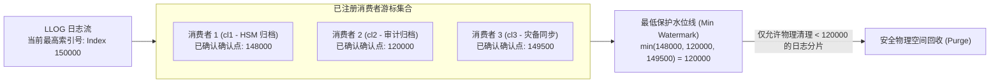

# 12.4 消费者生命周期与最低水位线回收

为了支持多个异构系统（如备份系统、安全审计、HSM）同时消费，Changelogs 采用了多租户注册与游标确认模型：



## 1. 注册（Register）
每个独立的下游服务必须在 MDT 上注册一个唯一的消费者代号（如 `cl1`、`cl2`）。系统为该消费者分配独立的递增确认游标。

## 2. 读取与确认（Acknowledge）
消费者调用用户态命令或 C-API 按序读取日志流。处理完毕后，发送确认请求上报其处理完毕的最新索引号：
```bash
lfs changelog_clear <mdt_name> <consumer_id> <end_index>
```

## 3. 最低水位裁决与自动回收
MDT 在执行物理磁盘分片回收时，必须取全量注册消费者的**最小已确认索引号（Min Watermark）**。只有当某个历史分片中的所有记录索引都严格小于该全局最低水位时，该分片才能被安全解挂并释放磁盘空间。

---

