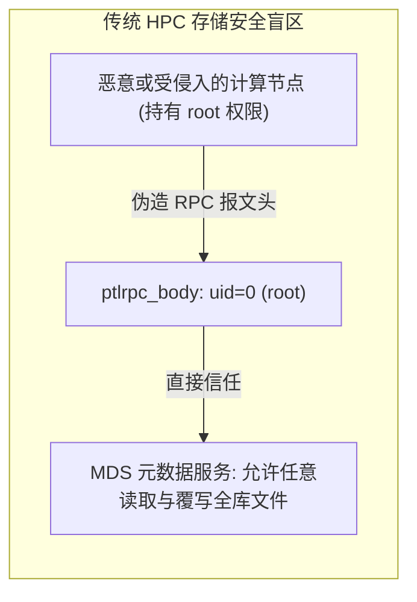
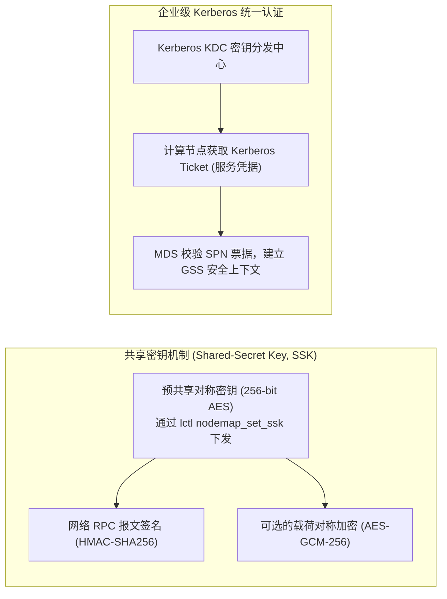

# 第 13 章：企业级安全认证与 Nodemap 多租户虚拟化

> **本章核心源码文件**：  
> - `lustre/nodemap/nodemap_handler.c`：Nodemap 身份重映射引擎与规则匹配实现  
> - `lustre/nodemap/nodemap_idmap.c`：UID/GID 双向转换哈希表与 Squash 降权实现  
> - `lustre/nodemap/nodemap_range.c`：基于 NID 范围的基数树（Radix Tree）快速查找  
> - `lustre/ptlrpc/gss/gss_keyring.c`：通用安全服务（GSS）与 Kerberos 凭据初始化  
> - `lustre/sec/shared_secret.c`：共享密钥（SSK, Shared-Secret Key）通道鉴权与报文签名  

---

## 13.1 企业级多租户安全诉求与传统 HPC 存储盲区

在传统高性能计算（HPC）环境中，存储系统通常假设运行在物理隔离的专用受信内网中。POSIX 权限模型完全信任计算客户端汇报的 UID 与 GID。客户端发出系统调用时，内核 `llite` 直接将当前进程的有效用户标识（`current_fsuid()`）填入 RPC 报文头部并发往 MDS：



在公有云 HPC、智算算力租赁以及跨部门多租户混合调度场景中，这种信任模型面临毁灭性风险：
1. **Root 提权逃逸**：租户在具备容器或物理机 root 权限时，可任意伪造 UID 为 0 发送 Lustre RPC，非法篡改全集群核心数据；
2. **多租户 UID/GID 冲突**：租户 A 内部的 UID 1001 对应开发人员张三，而租户 B 内部的 UID 1001 对应算法工程师李四，传统共享存储无法区分两者的数据归属；
3. **数据跨界越权遍历**：挂载整个全局文件系统后，租户可通过路径猜测或遍历访问其他租户的私有目录结构。

为此，现代 Lustre 构建了包含 **Nodemap 租户虚拟化**、**Shared-Secret Key（SSK）网络鉴权** 以及 **子目录挂载隔离（Fileset）** 的立体化安全防护架构。


如图 13-1 所示，现代 Lustre 逐步完善了从底层数据完整性校验（DIF/DIX）、Nodemap 身份隔离、SSK 共享密钥鉴权到分布式配额治理的完整矩阵。

---

## 13.2 Nodemap 架构机理：NID 范围与身份重映射

**Nodemap** 是运行在 MDS 与 OSS 服务端内核中的身份重映射与访问控制引擎。服务端为不同的租户网络划定专属的 Nodemap 配置空间，所有来自客户端的 RPC 报文在被分发至 VFS 之前，必须强制通过 Nodemap 规则过滤：

```mermaid
flowchart TD
    CLIENT["客户端发起 RPC (源 NID: 10.10.10.15@o2ib, 携带 UID=0, GID=0)"]
    SRV["MDS 服务端 LNet 接收报文"]
    
    CLIENT --> SRV
    
    subgraph Nodemap_Engine ["Nodemap 规则匹配引擎 (nodemap_handler.c)"]
        RADIX["1. 基于客户端源 NID 在基数树中检索所属 Nodemap"]
        CHECK_MAP{"命中哪个 Nodemap？"}
        
        RADIX --> CHECK_MAP
        
        CHECK_MAP -->|命中 default| SQUASH_ALL["默认安全规则：强制全部 Squash 为 nobody (65534)"]
        CHECK_MAP -->|命中租户 A (tenant_a)| RULE["2. 执行身份转换规则 (nodemap_idmap.c)"]
        
        RULE --> SQUASH_ROOT{"客户端 UID 是否为 0 (root)？"}
        SQUASH_ROOT -->|是| MAP_ROOT["squash_root: 强制转为 UID 65534 (nobody)"]
        SQUASH_ROOT -->|否| TRANSLATE["根据映射表转换: 租户内 UID 1001 -> 服务端物理 UID 20001"]
    end
    
    SRV --> Nodemap_Engine
    MAP_ROOT --> DISPATCH["投递给底层 MDD/OSD 实施 POSIX 鉴权"]
    TRANSLATE --> DISPATCH
```

### 13.2.1 核心控制策略标志位

每个 Nodemap 对象在服务端维护一组严格的行为控制策略：

| 策略控制项 | 默认值 | 作用与安全含义 |
| :--- | :--- | :--- |
| **`admin`** | `0`（禁用） | 若设为 0，则客户端发起的任何 `uid=0`（root）操作均会被强制降权（Squash）为指定的安全受限账号（如 `nobody`），彻底杜绝租户端 root 逃逸提权。 |
| **`trusted`** | `0`（非受信） | 若设为 0，客户端传入的所有 UID 与 GID 必须在映射表中存在显式映射规则；未映射账号自动被降权为 `squash_uid`。 |
| **`deny_unknown`** | `0` | 若设为 1，任何在映射表中未显式定义的未知用户在尝试访问文件时，系统直接抛出 `-EACCES`（拒绝访问）错误，实施白名单控制。 |
| **`map_mode`** | `both` | 控制映射是同时应用于 UID 和 GID，还是仅应用于其中之一。 |

---

## 13.3 子目录限制隔离：`fileset` 机制

除了身份转换外，多租户环境还要求租户只能看到属于自己的目录树分支，严禁跨界探查。Nodemap 提供了 **`fileset`（子目录限制）** 机制。


结合图 13-2 展示的官方架构：
- 租户 1 属于客户端网络 `10.10.1.0/24`，挂载点为 `/testfs`。由于其 Nodemap 绑定了 `fileset=/tenant1_data`，服务端在路径查找（`ll_lookup`）与路径转换（`llapi_path2fid` / `llapi_fid2path`）时，**强行将 `/tenant1_data` 作为该租户的根命名空间（Virtual Root）**；
- 租户 2 属于客户端网络 `10.10.2.0/24`，绑定了 `fileset=/tenant2_data`；
- 当租户 2 试图执行 `ls -la /` 时，其看到的只是 `/tenant2_data` 目录下的内容；如果租户 2 尝试通过相对路径或绝对路径遍历 `/tenant1_data`，服务端直接返回 `-ENOENT`（文件或目录不存在），从元数据协议层彻底隔绝了跨租户信息探测。

---

## 13.4 网络层鉴权：共享密钥（SSK）与 Kerberos GSS

在传输链路上，若网络未经加密与鉴权，恶意节点可通过伪造 ARP、IP 欺骗或网络嗅探冒充受信客户端。Lustre 支持基于通用安全服务应用编程接口（GSS-API）的两种认证体系：



### 13.4.1 共享密钥（SSK）
适用于智算集群与轻量化租户隔离。管理员在 MGS 上生成唯一的对称密钥文件，并通过专有通道分发给属于特定 Nodemap 的客户端节点：
- **认证模式（`null` / `skpi`）**：在 RPC 头部注入 HMAC 签名，服务端校验报文完整性与来源合法性，防止中间人篡改；
- **加密模式（`skpn`）**：对跨网络传输的 Bulk 数据载荷执行端到端 AES 加密，防止敏感训练数据被交换机镜像抓包泄露。

### 13.4.2 Kerberos GSS
适用于大型企业域环境。通过与企业现有的 Active Directory 或 MIT Kerberos KDC 对接，所有挂载与访问必须持有有效的 Kerberos 凭据，实现了与企业级 LDAP/IAM 系统的单点登录（SSO）与审计打通。

---

## 13.5 生产实战：Nodemap 配置与多租户隔离指令

以下命令在 MDS 节点上执行，全网实时生效：

```bash
# 1. 创建租户 A 的专属 Nodemap
lctl nodemap_add tenant_a

# 2. 将租户 A 的计算节点 IP/NID 范围划入该 Nodemap (支持子网段与 IB 地址)
lctl nodemap_add_range --name tenant_a --range 10.10.10.[100-200]@o2ib

# 3. 配置安全防御铁律：禁止 root 提权 (admin=0)，非受信 (trusted=0)，拦截未知账号 (deny_unknown=1)
lctl nodemap_modify --name tenant_a --property admin --value 0
lctl nodemap_modify --name tenant_a --property trusted --value 0
lctl nodemap_modify --name tenant_a --property deny_unknown --value 1

# 4. 设置安全回退降权账号 (Squash UID/GID 映射为 65534)
lctl nodemap_modify --name tenant_a --property squash_uid --value 65534
lctl nodemap_modify --name tenant_a --property squash_gid --value 65534

# 5. 绑定独立子目录命名空间隔离 (租户 A 仅可见 /testfs/projects/tenant_a)
lctl nodemap_set_fileset --name tenant_a --fileset /projects/tenant_a

# 6. 配置明确的 UID 映射 (租户客户端的 UID 1001 映射到存储底层的物理 UID 20001)
lctl nodemap_add_idmap --name tenant_a --idtype uid --idmap 1001:20001
lctl nodemap_add_idmap --name tenant_a --idtype gid --idmap 1001:20001

# 7. 查看当前 Nodemap 规则运行状态与命中计数
lctl get_param nodemap.tenant_a.*
```

---

## 13.6 生产事故案例：租户容器 Root 越权篡改核心共享库与 Nodemap 加固

### 13.6.1 故障现象

某云算力平台向外部科研团队开放了 128 台配有 GPU 的裸金属计算节点。租户在本地拥有操作系统 root 权限并以特权模式运行 Docker 容器。

某日上午，平台安全巡检系统报警：集群公共软件目录 `/mnt/lustre/opt/compiler/` 下的核心库文件被非正常覆写，多个公用二进制文件的修改时间（mtime）与 Inode 属性被篡改，导致全集群其他租户的编译任务大面积失败报 `Segmentation fault`。

### 13.6.2 排查过程

1. **元数据 Changelog 审计锁定嫌疑操作**：  
   在 MDS 上导出相关时段的变更日志：
   ```bash
   lfs changelog_find /mnt/lustre/opt/compiler/ -t SATTR,OPEN
   ```
   **数据分析**：捕获到一条关键修改记录：
   ```text
   rec: 8492011 type: SATTR fid: [0x200000401:0x12:0x0] uid: 0 gid: 0 nid: 10.10.10.142@o2ib
   ```
   修改请求直接来源于 NID 为 `10.10.10.142@o2ib` 的计算节点，且报文中的 UID 与 GID 均为 `0`。

2. **根因机理深入剖析**：  
   - 该节点分配给了外部租户开发团队。租户在容器内部以 `root`（UID=0）身份运行脚本，将编译临时文件误写到了平台共享基础库路径下；
   - 经审查集群配置，平台此前仅配置了默认的全局挂载，**未开启 Nodemap 隔离（`nodemap.active=0`）**；
   - 在缺乏 Nodemap 的裸运行模式下，MDS 盲目信任客户端传入的 `uid=0`，赋予了外部租户进程等同于集群超级管理员的完全控制权，产生了灾难性的越权覆写。

### 13.6.3 修复措施与成效

1. **紧急数据自愈**：  
   利用 Lustre 快照与备份镜像即刻回滚并替换受损的编译器二进制文件；
2. **全局启动 Nodemap 租户防御体系**：  
   在全网服务端激活 Nodemap 并实施严格的白名单准入：
   ```bash
   # 全局开启 Nodemap 引擎
   lctl nodemap_activate 1
   
   # 修改默认 default 规则：非受信且全量 Squash 为 65534
   lctl nodemap_modify --name default --property admin --value 0
   lctl nodemap_modify --name default --property trusted --value 0
   ```
   随后为所有外部租户划定专属 NID 范围，并强制绑定各自的 `fileset` 子目录与非 root 映射规则。加固后，外部租户即使在本地使用 root 发送指令，服务端接收后自动强转为 `nobody`，杜绝了一切跨租户和提权操作。

---

## 13.7 运维基线检查清单

- [ ] **多租户集群必须全局开启 Nodemap（`nodemap_activate 1`）**：在面向外部租户或开放 root 权限的算力集群中，禁止在无 Nodemap 保护状态下裸奔运行。
- [ ] **默认 Nodemap 必须严格关闭 `admin` 权限**：确保未分配专属规则的客户端在访问系统时，默认规则自动将其 `uid=0` 降权为 `squash_uid`。
- [ ] **租户挂载必须配置 `fileset` 边界**：严禁直接向租户开放全根文件系统路径，必须通过 `fileset` 将租户命名空间严格限制在专属子目录下。
- [ ] **定期审计 Nodemap 转换规则**：建立定时巡检脚本，比对 Nodemap 中的 `idmap` 列表与租户管理系统的 IAM 数据源，确保离职或失效账号的映射规则被及时清理。

---

## 本章小结

本章系统解析了 Lustre 企业级安全认证与多租户虚拟化隔离的核心机制：
1. **安全范式重构**：从传统假定网络受信的粗放模型，转向零信任的“入站全面过滤与按租户重映射”防御架构；
2. **Nodemap 身份虚拟化**：通过基于 NID 基数树的快速路由匹配、UID/GID 双向转换与 Root Squash 强制降权，彻底消除了租户端提权逃逸风险；
3. **命名空间空间隔离**：依托 `fileset` 机制构建了逻辑子目录到租户虚拟根的透明映射，实现了多租户环境下的全局路径不可见与访问阻断；
4. **网络通信防线**：结合共享密钥（SSK）与 Kerberos GSS 体系，在数据链路层构筑了防篡改、防伪造的加密与鉴权屏障，为构建面向云原生与多租户算力平台提供了坚固的安全基石。
