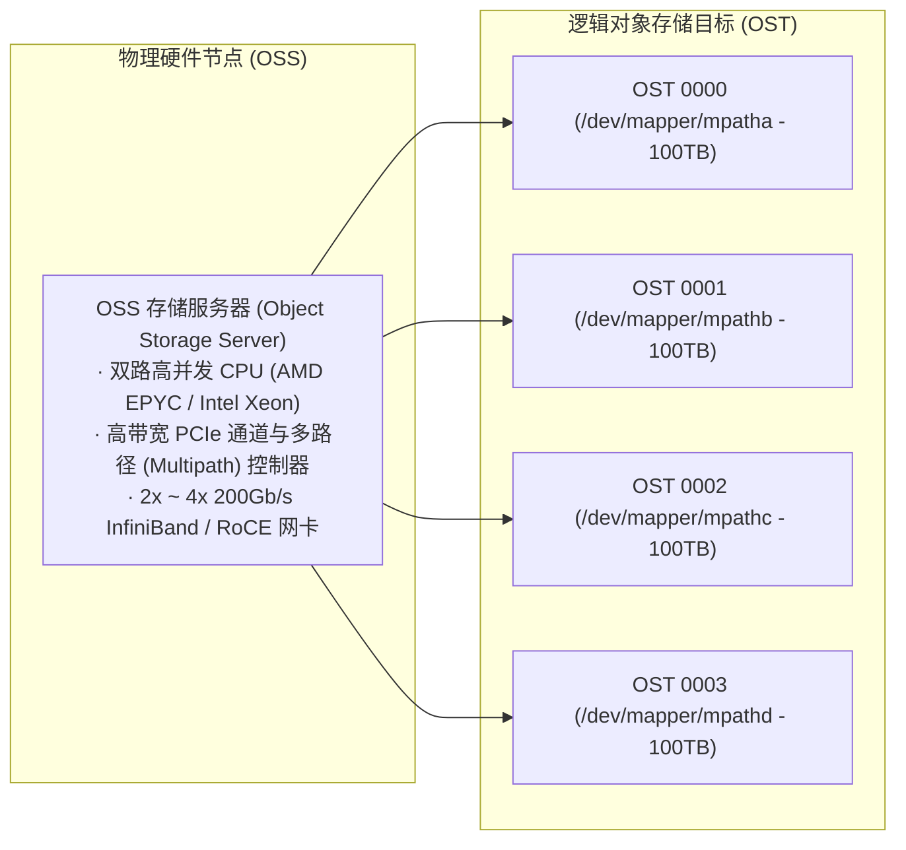
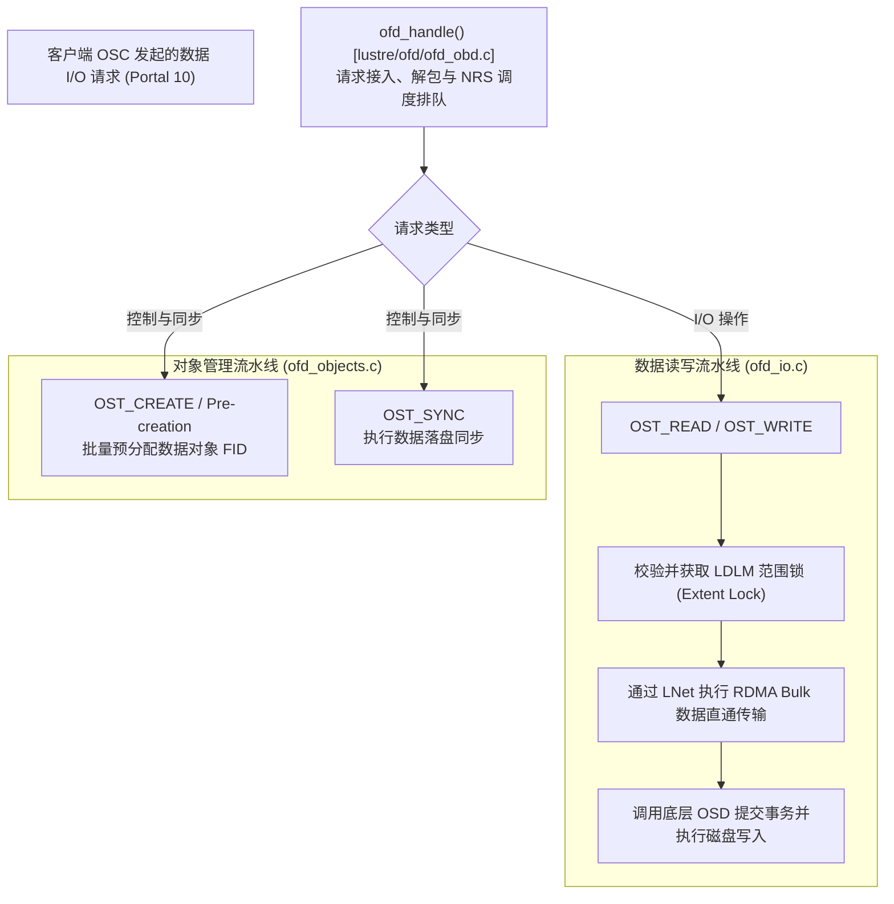
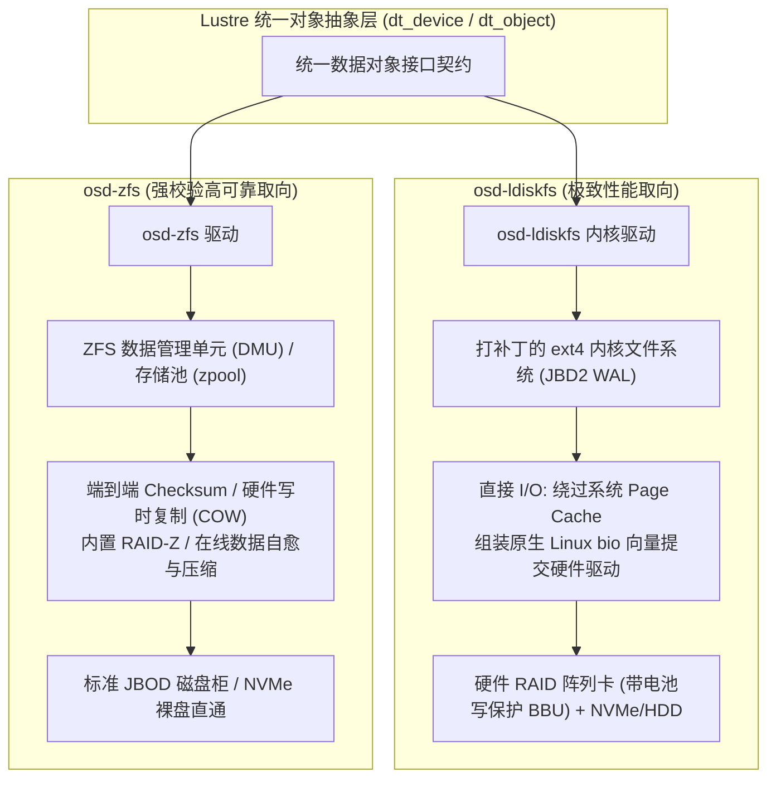

# 第 14 章：OST 与 OSD 存储核心与底层引擎抉择

> **本章核心源码文件**：  
> - `lustre/ofd/ofd_obd.c`：OST 过滤设备（OFD, OST Filter Device）初始化与 RPC 分发中枢  
> - `lustre/ofd/ofd_io.c`：数据读写 I/O 处理、Bulk 校验与空间提交逻辑  
> - `lustre/ofd/ofd_objects.c`：对象预创建（Pre-creation）机制与 FID 分配  
> - `lustre/osd-ldiskfs/osd_io.c`：基于 ldiskfs 的 Direct I/O 与 `bio` 向量组装驱动  
> - `lustre/osd-zfs/osd_io.c`：基于 ZFS DMU（Data Management Unit）的对象 I/O 驱动  

---

## 13.1 数据存储节点全景：OSS 与 OST

在 Lustre 数据存储平面中，系统同样区分为物理硬件服务与逻辑存储目标：



- **OSS（Object Storage Server，对象存储服务器）**：物理存储服务器节点，配置高并发处理器、大容量内存、高速网络适配器以及硬件 SAS/NVMe 磁盘控制器。
- **OST（Object Storage Target，对象存储目标）**：导出的逻辑存储设备单元，每个 OST 对应后端一个独立的物理文件系统卷（LUN）。一台物理 OSS 通常挂接 2 到 8 个 OST，从而利用多存储目标并发打满节点的总线与网络带宽。

---

## 13.2 服务端调度中枢：OFD（OST Filter Device）

在现代 Lustre 架构中，负责在 OST 端口（`OST_IO_PORTAL`）监听请求、协调分布式锁并派发物理 I/O 的核心模块是 **OFD（OST Filter Device）**（`lustre/ofd/`）。



### 对象批量预创建机制（Pre-Creation）

若每次客户端创建新文件并切分条带时，MDS 都需要同步向各个 OST 发送网络 RPC 申请对象 ID，元数据创建性能将严重受限。

OFD 实现了 **异步批量预创建机制**：
- OST 服务端在后台维护一个空闲对象池；
- 当池中可用对象数低于低水位线（Low Watermark）时，OST 主动在本地底层文件系统中批量创建一批空 Inode（如预分配 20,000 个对象），并将其已分配的 FID 序列通告给 MDS；
- 当客户端请求创建新文件时，MDS 仅需在内存中直接从对应 OST 的预分配池中取出一个 FID 填充至文件条带布局中，无需与 OST 进行即时网络往返。

---

## 13.3 后端存储引擎抉择：`osd-ldiskfs` vs `osd-zfs`

Lustre 提供了两套物理存储后端驱动，支持根据业务需求选择不同的底层文件系统：



### 特性与选型对比

| 评估维度 | `osd-ldiskfs`（基于 ext4 深度优化） | `osd-zfs`（基于 OpenZFS 构建） |
| :--- | :--- | :--- |
| **架构定位** | 极致裸性能取向，计算与超算密集型中心首选 | 数据安全与易维护取向，大容量冷热存储首选 |
| **底层硬件依赖** | 强依赖硬件 RAID 阵列卡（配备掉电保护缓存 BBU/Flash） | 支持直接挂接裸 JBOD 盘柜，利用软件 RAID-Z 容错 |
| **静默数据损坏检测** | 依赖外部校验工具，底层无持续自愈校验和 | 全链路 SHA256 / Blake3 校验和，读取时自动修复静默损坏 |
| **I/O 执行流水线** | 采用 Direct I/O，直接组装 `bio` 向量直通块设备驱动 | 经由 ZFS DMU 缓冲池与事务组（TXG）流水线回写 |
| **高级特性支持** | 支持 Quota 配额与快速恢复，不支持软快照 | 原生支持存储池快照、在线透明压缩（LZ4/ZSTD）与去重 |

---

## 13.4 物理 I/O 流水线：`osd_iobuf` 与 `bio` 直通

在 `osd-ldiskfs` 实现中，为了避免数据在进入磁盘前被 Linux 系统 Page Cache 进行二次拷贝与锁争用，内核采用 **Direct I/O 直通流水线**。

```c
struct osd_iobuf {
    wait_queue_head_t   dr_wait;            /* I/O 完成等待队列 */
    atomic_t            dr_numreqs;         /* 在途提交的 bio 结构体数量 */
    int                 dr_error;           /* 块设备驱动返回的错误码 */
    unsigned int        dr_max_pages;       /* 本次 I/O 涉及的最大物理页数 */
    unsigned int        dr_npages;          /* 当前装配的实际物理页数 */
    struct page       **dr_pages;           /* 指向待传输物理页面的指针数组 */
};
```

### I/O 组装与提交流程

1. **页面直接映射**：Bulk RDMA 数据到达后，物理页直接挂接在 `osd_iobuf` 的 `dr_pages` 数组中。
2. **块映射查询（`bmap` / `fiemap`）**：调用底层文件系统 Extent 映射接口，将逻辑对象内部偏移量转换为裸设备上的物理扇区地址。
3. **`bio` 组装与合并**：针对物理上连续的扇区，动态构建 Linux 原生 `struct bio` 结构体，将尽可能多的物理页面聚合进单个大型 I/O 请求（通常可达 1MB 或 4MB）。
4. **异步并发发射**：调用 `submit_bio()` 将组装好的 `bio` 向量直接投递至硬件块设备请求队列，由块设备驱动与 NVMe 控制器执行物理刷写。

---

## 13.5 生产实战：参数调优与监控指标

### 13.5.1 常用参数配置

```bash
# 1. 调整 OST 预分配对象数量的水位线
lctl set_param ofd.testfs-OST0000.create_count=20000

# 2. 控制每个 OST 的最大在途 RPC 数量 (提升并发度)
lctl set_param osc.testfs-OST0000-osc-*.max_rpcs_in_flight=32

# 3. 针对 ldiskfs 开启多块提交与预读优化
lctl set_param osd-ldiskfs.testfs-OST0000.writethrough_cache=0
```

### 13.5.2 常用状态监控与指标查看

| 监控目的 | 执行命令 | 输出关注重点 |
| :--- | :--- | :--- |
| **监控 OST 读写带宽与 IOPS** | `lctl get_param obdfilter.*.stats` | 查看 `read_bytes`、`write_bytes` 吞吐与单次 I/O 耗时分布。 |
| **查看块 I/O 碎片聚合度** | `lctl get_param obdfilter.*.brw_stats` | 查看磁盘读写尺寸分布直方图（评估 1MB+ 大块 I/O 占比）。 |
| **监控预分配池状态** | `lctl get_param ofd.*.precreate_batch` | 评估对象预分配池余量与补充速率。 |

---

## 13.6 生产事故案例：底层硬件 RAID 卡回写缓存失效导致 OST 写入吞吐骤降 90%

### 13.6.1 故障现象

某国家级气象超算中心在运行数值模拟大规模落盘测试时，单台 OSS 节点的写入吞吐突然由额定 12GB/s 暴跌至不足 1.1GB/s，伴随客户端大量写入请求排队超时。

监控显示：
- OSS 节点的 CPU、内存与 InfiniBand 网络利用率极低；
- 运行在底层 LUN 上的 4 个 OST 响应延迟由基线 2 毫秒骤增至 85 毫秒；
- 块设备队列深度持续维持在最大饱和状态。

### 13.6.2 排查过程

1. **I/O 分布直方图分析**：  
   在故障 OSS 上检查 `brw_stats`：
   ```bash
   lctl get_param obdfilter.testfs-OST0002.brw_stats
   ```
   **排查发现**：磁盘 I/O 尺寸分布依然以 1MB 规整大块为主，排除了小碎片 I/O 打散问题。说明 Lustre 上层在组装 `bio` 向量时并未异常。

2. **硬件控制器状态核验**：  
   使用硬件阵列管理工具（如 `storcli`）检查后端 SAS/SATA RAID 卡状态：
   ```text
   # storcli /c0 show
   Controller 0 Status: Warning
   BBU/CacheVault Status: Replacement Needed (Battery Over-temperature)
   Current Cache Policy: Write-Through (Automatic fallback from Write-Back)
   ```
   **机理分析**：  
   阵列卡的掉电保护电池（BBU）发生过温故障。为防止异常掉电导致缓存中尚未落盘的数据丢失，RAID 卡固件触发硬件安全保护，将写入缓存策略从高速的 **Write-Back（回写模式）** 自动强制降级为 **Write-Through（直写模式）**。  
   在直写模式下，每个 1MB 的物理块必须等待物理磁盘磁头完成实际寻道并落盘后才向内核返回完成信号，硬件写延迟成百倍增加，直接击穿了 Lustre 的 I/O 吞吐能力。

### 13.6.3 修复措施与成效

1. **临时应急处理**：  
   确认该服务器由双路冗余 UPS 不间断电源保护后，通过管理工具临时强制保持 Write-Back 策略：
   ```bash
   storcli /c0/v0 set wrcache=WB
   ```
2. **硬件部件更换**：  
   调度机房窗口期更换故障 BBU 模块，恢复硬件级双重安全防护。

调整后，OST 写入吞吐立即恢复至 12.2GB/s 额定线速，块写入延迟回落至 2 毫秒以下。

---

## 13.7 运维基线检查清单

- [ ] **定期监控硬件 RAID 卡缓存策略**：将存储控制器的电池（BBU/CacheVault）状态与缓存模式（Write-Back）纳入日常带外监控告警项。
- [ ] **关注 I/O 尺寸分布（`brw_stats`）**：生产高吞吐环境下，确认 1MB 及以上的大块写入占比超过 85%，若存在过多 4KB 小碎片写入，推动客户端调大条带或合并写入。
- [ ] **对象预分配水位监控**：监控 `ofd.*.precreate_batch`，避免高并发小文件风暴瞬间打空对象池导致前端创建同步阻塞。

---

## 本章小结

OST 与 OSD 构成了 Lustre 高性能数据落盘的核心基石。通过 OSS 与 OST 的清晰解耦，支持了硬件存储资源的高密度扩展；通过 OFD 驱动实现了高效的网络 I/O 调度与对象批量预分配；通过提供 `osd-ldiskfs`（裸性能优先）与 `osd-zfs`（数据安全与高级特性优先）双引擎，满足了异构场景的存储选型诉求；通过 Direct I/O 与 `osd_iobuf` 向量化直通流水线，将网络数据直推物理磁盘，实现了端到端的高效读写能力。
