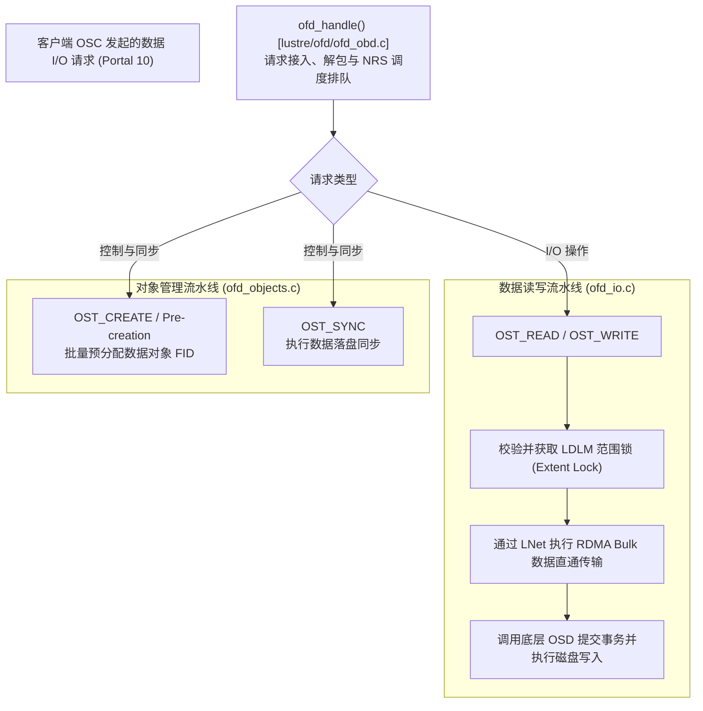

# 14.2 服务端调度中枢：OFD（OST Filter Device）

在现代 Lustre 架构中，负责在 OST 端口（`OST_IO_PORTAL`）监听请求、协调分布式锁并派发物理 I/O 的核心模块是 **OFD（OST Filter Device）**（`lustre/ofd/`）。

## 对象批量预创建机制（Pre-Creation）

若每次客户端创建新文件并切分条带时，MDS 都需要同步向各个 OST 发送网络 RPC 申请对象 ID，元数据创建性能将严重受限。

OFD 实现了 **异步批量预创建机制**：
- OST 服务端在后台维护一个空闲对象池；
- 当池中可用对象数低于低水位线（Low Watermark）时，OST 主动在本地底层文件系统中批量创建一批空 Inode（如预分配 20,000 个对象），并将其已分配的 FID 序列通告给 MDS；
- 当客户端请求创建新文件时，MDS 仅需在内存中直接从对应 OST 的预分配池中取出一个 FID 填充至文件条带布局中，无需与 OST 进行即时网络往返。

---

