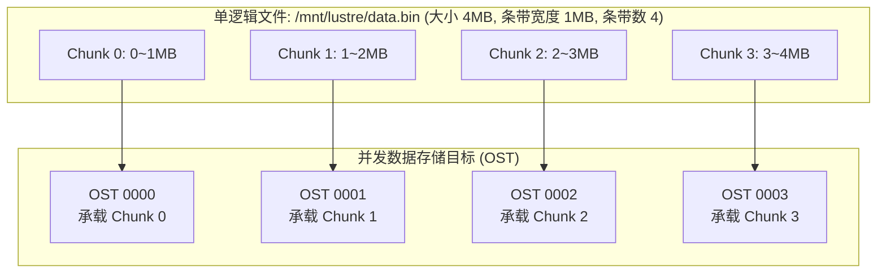
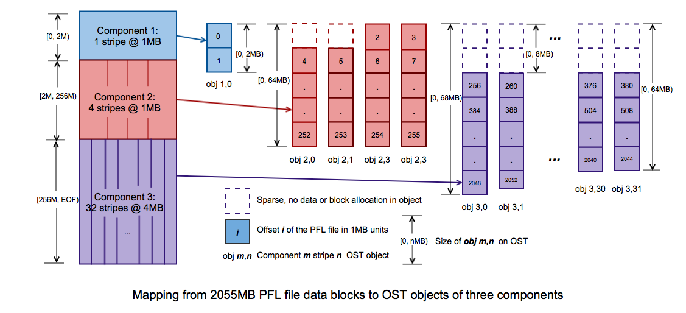
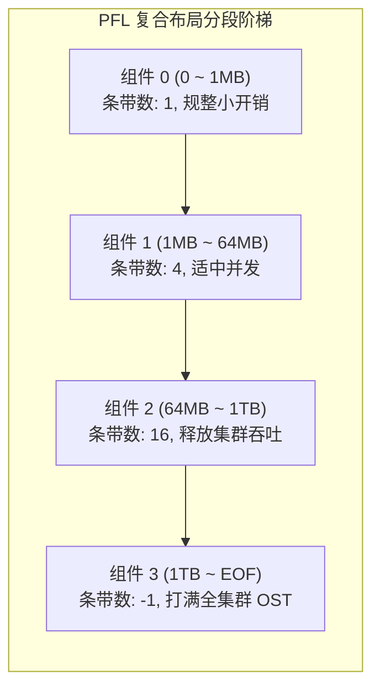
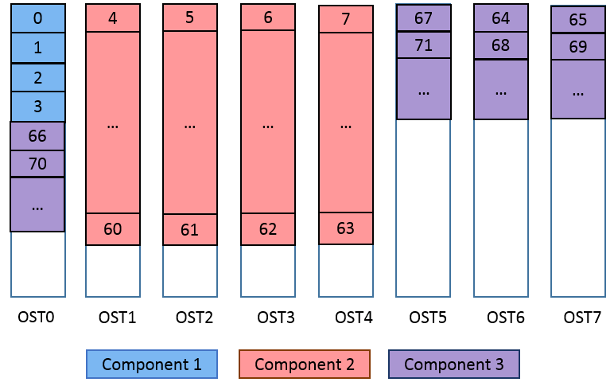
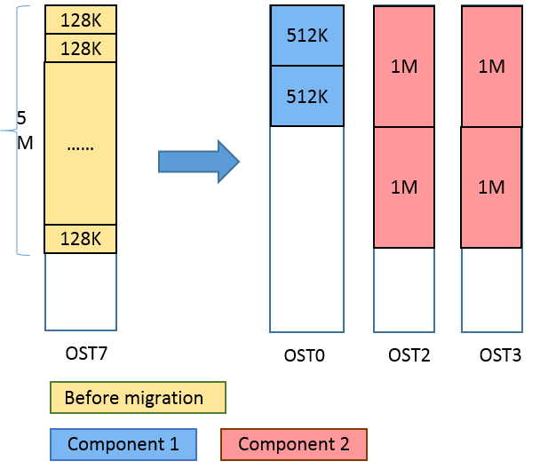
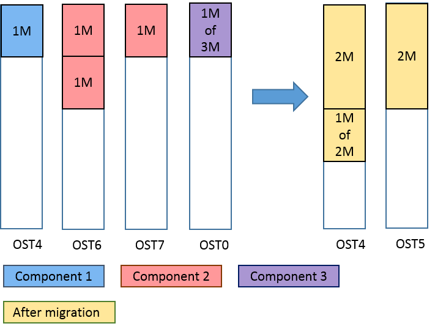
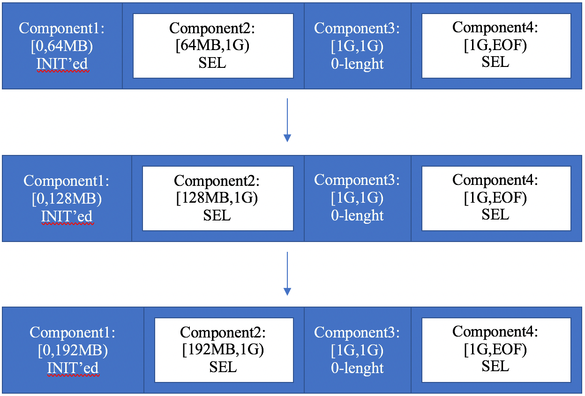
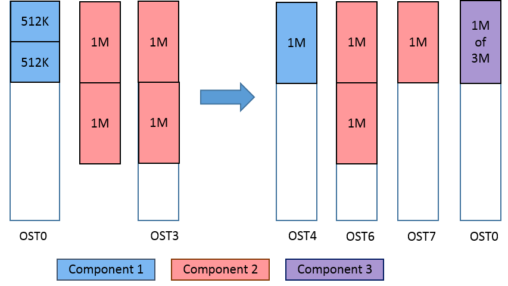
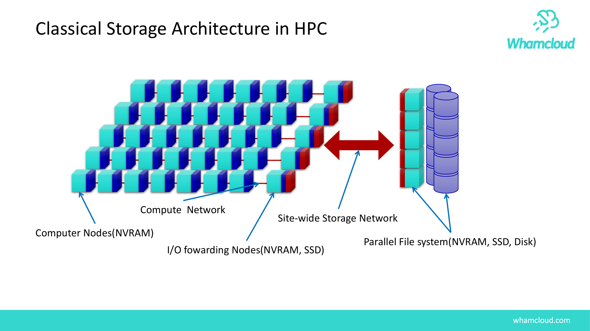

# 第 15 章：文件条带化与现代布局演进 (PFL / FLR / DoM / SEL)

> **本章核心源码文件**：  
> - `include/uapi/linux/lustre/lustre_user.h`：条带布局数据结构、复合布局（Composite Layout）与 PFL/FLR 宏定义  
> - `lustre/lov/lov_object.c`：逻辑对象卷（LOV）布局解析、条带分发与 I/O 映射实现  
> - `lustre/lov/lov_ea.c`：布局扩展属性（LOV EA）序列化与反序列化  
> - `lustre/lod/lod_lov.c`：服务端条带布局生成、OST 对象挑选与组件分配  
> - `lustre/utils/lfs.c`：用户态 `lfs setstripe`、`lfs mirror` 布局配置实现  

---

## 14.1 传统固定条带化的原理与局限

条带化（Striping）是 Lustre 实现极高聚合读写吞吐的核心技术。通过将单个逻辑文件切分为若干连续的固定大小数据块（Stripe Size），并循环轮询写入不同的物理 OST 节点，系统支持多计算节点并发读写同一大文件的不同区间，打满全网带宽。


*图 14-1: Lustre 传统条带化模型：单个逻辑文件切分为连续 Chunk 并轮询分布在多个 OST 上（来源：Lustre Architecture v4）*



### 传统固定布局的三大参数

1. **`stripe_size`（条带尺寸）**：每次连续写入单台 OST 的数据块大小（默认通常为 1MB）。
2. **`stripe_count`（条带计数）**：该文件所横跨的 OST 物理节点总数。
3. **`stripe_offset`（起始偏移）**：承载第 0 个数据块的起始 OST 编号（通常设为 -1，由服务端按负载均衡策略自动选取）。

### 传统单一固定条带的固有矛盾

- **小文件条带过宽问题**：若为了大文件高吞吐将默认条带数设得很大（如 `count=16` 或 `-1`），当应用程序生成海量几千字节（KB）的碎小文件时，系统依然需要为每个小文件在 16 个 OST 上分别申请预分配对象与锁资源，造成严重的元数据膨胀与预分配池耗尽。
- **大文件条带过窄问题**：若将默认条带数设为保守的 1（单 OST），当业务写入数十 TB 规模的大型模型检查点或科学模拟数据时，写入流量全部被锁定在单一物理节点上，无法发挥集群多节点并发吞吐优势。
- **静态预设的预测壁垒**：应用程序在调用 `open(..., O_CREAT)` 时，操作系统与存储系统无法提前获知该文件最终会被写入 4KB 还是 4TB。

---

## 14.2 渐进式文件布局（PFL, Progressive File Layout）

为消除传统固定布局的配置矛盾，Lustre 引入了 **复合布局架构（Composite Layout）**，其工业级实践即为 **渐进式文件布局（PFL, Progressive File Layout）**。



*图 14-2: PFL 渐进式文件布局整体架构：随文件大小动态扩展条带宽度（来源：Lustre Chinese Operations Manual）*


*图 14-3: PFL 复合组件的 Extent 区间切分与条带配置（来源：Lustre Chinese Operations Manual）*



### 14.2.1 动态按需分配与存储池协同



*图 14-4: PFL 组件与 OST 存储池（Flash 闪存池与 HDD 机械盘池）阶梯绑定拓扑（来源：Lustre Chinese Operations Manual）*


*图 14-5: 客户端写入跨越边界时触发的 PFL 动态范围扩展流程（来源：Lustre Chinese Operations Manual）*

- **延迟实例化（Late Allocation）**：文件刚创建时，系统仅在 MDT 上生成组件元数据模板，并不立即在所有组件对应的 OST 上分配实际对象。
- **跨界动态实例化**：当客户端写入量突破组件 0 的上限（如 1MB）时，客户端向 MDS 发起布局扩展请求，MDS 才会即时在下一级指定的 OST 上分配物理对象并挂接，保证“小文件零冗余开销，大文件自动全打散”。



*图 14-6: PFL 高速存储池空间耗尽时自动降级写入备用存储池的容错流程（来源：Lustre Chinese Operations Manual）*



*图 14-7: PFL 组件状态演进：从 Init、Stale 到 In-Sync 的状态机转换（来源：Lustre Chinese Operations Manual）*

---

## 14.3 自扩展布局（SEL, Self-Extending Layout）

在某些极具伸缩性的工作负载中，管理员希望文件能够在不需要预设硬编码 Extent 边界的前提下，根据实际写入速度自适应扩展。


*图 14-8: 自扩展布局（SEL）数据结构：包含动态伸缩算子与延展上限（来源：Lustre Chinese Operations Manual）*



*图 14-9: 客户端写入与服务端协调扩展 SEL 布局的执行时序（来源：Lustre Chinese Operations Manual）*

SEL 允许将最后一个组件标记为 `extension_size`（自扩展步长）。当文件写入逼近当前组件末尾时，客户端自动申请将现有组件在当前 OST 集合上向后延展指定长度，无需频繁向 MDS 请求创建新组件，兼顾了元数据轻量化与按需伸缩。

---

## 14.4 元数据端内嵌小数据：DoM（Data-on-MDT）

在经典架构中，无论文件多么小，客户端均必须分两步交互：先向 MDS 查询元数据，再通过网络向 OST 读取数据。对于海量几千字节（KB）的小文件（如源代码编译、AI 文本标签），跨节点两次网络往返导致元数据与网络协议栈开销远大于实际数据传输时间。

Lustre 引入了 **DoM（Data-on-MDT，元数据端内嵌小数据）** 特性：


*图 14-10: Data-on-MDT 架构：小文件或大文件首段直接内嵌存储于 MDT 本地全闪 NVMe 介质（来源：Lustre Chinese Operations Manual）*


*图 14-11: DoM 性能实测：在小文件读写与文件创建场景中，吞吐量提升 3~5 倍，单 RTT 消除网络往返（来源：Lustre Under New Challenges）*

- **数据随元数据直通返回**：小于配置阈值（如 1MB）的小文件，其物理数据块直接存放在 MDT 挂载的全闪 NVMe 介质上；
- **1-RTT 复合完成**：客户端在执行 `open()` 获取元数据意向锁的同时，直接将前 1MB 数据一并拉取回本地，消除了向 OST 发起二次网络 I/O 的延迟。

---

## 14.5 文件级冗余（FLR, File-Level Redundancy）多副本机制

传统 Lustre 依赖底层存储硬件提供可靠性（如 OST 配置硬件 RAID6 或双机高可用）。若某一 OST 所在机柜断电或存储节点彻底损坏，该 OST 上的数据分块将不可访问，直到节点修复完成。

**FLR（File-Level Redundancy，文件级冗余）** 提供了软件定义的文件级镜像副本能力：


*图 14-12: FLR 文件级镜像架构：单个逻辑文件在底层挂接多个独立的物理条带镜像（来源：Lustre Chinese Operations Manual）*



*图 14-13: PFL 阶梯条带与 FLR 多副本镜像的正交复合布局（来源：Lustre Chinese Operations Manual）*



*图 14-14: Lustre 现代存储布局全景演进：从固定条带到 PFL、DoM 与 FLR 的立体化融合（来源：Lustre Under New Challenges）*

### 15.5.1 异步与同步镜像流水线与延迟再同步


*图 15-15: FLR 延迟再同步（Delayed Mirror Resync）：主镜像写入、备镜像标记为 Stale 并由后台异步再同步（来源：Lustre Chinese Operations Manual）*

1. **镜像状态标记**：每个 Mirror 维护状态标记：
   - `in-sync`：该镜像包含最新的完整数据；
   - `stale`：由于写操作仅更新了部分镜像，该镜像被标记为陈旧脏数据。
2. **只读并发分流**：对于只读热点文件（如基础模型权重、共用容器镜像），FLR 支持将成千上万个客户端的读取并发分流到不同的 Mirror 所在的 OST 池中，读取带宽成倍线性叠加。
3. **后台延迟再同步（Delayed Resync）**：在密集写入阶段，系统仅更新主 Mirror，将备用 Mirror 标记为 `stale`；写入完成后，通过后台作业或策略引擎触发 `lfs mirror resync` 异步同步，兼顾写入低延迟与数据最终一致性。

---

## 14.6 生产实战：现代布局配置与运维命令集

```bash
# 1. 创建标准的工业级 PFL 布局 (0~1MB 单条带, 1M~64MB 4条带, 64M~1TB 16条带, 1T以上满条带)
lfs setstripe -E 1M -c 1 -E 64M -c 4 -E 1T -c 16 -E -1 -c -1 /mnt/lustre/pfl_template/

# 2. 创建具备 Data-on-MDT (DoM) 属性的阶梯布局 (前 1MB 数据内嵌在 MDT, 之后条带化到 OST)
lfs setstripe -E 1M -L mdt -E -1 -c 8 /mnt/lustre/dom_dir/

# 3. 创建具备双副本的 FLR 镜像文件
lfs mirror create -N2 /mnt/lustre/critical_checkpoint.bin

# 4. 手动触发陈旧镜像的后台在线再同步
lfs mirror resync /mnt/lustre/critical_checkpoint.bin

# 5. 校验指定文件各组件详细布局与镜像状态
lfs getstripe -v /mnt/lustre/critical_checkpoint.bin
```

---

## 14.7 生产事故案例：全局 `stripe_count=-1` 引发海量小文件预分配枯竭雪崩

### 14.7.1 故障现象

某国家超算中心新上线了一套由 64 台 OST 组成的高性能存储系统。某新入驻的用户课题组为追求极端读写带宽，在项目主目录执行了全局参数设置：
```bash
lfs setstripe -c -1 /mnt/lustre/proj_share/
```
随后，该课题组启动了包含数万个并发任务的生物信息学分析流程，该流程生成了超过 500 万个大小在 4KB 至 32KB 之间的小文件。

运行不足 1 小时，整套 Lustre 集群陷入严重卡顿，其他无辜课题组的写入操作全部频繁报错 `-ENOSPC` 或 I/O 超时，而监控显示集群整体存储空间使用率不足 8%。

### 14.7.2 排查过程

1. **OST 预分配状态排查**：  
   在 MDS 节点上查询与各 OST 关联的预分配对象状态：
   ```text
   # lctl get_param osp.*.prealloc_next_id
   prealloc_next_id: 1048576
   prealloc_last_id: 1048576 (Preallocation Exhausted!)
   ```
   **排查发现**：集群内全部 64 台 OST 的空闲预分配对象池全部见底，MDT 线程在极度频繁地向 64 台 OST 发起同步阻塞式的单次对象创建 RPC。
2. **机理分析**：  
   虽然文件只有 4KB，但在 `stripe_count=-1` 的规则下，MDS 必须为该文件在全集群全部 64 个 OST 上分别申请并绑定一个底层对象（Object）。500 万个小文件瞬间消耗了 $500\text{万} \times 64 = 3.2\text{亿}$ 个 OST 对象！不仅瞬间打崩了 OST 的预分配流控池，而且每个文件在 64 台 OST 上产生的元数据开销超过数据本身数千倍，引发全局雪崩。

### 14.7.3 修复措施与成效

1. **紧急截断违规目录布局**：  
   立刻重置该目录及其子目录的默认条带模板为单条带或 PFL：
   ```bash
   lfs setstripe -d /mnt/lustre/proj_share/
   lfs setstripe -E 1M -c 1 -E 1G -c 4 -E -1 -c 16 /mnt/lustre/proj_share/
   ```
2. **清理已有碎文件的冗余条带**：  
   使用 `lfs find` 检索已生成的错误小文件，通过 `lfs migrate -c 1` 将其在线重写迁移为单条带对象，回收 3 亿个无谓的 OST 孤儿预分配对象。
3. **设置全局防御策略**：  
   在 MGS 上配置根目录条带策略，严禁非管理员账号创建全局 `-c -1` 的无界条带目录。

修复后，OST 预分配池恢复至正常安全水位，集群全局性能恢复。

---

## 14.8 运维基线检查清单

- [ ] **严禁全局默认 `stripe_count=-1`**：生产环境根目录与通用用户目录严禁设为满条带，默认模板强烈推荐采用标准 PFL 阶梯分段。
- [ ] **DoM 阈值谨慎设定**：MDT 开启 DoM 时，单个文件 DoM 组件大小建议限制在 1MB 至 4MB 以内。过大的 DoM 组件会导致元数据全闪盘被数据块过快占满。
- [ ] **FLR 镜像网络隔离**：对于关键业务的多镜像副本，在 `lfs mirror create` 时结合 OST 存储池（Pools）指定镜像存放在不同的物理故障域机柜中，实现跨机柜容灾。

---

## 本章小结

从传统单一固定条带化向 PFL、DoM、SEL 与 FLR 的演进，标志着 Lustre 存储数据布局从静态预设走向智能化自适应。PFL 完美化解了大文件高并发与小文件轻量化的固有矛盾；DoM 通过元数据端内联存储实现了小数据 1-RTT 零网络往返；SEL 为动态扩展提供了平滑弹性；而 FLR 赋予了文件软件定义的多副本高可用与读流量线性卸载能力。合理规划与应用现代复合布局，是实现存储系统性能与空间利用率兼得的核心手段。
