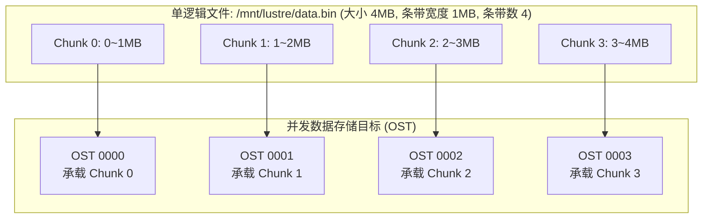

# 15.1 传统固定条带化的原理与局限

条带化（Striping）是 Lustre 实现极高聚合读写吞吐的核心技术。通过将单个逻辑文件切分为若干连续的固定大小数据块（Stripe Size），并循环轮询写入不同的物理 OST 节点，系统支持多计算节点并发读写同一大文件的不同区间，打满全网带宽。

*图 14-1: Lustre 传统条带化模型：单个逻辑文件切分为连续 Chunk 并轮询分布在多个 OST 上（来源：Lustre Architecture v4）*

## 传统固定布局的三大参数

1. **`stripe_size`（条带尺寸）**：每次连续写入单台 OST 的数据块大小（默认通常为 1MB）。
2. **`stripe_count`（条带计数）**：该文件所横跨的 OST 物理节点总数。
3. **`stripe_offset`（起始偏移）**：承载第 0 个数据块的起始 OST 编号（通常设为 -1，由服务端按负载均衡策略自动选取）。

## 传统单一固定条带的固有矛盾

- **小文件条带过宽问题**：若为了大文件高吞吐将默认条带数设得很大（如 `count=16` 或 `-1`），当应用程序生成海量几千字节（KB）的碎小文件时，系统依然需要为每个小文件在 16 个 OST 上分别申请预分配对象与锁资源，造成严重的元数据膨胀与预分配池耗尽。
- **大文件条带过窄问题**：若将默认条带数设为保守的 1（单 OST），当业务写入数十 TB 规模的大型模型检查点或科学模拟数据时，写入流量全部被锁定在单一物理节点上，无法发挥集群多节点并发吞吐优势。
- **静态预设的预测壁垒**：应用程序在调用 `open(..., O_CREAT)` 时，操作系统与存储系统无法提前获知该文件最终会被写入 4KB 还是 4TB。

---

