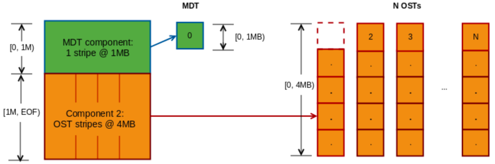
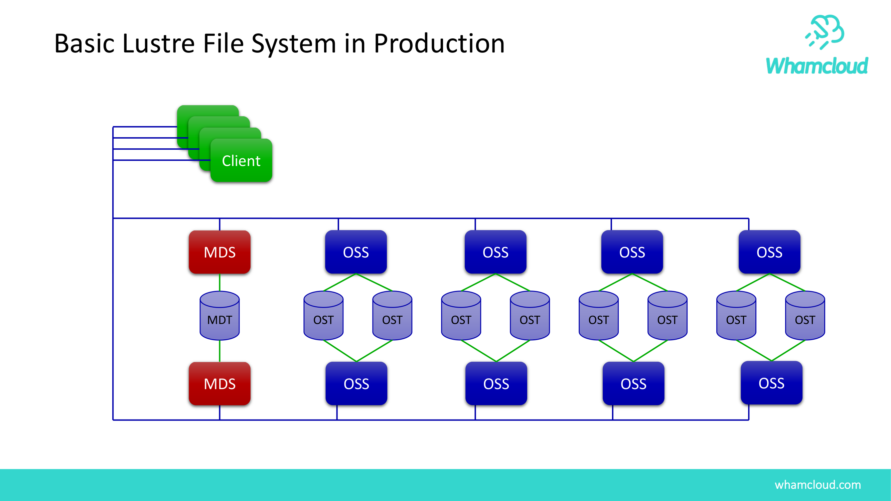

# 15.4 元数据端内嵌小数据：DoM（Data-on-MDT）

在经典架构中，无论文件多么小，客户端均必须分两步交互：先向 MDS 查询元数据，再通过网络向 OST 读取数据。对于海量几千字节（KB）的小文件（如源代码编译、AI 文本标签），跨节点两次网络往返导致元数据与网络协议栈开销远大于实际数据传输时间。

Lustre 引入了 **DoM（Data-on-MDT，元数据端内嵌小数据）** 特性：

*图 14-10: Data-on-MDT 架构：小文件或大文件首段直接内嵌存储于 MDT 本地全闪 NVMe 介质（来源：Lustre Chinese Operations Manual）*

*图 14-11: DoM 性能实测：在小文件读写与文件创建场景中，吞吐量提升 3~5 倍，单 RTT 消除网络往返（来源：Lustre Under New Challenges）*

- **数据随元数据直通返回**：小于配置阈值（如 1MB）的小文件，其物理数据块直接存放在 MDT 挂载的全闪 NVMe 介质上；
- **1-RTT 复合完成**：客户端在执行 `open()` 获取元数据意向锁的同时，直接将前 1MB 数据一并拉取回本地，消除了向 OST 发起二次网络 I/O 的延迟。

---

