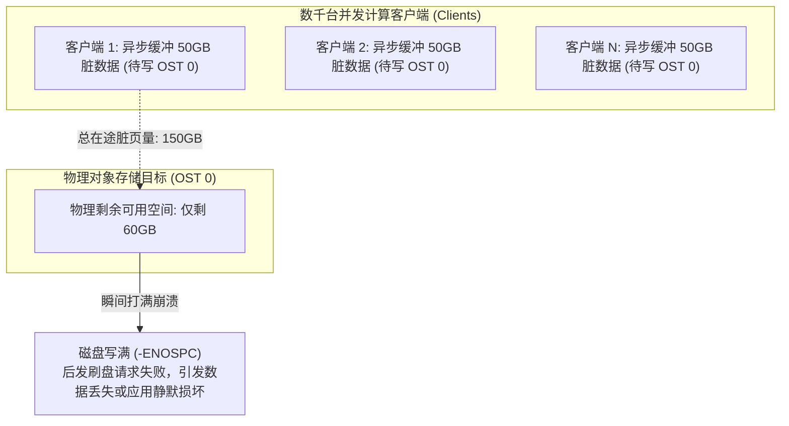
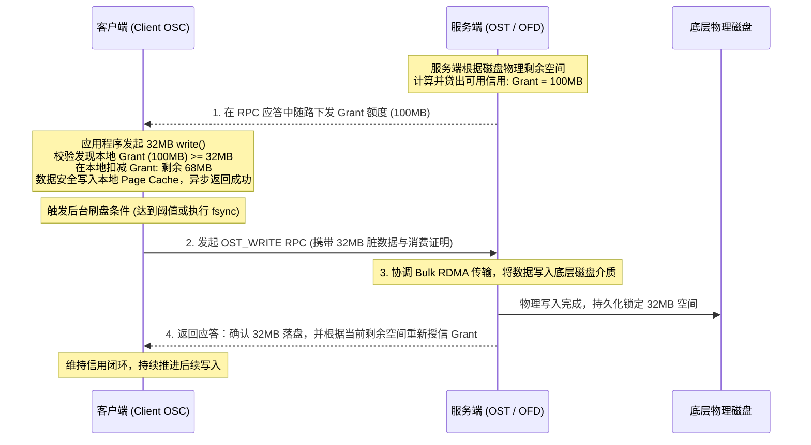
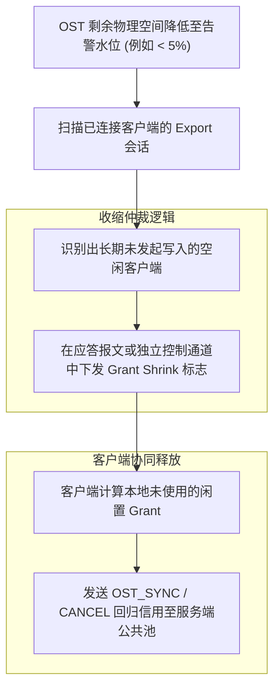
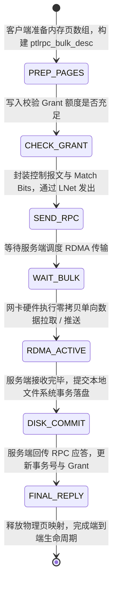

# 第 16 章：分布式 I/O 流水线与缓存 Grant 机制

> **本章核心源码文件**：  
> - `lustre/osc/osc_request.c`：客户端对象存储客户端（OSC）Grant 申请、流控与脏页管理  
> - `lustre/osc/osc_page.c`：客户端异步脏页生命周期与物理页面刷新  
> - `lustre/ofd/ofd_io.c`：服务端 Grant 配额计算、贷出与动态收缩（Grant Shrink）实现  
> - `lustre/include/lustre_osc.h`：Grant 控制块、阈值与水位线数据结构定义  
> - `lustre/ptlrpc/pack_generic.c`：Bulk RDMA 报文解包与数据校验实现  

---

## 15.1 异步写入的空间超卖风险与 Grant 机制的产生

在 POSIX 文件系统语义中，应用程序调用 `write()` 时，操作系统通常先将数据写入本地 Page Cache 并立即返回成功（异步写入），随后由内核后台线程（如 `flusher`）择机刷写至底层存储。

然而，在拥有成千上万个并发客户端的分布式存储集群中，朴素的异步缓存模型会引发严重的 **空间超卖灾难（Space Overcommit Disaster）**：



若各个客户端在将数据写入本地缓存时不进行全网空间校验，当所有客户端同时向同一台 OST 刷盘时，在途脏数据的总量若超过了该 OST 的实际剩余物理空间，先刷盘的客户端能够写入，而后刷盘的客户端将遭遇空间不足（`-ENOSPC`）。由于最初的 `write()` 已经返回成功，这会导致不可逆的数据截断与损坏。

为此，Lustre 设计了 **Grant 空间预留与流控机制**。

---

## 15.2 Grant 信用分配与流控闭环

Grant 是一种分布式的**字节级存储信用额度（Byte-Level Storage Credit）** 体系：



### 15.2.1 客户端脏页约束条件

在 `lustre/osc/osc_page.c` 中，客户端执行异步写入前必须满足下述核心安全不等式：

$$\text{LocalDirtyBytes} + \text{NewWriteBytes} \le \text{CurrentGrantBytes}$$

1. **信用充足**：若当前客户端拥有的空闲 Grant 额度大于等于待写入字节数，数据被允许安全进入本地 Page Cache，同时本地可用 Grant 相应扣减。
2. **信用耗尽阻断**：若可用 Grant 不足，客户端内核暂停接受异步写入，强制将调用挂起并触发紧急刷盘（Flush），将本地已有的脏数据通过网络推送到 OST。直到 OST 完成物理落盘并随回包返回新的 Grant 授信后，客户端才允许继续接收新的写请求。

---

## 15.3 动态回收机制：Grant Shrinking

当 OST 的物理磁盘空间逐渐耗尽（如剩余空间低于 5%）时，若允许部分空闲或低负载客户端长期持有大量未使用的 Grant 额度，会导致其他正在进行密集写入的活跃节点因申请不到 Grant 发生写入停顿。

OFD 实现了 **Grant 动态收缩机制（Grant Shrinking）**：



- **高水位感知**：服务端在剩余空间不足时，动态削减新下发的 Grant 配额；
- **主动召回**：通过网络通告空闲客户端主动释放其闲置的预留额度，将其集中调配给高负载写入的客户端，实现集群级存储资源的高效利用。

---

## 15.4 分布式 Bulk RDMA I/O 流水线状态机

大块数据读写流水线涉及客户端 OSC 与服务端 OFD 的多阶段状态协同：



1. **`PREP_PAGES`**：客户端将 VFS 传递的散列物理内存页装配入 `ptlrpc_bulk_desc`，通过 `LNetMDAttach()` 完成底层 RDMA 内存描述符绑定。
2. **`CHECK_GRANT`**：针对写请求，执行严格的 Grant 额度扣减。
3. **`SEND_RPC` 与 `WAIT_BULK`**：发送轻量级控制报文，等待服务端解析请求并根据服务端当前 I/O 队列深度调度网络 RDMA 操作。
4. **`RDMA_ACTIVE`**：网卡硬件通道在不经过 CPU 拷贝的前提下完成物理页面至远程主机的极速传输。
5. **`DISK_COMMIT` 与 `FINAL_REPLY`**：服务端底层提交写入，回传持久化确认并更新客户端在途信用。

---

## 15.5 生产实战：参数调优与监控指标

### 15.5.1 常用参数配置

```bash
# 1. 调整客户端初始预分配的 Grant 额度 (根据单机并发能力设定)
lctl set_param osc.*.max_dirty_mb=128

# 2. 调整服务端 Grant 占物理剩余空间的允许贷出比例
# 默认通常为 0.75，防止突发流量过度挤占空间
lctl set_param ofd.*.grant_ratio=75

# 3. 触发客户端立即强制刷新本地未刷盘的脏页数据
lctl set_param osc.*.force_sync=1
```

### 15.5.2 常用状态监控与指标查看

| 监控目的 | 执行命令 | 输出关注重点 |
| :--- | :--- | :--- |
| **监控当前客户端持有的 Grant 额度** | `lctl get_param osc.*.cur_grant_bytes` | 查看本地可用的写入信用总量（字节数）。 |
| **监控客户端当前在途脏页量** | `lctl get_param osc.*.cur_dirty_bytes` | 评估当前内存脏页堆积深度，判断是否存在刷盘阻塞。 |
| **监控服务端 Grant 贷出总量** | `lctl get_param ofd.*.tot_granted` | 监控服务端已贷出的全部信用总和，评估是否存在透支风险。 |

---

## 15.6 生产事故案例：Grant 回收延迟导致全集群高并发写入陷入 D 状态停顿

### 15.6.1 故障现象

某国家超算中心在运行千万亿次流体动力学模拟计算时，当全集群 2048 个计算节点向 Lustre 存储进行阶段性写盘时，原本仅需 20 秒完成的数据写入延长至超过 8 分钟，大批计算进程陷入 D 状态（不可中断睡眠）。

监控数据显示：
- 存储端 OSS 的 CPU、磁盘 I/O 写入带宽与网络通道均远未达到饱和状态；
- 计算节点上的 `cur_dirty_bytes` 紧紧贴住 `cur_grant_bytes` 上限；
- 计算节点内核日志频繁打印：
  ```text
  Lustre: testfs-OST0015-osc-...: waiting for grant to write...
  ```

### 15.6.2 排查过程

1. **容量分布排查**：  
   使用 `lfs df -h` 检查全网各 OST 的容量水位：
   ```text
   # lfs df -h
   UUID                 bytes        used   available use% mounted on
   testfs-OST0015_UUID  100.0T       92.8T      7.2T  93%  /mnt/lustre[OST:15]
   ... 其余 OST 水位普遍在 50% 左右 ...
   ```
   **排查发现**：全网 64 个 OST 中，唯独 `OST0015` 的使用率达到了 93%（剩余空间仅 7.2TB）。

2. **根因机理分析**：  
   - 当 `OST0015` 空间使用率突破 90% 警戒线后，OFD 内部的安全机制触发了严格的 Grant 额度收缩，将单客户端单次允许申请的 Grant 额度压缩为极小的片段；
   - 与此同时，上层某些未做分桶的作业恰好将大量数据条带映射到了 `OST0015` 上；
   - 2048 个客户端在向 `OST0015` 写入时，其本地持有的 Grant 瞬间被微小的写入耗尽；由于每个客户端每次只能向服务端申请到几百 KB 的极小 Grant，客户端在“申请微量 Grant $\rightarrow$ 瞬间写满挂起 $\rightarrow$ 刷盘等待应答 $\rightarrow$ 再次排队申请”的循环中严重阻塞，导致端到端写入吞吐发生雪崩。

### 15.6.3 修复措施与成效

1. **临时应急处理**：  
   临时调大该节点的动态 Grant 贷出上限比例，为在途业务释放缓冲通道：
   ```bash
   lctl set_param ofd.testfs-OST0015.grant_ratio=90
   ```
2. **存储目标容量动态再平衡**：  
   使用数据迁移工具将 `OST0015` 上的冷数据分块迁移（`lfs migrate`）至其余空闲 OST 上，将 `OST0015` 的物理空间水位回拉至 60% 安全线。

调整后，全集群客户端的 Grant 申请恢复大块批量分配，流体模拟作业写盘耗时重新回归至 18 秒正常水平。

---

## 15.7 运维基线检查清单

- [ ] **定期监控 OST 容量失衡度（Skewness）**：各 OST 之间的容量利用率极差不宜超过 20%；若存在个别 OST 空间过早突破 85%，应及时执行数据重平衡，防止局部触发 Grant 极度收缩。
- [ ] **客户端 `max_dirty_mb` 与内存对齐**：在配置了大内存（如 512GB 以上）的计算节点上，可适度将 `max_dirty_mb` 调大至 256MB 或 512MB，以提升大块连续写入时的聚合吞吐。
- [ ] **生产环境确认 Grant 比例安全边际**：保持 `ofd.*.grant_ratio` 在 75% 至 80% 之间，防止过高设置导致物理磁盘极端打满引发不可逆损坏。

---

## 本章小结

Lustre 通过设计精密的 Grant 空间信用流控体系，在保障客户端异步本地写入高性能的同时，从根本上消除了多节点高并发下的分布式物理空间超卖灾难；通过客户端严格的脏页约束与服务端的动态 Grant Shrink 机制，保障了全集群存储容量的高效与安全调度；配合端到端 Bulk RDMA 传输流水线，将网络数据直通底层介质，实现了兼具强安全防线与极高吞吐的分布式数据传输架构。
