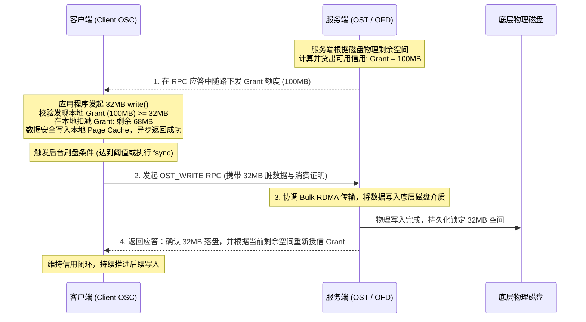

# 16.2 Grant 信用分配与流控闭环

Grant 是一种分布式的**字节级存储信用额度（Byte-Level Storage Credit）** 体系：

## 15.2.1 客户端脏页约束条件

在 `lustre/osc/osc_page.c` 中，客户端执行异步写入前必须满足下述核心安全不等式：

$$\text{LocalDirtyBytes} + \text{NewWriteBytes} \le \text{CurrentGrantBytes}$$

1. **信用充足**：若当前客户端拥有的空闲 Grant 额度大于等于待写入字节数，数据被允许安全进入本地 Page Cache，同时本地可用 Grant 相应扣减。
2. **信用耗尽阻断**：若可用 Grant 不足，客户端内核暂停接受异步写入，强制将调用挂起并触发紧急刷盘（Flush），将本地已有的脏数据通过网络推送到 OST。直到 OST 完成物理落盘并随回包返回新的 Grant 授信后，客户端才允许继续接收新的写请求。

---

