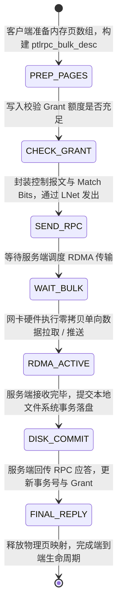

# 16.4 分布式 Bulk RDMA I/O 流水线状态机

大块数据读写流水线涉及客户端 OSC 与服务端 OFD 的多阶段状态协同：

1. **`PREP_PAGES`**：客户端将 VFS 传递的散列物理内存页装配入 `ptlrpc_bulk_desc`，通过 `LNetMDAttach()` 完成底层 RDMA 内存描述符绑定。
2. **`CHECK_GRANT`**：针对写请求，执行严格的 Grant 额度扣减。
3. **`SEND_RPC` 与 `WAIT_BULK`**：发送轻量级控制报文，等待服务端解析请求并根据服务端当前 I/O 队列深度调度网络 RDMA 操作。
4. **`RDMA_ACTIVE`**：网卡硬件通道在不经过 CPU 拷贝的前提下完成物理页面至远程主机的极速传输。
5. **`DISK_COMMIT` 与 `FINAL_REPLY`**：服务端底层提交写入，回传持久化确认并更新客户端在途信用。

---

