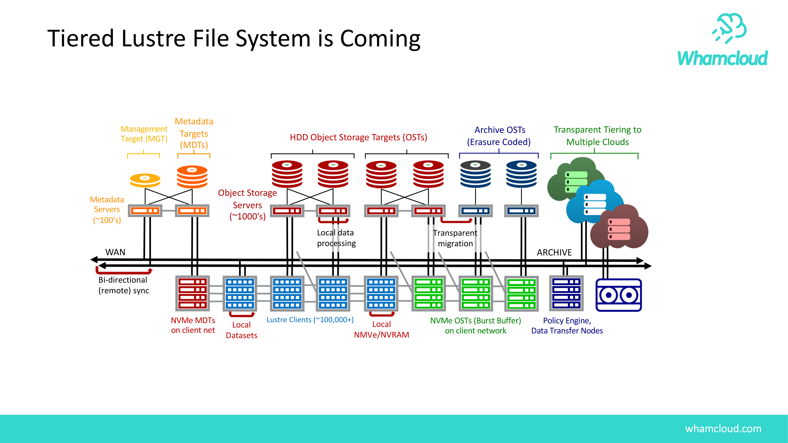
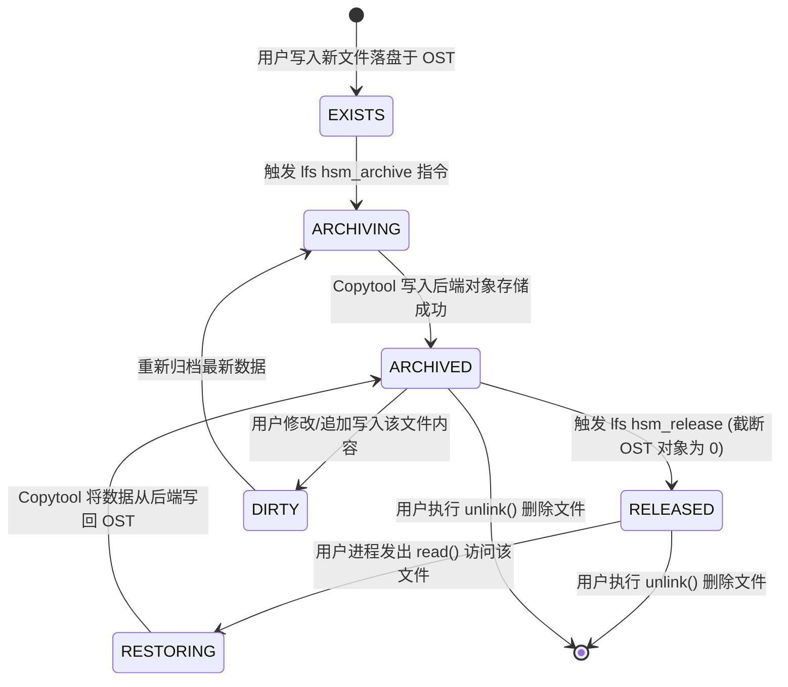
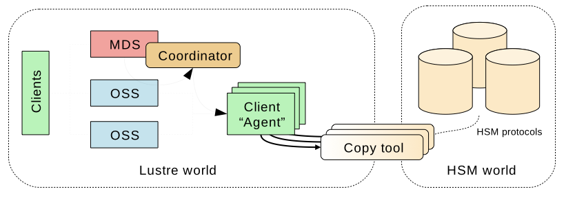
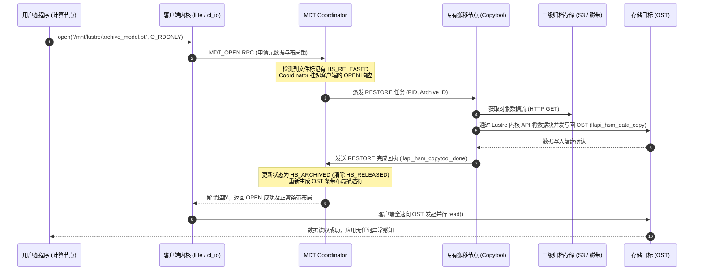
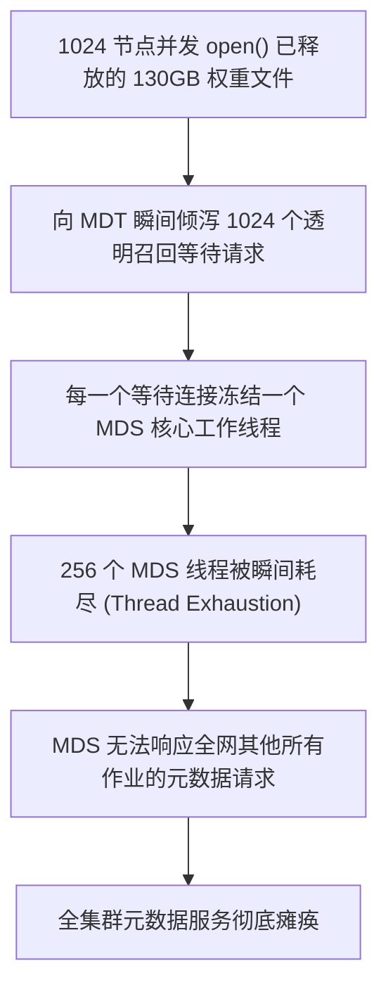

# 第 17 章：HSM 分层存储管理与对象存储云级下沉

> **本章核心源码文件**：  
> - `lustre/mdc/mdc_lib.c`：MDC 端 HSM 状态查询与 Coordinator 意向交互实现  
> - `lustre/mdt/mdt_hsm.c`：MDT 端 HSM 协调器（Coordinator）动作调度与队列管理  
> - `lustre/mdt/mdt_coordinator.c`：HSM 状态机转换、死锁检测与恢复机制  
> - `lustre/utils/lhsmtool_posix.c`：POSIX 后端数据搬迁工具（Copytool）用户态参考实现  
> - `include/uapi/linux/lustre/lustre_user.h`：HSM 标志位（`HS_EXISTS`、`HS_ARCHIVED`、`HS_RELEASED`、`HS_DIRTY`）定义  

---

## 17.1 分层存储的必然性：成本与性能的经济学平衡

在大规模人工智能智算中心、天文观测数据处理与基因组学测序平台中，存储系统面临海量数据沉淀与有限物理预算的矛盾：
- **热数据极速访问**：当前正在进行的训练任务、频繁迭代的特征工程需要极高 IOPS 和极低延迟的全闪存 NVMe 或高性能 SAS 介质；
- **冷数据长周期归档**：历史原始语料湖、模型历史版本权重以及合规审计日志体量达数十 PB 甚至 EB 级。如果全部留驻在单价高昂的 Lustre OST 闪存盘上，总体拥有成本（TCO）不可承受。



如图 17-1 所示，现代数据中心正在向以 Lustre 为高性能接入网关、向下对接多云对象存储（S3/Ceph）及近线磁带库的 **分层存储架构（Tiered Storage Architecture）** 演进。

Lustre 原生设计了 **HSM（Hierarchical Storage Management，分层存储管理）** 子系统：**在维持全局统一 POSIX 命名空间完全不变的前提下，自动或按需将底层数据对象在主存储与二级归档后端之间无感迁移与下沉**。

---

## 17.2 HSM 整体架构与核心组件拓扑


结合官方架构图 17-2 与图 17-3，Lustre HSM 体系由三大核心组件协同驱动：


### 1. HSM 协调器（Coordinator）
运行在主元数据服务器（MDT0000）内核中的中枢调度引擎。
- 负责维护全集群文件的 HSM 生命周期状态机；
- 维护全局请求等待队列与活动队列，追踪文件的归档（Archive）、释放（Release）、召回（Restore/Recall）及清除（Remove）指令；
- 向注册在线的数据搬迁节点（Agent）分发任务并监控进度，处理网络超时与重试。

### 2. 数据搬迁代理与工具（Agent & Copytool）
部署在专有数据搬运节点（Data Mover Nodes）上的守护进程。
- **与 Coordinator 保持长连接会话**：通过 Lustre 专有 RPC 协议向 MDT 注册自身支持的归档后端 ID（Archive ID）；
- **执行实际物理搬迁**：标准实现包括用于本地目录或 NFS 的 `lhsmtool_posix`，以及面向 Amazon S3、Ceph RGW、Google Cloud Storage 的 `lhsmtool_s3`。Copytool 通过 `llapi_hsm_copytool_*` 接口从 OST 读取数据并写入远端对象存储，反之亦然。

### 3. 策略引擎（Policy Engine，如 Robinhood）
运行在用户空间的自动化调度软件。通过持续解析 Lustre Changelogs（元数据变更日志），依据预设的策略规则（如“文件访问时间超过 90 天且大小大于 100MB 则归档”、“OST 存储水位超过 85% 则按 LRU 释放数据”），全自动批量触发 HSM 指令。

---

## 17.3 文件生命周期状态机与状态跃迁

在 HSM 体系中，文件的生命周期通过一组位图掩码精确定义：



### 核心状态标志位定义

```c
#define HS_NONE         0x00000000
#define HS_EXISTS       0x00000001  /* 文件物理数据块当前存在于 Lustre OST 上 */
#define HS_ARCHIVED     0x00000002  /* 文件完整副本已成功写入二级归档后端 */
#define HS_RELEASED     0x00000008  /* OST 上的数据已被释放 (大小为 0)，仅保留元数据 */
#define HS_DIRTY        0x00000010  /* 文件在归档后又被修改，归档副本已过时 */
#define HS_LOST         0x00000020  /* 归档后端副本损坏或不可达 */
```

- **`RELEASED`（关键空间释放态）**：  
  当文件处于 `RELEASED` 状态时，客户端执行 `ls -lh` 依然能看到文件的真实大小、权限、创建时间与目录归属，其元数据 Inode 完好无损地驻留在 MDT 上；但在底层 OST 存储介质上，该文件占用的对象扇区已被完全抹除并归还存储池，实现了**逻辑命名空间存在与物理存储空间归还的完美解耦**。

---

## 17.4 透明召回流水线与数据流（Transparent Recall）

当用户进程尝试打开并读取一个处于 `RELEASED` 状态的冷数据文件时，Lustre 的透明召回机制确保应用程序无须感知任何底层复杂性：



结合图 17-4 展示的交互数据流，完整召回流程如下：



在整个透明召回期间，客户端进程仅仅表现为系统调用微秒/秒级的暂时挂起。一旦 Copytool 将数据灌回 OST，I/O 管道瞬间打通，用户程序平滑恢复。

---

## 17.5 生产实战：HSM 配置与控制指令集

### 17.5.1 Coordinator 调优与启动

```bash
# 1. 开启 MDT 上的 HSM 协调器功能
lctl set_param mdt.testfs-MDT0000.hsm_control=enabled

# 2. 调整并发搬迁任务上限 (默认 16，大集群可调高至 64~128)
lctl set_param mdt.testfs-MDT0000.hsm.max_requests=128

# 3. 设置任务超时时限 (秒)，超时未完成自动派发给其他备用 Agent
lctl set_param mdt.testfs-MDT0000.hsm.grace_delay=300
```

### 17.5.2 Copytool 代理进程启动

在专门的物理数据搬运节点上启动 `lhsmtool_posix` 守护进程：

```bash
# 将本地挂载的 NFS/S3 映射目录作为 1 号归档池
lhsmtool_posix --daemon \
    --hsm-root /mnt/archive_storage/backend_1 \
    --archive 1 \
    /mnt/lustre
```

### 17.5.3 用户态数据管理与状态控制

```bash
# 1. 手动触发指定大文件的归档 (将数据复制至 1 号归档池)
lfs hsm_archive -a 1 /mnt/lustre/dataset/train_raw.tar

# 2. 查询文件当前精确的 HSM 状态
lfs hsm_state /mnt/lustre/dataset/train_raw.tar
# 输出示例：train_raw.tar: (0x00000009) exists archived, archive_id:1

# 3. 释放 OST 物理磁盘空间 (仅保留元数据，数据保留在归档池)
lfs hsm_release /mnt/lustre/dataset/train_raw.tar
# 再次查看状态将包含：exists archived released

# 4. 手动提前批量预热召回 (避免读取时发生在线挂起等待)
lfs hsm_restore /mnt/lustre/dataset/train_raw.tar

# 5. 查看当前 MDT 协调器积压的队列深度与在途任务
lctl get_param mdt.testfs-MDT0000.hsm.active_requests
```

---

## 17.6 生产事故案例：千卡并发读取 Released 巨型模型引发召回雪崩与 MDS 线程耗尽

### 17.6.1 故障现象

某国家人工智能实验室在一套 1024 节点的 GPU 训练集群上拉起一次针对千亿大模型的分布式评估评测。评估脚本被 SLURM 调度器同时广播至 1024 个计算节点，所有节点并发执行：
```python
model = torch.load("/mnt/lustre/models/deepseek-67b/weights.pt")
```
脚本执行瞬间，全集群所有节点的 Python 进程全部陷入挂死状态。紧接着，主元数据服务器 MDT0000 发生不可中断卡死，全网正常业务的 `ls`、`mkdir` 全部报超时错误，集群监控报警 MDS 线程池利用率打满 100%。

### 17.6.2 排查过程

1. **文件物理与 HSM 状态确认**：  
   运维人员在 MDS 节点上查询目标模型权重文件的状态：
   ```bash
   lfs hsm_state /mnt/lustre/models/deepseek-67b/weights.pt
   ```
   输出：
   ```text
   weights.pt: (0x0000000d) exists archived released, archive_id: 1
   ```
   **排查发现**：该模型在此前由于长期未使用，已被运维自动化脚本执行了 `lfs hsm_release`，其 130GB 的物理数据在 OST 上已被全部清空，数据仅留存在后端的 S3 归档桶中。

2. **根因机理深入分析**：  
   - 1024 个计算节点在同一秒钟并发执行 `open()` 操作；
   - 客户端内核向 MDT 发送了 **1024 个针对同一文件的透明召回请求**；
   - 在当时的内核实现中，MDT Coordinator 虽然识别出是同一个文件，但每一个阻塞的客户端连接依然各自占据了一个专用的 MDT RPC 接收工作线程，直接耗尽了 MDS 全部预留的 256 个服务线程；
   - 与此同时，后台配置的 Copytool 节点仅有 2 台，面对高达 130GB 的大文件，从对象存储通过网络下载需要数分钟，漫长的网络传输期内，MDS 的所有线程被完全死锁挂起，引发全集群元数据雪崩。



### 17.6.3 修复措施与成效

1. **紧急带外疏导与优先召回**：  
   - 运维人员登录集群调度器，紧急暂停相关评估作业（`scancel`），使 1024 个挂起的 RPC 连接断开，释放 MDS 工作线程池；
   - 随后由管理员在控制台手动以单线程方式执行提前预热召回：
     ```bash
     lfs hsm_restore /mnt/lustre/models/deepseek-67b/weights.pt
     ```
   - 等待 Copytool 完成 130GB 数据的全量落盘，确认文件脱离 `RELEASED` 状态；
   - 为避免再次发生热点单文件读争用，使用 `lfs mirror extend -N2` 将该权重文件在不同的 OST 存储池间创建两个物理镜像副本。
2. **制度规范与技术屏障加固**：  
   - **禁止在共享大模型权重上使用动态透明召回**：在业务准入规范中确立红线，所有多机并行训练加载的数据集与权重，必须在作业脚本的前置阶段（Prolog Script）执行非阻塞显式预热（Pre-warm），严禁依赖运行时的透明挂起召回；
   - **调优 Coordinator 排队参数**：设置 `lctl set_param mdt.*.hsm.active_request_timeout=600`，并在 MDS 边界增加对相同 FID 重复召回请求的快速聚合去重熔断机制。

加固后重新提交评估任务，1024 节点在 15 秒内全速完成模型加载，集群元数据保持平稳。

---

## 17.7 运维基线检查清单

- [ ] **严禁对共享高并发大文件依赖运行时透明召回**：大规模作业启动前，必须通过作业脚本前置执行 `lfs hsm_restore` 并确认状态已非 `RELEASED`。
- [ ] **数据搬运节点（Copytool）网络与硬件隔离**：Copytool 必须部署在具有充裕网络带宽的专用服务器上，严禁与核心 MDS 或重要 OSS 混部，防止数据搬移打满宿主机网络。
- [ ] **定期监控 HSM Coordinator 积压深度**：将 `mdt.*.hsm.active_requests` 与 `waiting_requests` 纳入监控大盘，排查是否存在由于后端存储故障导致任务无限期积压死锁。
- [ ] **策略引擎水位与冷却周期合理匹配**：配置 Robinhood 时，保留至少 15% 的 OST 缓冲水位空间，并将扫描周期设为合理间隔，避免高频震荡触发归档与释放。

---

## 本章小结

本章系统剖析了 Lustre 企业级 HSM 分层存储与云级数据下沉的技术体系：
1. **经济性与性能兼得**：HSM 通过打破传统单一介质的物理约束，构建了“全闪主存储承接高频算力、二级对象存储消化海量冷数据”的自动化分层架构；
2. **精密的分布式状态机**：通过 `EXISTS`、`ARCHIVED`、`RELEASED` 等状态位与 MDT Coordinator 的集中协调，实现了物理数据释放与全局逻辑命名空间保持的完美协同；
3. **透明无感召回**：依托 VFS 拦截与内核 Copytool 驱动，为用户应用提供了完全透明的按需数据复苏体验；
4. **防雪崩工程准则**：通过千卡并发召回引发 MDS 线程耗尽的真实惨烈事故，揭示了大规模并行计算下透明召回的工程边界，确立了“前置显式预热与多副本结合”的黄金运维防线。
