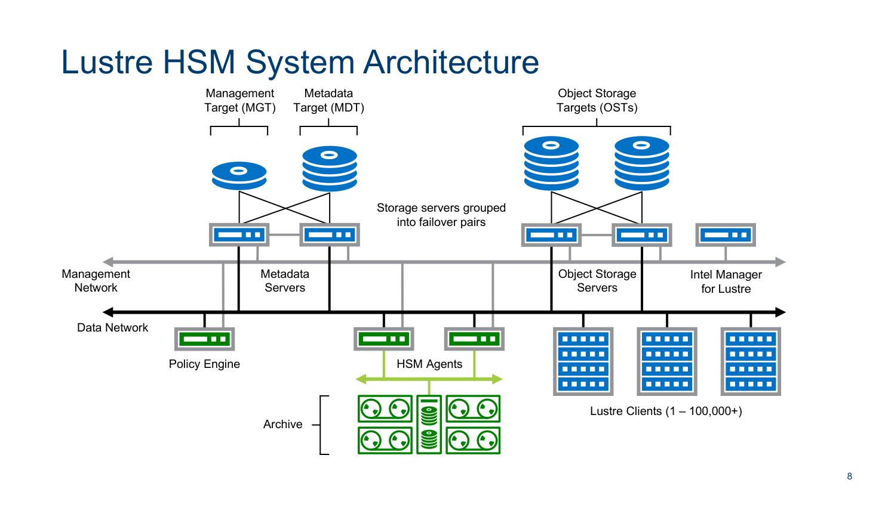

# 17.2 HSM 整体架构与核心组件拓扑

结合官方架构图 17-2 与图 17-3，Lustre HSM 体系由三大核心组件协同驱动：

## 1. HSM 协调器（Coordinator）
运行在主元数据服务器（MDT0000）内核中的中枢调度引擎。
- 负责维护全集群文件的 HSM 生命周期状态机；
- 维护全局请求等待队列与活动队列，追踪文件的归档（Archive）、释放（Release）、召回（Restore/Recall）及清除（Remove）指令；
- 向注册在线的数据搬迁节点（Agent）分发任务并监控进度，处理网络超时与重试。

## 2. 数据搬迁代理与工具（Agent & Copytool）
部署在专有数据搬运节点（Data Mover Nodes）上的守护进程。
- **与 Coordinator 保持长连接会话**：通过 Lustre 专有 RPC 协议向 MDT 注册自身支持的归档后端 ID（Archive ID）；
- **执行实际物理搬迁**：标准实现包括用于本地目录或 NFS 的 `lhsmtool_posix`，以及面向 Amazon S3、Ceph RGW、Google Cloud Storage 的 `lhsmtool_s3`。Copytool 通过 `llapi_hsm_copytool_*` 接口从 OST 读取数据并写入远端对象存储，反之亦然。

## 3. 策略引擎（Policy Engine，如 Robinhood）
运行在用户空间的自动化调度软件。通过持续解析 Lustre Changelogs（元数据变更日志），依据预设的策略规则（如“文件访问时间超过 90 天且大小大于 100MB 则归档”、“OST 存储水位超过 85% 则按 LRU 释放数据”），全自动批量触发 HSM 指令。

---

